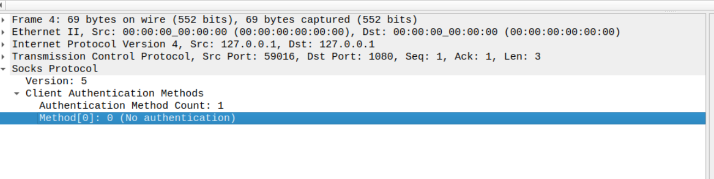
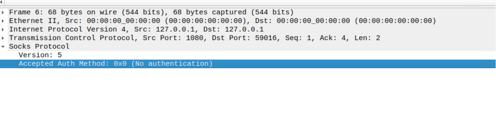
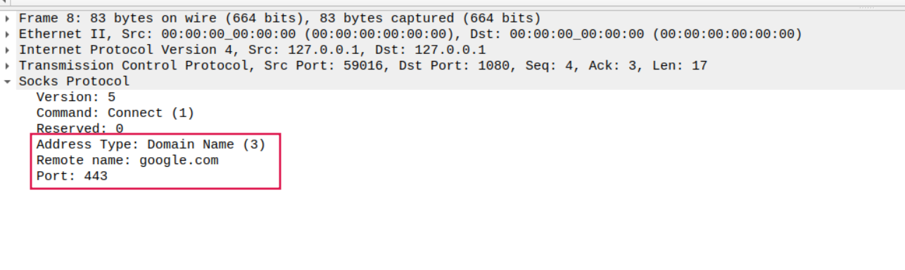
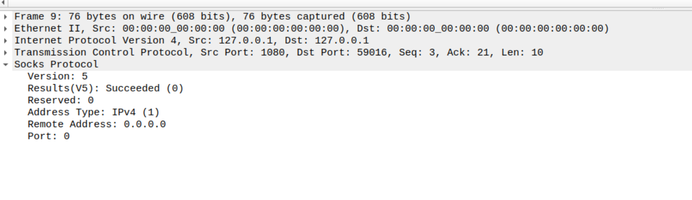
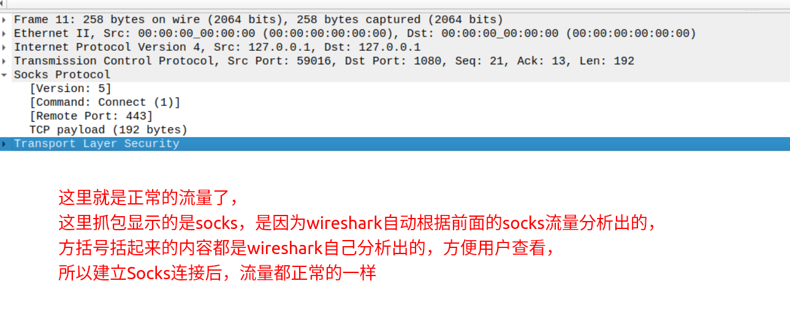

# Socks

<!-- @import "[TOC]" {cmd="toc" depthFrom=1 depthTo=6 orderedList=false} -->
<!-- code_chunk_output -->

- [Socks](#socks)
    - [概述](#概述)
      - [1.socks介绍](#1socks介绍)
        - [(1) what](#1-what)
        - [(2) why](#2-why)
      - [2.socks协议](#2socks协议)
        - [(1) 确定认证方法](#1-确定认证方法)
        - [(2) 建立连接](#2-建立连接)
        - [(3) 代理请求](#3-代理请求)
      - [3.socks server和socks server之间通信](#3socks-server和socks-server之间通信)
    - [shadowsocks使用](#shadowsocks使用)
      - [1.启动shadowsocks server](#1启动shadowsocks-server)
      - [2.启动shadowsocks local](#2启动shadowsocks-local)
      - [3.启动polipo（http proxy -> sock5 proxy）](#3启动polipohttp-proxy---sock5-proxy)
      - [4.验证](#4验证)
    - [其他使用](#其他使用)
      - [1.ssh -> socks5 proxy](#1ssh---socks5-proxy)
        - [(1) 添加ssh配置](#1-添加ssh配置)
      - [2.tcp -> socks5](#2tcp---socks5)
        - [(1) 注意（重要）](#1-注意重要)
        - [(2) 安装redsocks](#2-安装redsocks)
        - [(3) 设置iptables规则，将tcp流量转发到redsocks](#3-设置iptables规则将tcp流量转发到redsocks)
        - [(4)不能使用http proxy这种应用层转发方式将流量转发给redsocks](#4不能使用http-proxy这种应用层转发方式将流量转发给redsocks)
        - [(5) 测试](#5-测试)
      - [3.udp -> socks5（比较复杂）](#3udp---socks5比较复杂)
      - [4.DNS -> tcp -> socks](#4dns---tcp---socks)

<!-- /code_chunk_output -->

### 概述

#### 1.socks介绍

##### (1) what
* 是一种进行**tcp/udp转发**的协议
* 运行在application layer 和 transport layer之间

##### (2) why
* 正常tcp转发需要通过nginx等，而且一个端口只能转发到配置中的地址，而socks可以通过传递参数，从而告诉socks server，应该转发到指定的地址

#### 2.socks协议
[参考](https://datatracker.ietf.org/doc/html/rfc1928)

##### (1) 确定认证方法

* socks client -发送请求-> socks server
  * frame格式
    |字段|大小|说明|可设置的值|
    |-|-|-|-|
    |VER|1个8bit的数据|socks版本|05、04|
    |NMETHODS|1个8bit的数据|指定METHODS字段的大小||
    |METHODS|由NMETHODS指定（范围: 1-255个8bit的数据）|表示自己支持的认证方法，服务端根据自身的情况在客户端支持的方法中选择一个|NO AUTHENTICATION REQUIRED、GSSAPI、USERNAME/PASSWORD等|

* socks client <-确定认证方法- socks serve
  * frame格式
    |字段|大小|说明|可设置的值|
    |-|-|-|-|
    |VER|1个8bit的数据|socks版本|05、04|
    |METHODS|1个8bit的数据|确定的认证方法|当返回X'FF'时，表示客户端支持的认证方法，服务端都不支持，所以断开连接|

* demo
  * client -> server
  
  * client <- server
  

##### (2) 建立连接

* socks client -发送请求-> socks server
  * frame格式
    |字段|大小|说明|可设置的值|
    |-|-|-|-|
    |VER|1个8bit的数据|socks版本|05、04|
    |CMD|1个8bit的数据|进行的动作|CONNECT、BIND、UDP|
    |RSV|1个8bit的数据|保留||
    |**ATYP**|1个8bit的数据|address type of following address|IPv4、DOMAINNAME、IPv6|
    |**DST.ADDR**|可变|**需要代理的目标地址**（即客户端真正想要访问的地址）|
    |**DST.PORT**|2个8bit的数据|**需要代理的目标端口**（即客户端真正想要访问的地址）|
  
  * CMD
    * CONNECT（最常用）
      * 表示这是一个连接操作，即进行TCP转发
    * BIND
        * 表示client接受来自服务端的连接（当FTP时需要）
    * UDP
      * 表示进行UDP转发

* socks client <-返回结果- socks server
  * frame格式
    |字段|大小|说明|可设置的值|
    |-|-|-|-|
    |VER|1个8bit的数据|socks版本|05、04|
    |REP|1个8bit的数据|返回的结果|succeeded、Host unreachable、Connection refused等|
    |ATYP|1个8bit的数据|address type of following address|IPv4、DOMAINNAME、IPv6|
    |BND.ADDR|可变|server绑定的地址（一般不设置这个值，设为0.0.0.0）|
    |BND.PORT|2个8bit的数据|server绑定的端口（一般不设置这个值，设为0）|

* demo
  * client -> server
  
  * client <- server
  

##### (3) 代理请求

* 注意：建立socks连接后，流量都是正常的，没有socks这层协议存在了，数据都发往socks server了



#### 3.socks server和socks server之间通信

* socks server和socks server之间通信，就单纯使用tcp交换数据
  * 他们之间不需要特殊的协议，只要能够交换到数据即可，受到数据后自己进行解析处理
  * 比如:
    * shadowsocks server就是socks sever
    * shadowsocks local就是socks server
    * polipo是socks client
    * polipo和shadowsocks local使用socks协议
    * shadowsocks local和shadowsocks server使用单处的tcp协议

***

### shadowsocks使用

[参考](https://github.com/shadowsocks/shadowsocks-libev)

#### 1.启动shadowsocks server
* 创建配置文件
```shell
vim /etc/shadowsocks.json
```
```json
{
  "server":"0.0.0.0",
  "server_port":13863,
  "password":"***",
  "timeout":600,
  "method":"aes-256-cfb"
}
```

* 启动服务端
```shell
docker run --network host --restart always -itd -v /etc/shadowsocks.json:/etc/shadowsocks.json shadowsocks/shadowsocks-libev ss-server -c /etc/shadowsocks.json
```

#### 2.启动shadowsocks local

* 创建配置文件
```shell
vim /etc/shadowsocks.json
```
```json
{
  "server":"t.91tianlu.pw",
  "server_port":13863,
  "local_address": "127.0.0.1",
  "local_port":1080,
  "password":"***",
  "timeout":600,
  "method":"aes-256-cfb"
}
```

* 启动客户端
```shell
docker run --network host --restart always -itd -v /etc/shadowsocks.json:/etc/shadowsocks.json shadowsocks/shadowsocks-libev ss-local -c /etc/shadowsocks.json
```

#### 3.启动polipo（http proxy -> sock5 proxy）

* 注意: http proxy时域名也会丢给proxy进行解析
  * 所以不存在DNS污染问题

* 配置polipo
```shell
$ mkdir /etc/polipo
$ vim /etc/polipo/config

proxyAddress = "0.0.0.0"

#因为ss-local只支持sock5转发，需要需要利用polipo
socksParentProxy = "127.0.0.1:1080"
socksProxyType = socks5

chunkHighMark = 50331648
objectHighMark = 16384

serverMaxSlots = 64
serverSlots = 16
serverSlots1 = 32
```

* 启动polipo
```shell
docker run --network host --restart always  -itd -v /etc/polipo:/etc/polipo lsiocommunity/polipo polipo -c /etc/polipo/config
```

#### 4.验证

```shell
HTTPS_PROXY="http://127.0.0.1:8123" curl https://google.com
```

***

### 其他使用

#### 1.ssh -> socks5 proxy

##### (1) 添加ssh配置
```shell
vim ~/.ssh/config

#当用ssh协议连接github.com这个域名时进行proxy
#-X 5 指定proxy协议, 支持: 4 (socks4)、5 (socks5, 默认)、connect (https)
#127.0.0.1:1080指定proxy的地址
#指定需要转发的地址，使用变量: %h %p
Host  github.com
  ProxyCommand nc -X 5 -x 127.0.0.1:1080 %h %p
```

* 当无法连接到sock5 proxy时，会报如下错误（请检查sock5 proxy）:
  * Connection closed by UNKNOWN port 65535

#### 2.tcp -> socks5

##### (1) 注意（重要）
* proxy server需要获取original destination
  * 因为改变了tcp的destination
    * 如果不获取original destination，proxy server不知道将数据包转发到哪里
    * 使用http proxy就不会存在这样的问题，因为http请求里包含了original destination信息
  * 方法:
    * 可以通过tcp socket的特性获取original destination
    * 通过iptables的TPROXY target进行处理（不用REDIRET）
      * [TPROXY参考](https://powerdns.org/tproxydoc/tproxy.md.html)

##### (2) 安装redsocks
* 配置: `/etc/redsocks.conf`
```go
base {
  log_debug = on;
  log_info = on;
  log = "stderr";
  daemon = off;
  user = redsocks;
  group = redsocks;
  //说明使用的转发方式，需要根据具体的转发方式，获取到original destination
  redirector = iptables;
}

redsocks {
  //本地监听地址
  local_ip = 0.0.0.0;
  local_port = 12345;

  //socks5地址
  type = socks5;
  ip = 127.0.0.1;
  port = 1080;
}
```

* 启动服务
```shell
docker run --rm --privileged=true  -itd --network host -v /etc/redsocks.conf:/etc/redsocks.conf --entrypoint /usr/sbin/redsocks  ncarlier/redsocks -c /etc/redsocks.conf
```

##### (3) 设置iptables规则，将tcp流量转发到redsocks
* 注意:
  * iptables的output不影响回复流量（即对方发起的，然后需要回复给对方的流量）
```shell
iptables -t nat -N REDSOCKS
#设置哪些不转发
iptables -t nat -A REDSOCKS -d 0.0.0.0/8 -j RETURN
iptables -t nat -A REDSOCKS -d 127.0.0.0/8 -j RETURN
iptables -t nat -A REDSOCKS -d 172.17.0.0/24 -j RETURN
iptables -t nat -A REDSOCKS -d 192.168.0.0/16 -j RETURN
#其余的都转发
iptables -t nat -A REDSOCKS -p tcp -j REDIRECT --to-ports 12345

#使规则生效
iptables -t nat -A OUTPUT -p tcp   -j REDSOCKS
```

##### (4)不能使用http proxy这种应用层转发方式将流量转发给redsocks
因为使用tcp proxy和http proxy转发的内容是不一样的
* 比如需要转发https请求时
  * http proxy转发，是将http的请求内容转发过去
  * 而tcp proxy转发，则将TLS转发过去

##### (5) 测试
```shell
curl https://google.com
```

#### 3.udp -> socks5（比较复杂）
存在和tcp一样的问题，即需要获取original destination
由于udp socket没有获取original destination的特性，所有需要使用其他方式
* TPROXY
* 在配置文件中指定original destination信息
  * 这样只能服务一种应用层协议，比如DNS（那original destination信息就设置为DNS服务器的地址）

#### 4.DNS -> tcp -> socks