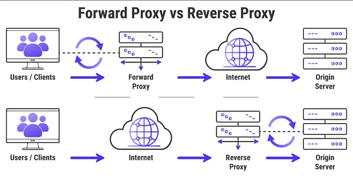

# overview

<!-- @import "[TOC]" {cmd="toc" depthFrom=1 depthTo=6 orderedList=false} -->
<!-- code_chunk_output -->

- [overview](#overview)
    - [概述](#概述)
      - [1.VPN vs Proxy](#1vpn-vs-proxy)
      - [2.forward proxy vs reverse proxy](#2forward-proxy-vs-reverse-proxy)
    - [常用工具的proxy设置方式](#常用工具的proxy设置方式)
      - [1.curl: 通过环境变量](#1curl-通过环境变量)
      - [2.wget: 通过配置文件](#2wget-通过配置文件)

<!-- /code_chunk_output -->

### 概述

#### 1.VPN vs Proxy

||VPN|Proxy|
|-|-|-|
|范围|系统范围的（会虚拟出一个网卡）|APP范围的，每个APP需要自己设置proxy|
|原理|有专门的协议|socks5（伪装成https协议）|

#### 2.forward proxy vs reverse proxy


***

### 常用工具的proxy设置方式

#### 1.curl: 通过环境变量
```shell
#区分大小写
HTTPS_PROXY="http://127.0.0.1:1095" http_proxy="http://127.0.0.1:1095" curl xx 
```

#### 2.wget: 通过配置文件
```shell
#vim /etc/wgetrc
$ vim ~/.wgetrc

use_proxy=yes
http_proxy=127.0.0.1:1095
https_proxy=127.0.0.1:1095
```