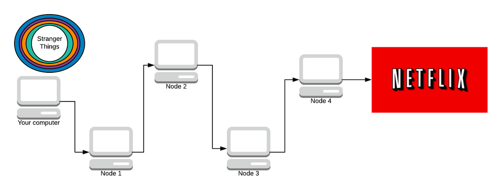
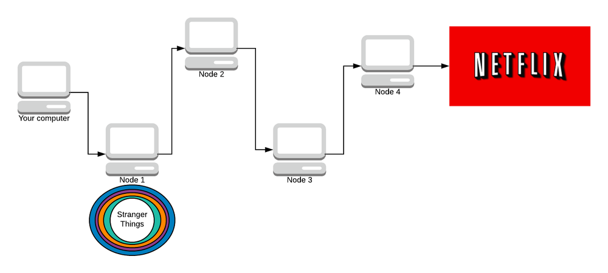
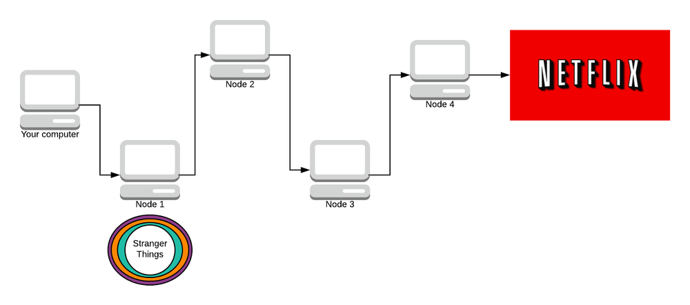

# onion routing

<!-- @import "[TOC]" {cmd="toc" depthFrom=1 depthTo=6 orderedList=false} -->

<!-- code_chunk_output -->

- [onion routing](#onion-routing)
    - [概述](#概述)
      - [1.基础概念](#1基础概念)
        - [(1) tor circuit](#1-tor-circuit)
      - [2.relay (node)的类型](#2relay-node的类型)
        - [(1) entry (guard) relay](#1-entry-guard-relay)
        - [(2) middle relay](#2-middle-relay)
        - [(3) exit relay](#3-exit-relay)
        - [(4) bridge](#4-bridge)
        - [(5) directory relay](#5-directory-relay)
        - [(6) HSDir (hidden service directory) relay](#6-hsdir-hidden-service-directory-relay)
      - [3.bridge的类型](#3bridge的类型)
        - [(1) obfs4 (obfuscator)](#1-obfs4-obfuscator)
        - [(2) snowflake](#2-snowflake)
        - [(3) meek-azure](#3-meek-azure)
      - [4.发布hidden service](#4发布hidden-service)
        - [(1) 设置introduction points](#1-设置introduction-points)
      - [(2) 发布descriptor](#2-发布descriptor)
      - [5.访问hidden service](#5访问hidden-service)
        - [(1) 获取onion address](#1-获取onion-address)
        - [(2) 获取descriptor](#2-获取descriptor)
        - [(3) 选择rendezvous point](#3-选择rendezvous-point)
        - [(4) 通过rendezvous point进行连接](#4-通过rendezvous-point进行连接)
      - [6.原理概述](#6原理概述)
      - [7.缺陷](#7缺陷)
        - [(1) 速度慢](#1-速度慢)
        - [(2) 不是绝对的隐秘](#2-不是绝对的隐秘)

<!-- /code_chunk_output -->

### 概述

[参考](https://skerritt.blog/how-does-tor-really-work/#%F0%9F%A4%BA-attacks-on-tor)

#### 1.基础概念

##### (1) tor circuit

* 由 entry (guard) relay -- midlle relay -- exit relay 组成的转发路线
    * 当一个tor browser建立了一个tor circuit（即连接到了entry relay）上，表示这个tor browser已经加入了tor network

#### 2.relay (node)的类型

[relay的flag](https://github.com/torproject/torspec/blob/main/dir-spec.txt)

##### (1) entry (guard) relay
* client连接的第一个节点
* 该节点知道的信息
    * 发起请求的源地址
    * 下一个节点的地址
* 不知道的信息
    * 最终的目标地址
    * 数据内容

##### (2) middle relay
* 负责转发节点的请求（是TOR circuit上的非entry和exit relay），用于隐匿数据的来源和去向
* 该节点知道的信息
    * 上一个节点的地址
    * 下一个节点的地址
* 不知道的信息
    * 发起请求的源地址
    * 最终的目标地址
    * 数据内容

##### (3) exit relay
* 数据包离开tor network，访问最终的目标地址
* 该节点知道的信息
    * 上一个节点的地址
    * 最终的目标地址
    * 数据内容
* 不知道的信息
    * 发起请求的源地址

##### (4) bridge
* 没有在direcotory relay中列出的节点（防止被政府机构获知，从而被禁止）
* 用户可以连接到bridge上，从而连接到tor network，这样政府机构就不知道用户连接到了tor network中

##### (5) directory relay
* 提供directory service
    * 负责维护正在运行的节点的列表
* flag: V2Dir

##### (6) HSDir (hidden service directory) relay
* 提供hidden service directory service
    * 负责维护DHT（分布式哈希表）
        * key: `<public_key_encode>.onion`
            * key就是hidden service的onion address，比如: `vww6ybal4bd7szmgncyruucpgfkqahzddi37ktceo3ah7ngmcopnpyyd.onion`
        * value: service desciptor
* flag: HSDir

#### 3.bridge的类型

##### (1) obfs4 (obfuscator)
默认的bridge

##### (2) snowflake

* domain fronting
    * 在HTTPS的url和SNI中的域名是 snowflake proxy，即允许访问的地址
    * 在HTTP header中的域名是真正需要访问的地址，即被禁止的地址
    * snowflake proxy会将请求转发到真正的目的地
    * 比如: `wget -q -O - https://www.google.com/ --header 'Host: www.youtube.com'`

* 有三部分组成
    * snowflake proxies（由用户自愿提供的）
    * client
    * broker： 提供snowflake proxies地址

* 工作原理
    

    * 首先去BROKER获取snowflake proxy的地址（snowflake proxy是短期的，所以会需要经常去broker获取新的snowflake proxy地址）
        * 利用domain fronting技术访问broker，所以审查机构就无法封禁broker
    * 发送请求到snowflake proxy（并在http header中设置真正的目的地，即bridge地址）
    * snowfalke proxy连接bridge（从而加入tor network）

##### (3) meek-azure

* 跟默认的bridge类似，只不过使用了domain fronting技术
    * 所有流量都使用domain fronting技术，发送到bridge，bridge再进行转发
    * 所以速度会比较慢，但是审查机构看起来就是正常的HTTPS流量

#### 4.发布hidden service

当需要提供一个hidden service，需要进行以下步骤，[参考](https://community.torproject.org/onion-services/overview/)

##### (1) 设置introduction points
* 与一批relays通信，需要其中三个作为introdution points
* introduction points到hidden service需要经过两个relay
    * 所以introduction points不知道hidden service具体的位置

#### (2) 发布descriptor
* 包含的内容:
    * introduction points信息
    * authentication keys
* 用私钥对这些内容进行加密
* 将descriptor发布到DHT（即directory节点维护的）
    * key: 公钥 encode
    * value: descriptor

#### 5.访问hidden service

[参考](https://community.torproject.org/onion-services/overview/)

##### (1) 获取onion address
* client需要获取hidden service的相应的onion address
    * 比如: `vww6ybal4bd7szmgncyruucpgfkqahzddi37ktceo3ah7ngmcopnpyyd.onion`

##### (2) 获取descriptor
* client根据onion address，去directory节点中获取相应的descriptor
* 用公钥验证descriptor
    * 公钥通过onion address进行decode获得
* 获取descriptor中的信息
    * introduction points信息

##### (3) 选择rendezvous point
* 选择一个relay作为rendezvous point
    * 发送"one-time secret"给他
* 连接一个introduction point
    * 发送 rendezvous point信息 和 "one-time secret" 给他
    * introduction point把rendezvous point信息 和 "one-time secret" 发送给 hidden service
    * hidden service会判断你是否可信

##### (4) 通过rendezvous point进行连接
* hiddent service用"one-time secret"连接到rendezvous point，从而建立和client之间的连接

#### 6.原理概述
* client从directory node获取节点信息，然后规划路由路径
* 发送请求之前，经过多少节点，就会加密多少层，每一个节点解密一层，直到exit node

#### 7.缺陷

##### (1) 速度慢
* 由于进行多层加密和转发，导致速度会很慢

##### (2) 不是绝对的隐秘 
* 当控制了entry node和exit node
    * 就能够进行追踪，从而无法隐藏踪迹