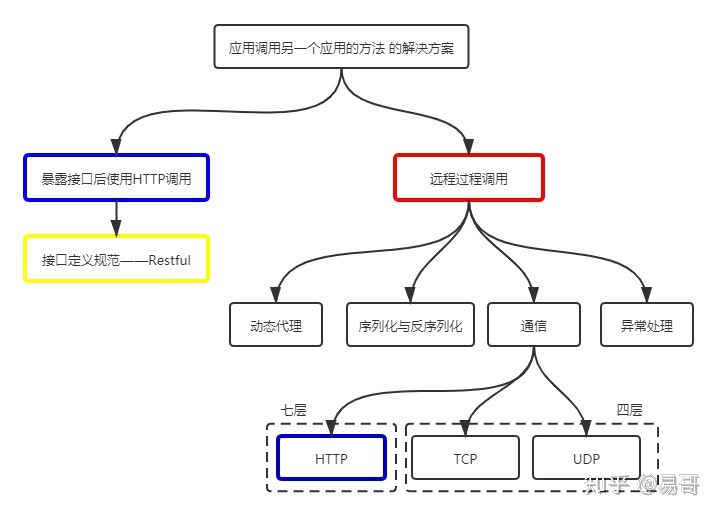
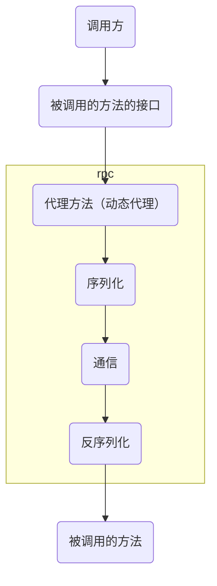

# rpc(remote procedure call)
### 预备知识
#### 1.动态代理
* 用来**包装**原始方法调用，用于**增强或改写**现有方法的逻辑，类似于**python的装饰函数**
* python中可以使用类的__getattribute__方法装饰原有函数，从而实现动态代理
* 好处是可以为某些类或函数动态添加某些功能，而不需重写这个类或函数
### 基础概念
#### 1.rpc
rpc是一种架构模式

#### 2.原理
**RPC的本质是socket加动态代理**
* 利用动态代理，封装出一个新的类，增加了某些功能，隐藏了底层的实现细节
* 增加的功能是，调用远程服务端的方法或接口等
* 客户端实例化新的类，传入参数，即指明要调用的方法，会将方法名称传送到服务器，在服务端进行调用，最后将结果返回给客户端，客户端感觉就像是在调用本地的方法一样
* 这样客户端就可以很容易使用服务端提供的各种功能

#### 3.restful 与 rpc 比较
* 都是跨应用调用的解决方案
* restful利用HTTP协议，有用信息占比少（包含了大量的HTTP头等信息），效率低（工作在第七层）
* rpc通常使用TCP或UDP协议，也可以使用HTTP协议，因此效率更高

#### 4.为什么要使用tcp协议的rpc做后端进程通信
* HTTP协议包含太多没用的信息
* rpc可以更好的实现更高级的封装，效率更好
* rpc让构建分布式计算（应用）更容易，让构建分布式计算（应用）更容易
