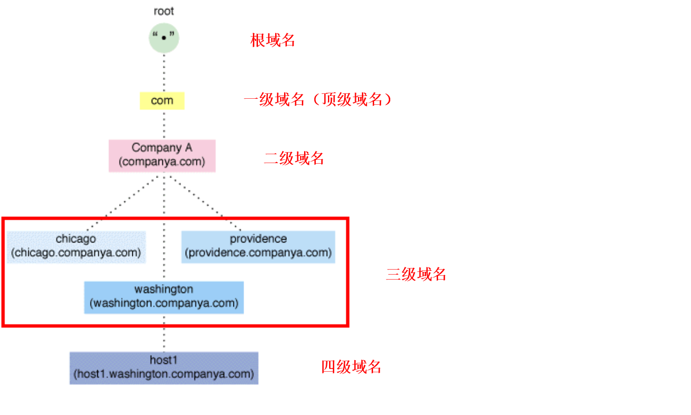

# DNS

<!-- @import "[TOC]" {cmd="toc" depthFrom=1 depthTo=6 orderedList=false} -->
<!-- code_chunk_output -->

- [DNS](#dns)
    - [概述](#概述)
      - [1.域名结构](#1域名结构)
      - [2.基础概念](#2基础概念)
        - [（1）stub resolver（存根解析器）](#1stub-resolver存根解析器)
        - [（2）recursive DNS server（cacheing DNS server，递归DNS）](#2recursive-dns-servercacheing-dns-server递归dns)
        - [（3）authoritative DNS server（权威DNS）](#3authoritative-dns-server权威dns)
        - [（4）forwarding DNS server（转发DNS）](#4forwarding-dns-server转发dns)
      - [3.域名解析时的各项解析记录](#3域名解析时的各项解析记录)
      - [4.DNS的search选项](#4dns的search选项)
      - [5.`/etc/resolv.conf`使用注意](#5etcresolvconf使用注意)
        - [(1) 最多只有3个nameserver生效](#1-最多只有3个nameserver生效)
        - [(2) 只会按顺序查询一个nameserver（如果nameserver超时，才会查询下一个）](#2-只会按顺序查询一个nameserver如果nameserver超时才会查询下一个)
      - [6.DNS security](#6dns-security)
        - [(1) DNS over TLS](#1-dns-over-tls)
        - [(2) DNS over HTTPS](#2-dns-over-https)
        - [(3) 常用DOT和DOH的nameserver](#3-常用dot和doh的nameserver)
      - [7.reverse DNS (ip -> domain name)](#7reverse-dns-ip---domain-name)
        - [(1) why](#1-why)
        - [(2) 前提： 只有存在PTR记录的域名，才能做reverse DNS](#2-前提-只有存在ptr记录的域名才能做reverse-dns)
        - [(3) 工作原理（以10.107.93.137为例）](#3-工作原理以1010793137为例)
    - [使用](#使用)
      - [1.`dig`](#1dig)

<!-- /code_chunk_output -->

### 概述

#### 1.域名结构


#### 2.基础概念


##### （1）stub resolver（存根解析器）
是DNS客户端库，用于查询DNS服务器进行解析工作

##### （2）recursive DNS server（cacheing DNS server，递归DNS）
* 递归查询
即本机无法查询到结果，会继续去其他DNS server查询
</br>
* 缓存查询结果

##### （3）authoritative DNS server（权威DNS）
权威DNS服务器，负责维护 指定域 中的域名信息

##### （4）forwarding DNS server（转发DNS）
查询请求转发给另外一台DNS服务器，由另外一台DNS服务器来完成查询请求
* 客户端会自己去 转发到的DNS服务器 查询结果
* 递归服务器会帮忙查询到结果并返回

#### 3.域名解析时的各项解析记录

```shell
#获取一个server的所有记录，下面列出的记录，不是一定都有的
dig <server> any
```

|记录|对应内容|说明|
|-|-|-|
|A|ip地址||
|AAAA|ipv6地址||
|NS|域名服务器||
|SRV|服务记录(记录了哪台计算机提供了哪个服务)|
|SOA|起始授权机构记录，NS用于标识多台域名解析服务器，SOA记录用于在众多NS记录中那一台是主服务器|
|CNAME|域名的别名|
|MX|邮件服务地址|
|TXT|说明信息|
|PTR|用于reverse DNS|记录的格式: `<ip反写>.in-addr.arpa` 或 `<ipv6反写>.in6.arpa`|

#### 4.DNS的search选项
```shell
#vim /etc/resolv.conf
nameserver <DNS_SERVER>
search <DOMAIN1> <DOMAIN@>
```
```shell
ping <HOST>
```
* 首先会在本地解析`<HOST>`
* 当本地无法解析时，会去DNS服务器解析`<HOST>`
* 当DNS服务器无法解析`<HOST>`时，会加上search中设置的域，即会尝试去DNS服务器解析`<HOST>.<DOMAIN1>`，`<HOST>.<DOMAIN2>`

#### 5.`/etc/resolv.conf`使用注意

[参考](https://man7.org/linux/man-pages/man5/resolv.conf.5.html)

##### (1) 最多只有3个nameserver生效

##### (2) 只会按顺序查询一个nameserver（如果nameserver超时，才会查询下一个）

比如： 查询`aa.my.local`域名
  * 如果第一个nameserver不能查询到结果
  * 第二个nameserver能查询到结果
  * 则返回的结果是查询不到结果

#### 6.DNS security

##### (1) DNS over TLS

##### (2) DNS over HTTPS

##### (3) 常用DOT和DOH的nameserver
[参考](https://dnsprivacy.org/public_resolvers/)

#### 7.reverse DNS (ip -> domain name)

[参考](https://phoenixnap.com/kb/reverse-dns-lookup)

##### (1) why
* 过滤垃圾邮件
* 有一些协议需要rDNS的支持
* 

##### (2) 前提： 只有存在PTR记录的域名，才能做reverse DNS
* 不存在PTR记录时
```shell
$ dig baidu.com any

; <<>> DiG 9.18.1-1ubuntu1.3-Ubuntu <<>> baidu.com any
;; global options: +cmd
;; Got answer:
;; ->>HEADER<<- opcode: QUERY, status: NOERROR, id: 44719
;; flags: qr rd ra; QUERY: 1, ANSWER: 17, AUTHORITY: 0, ADDITIONAL: 1

;; OPT PSEUDOSECTION:
; EDNS: version: 0, flags:; udp: 65494
;; QUESTION SECTION:
;baidu.com.			IN	ANY

;; ANSWER SECTION:
baidu.com.		6872	IN	SOA	dns.baidu.com. sa.baidu.com. 2012146352 300 300 2592000 7200
baidu.com.		6872	IN	TXT	"google-site-verification=GHb98-6msqyx_qqjGl5eRatD3QTHyVB6-xQ3gJB5UwM"
baidu.com.		6872	IN	TXT	"_globalsign-domain-verification=qjb28W2jJSrWj04NHpB0CvgK9tle5JkOq-EcyWBgnE"
baidu.com.		6872	IN	TXT	"v=spf1 include:spf1.baidu.com include:spf2.baidu.com include:spf3.baidu.com include:spf4.baidu.com a mx ptr -all"
baidu.com.		6872	IN	MX	10 mx.maillb.baidu.com.
baidu.com.		6872	IN	MX	20 mx50.baidu.com.
baidu.com.		6872	IN	MX	20 mx1.baidu.com.
baidu.com.		6872	IN	MX	20 jpmx.baidu.com.
baidu.com.		6872	IN	MX	15 mx.n.shifen.com.
baidu.com.		6872	IN	MX	20 usmx01.baidu.com.
baidu.com.		272	IN	A	39.156.66.10
baidu.com.		272	IN	A	110.242.68.66
baidu.com.		21272	IN	NS	dns.baidu.com.
baidu.com.		21272	IN	NS	ns3.baidu.com.
baidu.com.		21272	IN	NS	ns7.baidu.com.
baidu.com.		21272	IN	NS	ns2.baidu.com.
baidu.com.		21272	IN	NS	ns4.baidu.com.

;; Query time: 9243 msec
;; SERVER: 127.0.0.53#53(127.0.0.53) (TCP)
;; WHEN: Fri Mar 31 15:01:11 CST 2023
;; MSG SIZE  rcvd: 631


$ nslookup 39.156.66.10
** server can't find 10.66.156.39.in-addr.arpa: NXDOMAIN
```

* 当存在PTR记录时
```shell
$ nslookup 10.107.93.137
Server:		10.96.0.10
Address:	10.96.0.10:53

137.93.107.10.in-addr.arpa	name = grafana.monitor.svc.cluster.local
```

##### (3) 工作原理（以10.107.93.137为例）
将`10.107.93.137` -转换成-> `137.93.107.10.in-addr.arpa` -查询DNS-> 得到结果

***

### 使用

#### 1.`dig`
```shell
dig <SERVER>
    +search         #利用/etc/resolv.conf中的search参数，默认不使用
    -t <TYPE>       #查询指定记录
```

* list all records
   * since around 2019, most public DNS servers have stopped answering most DNS ANY queries usefully.
```shell
dig <domain_name> any
```
