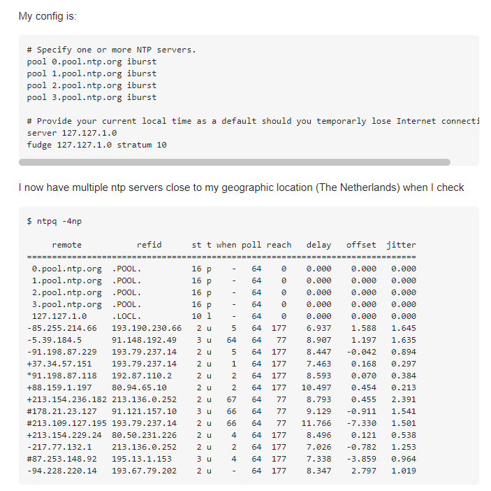

# NTP（Network Time Protocol）
[toc]

### 概述
#### 1.特点
* 分层设计(不超过15层)
* 缺陷:当闰秒的时候要将服务器暂时关闭,否则会崩溃

#### 2.常用ntp服务器地址
* ntp.ntsc.ac.cn
* ntp1.aliyun.com
* 210.72.145.44 (国家授时中心服务器IP地址)

***

### 配置

#### 1.服务端：`/etc/ntp.conf`

* 指定ntp server

```shell
server <NTP_SERVER> iburst prefer
#当一个远程NTP服务器不可用时，向它发送一系列的并发包进行检测
#prefer优先使用该服务器

#或者（用pool是通用的）
#上面就可以写成：pool <NTP_SERVER> iburst prefer

pool <domain_name> iburst
#从该域名能够解析多个ntp server，从而能够同时与多个ntp server建立关联
```


* 权限设置

```shell
#拒绝IPV4用户和#IPV6用户   
restrict default kod nomodify notrap nopeer noquery  
restrict -6 default kod nomodify notrap nopeer noquery    

#放行ntp server（即指定使用的ntp server，需要放行）
restrict <NTP_SERVER>

#放行本机
restrict 127.0.0.1
restrict -6 ::1

#本地网段授权访问
restrict 192.168.100.0 mask 255.255.255.0 nomodify
```

* 声明所在的层

```shell
#127.127.1.0表示本机系统时间源
#当没有时间同步来源的时候以自身的硬件时钟为准（如果有其他时间服务器，不会使用本地时钟）
server 127.127.1.0
fudge 127.127.1.0 stratum <STRATUM_NUMBER>
```

#### 2.客户端: `/etc/ntp.conf`
```shell
server <NTP_SERVER> iburst

#server后面的其他选项：
#   minpoll <num>   //设置最小poll时间为2^<num>秒
#   maxpoll <num>   //设置最大poll时间为2^<num>秒

#比如：
#   server <NTP_SERVER> iburst maxpoll 6       
```

***

### 查询ntp状态
#### ntpq命令格式
#### 1.格式
```shell
ntp -c <COMMAND>
```

#### 2.ntpq常用命令
##### （1）`ntpq -c peers`
显示ntp服务器的信息
```shell
$ ntpq -c peers   #等价与ntpq -p

remote           refid      st t when poll reach   delay   offset  jitter
==============================================================================
*114.118.7.163   210.72.145.18    2 u  991 1024  377    3.352    2.036   1.603
+120.25.115.20   10.137.53.7      2 u  816 1024  377   37.174    3.138   2.061
210.72.145.44   .INIT.          16 u    - 1024    0    0.000    0.000   0.000
LOCAL(0)        .LOCL.          10 l   9h   64    0    0.000    0.000   0.000
```
字段说明
* remote
  * NTP服务器的IP或主机名
  * 如果有`*`代表目前正在作用当中的上层NTP
  * 如果是`+`代表也有连上线，而且可作为下一个提供时间更新的候选者
</br>
* refid
  **ntp服务器的ntp服务器**的标识，可能的值：
  * `<IP>`，即ntp服务器使用的是ip为`<IP>`的ntp服务器
  * `.INIT.`，即还没有开始同步，也可以说是处于初始状态还没建立同步
  * `.LOCL.`，即本机 (当没有远程节点或服务器可用时）
</br>
* st（stratum）
ntp服务器所在的层
</br>
* when
  几秒钟前曾经做过时间同步化更新的动作
</br>
* poll（单位：秒）
  查询的时间间隔
</br>
* reach
  已经向上层NTP伺服器要求更新的次数
</br>
* delay（单位：微秒）
  从本地机发送同步要求到ntp服务器的往返时间
</br>
* offset（单位：毫秒）
  * 主机通过NTP时钟同步与所同步时间源的时间偏移量
  * offset越接近于0，主机和ntp服务器的时间越接近

##### （2）`ntpq -c associations`
查询各个服务器的关联id，为了进一步获取更多信息
```shell
$ ntpq -c associations

ind assid status  conf reach auth condition  last_event cnt
===========================================================
  1 43782  963a   yes   yes  none  sys.peer    sys_peer  3
  2 43783  9424   yes   yes  none candidate   reachable  2
  3 43784  8011   yes    no  none    reject    mobilize  1
  4 43785  8043   yes    no  none    reject unreachable  4
```

##### （3）`ntpq -c "rv <assid>"`
rv：read variables，读取变量，有三类 相关变量：
* 系统变量（当assid为0时，获取的是系统变量）
* 服务器变量（当assid为非0时，获取的是指定服务器的变量）
* 时钟变量（`ntpq -c cv`，获取的是时钟变量(clock variables)）
