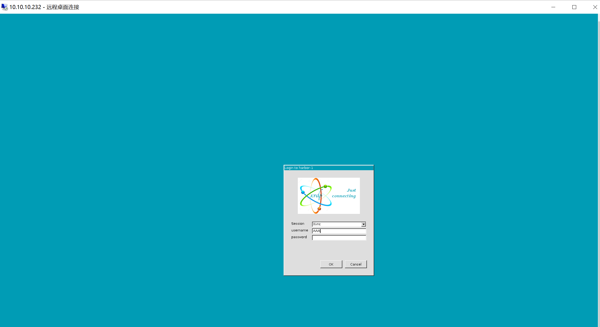

# RDP

[toc]

### linux部署xDRP

#### 1.安装xRDP
```shell
yum install xrdp
```

#### 2.配置认证信息
无需配置，跟系统账号一样

#### 3.启动xrdp
```shell
systemctl restart xrdp
systemctl status xrdp
```

#### 4.验证
windows运行 -> 远程桌面连接 -> 输入地址

