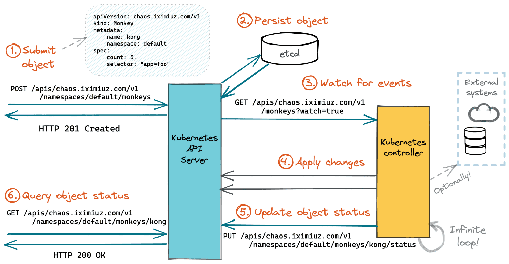

# operator


<!-- @import "[TOC]" {cmd="toc" depthFrom=1 depthTo=6 orderedList=false} -->

<!-- code_chunk_output -->

- [operator](#operator)
    - [overview](#overview)
      - [1.principle](#1principle)
    - [kubebuilder](#kubebuilder)
      - [1.quick start](#1quick-start)
        - [(1) install](#1-install)
        - [(2) create a project](#2-create-a-project)
        - [(3) create API](#3-create-api)
        - [(4) run in test env](#4-run-in-test-env)
        - [(5) run on the cluster](#5-run-on-the-cluster)
      - [2.define API](#2define-api)
        - [(1) Status and Specs](#1-status-and-specs)
        - [(2) Markers and validations](#2-markers-and-validations)
      - [3.reconciliation process](#3reconciliation-process)
        - [(1) return options](#1-return-options)
        - [(2) oberving changes on cluster](#2-oberving-changes-on-cluster)
        - [(3) setting the RBAC permissions](#3-setting-the-rbac-permissions)
      - [4.Owner References](#4owner-references)
      - [5.Finalizers](#5finalizers)

<!-- /code_chunk_output -->


### overview

#### 1.principle



---

### kubebuilder

[参考](https://book.kubebuilder.io/quick-start)

#### 1.quick start

##### (1) install

##### (2) create a project
```shell
mkdir ~/Workspace/codes/projects/guestbook
cd ~/Workspace/codes/projects/guestbook
kubebuilder init --domain my.domain --repo my.domain/guestbook
```

##### (3) create API

```shell
kubebuilder create api --group webapp --version v1 --kind Guestbook
```

* to create a new API (group/version) as webapp/v1 and new Kind(CRD) Guestbook
    * `api/v1/guestbook_types.go`
        * where the API is defined
    * `internal/controllers/guestbook_controller.go`
        * where the reconciliation business logic is implemented for this Kind(CRD)

* then edit API definitions, 
    * demo: `api/v1/guestbook_types.go`
```go
// GuestbookSpec defines the desired state of Guestbook
type GuestbookSpec struct {
    // INSERT ADDITIONAL SPEC FIELDS - desired state of cluster
    // Important: Run "make" to regenerate code after modifying this file

    // Quantity of instances
    // +kubebuilder:validation:Minimum=1
    // +kubebuilder:validation:Maximum=10
    Size int32 `json:"size"`

    // Name of the ConfigMap for GuestbookSpec's configuration
    // +kubebuilder:validation:MaxLength=15
    // +kubebuilder:validation:MinLength=1
    ConfigMapName string `json:"configMapName"`

    // +kubebuilder:validation:Enum=Phone;Address;Name
    Type string `json:"alias,omitempty"`
}

// GuestbookStatus defines the observed state of Guestbook
type GuestbookStatus struct {
    // INSERT ADDITIONAL STATUS FIELD - define observed state of cluster
    // Important: Run "make" to regenerate code after modifying this file

    // PodName of the active Guestbook node.
    Active string `json:"active"`

    // PodNames of the standby Guestbook nodes.
    Standby []string `json:"standby"`
}

// +kubebuilder:object:root=true
// +kubebuilder:subresource:status
// +kubebuilder:resource:scope=Cluster

// Guestbook is the Schema for the guestbooks API
type Guestbook struct {
    metav1.TypeMeta   `json:",inline"`
    metav1.ObjectMeta `json:"metadata,omitempty"`

    Spec   GuestbookSpec   `json:"spec,omitempty"`
    Status GuestbookStatus `json:"status,omitempty"`
}
```
* generate the manifests such as CRs
    * `config/crd/bases/`
```shell
make manifests
```

##### (4) run in test env
* install crd
```shell
make install
```

* run operator
```shell
make run
```

* apply sample yaml

##### (5) run on the cluster
* build image
```shell
make docker-build docker-push IMG=<some-registry>/<project-name>:tag
```

* generate operator yaml
    * `dist/install.yaml`
```shell
make build-installer IMG=<some-registry>/<project-name>:tag
```

#### 2.define API

##### (1) Status and Specs
* Status
    * describe the current status of the CR instance
* Specs
    * define all the available specifications and configurations for our Custom Resource (CR)

##### (2) Markers and validations
* employ markers (such ad `+kubebuilder:validation:Minimum=1`) to define validations and criteria, ensuring that data provided by users
    * [markers参考](https://book.kubebuilder.io/reference/markers)

#### 3.reconciliation process
* implement business logic
    * it operates like a loop, continuously checking conditions and performing actions until all conditions align with its implementation
    * we can stop reconciliation when it is successful and don’t need to try again until there’s some changes
    * pseudo-code to illustrate this

```go
import (
    "context"
    ctrl "sigs.k8s.io/controller-runtime"
    webappv1 "my.domain/guestbook/api/v1"
)

func (r *GuestbookReconciler) Reconcile(ctx context.Context, req ctrl.Request) (ctrl.Result, error) {
    _ = log.FromContext(ctx)

    // retrieves an obj for the given "name and namespace" from the Kubernetes Cluster
    guestbook := &webappv1.Guestbook{}
    err := r.Get(ctx, req.NamespacedName, guestbook)

    // Check if a Deployment for the app exists, if not, create one
    // If there's an error, then restart from the beginning of the reconcile
    if err != nil {
    return ctrl.Result{}, err
    }

    // Check if a Service for the app exists, if not, create one
    // If there's an error, then restart from the beginning of the reconcile
    if err != nil {
    return ctrl.Result{}, err
    }

    // Look for Database CR/CRD
    // Check the Database Deployment's replicas size
    // If deployment.replicas size doesn't match cr.size, then update it
    // Then, restart from the beginning of the reconcile. For example, by returning `reconcile.Result{Requeue: true}, nil`.
    if err != nil {
    return ctrl.Result{Requeue: true}, nil
    }
    ...

    // If at the end of the loop:
    // Everything was executed successfully, and the reconcile can stop
    return ctrl.Result{}, nil
}
```

##### (1) return options
* with an error and restart reconcile
```go
return ctrl.Result{}, err
```
* without and error and restart reconcile
```go
return ctrl.Result{Requeue: true}, nil
```
* stop the reconcile
```go
return ctrl.Result{}, nil
```
* reconcile again after some time
```go
nextRun := time.Now().Add(5 * time.Minute)
duration := nextRun.Sub(time.Now())
return ctrl.Result{RequeueAfter: duration}, nil
```

##### (2) oberving changes on cluster
* This controller is persistently observant, monitoring any events associated with this Kind. 
* As a result, pertinent changes instantly set off the controller’s reconciliation process

##### (3) setting the RBAC permissions
* The RBAC permissions are now configured via RBAC markers
```go
// +kubebuilder:rbac:groups=cache.example.com,resources=memcacheds,verbs=get;list;watch;create;update;patch;delete
// +kubebuilder:rbac:groups=cache.example.com,resources=memcacheds/status,verbs=get;update;patch
// +kubebuilder:rbac:groups=cache.example.com,resources=memcacheds/finalizers,verbs=update
// +kubebuilder:rbac:groups=core,resources=events,verbs=create;patch
// +kubebuilder:rbac:groups=apps,resources=deployments,verbs=get;list;watch;create;update;patch;delete
// +kubebuilder:rbac:groups=core,resources=pods,verbs=get;list;watch
```
* the yamls generated at `config/rbac/`

#### 4.Owner References
* 设置Owner References后，当所属该custom resource的资源变化时，该controller也能接收到通知（从而调用reconcile）
* 当Owner被删除后，属于该owner的资源也会被删除

#### 5.Finalizers