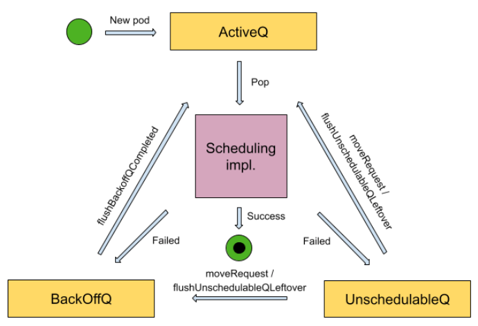

# kube-scheduler


<!-- @import "[TOC]" {cmd="toc" depthFrom=1 depthTo=6 orderedList=false} -->

<!-- code_chunk_output -->

- [kube-scheduler](#kube-scheduler)
    - [setup a scheduler](#setup-a-scheduler)
      - [1.Prepation](#1prepation)
        - [(1) config](#1-config)
        - [(2) plugins](#2-plugins)
        - [(3) register metrics](#3-register-metrics)
      - [2.build frameworks](#2build-frameworks)
      - [3.setup scheduling queue](#3setup-scheduling-queue)
        - [(1) priority queue](#1-priority-queue)
      - [3.setup scheduler](#3setup-scheduler)
    - [run scheduler](#run-scheduler)
      - [1.run basic services](#1run-basic-services)
      - [2.run scheduler](#2run-scheduler)
        - [(1) run scheduling queue (prioprity queue)](#1-run-scheduling-queue-prioprity-queue)
        - [(2) start scheduleOne loop](#2-start-scheduleone-loop)
        - [(3) podsToActivate](#3-podstoactivate)
      - [3.schedulingCycle](#3schedulingcycle)
        - [(1) SchedulePod](#1-schedulepod)
      - [4.bindingCycle](#4bindingcycle)

<!-- /code_chunk_output -->


### setup a scheduler

* Setup creates a completed config and a scheduler based on the command args and options

```go
cc, sched, err := Setup(ctx, opts, registryOptions...)
```

```go
// set defaults using scheme defaultFunc
cfg, err := latest.Default()

// componentConfig is the config of the current component(e.g. kubeScheduler) 
opts.ComponentConfig = cfg

// set command config, including
//   common config: client, EventBroadcaster, InformerFactory, DynInformerFactory
//   ComponentConfig
c, err := opts.Config(ctx)

// make the config completed
//   grant apiserver authrization to it
cc := c.Complete()

/*
set up the scheduler and complement some configs, such as 
    * add informers to informer factory
    * add eventhandlers
*/
sched, err := scheduler.New(ctx,
        cc.Client,
        cc.InformerFactory,
        cc.DynInformerFactory,
        recorderFactory,
        scheduler.WithComponentConfigVersion(cc.ComponentConfig.TypeMeta.APIVersion),
        scheduler.WithKubeConfig(cc.KubeConfig),
        scheduler.WithProfiles(cc.ComponentConfig.Profiles...),
        scheduler.WithPercentageOfNodesToScore(cc.ComponentConfig.PercentageOfNodesToScore),
        scheduler.WithFrameworkOutOfTreeRegistry(outOfTreeRegistry),
        scheduler.WithPodMaxBackoffSeconds(cc.ComponentConfig.PodMaxBackoffSeconds),
        scheduler.WithPodInitialBackoffSeconds(cc.ComponentConfig.PodInitialBackoffSeconds),
        scheduler.WithPodMaxInUnschedulablePodsDuration(cc.PodMaxInUnschedulablePodsDuration),
        scheduler.WithExtenders(cc.ComponentConfig.Extenders...),
        scheduler.WithParallelism(cc.ComponentConfig.Parallelism),
        scheduler.WithBuildFrameworkCapturer(func(profile kubeschedulerconfig.KubeSchedulerProfile) {
            // Profiles are processed during Framework instantiation to set default plugins and configurations. Capturing them for logging
            completedProfiles = append(completedProfiles, profile)
        }),
    )
```

#### 1.Prepation

##### (1) config

* Options
    * General command-line arguments or configuration settings passed to the Kubernetes scheduler
    * Options has **all** the params needed to run a Scheduler
    
* schedulerOptions
    * global configuration options for schedulers
        * kube-scheduler may have multiple shedulers and the default is default-scheduler
* KubeSchedulerProfile
    * a specific configuration option for a specific sheduler
    * SchedulerName is the name of the scheduler associated to this profile.
    * If SchedulerName matches with the pod's "spec.schedulerName", then the pod is scheduled with this profile.


```go
func New(ctx context.Context,
    client clientset.Interface,
    informerFactory informers.SharedInformerFactory,
    dynInformerFactory dynamicinformer.DynamicSharedInformerFactory,
    recorderFactory profile.RecorderFactory,
    opts ...Option) (*Scheduler, error) {
    

    // set default options
    options := defaultSchedulerOptions

    // set custom options
    for _, opt := range opts {
        opt(&options)
    }
}
```

##### (2) plugins

* in-tree plugins: `pkg/scheduler/framework/plugins`
* some [out-of-tree plugins](https://github.com/kubernetes-sigs/scheduler-plugins) implemented by large companies

```go
// load default plugins
registry := frameworkplugins.NewInTreeRegistry()

// load custom plugins
if err := registry.Merge(options.frameworkOutOfTreeRegistry); err != nil {
    return nil, err
}
```

##### (3) register metrics
* define metrics
```go
metrics.Register()
```

* The metrics will be updated or incremented at relevant points in the scheduler code, e.g.
```go
scheduleAttempts.WithLabelValues(result, profile).Inc()
```

#### 2.build frameworks

* [extension points](https://kubernetes.io/docs/concepts/scheduling-eviction/scheduling-framework/): 
    * a well-defined location in the scheduling framework where you can run specific plugins

* Framework is an interface defining methods to run various plugins
```go
// Framework manages the set of plugins in use by the scheduling framework.
// Configured plugins are called at specified points in a scheduling context.
type Framework interface {
    // some run methods in the Handle interface
    Handle

    QueueSortFunc() LessFunc

    RunPreFilterPlugins(ctx context.Context, state *CycleState, pod *v1.Pod) (*PreFilterResult, *Status, sets.Set[string])

    RunPostFilterPlugins(ctx context.Context, state *CycleState, pod *v1.Pod, filteredNodeStatusMap NodeToStatusMap) (*PostFilterResult, *Status)

    RunPreBindPlugins(ctx context.Context, state *CycleState, pod *v1.Pod, nodeName string) *Status

    RunBindPlugins(ctx context.Context, state *CycleState, pod *v1.Pod, nodeName string) *Status

    RunPostBindPlugins(ctx context.Context, state *CycleState, pod *v1.Pod, nodeName string)

    // ...
}
```

* NewMap builds the frameworks given by the configuration, indexed by profile name
    * e.g. 
```go
profiles, err := profile.NewMap(ctx, options.profiles, registry, recorderFactory,
    frameworkruntime.WithComponentConfigVersion(options.componentConfigVersion),
    frameworkruntime.WithClientSet(client),
    frameworkruntime.WithKubeConfig(options.kubeConfig),
    frameworkruntime.WithInformerFactory(informerFactory),
    frameworkruntime.WithResourceClaimCache(resourceClaimCache),
    frameworkruntime.WithSnapshotSharedLister(snapshot),
    frameworkruntime.WithCaptureProfile(frameworkruntime.CaptureProfile(options.frameworkCapturer)),
    frameworkruntime.WithParallelism(int(options.parallelism)),
    frameworkruntime.WithExtenders(extenders),
    frameworkruntime.WithMetricsRecorder(metricsRecorder),
    frameworkruntime.WithWaitingPods(waitingPods),
)
```

```go
func NewMap(ctx context.Context, cfgs []config.KubeSchedulerProfile, r frameworkruntime.Registry, recorderFact RecorderFactory,
    opts ...frameworkruntime.Option) (Map, error) {
    m := make(Map)
    v := cfgValidator{m: m}

    for _, cfg := range cfgs {
        p, err := newProfile(ctx, cfg, r, recorderFact, opts...)
        if err != nil {
            return nil, fmt.Errorf("creating profile for scheduler name %s: %v", cfg.SchedulerName, err)
        }
        if err := v.validate(cfg, p); err != nil {
            return nil, err
        }
        m[cfg.SchedulerName] = p
    }
    return m, nil
}
```

```go
func newProfile(ctx context.Context, cfg config.KubeSchedulerProfile, r frameworkruntime.Registry, recorderFact RecorderFactory,
    opts ...frameworkruntime.Option) (framework.Framework, error) {
    recorder := recorderFact(cfg.SchedulerName)
    opts = append(opts, frameworkruntime.WithEventRecorder(recorder))
    // NewFramework initializes plugins given the configuration and the registry
    return frameworkruntime.NewFramework(ctx, r, &cfg, opts...)
}
```

#### 3.setup scheduling queue
```go
// run PreEnqueuePlugins and EnqueueExtensions
for profileName, profile := range profiles {
    preEnqueuePluginMap[profileName] = profile.PreEnqueuePlugins()
    queueingHintsPerProfile[profileName], err = buildQueueingHintMap(ctx, profile.EnqueueExtensions())
    if err != nil {
        returnErr = errors.Join(returnErr, err)
    }
}

podQueue := internalqueue.NewSchedulingQueue(
    profiles[options.profiles[0].SchedulerName].QueueSortFunc(),
    informerFactory,
    internalqueue.WithPodInitialBackoffDuration(time.Duration(options.podInitialBackoffSeconds)*time.Second),
    internalqueue.WithPodMaxBackoffDuration(time.Duration(options.podMaxBackoffSeconds)*time.Second),
    internalqueue.WithPodLister(podLister),
    internalqueue.WithPodMaxInUnschedulablePodsDuration(options.podMaxInUnschedulablePodsDuration),
    internalqueue.WithPreEnqueuePluginMap(preEnqueuePluginMap),
    internalqueue.WithQueueingHintMapPerProfile(queueingHintsPerProfile),
    internalqueue.WithPluginMetricsSamplePercent(pluginMetricsSamplePercent),
    internalqueue.WithMetricsRecorder(*metricsRecorder),
)
```

```go
// NewSchedulingQueue initializes a priority queue as a new scheduling queue.
func NewSchedulingQueue(
    lessFn framework.LessFunc,
    informerFactory informers.SharedInformerFactory,
    opts ...Option) SchedulingQueue {
    return NewPriorityQueue(lessFn, informerFactory, opts...)
}
```

##### (1) priority queue


* use **heap sort** to sort queue
    * the head is the highest priority
* activeQ
    * holds pods that are being considered for scheduling
* backoffQ
    * holds pods that moved from unschedulablePods and will move to activeQ when their backoff periods complete
* unschedulablePods
    * holds pods that were already attempted for scheduling and are currently determined to be unschedulable
    ```go
    type UnschedulablePods struct {
        // podInfoMap is a map key by a pod's full-name and the value is a pointer to the QueuedPodInfo.
        podInfoMap map[string]*framework.QueuedPodInfo
        keyFunc    func(*v1.Pod) string
        // unschedulableRecorder/gatedRecorder updates the counter when elements of an unschedulablePodsMap
        // get added or removed, and it does nothing if it's nil.
        unschedulableRecorder, gatedRecorder metrics.MetricRecorder
    }
    ```

```go
// implements PodNominator interface, SchedulingQueue interface, etc
type PriorityQueue struct {

    // when find a suitable node which is not feasible, it will check if preemption is allowed
    // when preempt, it needs to store pods info temporarily 
    *nominator

    activeQ *heap.Heap

    podBackoffQ *heap.Heap

    unschedulablePods *UnschedulablePods

    // ...
}
```

#### 3.setup scheduler

```go
// Cache collects pods' information and provides node-level aggregated information.
// It's intended for generic scheduler to do efficient lookup.
schedulerCache := internalcache.New(ctx, durationToExpireAssumedPod)


sched := &Scheduler{
    Cache:                    schedulerCache,
    client:                   client,
    nodeInfoSnapshot:         snapshot,
    percentageOfNodesToScore: options.percentageOfNodesToScore,
    Extenders:                extenders,
    StopEverything:           stopEverything,
    SchedulingQueue:          podQueue,
    Profiles:                 profiles,
    logger:                   logger,
}

sched.NextPod = podQueue.Pop

sched.applyDefaultHandlers()
```

***

### run scheduler

#### 1.run basic services

```go
// Start events processing pipeline.
cc.EventBroadcaster.StartRecordingToSink(ctx.Done())
defer cc.EventBroadcaster.Shutdown()

// Start up the healthz server.
// ...

// start informers
startInformersAndWaitForSync := func(ctx context.Context) {
    // Start all informers.
    cc.InformerFactory.Start(ctx.Done())
    // DynInformerFactory can be nil in tests.
    if cc.DynInformerFactory != nil {
        cc.DynInformerFactory.Start(ctx.Done())
    }

    // WaitForCacheSync blocks until all started informers' caches were synced
    cc.InformerFactory.WaitForCacheSync(ctx.Done())
    // DynInformerFactory can be nil in tests.
    if cc.DynInformerFactory != nil {
        cc.DynInformerFactory.WaitForCacheSync(ctx.Done())
    }

    // Wait for all handlers to sync (all items in the initial list delivered) before scheduling.
    if err := sched.WaitForHandlersSync(ctx); err != nil {
        logger.Error(err, "waiting for handlers to sync")
    }

    close(handlerSyncReadyCh)
    logger.V(3).Info("Handlers synced")
}
if !cc.ComponentConfig.DelayCacheUntilActive || cc.LeaderElection == nil {
    startInformersAndWaitForSync(ctx)
}

// start scheduler
sched.Run(ctx)
```

#### 2.run scheduler
```go
// Run begins watching and scheduling. It starts scheduling and blocked until the context is done.
func (sched *Scheduler) Run(ctx context.Context) {
    logger := klog.FromContext(ctx)
    sched.SchedulingQueue.Run(logger)

    // We need to start scheduleOne loop in a dedicated goroutine,
    // because scheduleOne function hangs on getting the next item
    // from the SchedulingQueue.
    // If there are no new pods to schedule, it will be hanging there
    // and if done in this goroutine it will be blocking closing
    // SchedulingQueue, in effect causing a deadlock on shutdown.
    go wait.UntilWithContext(ctx, sched.ScheduleOne, 0)

    <-ctx.Done()
    sched.SchedulingQueue.Close()

    // If the plugins satisfy the io.Closer interface, they are closed.
    err := sched.Profiles.Close()
    if err != nil {
        logger.Error(err, "Failed to close plugins")
    }
}
```

##### (1) run scheduling queue (prioprity queue)
```go
sched.SchedulingQueue.Run(logger)
```
```go
// Run starts the goroutine to pump from podBackoffQ to activeQ
func (p *PriorityQueue) Run(logger klog.Logger) {
    go wait.Until(func() {

        // flushBackoffQCompleted Moves all pods from backoffQ which have completed backoff in to activeQ
        p.flushBackoffQCompleted(logger)
    }, 1.0*time.Second, p.stop)

    go wait.Until(func() {
        
        // flushUnschedulablePodsLeftover moves pods which stay in unschedulablePods
        // longer than podMaxInUnschedulablePodsDuration to backoffQ or activeQ.
        p.flushUnschedulablePodsLeftover(logger)
    }, 30*time.Second, p.stop)
}
```

##### (2) start scheduleOne loop
```go
go wait.UntilWithContext(ctx, sched.ScheduleOne, 0)
```
```go
func (sched *Scheduler) ScheduleOne(ctx context.Context) {

    // pop the highest priority pod from activeQ
    podInfo, err := sched.NextPod(logger)

    // determine which framework to use based on pod.Spec.SchedulerName
    fwk, err := sched.frameworkForPod(pod)

    // a per-scheduling-cycle storage used by scheduler plugins to share data
    state := framework.NewCycleState()


    // why need podsToActivate:
    //   * lets the scheduler reactivate specific pods that were previously unschedulable, in response to changes triggered by other pods getting scheduled
    //   * otherwise, the scheduler would have to periodically retry everything
    podsToActivate := framework.NewPodsToActivate()
    state.Write(framework.PodsToActivateKey, podsToActivate)

    scheduleResult, assumedPodInfo, status := sched.schedulingCycle(schedulingCycleCtx, state, fwk, podInfo, start, podsToActivate)


    // bind the pod to its host asynchronously (we can do this becasue of the assumption step above).
    // The assumption step refers to AssumePod() — the moment when the scheduler pretends the pod is already scheduled by updating its internal cache before doing the actual bind
    go func() {
        status := sched.bindingCycle(bindingCycleCtx, state, fwk, scheduleResult, assumedPodInfo, start, podsToActivate)

        // Done must be called for pod returned by Pop. 
        // This allows the queue to keep track of which pods are currently being processed
        sched.SchedulingQueue.Done(assumedPodInfo.Pod.UID)
    }()
}
```

##### (3) podsToActivate

* example:
    * Pod A: low-priority pod already scheduled on Node-1
    * Pod B: high-priority pod that needs Node-1, but it couldn't be scheduled earlier because Node-1 was full (so it’s in `unschedulablePods`)
    * Pod C is very high priority and preempt Pod A to make room
    * Now Node-1 is available again
    * After Pod C is bound, the scheduler activates pods in podsToActivateAfter Pod C is bound, the scheduler activates pods in podsToActivate
    * Now PodB is moved from `unschedulablePods` → `activeQ`

#### 3.schedulingCycle
```go
// schedulingCycle tries to schedule a single Pod.
func (sched *Scheduler) schedulingCycle(
    ctx context.Context,
    state *framework.CycleState,
    fwk framework.Framework,
    podInfo *framework.QueuedPodInfo,
    start time.Time,
    podsToActivate *framework.PodsToActivate,
) (ScheduleResult, *framework.QueuedPodInfo, *framework.Status) {

    scheduleResult, err := sched.SchedulePod(ctx, fwk, state, pod)

    // assume modifies `assumedPod` by setting NodeName=scheduleResult.SuggestedHost
    err = sched.assume(logger, assumedPod, scheduleResult.SuggestedHost)

    // Run the Reserve method of reserve plugins.
    // allow plugins to prepare and lock down resources in a safe, coordinated, and fail-fast way — before the pod is actually bound
    if sts := fwk.RunReservePluginsReserve(ctx, state, assumedPod, scheduleResult.SuggestedHost); !sts.IsSuccess() {
        // trigger un-reserve to clean up state associated with the reserved Pod
        fwk.RunReservePluginsUnreserve(ctx, state, assumedPod, scheduleResult.SuggestedHost)
    }

    // Run "permit" plugins.
    // why: e.g.
    //      You want to schedule a group of pods together, or not at all
    //      Maybe another system (e.g., a GPU allocator or custom orchestrator) must Approve the pod
    runPermitStatus := fwk.RunPermitPlugins(ctx, state, assumedPod, scheduleResult.SuggestedHost)

    // At the end of a successful scheduling cycle, pop and move up Pods if needed.
    if len(podsToActivate.Map) != 0 {
        sched.SchedulingQueue.Activate(logger, podsToActivate.Map)
        // Clear the entries after activation.
        podsToActivate.Map = make(map[string]*v1.Pod)
    }

    return scheduleResult, assumedPodInfo, nil
}
```

##### (1) SchedulePod
```go
func (sched *Scheduler) schedulePod(ctx context.Context, fwk framework.Framework, state *framework.CycleState, pod *v1.Pod) (result ScheduleResult, err error) {

    feasibleNodes, diagnosis, err := sched.findNodesThatFitPod(ctx, fwk, state, pod)

    priorityList, err := prioritizeNodes(ctx, sched.Extenders, fwk, state, pod, feasibleNodes)

    host, _, err := selectHost(priorityList, numberOfHighestScoredNodesToReport)

    return ScheduleResult{
        SuggestedHost:  host,
        EvaluatedNodes: len(feasibleNodes) + len(diagnosis.NodeToStatusMap),
        FeasibleNodes:  len(feasibleNodes),
    }, err
}
```

#### 4.bindingCycle
```go
// bindingCycle tries to bind an assumed Pod.
func (sched *Scheduler) bindingCycle(
    ctx context.Context,
    state *framework.CycleState,
    fwk framework.Framework,
    scheduleResult ScheduleResult,
    assumedPodInfo *framework.QueuedPodInfo,
    start time.Time,
    podsToActivate *framework.PodsToActivate) *framework.Status {

    assumedPod := assumedPodInfo.Pod

    // Run "prebind" plugins.
    status := fwk.RunPreBindPlugins(ctx, state, assumedPod, scheduleResult.SuggestedHost)

    // Run "bind" plugins.
    if status := sched.bind(ctx, fwk, assumedPod, scheduleResult.SuggestedHost, state); !status.IsSuccess() {
        return status
    }

    // Run "postbind" plugins.
    fwk.RunPostBindPlugins(ctx, state, assumedPod, scheduleResult.SuggestedHost)

    // At the end of a successful binding cycle, move up Pods if needed.
    if len(podsToActivate.Map) != 0 {
        sched.SchedulingQueue.Activate(logger, podsToActivate.Map)
        // Unlike the logic in schedulingCycle(), we don't bother deleting the entries
        // as `podsToActivate.Map` is no longer consumed.
    }

    return nil
}
```