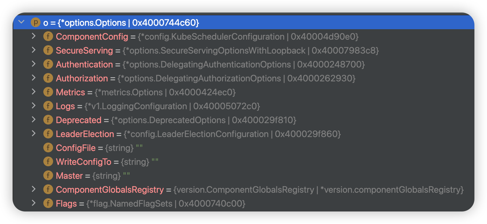
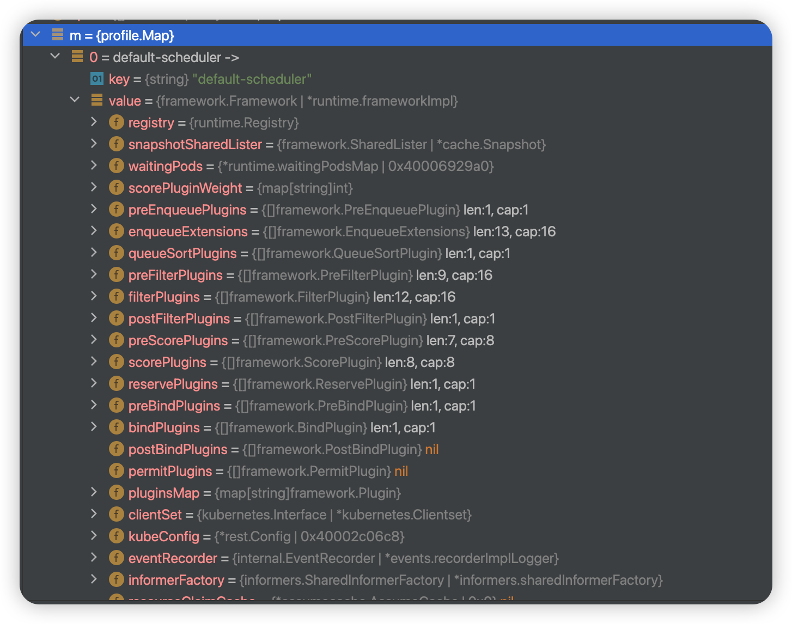

# kube-scheduler


<!-- @import "[TOC]" {cmd="toc" depthFrom=1 depthTo=6 orderedList=false} -->

<!-- code_chunk_output -->

- [kube-scheduler](#kube-scheduler)
    - [setup a scheduler](#setup-a-scheduler)
      - [1.Prepation](#1prepation)
        - [(1) config](#1-config)
        - [(2) plugins](#2-plugins)
        - [(3) register metrics](#3-register-metrics)
      - [2.build frameworks](#2build-frameworks)
      - [3.setup scheduling queue](#3setup-scheduling-queue)
    - [run scheduler](#run-scheduler)
      - [1.run basic services](#1run-basic-services)

<!-- /code_chunk_output -->


### setup a scheduler

* Setup creates a completed config and a scheduler based on the command args and options

```go
cc, sched, err := Setup(ctx, opts, registryOptions...)
```

```go
// set defaults using scheme defaultFunc
cfg, err := latest.Default()

// componentConfig is the config of the current component(e.g. kubeScheduler) 
opts.ComponentConfig = cfg

// set command config, including
//   common config: client, EventBroadcaster, InformerFactory, DynInformerFactory
//   ComponentConfig
c, err := opts.Config(ctx)

// make the config completed
//   grant apiserver authrization to it
cc := c.Complete()

/*
set up the scheduler and complement some configs, such as 
    * add informers to informer factory
    * add eventhandlers
*/
sched, err := scheduler.New(ctx,
        cc.Client,
        cc.InformerFactory,
        cc.DynInformerFactory,
        recorderFactory,
        scheduler.WithComponentConfigVersion(cc.ComponentConfig.TypeMeta.APIVersion),
        scheduler.WithKubeConfig(cc.KubeConfig),
        scheduler.WithProfiles(cc.ComponentConfig.Profiles...),
        scheduler.WithPercentageOfNodesToScore(cc.ComponentConfig.PercentageOfNodesToScore),
        scheduler.WithFrameworkOutOfTreeRegistry(outOfTreeRegistry),
        scheduler.WithPodMaxBackoffSeconds(cc.ComponentConfig.PodMaxBackoffSeconds),
        scheduler.WithPodInitialBackoffSeconds(cc.ComponentConfig.PodInitialBackoffSeconds),
        scheduler.WithPodMaxInUnschedulablePodsDuration(cc.PodMaxInUnschedulablePodsDuration),
        scheduler.WithExtenders(cc.ComponentConfig.Extenders...),
        scheduler.WithParallelism(cc.ComponentConfig.Parallelism),
        scheduler.WithBuildFrameworkCapturer(func(profile kubeschedulerconfig.KubeSchedulerProfile) {
            // Profiles are processed during Framework instantiation to set default plugins and configurations. Capturing them for logging
            completedProfiles = append(completedProfiles, profile)
        }),
    )
```

#### 1.Prepation

##### (1) config

* Options
    * General command-line arguments or configuration settings passed to the Kubernetes scheduler
    * Options has **all** the params needed to run a Scheduler
    
* schedulerOptions
    * global configuration options for schedulers
        * kube-scheduler may have multiple shedulers and the default is default-scheduler
* KubeSchedulerProfile
    * a specific configuration option for a specific sheduler
    * SchedulerName is the name of the scheduler associated to this profile.
    * If SchedulerName matches with the pod's "spec.schedulerName", then the pod is scheduled with this profile.


```go
func New(ctx context.Context,
    client clientset.Interface,
    informerFactory informers.SharedInformerFactory,
    dynInformerFactory dynamicinformer.DynamicSharedInformerFactory,
    recorderFactory profile.RecorderFactory,
    opts ...Option) (*Scheduler, error) {
    

    // set default options
    options := defaultSchedulerOptions

    // set custom options
    for _, opt := range opts {
        opt(&options)
    }
}
```

##### (2) plugins

* in-tree plugins: `pkg/scheduler/framework/plugins`
* some [out-of-tree plugins](https://github.com/kubernetes-sigs/scheduler-plugins) implemented by large companies

```go
// load default plugins
registry := frameworkplugins.NewInTreeRegistry()

// load custom plugins
if err := registry.Merge(options.frameworkOutOfTreeRegistry); err != nil {
    return nil, err
}
```

##### (3) register metrics
* define metrics
```go
metrics.Register()
```

* The metrics will be updated or incremented at relevant points in the scheduler code, e.g.
```go
scheduleAttempts.WithLabelValues(result, profile).Inc()
```

#### 2.build frameworks

* [extension points](https://kubernetes.io/docs/concepts/scheduling-eviction/scheduling-framework/): 
    * a well-defined location in the scheduling framework where you can run specific plugins

* Framework is an interface defining methods to run various plugins
```go
// Framework manages the set of plugins in use by the scheduling framework.
// Configured plugins are called at specified points in a scheduling context.
type Framework interface {
    // some run methods in the Handle interface
    Handle

    QueueSortFunc() LessFunc

    RunPreFilterPlugins(ctx context.Context, state *CycleState, pod *v1.Pod) (*PreFilterResult, *Status, sets.Set[string])

    RunPostFilterPlugins(ctx context.Context, state *CycleState, pod *v1.Pod, filteredNodeStatusMap NodeToStatusMap) (*PostFilterResult, *Status)

    RunPreBindPlugins(ctx context.Context, state *CycleState, pod *v1.Pod, nodeName string) *Status

    RunBindPlugins(ctx context.Context, state *CycleState, pod *v1.Pod, nodeName string) *Status

    RunPostBindPlugins(ctx context.Context, state *CycleState, pod *v1.Pod, nodeName string)

    // ...
}
```

* NewMap builds the frameworks given by the configuration, indexed by profile name
    * e.g. 
```go
profiles, err := profile.NewMap(ctx, options.profiles, registry, recorderFactory,
    frameworkruntime.WithComponentConfigVersion(options.componentConfigVersion),
    frameworkruntime.WithClientSet(client),
    frameworkruntime.WithKubeConfig(options.kubeConfig),
    frameworkruntime.WithInformerFactory(informerFactory),
    frameworkruntime.WithResourceClaimCache(resourceClaimCache),
    frameworkruntime.WithSnapshotSharedLister(snapshot),
    frameworkruntime.WithCaptureProfile(frameworkruntime.CaptureProfile(options.frameworkCapturer)),
    frameworkruntime.WithParallelism(int(options.parallelism)),
    frameworkruntime.WithExtenders(extenders),
    frameworkruntime.WithMetricsRecorder(metricsRecorder),
    frameworkruntime.WithWaitingPods(waitingPods),
)
```

```go
func NewMap(ctx context.Context, cfgs []config.KubeSchedulerProfile, r frameworkruntime.Registry, recorderFact RecorderFactory,
    opts ...frameworkruntime.Option) (Map, error) {
    m := make(Map)
    v := cfgValidator{m: m}

    for _, cfg := range cfgs {
        p, err := newProfile(ctx, cfg, r, recorderFact, opts...)
        if err != nil {
            return nil, fmt.Errorf("creating profile for scheduler name %s: %v", cfg.SchedulerName, err)
        }
        if err := v.validate(cfg, p); err != nil {
            return nil, err
        }
        m[cfg.SchedulerName] = p
    }
    return m, nil
}
```

```go
func newProfile(ctx context.Context, cfg config.KubeSchedulerProfile, r frameworkruntime.Registry, recorderFact RecorderFactory,
    opts ...frameworkruntime.Option) (framework.Framework, error) {
    recorder := recorderFact(cfg.SchedulerName)
    opts = append(opts, frameworkruntime.WithEventRecorder(recorder))
    // NewFramework initializes plugins given the configuration and the registry
    return frameworkruntime.NewFramework(ctx, r, &cfg, opts...)
}
```

#### 3.setup scheduling queue
```go
podQueue := internalqueue.NewSchedulingQueue(
    profiles[options.profiles[0].SchedulerName].QueueSortFunc(),
    informerFactory,
    internalqueue.WithPodInitialBackoffDuration(time.Duration(options.podInitialBackoffSeconds)*time.Second),
    internalqueue.WithPodMaxBackoffDuration(time.Duration(options.podMaxBackoffSeconds)*time.Second),
    internalqueue.WithPodLister(podLister),
    internalqueue.WithPodMaxInUnschedulablePodsDuration(options.podMaxInUnschedulablePodsDuration),
    internalqueue.WithPreEnqueuePluginMap(preEnqueuePluginMap),
    internalqueue.WithQueueingHintMapPerProfile(queueingHintsPerProfile),
    internalqueue.WithPluginMetricsSamplePercent(pluginMetricsSamplePercent),
    internalqueue.WithMetricsRecorder(*metricsRecorder),
)
```

***

### run scheduler

#### 1.run basic services

```go
// Start events processing pipeline.
cc.EventBroadcaster.StartRecordingToSink(ctx.Done())
defer cc.EventBroadcaster.Shutdown()

// Start up the healthz server.
// ...

// start informerss
startInformersAndWaitForSync := func(ctx context.Context) {
    // Start all informers.
    cc.InformerFactory.Start(ctx.Done())
    // DynInformerFactory can be nil in tests.
    if cc.DynInformerFactory != nil {
        cc.DynInformerFactory.Start(ctx.Done())
    }

    // WaitForCacheSync blocks until all started informers' caches were synced
    cc.InformerFactory.WaitForCacheSync(ctx.Done())
    // DynInformerFactory can be nil in tests.
    if cc.DynInformerFactory != nil {
        cc.DynInformerFactory.WaitForCacheSync(ctx.Done())
    }

    // Wait for all handlers to sync (all items in the initial list delivered) before scheduling.
    if err := sched.WaitForHandlersSync(ctx); err != nil {
        logger.Error(err, "waiting for handlers to sync")
    }

    close(handlerSyncReadyCh)
    logger.V(3).Info("Handlers synced")
}
if !cc.ComponentConfig.DelayCacheUntilActive || cc.LeaderElection == nil {
    startInformersAndWaitForSync(ctx)
}

// start scheduler
sched.Run(ctx)
```