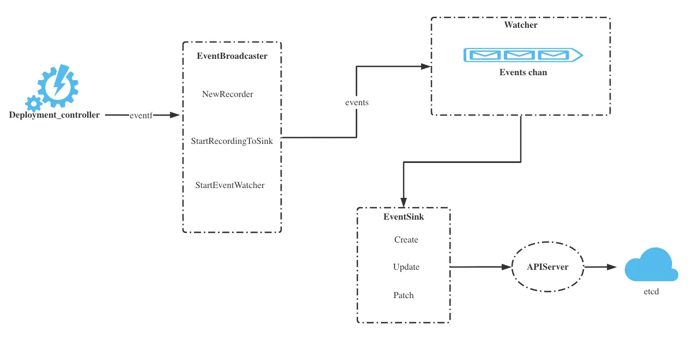

# Event


<!-- @import "[TOC]" {cmd="toc" depthFrom=1 depthTo=6 orderedList=false} -->

<!-- code_chunk_output -->

- [Event](#event)
    - [Overview](#overview)
      - [1.EventBroadcaster (receive events from the component itself)](#1eventbroadcaster-receive-events-from-the-component-itself)
        - [(1) what](#1-what)
        - [(2) create a new event Broadcaster](#2-create-a-new-event-broadcaster)
      - [2.watchers](#2watchers)
      - [3.recordToSink (write events to apiserver)](#3recordtosink-write-events-to-apiserver)

<!-- /code_chunk_output -->


### Overview



```go
type recorderImpl struct {
	scheme              *runtime.Scheme
	reportingController string
	reportingInstance   string
	*watch.Broadcaster
	clock clock.Clock
}

func (recorder *recorderImpl) Eventf(regarding runtime.Object, related runtime.Object, eventtype, reason, action, note string, args ...interface{}) {
	recorder.eventf(klog.Background(), regarding, related, eventtype, reason, action, note, args...)
}

func (recorder *recorderImpl) eventf(logger klog.Logger, regarding runtime.Object, related runtime.Object, eventtype, reason, action, note string, args ...interface{}) {
	timestamp := metav1.MicroTime{Time: time.Now()}
	message := fmt.Sprintf(note, args...)
	refRegarding, err := reference.GetReference(recorder.scheme, regarding)
	if err != nil {
		logger.Error(err, "Could not construct reference, will not report event", "object", regarding, "eventType", eventtype, "reason", reason, "message", message)
		return
	}

	var refRelated *v1.ObjectReference
	if related != nil {
		refRelated, err = reference.GetReference(recorder.scheme, related)
		if err != nil {
			logger.V(9).Info("Could not construct reference", "object", related, "err", err)
		}
	}
	if !util.ValidateEventType(eventtype) {
		logger.Error(nil, "Unsupported event type", "eventType", eventtype)
		return
	}
	event := recorder.makeEvent(refRegarding, refRelated, timestamp, eventtype, reason, message, recorder.reportingController, recorder.reportingInstance, action)
	go func() {
		defer utilruntime.HandleCrash()
		recorder.Action(watch.Added, event)
	}()
}
```

#### 1.EventBroadcaster (receive events from the component itself)

##### (1) what
* get events from `incoming` channel in a loop
* distribute events to watchers: `m.distribute(event)`

##### (2) create a new event Broadcaster
* start a loop goroutine to **reveive** events and **distribute** these events to **broadcatser watchers**

```go
func NewBroadcaster(queueLength int, fullChannelBehavior FullChannelBehavior) *Broadcaster {
    m := &Broadcaster{
        watchers:            map[int64]*broadcasterWatcher{},
        incoming:            make(chan Event, incomingQueueLength),
        stopped:             make(chan struct{}),
        watchQueueLength:    queueLength,
        fullChannelBehavior: fullChannelBehavior,
    }
    m.distributing.Add(1)

    // start a loop goroutine
    go m.loop()
    
    return m
}
```

```go
// loop receives from m.incoming and distributes to all watchers.
func (m *Broadcaster) loop() {
    // Deliberately not catching crashes here. Yes, bring down the process if there's a
    // bug in watch.Broadcaster.
    for event := range m.incoming {
        if event.Type == internalRunFunctionMarker {
            event.Object.(functionFakeRuntimeObject)()
            continue
        }
        m.distribute(event)
    }
    m.closeAll()
    m.distributing.Done()
}
```

* blockQueue was used to wait for the function to be done
    * events are not able to be pushed into the channel util the function being done
```go
func (m *Broadcaster) blockQueue(f func()) {
    m.incomingBlock.Lock()
    defer m.incomingBlock.Unlock()
    select {
    case <-m.stopped:
        return
    default:
    }
    var wg sync.WaitGroup
    wg.Add(1)
    m.incoming <- Event{
        Type: internalRunFunctionMarker,
        Object: functionFakeRuntimeObject(func() {
            defer wg.Done()
            f()
        }),
    }
    wg.Wait()
}
```

#### 2.watchers
```go
func (e *eventBroadcasterImpl) startRecordingEvents(ctx context.Context) error {
    eventHandler := func(obj runtime.Object) {
        event, ok := obj.(*eventsv1.Event)
        if !ok {
            klog.FromContext(ctx).Error(nil, "unexpected type, expected eventsv1.Event")
            return
        }
        e.recordToSink(ctx, event, clock.RealClock{})
    }
    stopWatcher, err := e.StartEventWatcher(eventHandler)
    if err != nil {
        return err
    }
    go func() {
        <-ctx.Done()
        stopWatcher()
    }()
    return nil
}
```
```go
func (e *eventBroadcasterImpl) StartEventWatcher(eventHandler func(event runtime.Object)) (func(), error) {
    // add watchers to EventBroadcaster
    watcher, err := e.Watch()
    if err != nil {
        return nil, err
    }

    // start watchers
    go func() {
        defer utilruntime.HandleCrash()
        for {
            watchEvent, ok := <-watcher.ResultChan()
            if !ok {
                return
            }
            eventHandler(watchEvent.Object)
        }
    }()
    return watcher.Stop, nil
}
```
* add watchers to EventBroadcaster
```go
func (m *Broadcaster) Watch() (Interface, error) {
    var w *broadcasterWatcher
    m.blockQueue(func() {
        id := m.nextWatcher
        m.nextWatcher++
        w = &broadcasterWatcher{
            result:  make(chan Event, m.watchQueueLength),
            stopped: make(chan struct{}),
            id:      id,
            m:       m,
        }
        m.watchers[id] = w
    })
    if w == nil {
        return nil, fmt.Errorf("broadcaster already stopped")
    }
    return w, nil
}
```

#### 3.recordToSink (write events to apiserver)

```go
func (e *eventBroadcasterImpl) startRecordingEvents(ctx context.Context) error {
    //...
    e.recordToSink(ctx, event, clock.RealClock{})
    //...
}
```

```go
func (e *eventBroadcasterImpl) recordToSink(ctx context.Context, event *eventsv1.Event, clock clock.Clock) {
    //...
    e.attemptRecording(ctx, evToRecord)
    //...
}
```
```go
func (e *eventBroadcasterImpl) attemptRecording(ctx context.Context, event *eventsv1.Event) {
    tries := 0
    for {
        if _, retry := recordEvent(ctx, e.sink, event); !retry {
            return
        }
        //...
    }
}
```
```go
func recordEvent(ctx context.Context, sink EventSink, event *eventsv1.Event) (*eventsv1.Event, bool) {
    //...
    newEvent, err = sink.Create(ctx, event)
    //...
}
```
```go
// staging/src/k8s.io/client-go/gentype/type.go

func (c *Client[T]) Create(ctx context.Context, obj T, opts metav1.CreateOptions) (T, error) {
    result := c.newObject()
    err := c.client.Post().
        NamespaceIfScoped(c.namespace, c.namespace != "").
        Resource(c.resource).
        VersionedParams(&opts, c.parameterCodec).
        Body(obj).
        Do(ctx).
        Into(result)
    return result, err
}
```