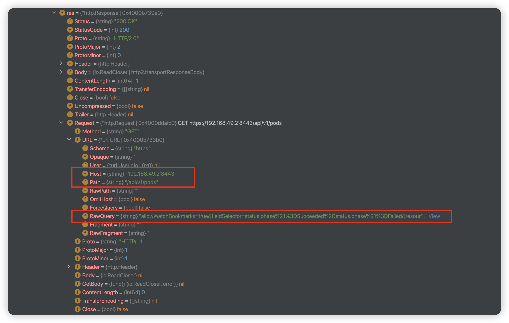

# ListWatch


<!-- @import "[TOC]" {cmd="toc" depthFrom=1 depthTo=6 orderedList=false} -->

<!-- code_chunk_output -->

- [ListWatch](#listwatch)
    - [Overview](#overview)
      - [1.every type has its corresponding listWatch](#1every-type-has-its-corresponding-listwatch)
      - [2.List](#2list)
      - [3.Watch](#3watch)
        - [(1) how watch](#1-how-watch)
        - [(2) watch output](#2-watch-output)
      - [4.listWatch](#4listwatch)

<!-- /code_chunk_output -->


### Overview

#### 1.every type has its corresponding listWatch
* e.g. `*v1.Pod` (`staging/src/k8s.io/client-go/kubernetes/typed/core/v1/pod.go`)
```go
type PodInterface interface {
    Create(ctx context.Context, pod *v1.Pod, opts metav1.CreateOptions) (*v1.Pod, error)
    Update(ctx context.Context, pod *v1.Pod, opts metav1.UpdateOptions) (*v1.Pod, error)
    // Add a +genclient:noStatus comment above the type to avoid generating UpdateStatus().
    UpdateStatus(ctx context.Context, pod *v1.Pod, opts metav1.UpdateOptions) (*v1.Pod, error)
    Delete(ctx context.Context, name string, opts metav1.DeleteOptions) error
    DeleteCollection(ctx context.Context, opts metav1.DeleteOptions, listOpts metav1.ListOptions) error
    Get(ctx context.Context, name string, opts metav1.GetOptions) (*v1.Pod, error)
    List(ctx context.Context, opts metav1.ListOptions) (*v1.PodList, error)
    Watch(ctx context.Context, opts metav1.ListOptions) (watch.Interface, error)
    Patch(ctx context.Context, name string, pt types.PatchType, data []byte, opts metav1.PatchOptions, subresources ...string) (result *v1.Pod, err error)
    Apply(ctx context.Context, pod *corev1.PodApplyConfiguration, opts metav1.ApplyOptions) (result *v1.Pod, err error)
    // Add a +genclient:noStatus comment above the type to avoid generating ApplyStatus().
    ApplyStatus(ctx context.Context, pod *corev1.PodApplyConfiguration, opts metav1.ApplyOptions) (result *v1.Pod, err error)
    UpdateEphemeralContainers(ctx context.Context, podName string, pod *v1.Pod, opts metav1.UpdateOptions) (*v1.Pod, error)

    PodExpansion
}
```

#### 2.List
* `staging/src/k8s.io/client-go/gentype/type.go`
```go
func (l *alsoLister[T, L]) List(ctx context.Context, opts metav1.ListOptions) (L, error) {
    if watchListOptions, hasWatchListOptionsPrepared, watchListOptionsErr := watchlist.PrepareWatchListOptionsFromListOptions(opts); watchListOptionsErr != nil {
        klog.Warningf("Failed preparing watchlist options for $.type|resource$, falling back to the standard LIST semantics, err = %v", watchListOptionsErr)
    } else if hasWatchListOptionsPrepared {
        result, err := l.watchList(ctx, watchListOptions)
        if err == nil {
            consistencydetector.CheckWatchListFromCacheDataConsistencyIfRequested(ctx, "watchlist request for "+l.client.resource, l.list, opts, result)
            return result, nil
        }
        klog.Warningf("The watchlist request for %s ended with an error, falling back to the standard LIST semantics, err = %v", l.client.resource, err)
    }
    result, err := l.list(ctx, opts)
    if err == nil {
        consistencydetector.CheckListFromCacheDataConsistencyIfRequested(ctx, "list request for "+l.client.resource, l.list, opts, result)
    }
    return result, err
}
```
```go
func (l *alsoLister[T, L]) list(ctx context.Context, opts metav1.ListOptions) (L, error) {
    list := l.newList()
    var timeout time.Duration
    if opts.TimeoutSeconds != nil {
        timeout = time.Duration(*opts.TimeoutSeconds) * time.Second
    }
    err := l.client.client.Get().
        NamespaceIfScoped(l.client.namespace, l.client.namespace != "").
        Resource(l.client.resource).
        VersionedParams(&opts, l.client.parameterCodec).
        Timeout(timeout).
        Do(ctx).
        Into(list)
    return list, err
}
```

* output a list (e.g. pod)
```go
{
    "list": {
        "items": [
            <v1.Pod>,
            <v1.Pod>,
        ]
    }
}
```

#### 3.Watch

* `staging/src/k8s.io/client-go/gentype/type.go`
```go
func (c *Client[T]) Watch(ctx context.Context, opts metav1.ListOptions) (watch.Interface, error) {
    var timeout time.Duration
    if opts.TimeoutSeconds != nil {
        timeout = time.Duration(*opts.TimeoutSeconds) * time.Second
    }
    opts.Watch = true
    return c.client.Get().
        NamespaceIfScoped(c.namespace, c.namespace != "").
        Resource(c.resource).
        VersionedParams(&opts, c.parameterCodec).
        Timeout(timeout).
        Watch(ctx)
}
```

##### (1) how watch
* establish a long connection to watch a specific resource and then send event to result channel
```go
// receive reads result from the decoder in a loop and sends down the result channel.
func (sw *StreamWatcher) receive() {
    defer utilruntime.HandleCrash()
    defer close(sw.result)
    defer sw.Stop()
    for {
        action, obj, err := sw.source.Decode()
        if err != nil {
            switch err {
            case io.EOF:
                // watch closed normally
            case io.ErrUnexpectedEOF:
                klog.V(1).Infof("Unexpected EOF during watch stream event decoding: %v", err)
            default:
                if net.IsProbableEOF(err) || net.IsTimeout(err) {
                    klog.V(5).Infof("Unable to decode an event from the watch stream: %v", err)
                } else {
                    select {
                    case <-sw.done:
                    case sw.result <- Event{
                        Type:   Error,
                        Object: sw.reporter.AsObject(fmt.Errorf("unable to decode an event from the watch stream: %v", err)),
                    }:
                    }
                }
            }
            return
        }
        select {
        case <-sw.done:
            return
        case sw.result <- Event{
            Type:   action,
            Object: obj,
        }:
        }
    }
}
```

* e.g. pod

    * `sw.source.decoder.reader.r.cs.res.Request.URL.RawQuery`: `allowWatchBookmarks=true&fieldSelector=status.phase%21%3DSucceeded%2Cstatus.phase%21%3DFailed&resourceVersion=333899&timeout=6m51s&timeoutSeconds=411&watch=true`

##### (2) watch output
* send event to result channel
```go
case sw.result <- Event{
            Type:   action,
            Object: obj,
        }:
```
* action:
    * ADDED
    * MODIFIED
    * DELETED
    * BOOKMARK
        * Bookmarks are intended to let the client know that the server has sent the client all events up to the resourceVersion specified in the Bookmark event. This is to make sure that if the watch on the client side fails or the channel closes (after timeout), the client can resume the watch from resourceVersion last returned in the Bookmark event. It's more like a **checkpoint** event in the absence of real mutating events like Added, Modified, Deleted
    * ERROR

#### 4.listWatch
* `staging/src/k8s.io/client-go/gentype/type.go`
```go
// watchList establishes a watch stream with the server and returns the list of resources.
func (l *alsoLister[T, L]) watchList(ctx context.Context, opts metav1.ListOptions) (result L, err error) {
    var timeout time.Duration
    if opts.TimeoutSeconds != nil {
        timeout = time.Duration(*opts.TimeoutSeconds) * time.Second
    }
    result = l.newList()
    err = l.client.client.Get().
        NamespaceIfScoped(l.client.namespace, l.client.namespace != "").
        Resource(l.client.resource).
        VersionedParams(&opts, l.client.parameterCodec).
        Timeout(timeout).
        WatchList(ctx).
        Into(result)
    return
}
```