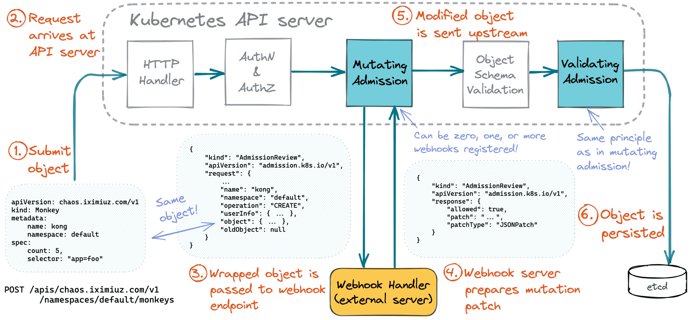
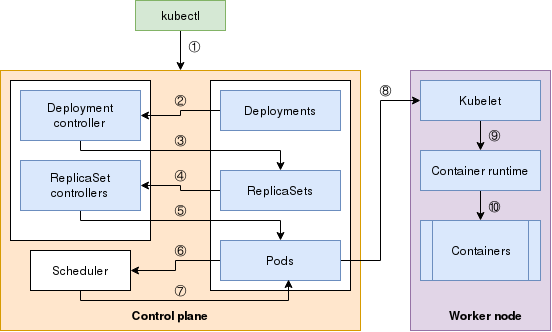

# overview

<!-- @import "[TOC]" {cmd="toc" depthFrom=1 depthTo=6 orderedList=false} -->
<!-- code_chunk_output -->

- [overview](#overview)
    - [基础架构](#基础架构)
      - [1.master核心组件](#1master核心组件)
      - [2.node核心组件](#2node核心组件)
      - [3.创建和删除pod时，各组件交互过程](#3创建和删除pod时各组件交互过程)
        - [(1) two web hooks](#1-two-web-hooks)
        - [(2) 创建deployment](#2-创建deployment)
        - [(3) 创建pod时](#3-创建pod时)
        - [(4) 删除pod时](#4-删除pod时)
      - [4.存储组件（一般放在master上，非常重要）](#4存储组件一般放在master上非常重要)
      - [5.核心附件](#5核心附件)
        - [（1）coredns](#1coredns)
        - [（2）metrics-server](#2metrics-server)
        - [（3）dashboard](#3dashboard)
        - [（4）ingress controller](#4ingress-controller)
        - [（5）fluentd](#5fluentd)
      - [6.网络组件（有很多，选择其中一个即可）](#6网络组件有很多选择其中一个即可)
    - [基础概念](#基础概念)
      - [1.pod](#1pod)
      - [2.controller](#2controller)
      - [3.service](#3service)
      - [4.label selector](#4label-selector)
      - [5.k8s中的资源就是api，创建资源就是使用api进行操作](#5k8s中的资源就是api创建资源就是使用api进行操作)
    - [网络架构](#网络架构)
      - [1.有三种网络](#1有三种网络)
      - [2.三种通信](#2三种通信)

<!-- /code_chunk_output -->

### 基础架构
master/node架构，master一般设为3个（高可用）

#### 1.master核心组件
* apiserver                         
用于暴露kubernetes的API（是整个集群对外的接口）
</br>
* scheduler 	                     
监视apiserver，负责调度资源
</br>
* controller-manager                 
用于管理控制器，控制器用于管理pod（控制器有多种）

#### 2.node核心组件
* kubelet                            
监视apiserver，管理pod
</br>
* docker                             
容器引擎
</br>
* kube-proxy                         
管理service，当service发生变化或与service相关联的pod发生变化，kube-proxy都会修改iptables规则
与api server进行通信
每个pod发生地址改变后，apiserver会通知kube-proxy
kube-proxy会修改该kube-proxy所在节点的iptables规则

#### 3.创建和删除pod时，各组件交互过程

##### (1) two web hooks


##### (2) 创建deployment


##### (3) 创建pod时


* 提交Pod spec到API server
* API server将pod对象写入etcd
* API server会反应etcd状态的改变
* 所有k8s组件都监控着API server，检查是否有相关的改变
* kube-scheduler发现了改变：有一个新的pod对象创建
* kube-scheduler将该pod调度到一个node上，并且更新API server
* API server会将这个改变再次写入etcd中
* 相应node上的kubelet发现了新的改变与自己有关
* kubelet调用docker，启动pods，返回容器的状态
* API server将容器的状态存储到etcd中
* 写入成功后，API server会告诉kubelet

##### (4) 删除pod时


#### 4.存储组件（一般放在master上，非常重要）
* etcd                               
master的共享存储，存储k8s的资源数据

#### 5.核心附件

##### （1）coredns                         
每当添加一个资源或者修改资源，都会更新dns记录，使得能够通过域名解析到相应资源
资源的域名：
```shell
NAME.NAMESPACE.DOAMIN
```
默认的DOMAIN为svc.cluster.local
pod的域名有点特殊需要跟上service的名称：
```shell
NAME.SERVICE.NAMESPACE.DOMAIN
```

##### （2）metrics-server
  用于获取k8s集群中的一些指标数据（比如：cpu和内存的使用量）

##### （3）dashboard

##### （4）ingress controller

##### （5）fluentd
用于采集集群内个资源的日志

```shell
#docker所有日志：
/var/lib/docker/containers/<container_id>/

#k8s中pods的所有日志
#该目录下都是链接文件，指向/var/lib/docker/containers/<container_id>/目录下的日志文件
/var/log/pods/<namespace>_<pod_name>_<pod_id>/<container_name>/

#k8s提供一个方便访问日志的方式
#所有容器的日志的链接文件都放/var/log/containers/这个目录下
/var/log/containers/<pod_name>_<namespace>_<container_name>_<container_id>.log
```
fluentd通过DaemonSet方式部署，挂载/var/log/containers目录，即可采集所有日志

#### 6.网络组件（有很多，选择其中一个即可）
* flannel                            
网络配置
</br>
* calico                             
网络配置，网络策略（网络策略可以用来设置隔离pod的策略）
</br>
* canel                              
将flannel和calico结合起来（flannel提供网络配置，calico提供网络策略）

***

### 基础概念
#### 1.pod                               
* 是kubernetes最基本的操作单元,一个pod是一个进程,内部封装了多个紧密相关的容器
* 类似一个虚拟机，里面的容器共享net、UTS、ipc命令空间（user、mnt、pid相互隔离）
* 同一个pod里的容器共享存储卷（类似虚拟机的磁盘）
* 为什么能够实现上面两种特性：每个pod中有一个基础架构容器（叫pause，其他容器共享该容器的net，UTS，ipc空间和存储卷等）
* 一个pod里的所有容器只能运行在一个node上
```
有两种类型：
  自主式pod：不受控制器控制，即删除了不会再创建
  由控制器控制的pod，会控制pod的副本数量，多了删除，少了创建
```
#### 2.controller                        
* 控制器有多种类型，用于管理相应资源
* pod控制器，用于管理pod，比如某个pod挂了，控制器会再创建一个

#### 3.service      
* 为pods提供固定访问点，之后，就可以直接访问该service，从而访问到相应的pod，因为pod的地址可能变化      
* 通过标签选择器与后端的pod相关联
* 通过宿主机的iptables规则，将相应请求转发给相应的pod
比如pod1需要访问pod2，请求会被交给docker的网关，然后根据iptables的规则进行转发，则这里的iptables规则提供的就是service服务

#### 4.label selector                    
用于管理各种资源，通过资源的元数据（即资源打上label），对资源进行管理
```yaml
#许多资源支持内嵌字段定义其使用的标签选择器：

#直接使用键值对对标签过滤
matchLabels:        

#基于给定的表达式对标签过滤
matchExpressions: {key:"KEY",operator:"OPERATOR",values:[VAL1,VAL2,...]
#OPERATOR可以为:
#  In，NotIn               //values列表必须为非空
#  Exists，NotEXists       //values列表必须为空
```

#### 5.k8s中的资源就是api，创建资源就是使用api进行操作

***

### 网络架构
#### 1.有三种网络
* 节点网络
* 集群网络（即service网络，虚拟的网络，存在于iptables规则中）
* pod网络

#### 2.三种通信
* lo                       
同一个pod内的多个容器间通信
* overlay                 
各pod间通信，隧道模式
* 通过iptables规则        
pod与service之间的通信
