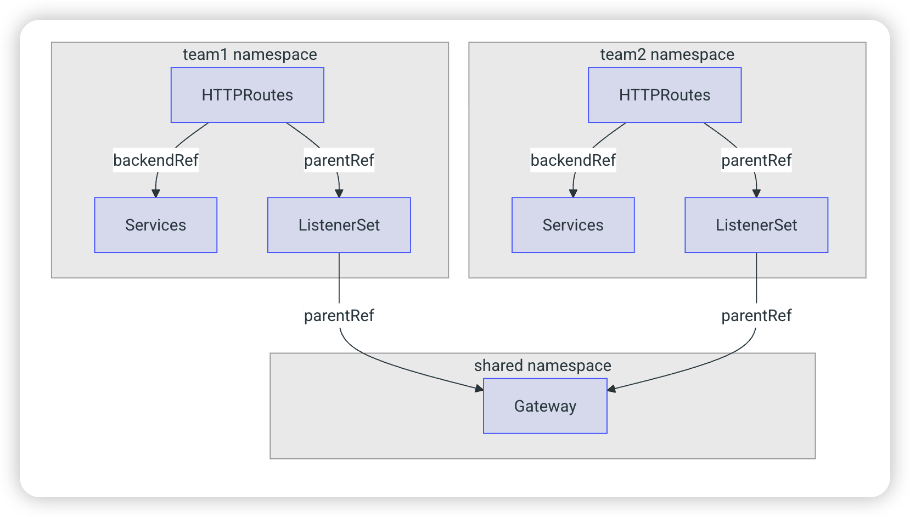

# Envoy Gateway

<!-- @import "[TOC]" {cmd="toc" depthFrom=1 depthTo=6 orderedList=false} -->

<!-- code_chunk_output -->

- [Envoy Gateway](#envoy-gateway)
    - [Overview](#overview)
      - [1.Create Gateway](#1create-gateway)
        - [(1) GatewayClass parametersRef (gatewayProvider-specific)](#1-gatewayclass-parametersref-gatewayprovider-specific)
        - [(2) GatewayClass (specify config related with gateway provider)](#2-gatewayclass-specify-config-related-with-gateway-provider)
        - [(3) Gateway](#3-gateway)
      - [2.Using ListenerSets](#2using-listenersets)
        - [(1) gateway](#1-gateway)
        - [(2) ListenerSet](#2-listenerset)
        - [(3) Route Attachment](#3-route-attachment)

<!-- /code_chunk_output -->


### Overview



#### 1.Create Gateway

* When create a Gateway
    * it will create envoyproxy deployment (equivalent to nginx): `envoy-<gateway_namespace>-<gateway_name>`
    * the Cloud Controller Manager  will see the annotation in the deployment's service and then create LB in aws

##### (1) GatewayClass parametersRef (gatewayProvider-specific)

* take envoygateway as an example: [EnvoyProxy](https://gateway.envoyproxy.io/docs/tasks/operations/customize-envoyproxy/)

```yaml
apiVersion: gateway.envoyproxy.io/v1alpha1
kind: EnvoyProxy
metadata:
  name: custom-proxy-config
  namespace: envoy-gateway-system
spec:
  provider:
    type: Kubernetes
    kubernetes:
      envoyService:
        annotations:
          service.beta.kubernetes.io/aws-load-balancer-type: "nlb"
      envoyDeployment:
        replicas: 2
        container:
          resources:
            requests:
              cpu: 50m
              memory: 256Mi
            limits:
              cpu: 500m
              memory: 1Gi
      envoyPDB:
        minAvailable: 1
```

##### (2) GatewayClass (specify config related with gateway provider)
```yaml
apiVersion: gateway.networking.k8s.io/v1
kind: GatewayClass
metadata:
  name: example
spec:
  # specify gateway controller (such as envoy gateway, nginx gateway)
  controllerName: "gateway.envoyproxy.io/gatewayclass-controller"

  # pass parameters to their controller
  # It tells the cluster to look for a specialized settings file (the EnvoyProxy whose name is custom-proxy-config) rather than just using the generic defaults
  parametersRef:
    group: gateway.envoyproxy.io
    kind: EnvoyProxy
    name: custom-proxy-config
    namespace: envoy-gateway-system
```

* popolar controllers
```
Envoy Gateway	gateway.envoyproxy.io/gatewayclass-controller
Istio	istio.io/gateway-controller
AWS (LBC)	group.aws.k8s.aws/gateway-api-controller
Nginx	k8s-gateway-nginx.nginx.org/nginx-gateway-controller
GKE	networking.gke.io/gateway-ctlr
```

##### (3) Gateway
```yaml
apiVersion: gateway.networking.k8s.io/v1
kind: Gateway
metadata:
  name: prod-web
spec:
  # specify which GatewayClass to use (define how to instantiatize a gateway)
  gatewayClassName: example
  listeners:
  - protocol: HTTP
    port: 80
    name: prod-web-gw
    allowedRoutes:
      namespaces:
        from: Same
```
#### 2.Using ListenerSets

##### (1) gateway

By default, a Gateway does not allow ListenerSets to be attached.
Users can enable this behaviour by configuring their Gateway to allow ListenerSets by adding the `allowedListeners`

```yaml
apiVersion: gateway.networking.k8s.io/v1
kind: Gateway
metadata:
  name: parent-gateway
  annotations:
    cert-manager.io/cluster-issuer: letsencrypt-gateway
spec:
  gatewayClassName: example
  allowedListeners:
    namespaces:
      from: Selector
      selector:
        matchLabels:
          belongs-to: shared-gateway
  listeners:
  - name: foo
    hostname: foo.com
    protocol: HTTP
    port: 80
```

##### (2) ListenerSet

A conflict in ListenerSet occurs when two different resources try to claim the same Port, Protocol, and Hostname combination on the same parent Gateway
* The winning ListenerSet is marked as `Accepted: true` 
* the losing ListenerSet(s) are marked with `Accepted: false`, and `Conflidted: true`

```yaml
apiVersion: gateway.networking.k8s.io/v1
kind: ListenerSet
metadata:
  name: first-workload-listeners
  namespace: team-1-ns
spec:
  parentRef:
    namespace: default
    name: parent-gateway
    kind: Gateway
    group: gateway.networking.k8s.io
  listeners:
  - name: first
    hostname: first.foo.com
    protocol: HTTPS
    port: 443
    tls:
      mode: Terminate
      certificateRefs:
      - kind: Secret
        group: ""
        name: first-workload-cert
```

##### (3) Route Attachment
```yaml
apiVersion: gateway.networking.k8s.io/v1
kind: HTTPRoute
metadata:
  name: httproute-example
spec:
  parentRefs:
  - name: workload-listeners
    kind: ListenerSet
    group: gateway.networking.k8s.io
    sectionName: second
```