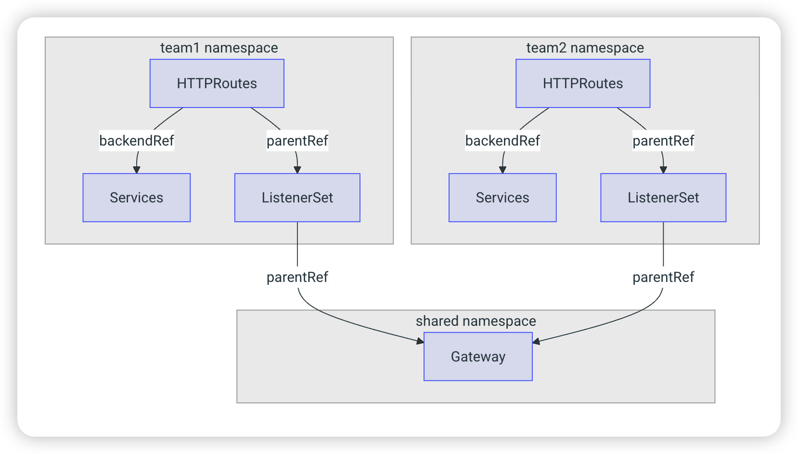

# Envoy Gateway

<!-- @import "[TOC]" {cmd="toc" depthFrom=1 depthTo=6 orderedList=false} -->

<!-- code_chunk_output -->

- [Envoy Gateway](#envoy-gateway)
    - [Overview](#overview)
      - [1.Create Gateway](#1create-gateway)
        - [(1) GatewayClass parametersRef (gatewayProvider-specific)](#1-gatewayclass-parametersref-gatewayprovider-specific)
        - [(2) GatewayClass (specify config related with gateway provider)](#2-gatewayclass-specify-config-related-with-gateway-provider)
        - [(3) Gateway](#3-gateway)
      - [2.Using ListenerSets](#2using-listenersets)
        - [(1) gateway](#1-gateway)
        - [(2) ListenerSet](#2-listenerset)
        - [(3) Route Attachment](#3-route-attachment)
    - [Envoy Gateway Extensions](#envoy-gateway-extensions)
      - [1.ClientTrafficPolicy](#1clienttrafficpolicy)
        - [(1) TLS settings](#1-tls-settings)
        - [(2) HTTP protocol settings](#2-http-protocol-settings)
        - [(3) Timeout](#3-timeout)
        - [(4) mTLS client cert forwarding](#4-mtls-client-cert-forwarding)
        - [(5) Client IP detection](#5-client-ip-detection)
      - [2.BackendTrafficPolicy](#2backendtrafficpolicy)
        - [(1) Load balancer](#1-load-balancer)
        - [(2) Circuit breaker](#2-circuit-breaker)
        - [(3) Retry](#3-retry)
        - [(4) Timeout](#4-timeout)
        - [(5) Health check](#5-health-check)
        - [(6) Compressor](#6-compressor)
      - [3.SecurityPolicy](#3securitypolicy)
        - [(1) IP-based authorization](#1-ip-based-authorization)

<!-- /code_chunk_output -->


### Overview



#### 1.Create Gateway

* When create a Gateway
    * it will create envoyproxy deployment (equivalent to nginx): `envoy-<gateway_namespace>-<gateway_name>`
    * the Cloud Controller Manager  will see the annotation in the deployment's service and then create LB in aws

##### (1) GatewayClass parametersRef (gatewayProvider-specific)

* take envoygateway as an example: [EnvoyProxy](https://gateway.envoyproxy.io/docs/tasks/operations/customize-envoyproxy/)

```yaml
apiVersion: gateway.envoyproxy.io/v1alpha1
kind: EnvoyProxy
metadata:
  name: custom-proxy-config
  namespace: envoy-gateway-system
spec:
  provider:
    type: Kubernetes
    kubernetes:
      envoyService:
        annotations:
          service.beta.kubernetes.io/aws-load-balancer-type: "nlb"
      envoyDeployment:
        replicas: 2
        container:
          resources:
            requests:
              cpu: 50m
              memory: 256Mi
            limits:
              cpu: 500m
              memory: 1Gi
      envoyPDB:
        minAvailable: 1
```

##### (2) GatewayClass (specify config related with gateway provider)
```yaml
apiVersion: gateway.networking.k8s.io/v1
kind: GatewayClass
metadata:
  name: example
spec:
  # specify gateway controller (such as envoy gateway, nginx gateway)
  controllerName: "gateway.envoyproxy.io/gatewayclass-controller"

  # pass parameters to their controller
  # It tells the cluster to look for a specialized settings file (the EnvoyProxy whose name is custom-proxy-config) rather than just using the generic defaults
  parametersRef:
    group: gateway.envoyproxy.io
    kind: EnvoyProxy
    name: custom-proxy-config
    namespace: envoy-gateway-system
```

* popolar controllers
```
Envoy Gateway	gateway.envoyproxy.io/gatewayclass-controller
Istio	istio.io/gateway-controller
AWS (LBC)	group.aws.k8s.aws/gateway-api-controller
Nginx	k8s-gateway-nginx.nginx.org/nginx-gateway-controller
GKE	networking.gke.io/gateway-ctlr
```

##### (3) Gateway
```yaml
apiVersion: gateway.networking.k8s.io/v1
kind: Gateway
metadata:
  name: prod-web
spec:
  # specify which GatewayClass to use (define how to instantiatize a gateway)
  gatewayClassName: example
  listeners:
  - protocol: HTTP
    port: 80
    name: prod-web-gw
    allowedRoutes:
      namespaces:
        from: Same
```
#### 2.Using ListenerSets

##### (1) gateway

By default, a Gateway does not allow ListenerSets to be attached.
Users can enable this behaviour by configuring their Gateway to allow ListenerSets by adding the `allowedListeners`

```yaml
apiVersion: gateway.networking.k8s.io/v1
kind: Gateway
metadata:
  name: parent-gateway
  annotations:
    cert-manager.io/cluster-issuer: letsencrypt-gateway
spec:
  gatewayClassName: example
  allowedListeners:
    namespaces:
      from: Selector
      selector:
        matchLabels:
          belongs-to: shared-gateway
  listeners:
  - name: foo
    hostname: foo.com
    protocol: HTTP
    port: 80
```

##### (2) ListenerSet

A conflict in ListenerSet occurs when two different resources try to claim the same Port, Protocol, and Hostname combination on the same parent Gateway
* The winning ListenerSet is marked as `Accepted: true` 
* the losing ListenerSet(s) are marked with `Accepted: false`, and `Conflidted: true`

```yaml
apiVersion: gateway.networking.k8s.io/v1
kind: ListenerSet
metadata:
  name: first-workload-listeners
  namespace: team-1-ns
spec:
  parentRef:
    namespace: default
    name: parent-gateway
    kind: Gateway
    group: gateway.networking.k8s.io
  listeners:
  - name: first
    hostname: first.foo.com
    protocol: HTTPS
    port: 443
    tls:
      mode: Terminate
      certificateRefs:
      - kind: Secret
        group: ""
        name: first-workload-cert
```

##### (3) Route Attachment
```yaml
apiVersion: gateway.networking.k8s.io/v1
kind: HTTPRoute
metadata:
  name: httproute-example
spec:
  parentRefs:
  - name: workload-listeners
    kind: ListenerSet
    group: gateway.networking.k8s.io
    sectionName: second
```

***

### Envoy Gateway Extensions

[xRef](https://gateway.envoyproxy.io/docs/api/extension_types/)

#### 1.ClientTrafficPolicy

* configures how Envoy handles **inbound** traffic from clients
* Controls: TLS settings, HTTP protocol versions, connection timeouts, header manipulation, client IP detection

```yaml
apiVersion: gateway.envoyproxy.io/v1alpha1
kind: ClientTrafficPolicy
metadata:
  name: client-traffic-policy
  namespace: default
spec:
  targetRef:
    group: gateway.networking.k8s.io
    kind: Gateway
    name: prod-web
```

##### (1) TLS settings

Enforce minimum TLS 1.2 and restrict to strong cipher suites. Cipher list only applies to TLS 1.2; TLS 1.3 uses fixed suites.

```yaml
tls:
  minVersion: "1.2"
  maxVersion: "1.3"
  ciphers:
  - ECDHE-RSA-AES128-GCM-SHA256
  - ECDHE-RSA-AES256-GCM-SHA384
```

##### (2) HTTP protocol settings

Enable HTTP/1.1 chunked trailers and tune HTTP/2 flow-control windows. Larger window values improve throughput on high-bandwidth connections.

```yaml
http1:
  enableTrailers: true
http2:
  initialStreamWindowSize: 65536
  initialConnectionWindowSize: 1048576
```

##### (3) Timeout

If Envoy does not receive the complete request (headers + body) within this duration, it closes the connection.

This defends against **slow-loris attacks**: an attacker opens many connections and deliberately trickles data one byte at a time, keeping each connection alive without ever finishing the request. The server exhausts its connection limit and starts refusing real clients. Setting a deadline forces those stalled connections to be dropped.

```yaml
timeout:
  http:
    requestReceivedTimeout: "30s"
```

##### (4) mTLS client cert forwarding

Pass the client certificate's Subject DN and SAN URI downstream via `X-Forwarded-Client-Cert` so backend services can identify the caller.

```yaml
headers:
  xForwardedClientCert:
    mode: AppendForward
    certDetailsToAdd:
    - Subject
    - URI
```

##### (5) Client IP detection

Extract the real client IP from `X-Forwarded-For`. 
* `numTrustedHops: 1` means trust only the single proxy (e.g. NLB/ALB) directly in front of Envoy, preventing clients from spoofing their IP by injecting extra XFF entries.
```
Client (1.2.3.4) → NLB (10.0.0.1) → Envoy
X-Forwarded-For: 1.2.3.4, 10.0.0.1
```

```yaml
clientIPDetection:
  xForwardedFor:
    numTrustedHops: 1
    trustedCIDRs:
      - 120.52.22.96/27   # alternative to numTrustedHops: trust by IP range instead of position, useful when upstream proxies (e.g. CDN) have known CIDRs
```

#### 2.BackendTrafficPolicy

* configures how Envoy handles **outbound** traffic to backends
* Controls: load balancing, circuit breaking, retries, health checks, timeouts

```yaml
apiVersion: gateway.envoyproxy.io/v1alpha1
kind: BackendTrafficPolicy
metadata:
  name: backend-traffic-policy
  namespace: default
spec:
  targetRef:
    group: gateway.networking.k8s.io
    kind: HTTPRoute
    name: my-route
```

##### (1) Load balancer

Algorithm used to distribute requests across backend pods.

```yaml
loadBalancer:
  type: RoundRobin   # options: RoundRobin | LeastRequest | Random | ConsistentHash
```

##### (2) Circuit breaker

Limits concurrent load on the backend. When any threshold is exceeded, Envoy immediately returns an error instead of queuing more requests — preventing a slow backend from cascading into a full outage.

```yaml
circuitBreaker:
  maxConnections: 1024          # max open TCP connections to the backend
  maxPendingRequests: 1024      # max requests queued while waiting for a connection
  maxParallelRequests: 1024     # max requests in flight at the same time
  maxParallelRetries: 3         # max concurrent retries across all requests
  maxRequestsPerConnection: 100 # recycle connections after this many requests (helps avoid stale long-lived connections)
```

##### (3) Retry

Automatically retries failed requests before returning an error to the client.

```yaml
retry:
  numRetries: 3        # max retry attempts per request
  perRetry:
    timeout: "5s"      # timeout for each individual attempt (not the total budget)
  retryOn:
    httpStatusCodes:
    - 502              # bad gateway (upstream unreachable)
    - 503              # service unavailable (overloaded or down)
```

##### (4) Timeout

```yaml
timeout:
  http:
    requestTimeout: "30s"        # time from Envoy forwarding the request to receiving the last byte of the backend response
    connectionIdleTimeout: "60s" # close connections that have been idle for this long (reclaims resources)
```

##### (5) Health check

Envoy actively probes the backend on a schedule and stops routing to pods that fail the check.

```yaml
healthCheck:
  active:
    protocol: HTTP
    http:
      path: /healthz
      expectedStatuses:
      - start: 200
        end: 299             # any 2xx response counts as healthy
    interval: "10s"          # probe every 10s
    timeout: "5s"            # probe must respond within 5s or counts as a failure
    unhealthyThreshold: 3    # mark unhealthy after 3 consecutive failures
    healthyThreshold: 2      # mark healthy again after 2 consecutive successes
```

##### (6) Compressor

Envoy compresses response bodies before sending them to the client.
* Envoy checks the client's Accept-Encoding request header
* Responses smaller than the threshold are sent uncompressed — compressing tiny payloads adds CPU overhead with negligible size savings.

```yaml
compressor:
  - type: Brotli   # best compression ratio; supported by all modern browsers
    brotli: {}
    minContentLength: 1024
  - type: Gzip     # widest compatibility fallback
    gzip: {}
    minContentLength: 1024
  - type: Zstd     # fastest compression; good for high-throughput APIs
    zstd: {}
    minContentLength: 1024
```

#### 3.SecurityPolicy

* configures access control for **inbound** requests
* Controls: IP allowlist/denylist, JWT authentication, OIDC, API key, CORS, ExtAuth

```yaml
apiVersion: gateway.envoyproxy.io/v1alpha1
kind: SecurityPolicy
metadata:
  name: security-policy
  namespace: default
spec:
  targetRef:
    group: gateway.networking.k8s.io
    kind: HTTPRoute
    name: my-route
```

##### (1) IP-based authorization

`defaultAction: Deny` makes this an allowlist — only the listed CIDRs are permitted. Without it the default is `Allow`, which turns the rules into a denylist instead.

Note: Envoy matches against the **detected client IP**, so pair with `clientIPDetection` in `ClientTrafficPolicy` if traffic passes through a proxy or CDN — otherwise Envoy matches the proxy IP instead of the real client.

```yaml
authorization:
  defaultAction: Deny
  rules:
  - action: Allow
    principal:
      clientCIDRs:
      - 203.0.113.0/24    # allowed IP range
      - 198.51.100.42/32  # single allowed IP
```
