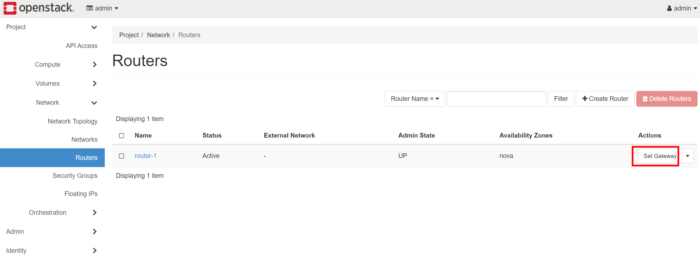

# deploy

<!-- @import "[TOC]" {cmd="toc" depthFrom=1 depthTo=6 orderedList=false} -->
<!-- code_chunk_output -->

- [deploy](#deploy)
    - [概述](#概述)
      - [1.节点类型](#1节点类型)
    - [部署](#部署)
      - [1.确定相关版本](#1确定相关版本)
      - [2.注意](#2注意)
        - [（1）deploy执行是幂等](#1deploy执行是幂等)
      - [3.准备openstack相关机器](#3准备openstack相关机器)
        - [（1）建议选择ubuntu系统](#1建议选择ubuntu系统)
        - [（2）加载kvm模块](#2加载kvm模块)
        - [（3）高可用：奇数台controller](#3高可用奇数台controller)
        - [（4）网络规划](#4网络规划)
      - [4.准备好ansible部署机](#4准备好ansible部署机)
        - [(1) 安装ansible所需依赖](#1-安装ansible所需依赖)
        - [(2) 通过下载包安装](#2-通过下载包安装)
        - [(3) 在虚拟环境中安装python包依赖](#3-在虚拟环境中安装python包依赖)
        - [(4) 配置ansible](#4-配置ansible)
        - [(5) 准备好kolla配置文件](#5-准备好kolla配置文件)
      - [5.配置清单文件（@ansible）](#5配置清单文件ansible)
      - [6.生成和修改密码](#6生成和修改密码)
      - [7.配置：`/etc/kolla/globals.yml`](#7配置etckollaglobalsyml)
        - [(1) 使用OVN (建议)](#1-使用ovn-建议)
        - [(2) DVR模式（Distributed Virtual Routing，Distributed Floating IPs）（建议生产使用）](#2-dvr模式distributed-virtual-routingdistributed-floating-ips建议生产使用)
      - [8.使用ceph (可选)](#8使用ceph-可选)
        - [（1）修改配置](#1修改配置)
        - [（2）标记磁盘（@storage-nodes）](#2标记磁盘storage-nodes)
      - [9.使用LVM (可选)](#9使用lvm-可选)
        - [(1) 准备好LVM](#1-准备好lvm)
        - [(2) 配置](#2-配置)
      - [10.修改配置解决相关bug](#10修改配置解决相关bug)
        - [（1）解决无法从volume-based image创建volume的问题](#1解决无法从volume-based-image创建volume的问题)
        - [（2）ceph-mgr内存使用越来越多](#2ceph-mgr内存使用越来越多)
      - [11.进行部署](#11进行部署)
      - [12.使用openstack](#12使用openstack)
      - [13.部署Loadbalancer](#13部署loadbalancer)
      - [14.执行一个demo](#14执行一个demo)
        - [（1）创建供应商网络（即external网络）](#1创建供应商网络即external网络)
        - [（2）创建租户网络](#2创建租户网络)
        - [（3）创建路由器](#3创建路由器)
      - [15.创建security group用于对外（即当使用floating ip时）](#15创建security-group用于对外即当使用floating-ip时)
      - [16.从host能够ping instance（默认不可以）](#16从host能够ping-instance默认不可以)
        - [（1）分配floating ip](#1分配floating-ip)
        - [（2）在host上配置路由](#2在host上配置路由)
    - [配置IPv6](#配置ipv6)
      - [1.网络规划](#1网络规划)
      - [2.创建public网络](#2创建public网络)
        - [(1) 创建ipv6 subnet](#1-创建ipv6-subnet)
        - [(2) 如果需要删除subnet](#2-如果需要删除subnet)
      - [3.创建tenant网络](#3创建tenant网络)
        - [(1) 创建ipv6 subnet](#1-创建ipv6-subnet-1)
        - [(2) 将创建的ipv6 subnet连接到router上](#2-将创建的ipv6-subnet连接到router上)
      - [4.设置路由](#4设置路由)
        - [(1) 获取public网络的link-local地址](#1-获取public网络的link-local地址)
        - [(2) 在物理路器上添加路由](#2-在物理路器上添加路由)
      - [5.验证](#5验证)
    - [测试](#测试)
      - [1.测试 ceph性能](#1测试-ceph性能)
      - [2.测试镜像上传、创建虚拟机等功能](#2测试镜像上传-创建虚拟机等功能)
      - [3.测试 虚拟机性能](#3测试-虚拟机性能)
    - [添加或删除节点](#添加或删除节点)
      - [1.添加controller](#1添加controller)
      - [2.添加compute](#2添加compute)
      - [3.删除controller](#3删除controller)
      - [4.可能遇到的问题及恢复办法](#4可能遇到的问题及恢复办法)
        - [（1）mariadb无法启动](#1mariadb无法启动)
    - [覆盖配置（除了`global.yaml`）](#覆盖配置除了globalyaml)
    - [trouble shooting](#trouble-shooting)
      - [1.检查时，python sdk报错](#1检查时python-sdk报错)
      - [2.创建instance时，Sending discover failed（通过dhcp获取ip失败）](#2创建instance时sending-discover-failed通过dhcp获取ip失败)
      - [3.vm创建启动都没问题，在启动操作系统时等好久（一般是DHCP的问题，即网络的问题）](#3vm创建启动都没问题在启动操作系统时等好久一般是dhcp的问题即网络的问题)
      - [4.网络不通，但是通过抓包能够获取ARP的包（证明二层是同的，一般是三层设置了什么策略，比如iptables）](#4网络不通但是通过抓包能够获取arp的包证明二层是同的一般是三层设置了什么策略比如iptables)
      - [5.jina2版本问题: The error was: No filter named 'service_enabled_and_mapped_to_host' found](#5jina2版本问题-the-error-was-no-filter-named-service_enabled_and_mapped_to_host-found)
    - [kolla-ansible脚本解析](#kolla-ansible脚本解析)
      - [1.main函数](#1main函数)
      - [2.初始化机器](#2初始化机器)
      - [3.部署](#3部署)

<!-- /code_chunk_output -->

### 概述

#### 1.节点类型

|节点类型|服务|
|-|-|
|controller（奇数）|基础服务：heat（调度服务），keystone（认证服务），glance（镜像管理服务），cinder（块存储服务），swift（对象存储服务）等|
|compute|nova等|
|network|neutron等|
|storage（奇数）|ceph等|
|monitoring||

***

### 部署

[参考quick start](https://docs.openstack.org/kolla-ansible/xena/user/quickstart.html)

#### 1.确定相关版本
* kolla-ansible版本
* openstack版本
* 操作系统版本
  * 需要根据openstack版本确定（[参考安装文档](https://docs.openstack.org/kolla-ansible/train/user/support-matrix)）
  * 建议选择ubuntu系统进行安装，因为选择centos时，容易出现一些包的错误
* 每个版本之间都有依赖关系，比如特定kolla-ansible版本只能部署特定的openstack版本，特定的openstack版本只能装在特定的操作系统上
[参考](https://docs.openstack.org/releasenotes/kolla-ansible/)

#### 2.注意

##### （1）deploy执行是幂等
即多次执行不会影响现有环境（前提是 所有的配置都是通过kolla-ansible脚本修改的，然后通过kolla-ansible deploy应用的）

#### 3.准备openstack相关机器

##### （1）建议选择ubuntu系统
因为选择centos时，容易出现一些包的错误
所有机器执行一下命令
```shell
systemctl stop apt-daily.timer
systemctl disable apt-daily.timer

systemctl stop apt-daily-upgrade.timer
systemctl disable apt-daily-upgrade.timer

systemctl stop apt-daily
systemctl disable apt-daily

systemctl stop apt-daily-upgrade
systemctl disable apt-daily-upgrade

systemctl stop unattended-upgrades.service
systemctl disable unattended-upgrades.service

#关闭防火墙
systemctl stop ufw.service
systemctl disable ufw.service

reboot
```

##### （2）加载kvm模块
所有机器上加载kvm_intel（或者kvm_amd）模块
```shell
$ vim /etc/modprobe.d/kvm.conf

#kvm开启了netsted（即虚拟机可以进行kvm虚拟）
# kvm_intel 或者 kvm_amd
options kvm_intel nested=1
```

##### （3）高可用：奇数台controller
奇数台controller: 因为rabbitmq、ceph-mon等需要奇数个

##### （4）网络规划

* 测试环境
  * 分为两个网络：管理网、业务网
  * 每个节点一张网卡，网络节点两张网卡
* 生产环境
  * 分为三个网络：管理网、存储网、业务网
  * 每个节点两张网卡，网路节点三张网卡

#### 4.准备好ansible部署机

##### (1) 安装ansible所需依赖

* 设置镜像源头（所有节点）
```shell
sudo sed -i "s@http://.*archive.ubuntu.com@http://mirrors.huaweicloud.com@g" /etc/apt/sources.list
sudo sed -i "s@http://.*security.ubuntu.com@http://mirrors.huaweicloud.com@g" /etc/apt/sources.list
```

* 安装
```shell
apt-get -y install python3-dev libffi-dev gcc libssl-dev python3-selinux python3-setuptools python3-venv sshpass

#yum -y install python3-devel libffi-devel gcc openssl-devel python3-libselinux
```

##### (2) 通过下载包安装
```shell
cd <dir>

pip3 -r requirements.txt
python3 setup.py install
```

##### (3) 在虚拟环境中安装python包依赖

* 设置pip源（所有节点）
```shell
$ mkdir ~/.pip/
$ vim ~/.pip/pip.conf

[global]
index-url=http://pypi.douban.com/simple/
trusted-host=pypi.douban.com
```

* 安装
```shell
python3 -m venv /root/kolla-env
source /root/kolla-env/bin/activate
pip install -U pip
pip install 'ansible<2.10'
pip install 'kolla-ansible == 9.*'
```

##### (4) 配置ansible
```shell
$ mkdir /etc/ansible
$ vim /etc/ansible/ansible.cfg

[defaults]
host_key_checking=False
pipelining=True
forks=100
```

##### (5) 准备好kolla配置文件
```shell
mkdir -p /etc/kolla
cp -r /root/kolla-env/share/kolla-ansible/etc_examples/kolla/* /etc/kolla

mkdir /root/kolla-deployment
cd /root/kolla-deployment
cp /root/kolla-env/share/kolla-ansible/ansible/inventory/* ./
```

#### 5.配置清单文件（@ansible）
```shell
vim multinode
```
```shell
[control]
control-1 ansible_host=10.172.0.224 ansible_user=lil ansible_password=cangoal ansible_become=true ansible_become_user=root ansible_become_password=cangoal
control-2 ansible_host=10.172.0.225 ansible_user=lil ansible_password=cangoal ansible_become=true ansible_become_user=root ansible_become_password=cangoal

[network:children]
control

[compute]
10.0.0.[13:14] ansible_user=ubuntu ansible_password=foobar ansible_become=true

[monitoring]
10.0.0.10
# This group is for monitoring node.
# Fill it with one of the controllers' IP address or some others.

[storage:children]
compute

[deployment]
localhost       ansible_connection=local become=true
# use localhost and sudo
```
```shell
#-b: become
ansible -i ./multinode all -b -m ping
```

#### 6.生成和修改密码
```shell
kolla-genpwd

#会在/etc/kolla/passwords.yml文件中生成密码
```

* 修改admin的登录密码
```shell
$ vim /etc/kolla/passwords.yml

keystone_admin_password: cangoal
```

#### 7.配置：`/etc/kolla/globals.yml`
[quick start](https://docs.openstack.org/kolla-ansible/xena/user/quickstart.html)
[具体配置](https://docs.openstack.org/kolla-ansible/xena/reference/index.html)
[服务的详细配置](https://docs.openstack.org/train/configuration/)

* 注意：当不同主机的变量不一样时（比如网卡名不一样），需要 **注释** `globals.yaml`中的配置，然后在inventory配置相应的变量（因为`-e @/etc/globals.yml`优先级更高）
  * 比如：
  ```shell
  [control]
  host-2 ... network_interface=enp2s0

  [network]
  host-1 ... network_interface=enp5s0
  ```
```yaml
#docker配置(关闭docker的iptables，不然会影响到openstack的网络导致网路不通)
#需要注意docker对网络的影响，比如docker的bridge也会有影响，必要时可以关掉（新版的kolla提供了关闭选项，旧版的需要手动修改docker配置进行关闭）
docker_disable_default_iptables_rules: "yes"

#  设置镜像，下面的这些配置决定了镜像的名称：kolla/ubuntu-source-xx:train
kolla_base_distro: "ubuntu"
kolla_install_type: "source"
#  openstack的版本，用默认的，不要修改
#openstack_release: "train"
#openstack_tag: "{{ openstack_release ~ openstack_tag_suffix }}"
#openstack_tag_suffix: "{{ '' if base_distro != 'centos' or ansible_distribution_major_version == '7' else  '-centos8' }}"

#  配置加速镜像源，安装docker时进行配置（下面这个地址比较慢，不用添加）
#docker_custom_config:
#  registry-mirrors:
#  - https://05916ee38400267c0f42c0097caab960.mirror.swr.myhuaweicloud.com

#  指定私有仓库
docker_registry: xx
docker_registry_insecure: yes
docker_registry_username: admin
#  docker_registry_password在passwords.yml文件中设置


#网络配置参考：https://docs.openstack.org/kolla-ansible/train/admin/production-architecture-guide.html

#给network节点上的network_interface设置vip（network上有haproxy对controller做代理）
kolla_internal_vip_address: "10.172.0.226"

#  openstack集群内部通信的网卡
#   tunnel等网络都会放在上面
network_interface: "eth0"

#当有单独的存储网时，修改下面的两个网卡
# compute节点往ceph写数据使用的网卡
storage_interface: "{{ network_interface }}"
# ceph进行数据复制使用的网卡
cluster_interface: "{{ network_interface }}"

#  在network节点上，该网卡用于openstack环境连接公网（网络节点的br-ex会用到该网卡）（这个也叫业务网卡）
#  需要未配置ip，且能够设置为promiscous模式
#  该网卡需要up
neutron_external_interface: "eth1"

#ceph配置
enable_ceph: "yes"
enable_ceph_mds: "yes"
enable_ceph_dashboard: "no" #disable ceph mgr的dashboard模块

#cinder配置
enable_cinder: "yes"
# 提供备份volume的能力
enable_cinder_backup: "yes"

#nova配置
# 使用ceph存储虚拟机信息（可以方便迁移）
nova_backend_ceph: "{{ enable_ceph }}"
#  设置hypervisor类型（默认为：kvm）
#  当openstack安装在虚拟机上时，这里用qemu，用kvm会有问题
nova_compute_virt_type: "kvm"

#glance配置（使用ceph存储）
glance_backend_ceph: "yes"
glance_backend_file: "no"

#监控相关
enable_prometheus_ceph_mgr_exporter: "yes"  #待测试（enable ceph mgr的prometheus模块）
enable_prometheus_openstack_exporter: "yes" #待测试（需要enable_prometheus，这样其他exporter也会安装，可以设置其他不安装）
```

* 配置网卡up和混杂模式
  * `#!/bin/bash`一定要以这个开头，不然不会执行
```shell
$ vim /etc/rc.local

#!/bin/bash
ip link set eth1 up
ip link set eth1 promisc on

$ chmod +x /etc/rc.local
```

##### (1) 使用OVN (建议)
* 不同版本enable OVN的配置有所不一样
[参考](https://docs.openstack.org/kolla-ansible/zed/reference/networking/neutron.html)

##### (2) DVR模式（Distributed Virtual Routing，Distributed Floating IPs）（建议生产使用）
[参考](https://docs.openstack.org/networking-ovn/latest/admin/refarch/refarch.html#:~:text=Distributed%20Floating%20IPs%20(DVR),connectivity%20to%20the%20external%20network.)

* 实现
  * 通过控制路由实现的
* 特点
  * 每个compute node上配一个external interface
  * external流量 和 floating ip流量 从该external interface出去
  * 跨节点的fixed ip流量（即内部流量）还是需要经过network node进行路由


* 配置
```shell
enable_neutron_dvr: "yes"
```

#### 8.使用ceph (可选)

注意：ceph osd数量**至少是3个**，因为pool的默认副本数为3，如果osd数量小于3，会导致ceph不可用

##### （1）修改配置

如果要修改ceph的配置（比如默认的副本数等），[参考这里](https://docs.openstack.org/kolla-ansible/queens/reference/ceph-guide.html)
* 修改`/etc/kolla/globals.yml`
```yaml
enable_ceph: "yes"
```

##### （2）标记磁盘（@storage-nodes）
[参考](https://docs.openstack.org/kolla-ansible/train/reference/storage/ceph-guide.html)

这样就会在该磁盘上创建osd

* data、WAL、DB放在一起

```shell
parted <disk> -s -- mklabel gpt mkpart KOLLA_CEPH_OSD_BOOTSTRAP_BS 1 -1
#为什么这样标记，参考：
# roles/ceph/tasks/bootstrap_osds.yml
# roles/ceph/defaults/main.yml
```

* data、WAL、DB分开（DB/WAL放在ssd上）
```shell
#xx对应一个osd，即xx相同的分区用于同一个osd
#标记用于存储metadata和data的磁盘
parted <disk> -s -- mklabel gpt mkpart KOLLA_CEPH_OSD_BOOTSTRAP_BS_xx 1 -1

#一般：同一个磁盘上的不同分区
#标记WAL分区
parted <ssd_disk> -s -- mklabel gpt mkpart KOLLA_CEPH_OSD_BOOTSTRAP_BS_xx_W 1 -1
#标记DB分区
parted <ssd_disk> -s -- mklabel gpt mkpart KOLLA_CEPH_OSD_BOOTSTRAP_BS_xx_D  1 -1
```

#### 9.使用LVM (可选)

##### (1) 准备好LVM
* 如果不准备，有些版本的kolla-ansible会自动使用loop device创建
  * 但是这种重启后，需要重启挂载
  ```shell
  loseup -f /var/lib/cinder_data.img
  docker restart cinder_volume
  ```
* 自己准备
  * 使用loop device
    * [参考](https://landoflinux.com/linux_lvm_example_02.html)
    ```shell
    fallocate -l 50G /var/lib/cinder_data.img
    losetup -f /var/lib/cinder_data.img
    losetup -a
    vgcreate cinder-volumes /dev/<loop>
    ```
  * 使用真正的磁盘

##### (2) 配置
```shell
vim /etc/kolla/globals.yml
```
```yaml
enable_cinder: "yes"
enable_cinder_backup: "yes"
enable_cinder_backend_lvm: "yes"
cinder_volume_group: "cinder-volumes"
```

#### 10.修改配置解决相关bug

##### （1）解决无法从volume-based image创建volume的问题
* 配置glance-api
```shell
$ mkdir /etc/kolla/config/glance
$ vim /etc/kolla/config/glance/glance-api.conf

[glance_store]
stores = rbd

```

或者等安装完成后（不推荐，因为重新执行deploy后，会被覆盖）
* 修改所有controller的`/etc/kolla/glance-api/glance-api.conf`
```shell
#修改下面的两个配置
[glance_store]
default_store = rbd
stores = rbd
...
```

* 重启所有controller的glance-api这个容器

##### （2）ceph-mgr内存使用越来越多
* 关闭ceph-mgr的dashboard模块（下面这种更改方式是临时的）
```shell
docker exec -it <ceph_mgr_container> -it /bin/bash
ceph mgr module disable dashboard
ceph mgr module ls
```

#### 11.进行部署
```shell
kolla-ansible -i ./multinode bootstrap-servers
kolla-ansible -i ./multinode prechecks
#可以提前准备镜像：
kolla-ansible -i ./multinode pull
kolla-ansible -i ./multinode deploy
```

#### 12.使用openstack

```shell
#安装openstack客户端(注意client版本，可能跟openstack版本不兼容)
pip install python-openstackclient==5.5.1
#生产admin-openrc.sh文件
kolla-ansible post-deploy
```

#### 13.部署Loadbalancer

[参考](https://docs.openstack.org/kolla-ansible/train/reference/networking/octavia.html)
* 制作镜像

```shell
apt -y install debootstrap qemu-utils kpartx

git clone https://opendev.org/openstack/octavia -b stable/train

python3 -m venv dib-venv
source dib-venv/bin/activate
pip install diskimage-builder

cd octavia/diskimage-create

#有必要设置代理，不然总是超时
#export http_proxy='http://10.10.10.103:1080'
#export https_proxy='http://10.10.10.103:1080'
./diskimage-create.sh
#用完记得关闭代理（即删除这两个环境变量）
```

* 上传镜像
```shell
source /etc/kolla/admin-openrc.sh
source /root/kolla-env/bin/activate
openstack image create --progress --container-format bare --disk-format qcow2 --private --tag amphora --file amphora-x64-haproxy.qcow2  amphora-x64-haproxy.qcow2
```

* 生成证书
```shell
(umask 077;openssl genrsa -aes256 -out server_ca.key)
openssl req -new -x509 -key server_ca.key -out server_ca.crt -days 3650

(umask 077;openssl genrsa -aes256 -out client_ca.key)
openssl req -new -x509 -key client_ca.key -out client_ca.crt -days 3650

(umask 077;openssl genrsa -aes256 -out client.key)
openssl req -new -key client.key -out client.csr -subj '/CN=xx'
openssl x509 -req -in client.csr -CA client_ca.crt -CAkey client_ca.key -CAcreateserial -days 3650 -out client.crt

openssl rsa -in client_ca.key -out client.cert-and-key
cat client_ca.crt >> client.cert-and-key

#client_ca是用给amphora agent用于签署证书的
cp client_ca.crt /etc/kolla/config/octavia/client_ca.cert.pem
#server_ca是用于签署服务端的证书
cp server_ca.crt /etc/kolla/config/octavia/server_ca.cert.pem
cp server_ca.key /etc/kolla/config/octavia/server_ca.key.pem
#amphora agent使用的证书（是用server_ca签署的）
cp client.cert-and-key /etc/kolla/config/octavia/client.cert-and-key.pem

vim /etc/kolla/passwords.yml
#octavia_ca_password: xx
```

* 创建ssh keypair
```shell
#创建的是公钥，公钥会被放到amphora的authorized_keys中
openstack keypair create octavia_ssh_key   --os-username octavia   --os-password "$(cat /etc/kolla/passwords.yml | grep octavia_keystone_password | awk '{ print $2 }')"
#注意私钥会打印出来，注意保存
```

* 修改：`/etc/kolla/globals.yaml`
```shell
enable_octavia: "yes"
#网络id（controller必须能达到这个网络，所以用私有网络不行，可以使用public网络或者管理网络）
octavia_amp_boot_network_list: "07810178-94ec-4fe7-ae9e-c12f4cd41b52"
#amphora的security group id
octavia_amp_secgroup_list: "8c2b28eb-2714-40c2-ac94-151238031043,7a9aea64-d67e-4c0d-a3b2-6fa12194866c"
#amphora使用的flavor id
octavia_amp_flavor_id: "8b81c090-1129-452c-bd31-5d5a9b3bb116"
```

* 部署
```shell
kolla-ansible -i ./multinode deploy
```

#### 14.执行一个demo
```shell
openstack network create --external     --provider-physical-network physnet1     --provider-network-type flat     public1 
openstack subnet create --no-dhcp --network public1 --subnet-range 10.172.1.0/24 --gateway 10.172.1.254 --allocation-pool start=10.172.1.50,end=10.172.1.60 public1-subnet
openstack network create demo-net
openstack subnet create     --network demo-net     --subnet-range 3.1.5.0/24     --gateway 3.1.5.254     --dns-nameserver 114.114.114.114     demo-subnet
openstack router create demo-router
openstack router add subnet demo-router demo-subnet
openstack router set --enable-snat --external-gateway public1 demo-router
openstack security group create public
openstack security group rule create --ingress  --remote-ip 0.0.0.0/0 public
openstack security group rule create --ingress  --ethertype ipv6 --remote-ip ::/0 public
openstack image create --progress --disk-format qcow2 --public --file /tmp/cirros-0.4.0-x86_64-disk.img  cirros
openstack image list
openstack flavor create --vcpus 2 --ram 4096 --disk 20 2c/4g
```

##### （1）创建供应商网络（即external网络）


* 创建虚拟网络
```shell
#--provider-physical-network physnet1
#指定这个虚拟网路应用在哪个物理网络，physnet1是在/etc/kolla/neutron-openvswitch-agent/ml2_conf.ini配置文件中定义的：bridge_mappings = physnet1:br-ex
openstack network create --external \
    --provider-physical-network physnet1 \
    --provider-network-type flat \
    public1   #随便取
```

* 创建子网（即创建网段和分配地址，要根据外出网卡的实际情况进行配置）
```shell
openstack subnet create --no-dhcp \
    --network public1 \
    --subnet-range 3.1.5.0/24 --gateway 3.1.5.254 \ #用于外部通信的那张网卡 所在的网段，真实存在的网关
    --allocation-pool start=3.1.5.2,end=3.1.5.11  \ #这个子网能分配的ip地址
     public1-subnet
```

##### （2）创建租户网络


* 创建虚拟网络
```shell
#--provider-network-type vxlan，不需要指定，会根据使用的隧道自动指定
openstack network create \
    demo-net    #随便取
```

* 创建子网（即创建网段和分配地址，网段可以随便设置，只要不冲突就行）
```shell
openstack subnet create \
    --network demo-net \
    --subnet-range 10.0.0.0/24 \    #设置该租户所在网段，该租户创建的虚拟的ip就要从其中分配
    --gateway 10.0.0.254 \    #指定网关地址，之后配置在虚拟路由器上就行
    --dns-nameserver 114.114.114.114 \
    demo-subnet
```

##### （3）创建路由器


* 创建虚拟路由器
```shell
openstack router create demo-router
```

* 在路由器上创建一个端口，并将该端口加入到某个租户网络
```shell
#在demo-router路由器上创建一个端口，并将该端口加入到demo-subnet这个子网中
#该端口的地址 就是 该子网的gateway地址
openstack router add subnet demo-router demo-subnet
```

* 将外部网络的某个地址设置为路由器的默认网关

或者通过下面的命令行
```shell
#在demo-router路由器上创建一个端口，并将该端口加入到外部网络的子网中
#该端口的地址 就是 该子网中可分配地址的随机一个
openstack router set --enable-snat --external-gateway public1 demo-router
```

#### 15.创建security group用于对外（即当使用floating ip时）
* 可以具体到端口，一般不会具体到ip（因为对外提供服务不会限制某些具体ip）

```shell
openstack security group create public

#protocol、port等默认为所有
openstack security group rule create --ingress  --remote-ip 0.0.0.0/0 public
openstack security group rule create --ingress  --ethertype ipv6 --remote-ip ::/0 public
```


#### 16.从host能够ping instance（默认不可以）

##### （1）分配floating ip

##### （2）在host上配置路由
* 比如网络架构如下，只要在host上添加如下路由


```shell
ip route add 10.172.0.0/16 via 10.10.10.68
```

***

### 配置IPv6

[参考](https://object-storage-ca-ymq-1.vexxhost.net/swift/v1/6e4619c416ff4bd19e1c087f27a43eea/www-assets-prod/presentation-media/IPv6-Deployment-OpenStack.pdf)

* openstack不支持ipv6的NAT

#### 1.网络规划

* 网关路由器使用ipv6 PD
  * 可以使用运营商分配的ipv6，划分多个子网，在内网中进行分配

* 网关路由器使用ipv6 NAT（不建议）
  * ipv6就可以随便规划
  * 但是这种存在问题，一般不支持ipv6的端口转发

#### 2.创建public网络

* 默认已经创建好public1网络

##### (1) 创建ipv6 subnet

* 默认不创建ipv6 subnet时，还是会自动配置ipv6的，因为有router advertisement机制
  * 但是无法使用neutron等处理ipv6了，导致路由等会有问题，所以这里还是要创建一下

```shell
#用于外部通信的那张网卡 所在的网段，真实存在的网关
#gateway不指定就默认为<prefix>::1
openstack subnet create --no-dhcp \
    --ip-version 6 \
    --network public1 \
    --subnet-range dd00:4191:d066::/64 \
     public1-ipv6
```

##### (2) 如果需要删除subnet
* 查看分配的ipv6地址
```shell
$ openstack port list

| 54a1890b-bd27-4777-b85b-7c26f9281154 |           | fa:16:3e:7c:53:fb | ip_address='10.10.10.224', subnet_id='6b857ae4-3474-4506-b2c3-3312c61558e9'        | ACTIVE |
|                                      |           |                   | ip_address='dd00:4191:d066::b8', subnet_id='41d744fc-7977-4eef-a570-d34ac3e4da4b'  |     
```

* unset分配的ipv6地址
```shell
openstack port unset --fixed-ip  subnet='41d744fc-7977-4eef-a570-d34ac3e4da4b',ip-address='dd00:4191:d066::b8' 54a1890b-bd27-4777-b85b-7c26f9281154
```

* 然后删除public中的ipv6 subnet就行了

#### 3.创建tenant网络

##### (1) 创建ipv6 subnet

```shell
#设置tenant的ipv6网段，根据ipv6 PD分配的网段进行设置
#  比如：ipv6 PD分配的网段是 dd00:4191:d066::/48，则这里网络可以选择： dd00:4191:d066:1::/64、dd00:4191:d066:2::/64、dd00:4191:d066:3::/64等
#gateway不指定就默认为<prefix>::1
openstack subnet create \
    --ip-version 6 \
    --network demo-net \
    --subnet-range dd00:4191:d066:1::/64 \
    --ipv6-ra-mode=slaac \
     --ipv6-address-mode=slaac \
    demo-ipv6
```

##### (2) 将创建的ipv6 subnet连接到router上
```shell
openstack router add subnet demo-router demo-ipv6
```

#### 4.设置路由

* 注意: 在物理的外出路由器上，而不是在openstack中
  * 因为物理网路不知道去往tenant网络的路由

##### (1) 获取public网络的link-local地址

* 根据下面命令找到link-local的ip是`fe80::f816:3eff:fe7c:53fb`
```shell
$ ip netns ls

qdhcp-4c432d1a-0fb9-4ea6-a0f1-2c39aa8a1d63 (id: 2)
qrouter-5bdda72e-6743-4c79-b265-3a29ae82f349 (id: 0)

$ ip netns exec qrouter-5bdda72e-6743-4c79-b265-3a29ae82f349 /bin/bash

$ ip a

38: qg-54a1890b-bd: <BROADCAST,MULTICAST,UP,LOWER_UP> mtu 1500 qdisc noqueue state UNKNOWN group default qlen 1000
    .....
    inet6 dd00:4191:d066::4a/64 scope global 
       valid_lft forever preferred_lft forever
    inet6 fe80::f816:3eff:fe7c:53fb/64 scope link 
       valid_lft forever preferred_lft forever
```

##### (2) 在物理路器上添加路由

|接口名|目标网络|前缀长度|网关地址|
|-|-|-|-|
|LAN|dd00:4191:d066:1::|64|fe80::f816:3eff:fe7c:53fb|

#### 5.验证

* 创建虚拟机（注意关于ipv6的安全策略）
```shell
ping6 mirrors.aliyun.com
```

***

### 测试

#### 1.测试 ceph性能
参考ceph性能相关文档

#### 2.测试镜像上传、创建虚拟机等功能

#### 3.测试 虚拟机性能

***

### 添加或删除节点

[参考](https://docs.openstack.org/kolla-ansible/xena/user/adding-and-removing-hosts.html)

#### 1.添加controller

```shell
#使用--limit可以节省时间，因为不需要部署其他机器了
kolla-ansible -i ./multinode bootstrap-servers --limit <new_host>
kolla-ansible -i ./multinode pull --limit <new_host>
kolla-ansible -i ./multinode deploy
```

#### 2.添加compute

```shell
kolla-ansible -i ./multinode bootstrap-servers --limit <new_host>
kolla-ansible -i ./multinode pull --limit <new_host>
kolla-ansible -i ./multinode prechecks
kolla-ansible -i ./multinode deploy
```

#### 3.删除controller
需要注意的是，不仅仅要做参考文档中的某些步骤，可能还需要其他步骤，因为有些组件的集群需要手动调整，比如：
* ceph需要用客户端命令删除相应的mon

#### 4.可能遇到的问题及恢复办法

##### （1）mariadb无法启动
```shell
kolla-ansible -i ./multinode mariadb_recovery
```

***

### 覆盖配置（除了`global.yaml`）

* 可以覆盖某个具体服务的具体配置
[参考](https://docs.openstack.org/kayobe/latest/configuration/reference/kolla-ansible.html)

* 某个服务的具体配置
[参考](https://docs.openstack.org/2023.1/configuration/)

***

### trouble shooting

#### 1.检查时，python sdk报错
将目标机上的python换成python3
```shell
ln -fs /usr/bin/python3 /usr/bin/python
```
然后再次执行任务
```shell
kolla-ansible -i ./multinode bootstrap-servers
kolla-ansible -i ./multinode prechecks
```

#### 2.创建instance时，Sending discover failed（通过dhcp获取ip失败）
需要具体查看日志：`/var/log/kolla/neutron/neutron-dhcp-agent.log`和`/var/log/kolla/neutron/dnsmasq.log`

#### 3.vm创建启动都没问题，在启动操作系统时等好久（一般是DHCP的问题，即网络的问题）

#### 4.网络不通，但是通过抓包能够获取ARP的包（证明二层是同的，一般是三层设置了什么策略，比如iptables）

#### 5.jina2版本问题: The error was: No filter named 'service_enabled_and_mapped_to_host' found

```shell
pip install --force-reinstall -v "Jinja2==3.0.2"
```

***

### kolla-ansible脚本解析

#### 1.main函数
```shell
$ vim /root/kolla-env/bin/kolla-ansible

#执行的内容
PASSWORDS_FILE="${PASSWORDS_FILE:-${CONFIG_DIR}/passwords.yml}"
CONFIG_OPTS="-e @${CONFIG_DIR}/globals.yml -e @${PASSWORDS_FILE} -e CONFIG_DIR=${CONFIG_DIR}"
CMD="ansible-playbook -i $INVENTORY $CONFIG_OPTS $EXTRA_OPTS $PLAYBOOK $VERBOSITY"
```

#### 2.初始化机器
安装初始化组件: docker等

* 入口playbook: `<kolla_ansible_path>/ansible/kolla-host.yml`

#### 3.部署

进行openstack部署
* 入口playbook: `<kolla_ansible_path>/ansible/site.yml`