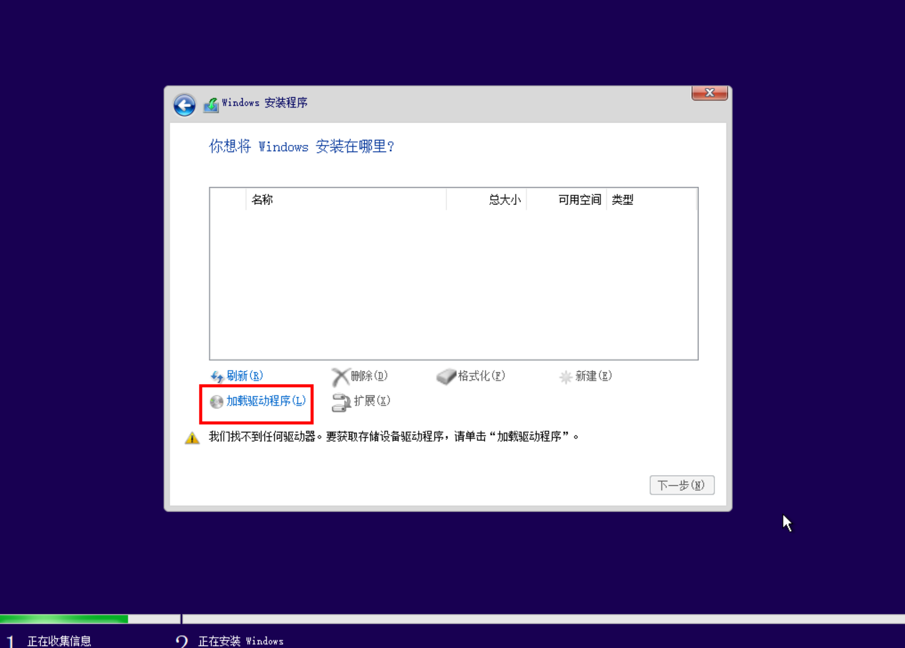
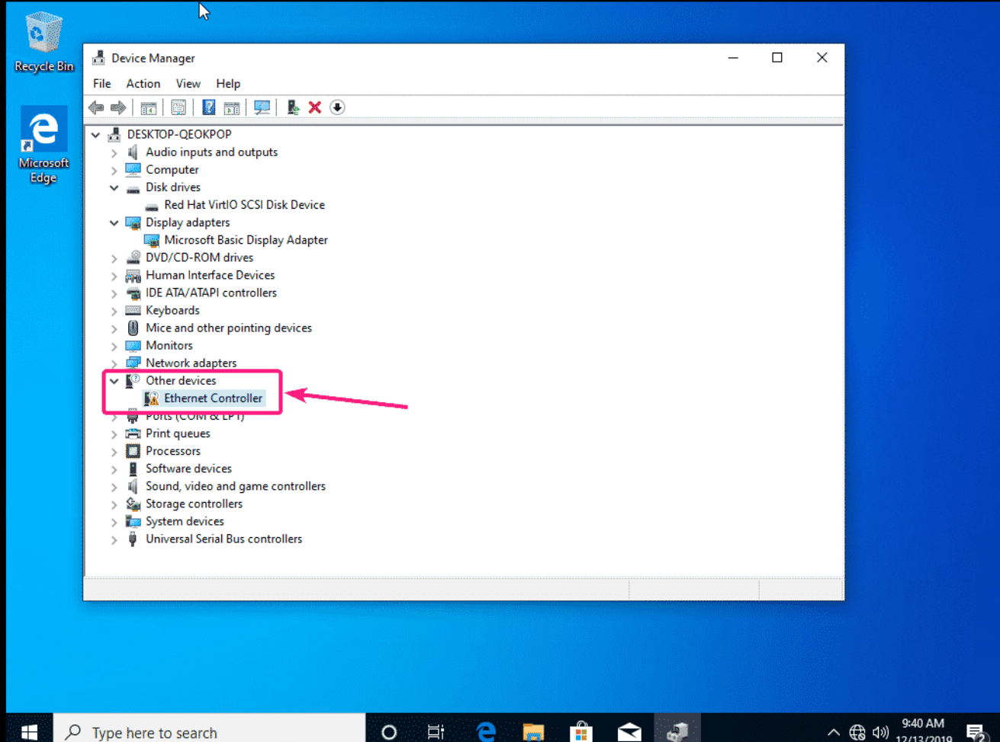
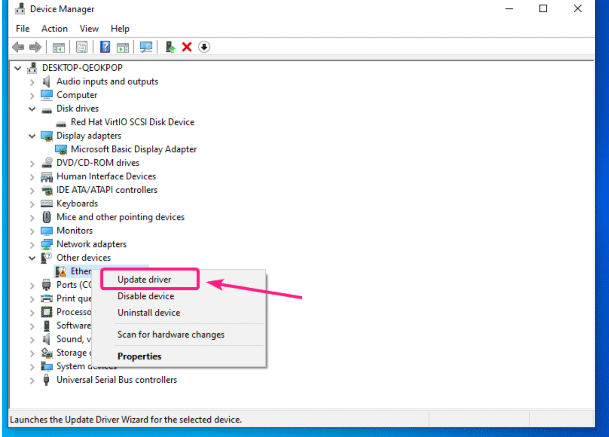
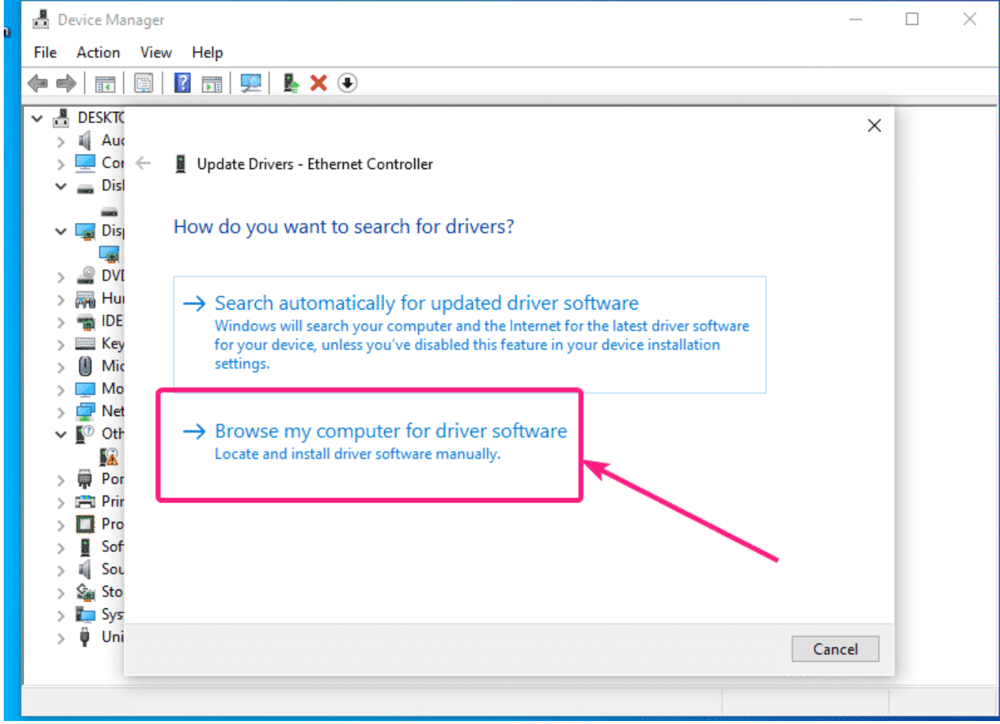
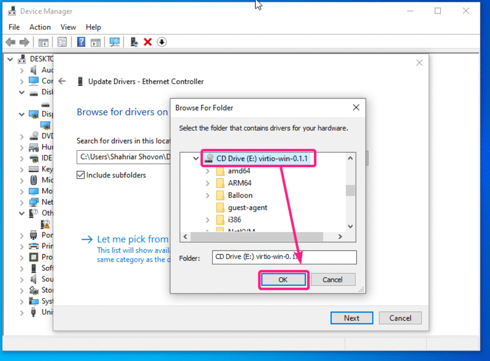

# usage

<!-- @import "[TOC]" {cmd="toc" depthFrom=1 depthTo=6 orderedList=false} -->
<!-- code_chunk_output -->

- [usage](#usage)
    - [镜像相关](#镜像相关)
      - [1.在cloud镜像基础上制作镜像](#1在cloud镜像基础上制作镜像)
        - [(1) 启动一个实例并配置Configuration](#1-启动一个实例并配置configuration)
        - [(2) 在实例中修改相关配置](#2-在实例中修改相关配置)
      - [2.从iso安装镜像（一开始不能挂载磁盘）](#2从iso安装镜像一开始不能挂载磁盘)
      - [3.制作cloud镜像](#3制作cloud镜像)
      - [4.制作windows镜像(注意cpu问题)](#4制作windows镜像注意cpu问题)
        - [(1) 下载相关iso并上传为镜像](#1-下载相关iso并上传为镜像)
        - [(2) 创建volume](#2-创建volume)
        - [(3) 创建虚拟机](#3-创建虚拟机)
        - [(4) 安装](#4-安装)
        - [(5) 安装成功后，需要安装网卡驱动](#5-安装成功后需要安装网卡驱动)
        - [(6) 把 其他（即未识别的设备）下面 的设备都更新一下驱动](#6-把-其他即未识别的设备下面-的设备都更新一下驱动)
        - [(7) 使用注意 (上传为镜像模板后)](#7-使用注意-上传为镜像模板后)
      - [5.上传镜像](#5上传镜像)
      - [6.下载镜像](#6下载镜像)
    - [基本使用](#基本使用)
      - [1.flavor相关](#1flavor相关)
      - [2.port（网卡）相关](#2port网卡相关)
      - [3.volume（磁盘）相关](#3volume磁盘相关)
        - [（1）基本使用](#1基本使用)
        - [（2）扩容](#2扩容)
      - [4.创建虚拟机模板（即image）](#4创建虚拟机模板即image)
      - [5.创建虚拟机](#5创建虚拟机)
        - [（1）依赖cloud-init的功能](#1依赖cloud-init的功能)
        - [（2）手动进行扩容（如果不支持自动扩容）](#2手动进行扩容如果不支持自动扩容)
      - [6.虚拟机的调度：zone和aggregate](#6虚拟机的调度zone和aggregate)
        - [（1）zone](#1zone)
        - [（2）aggregate](#2aggregate)
      - [7.snapshot和backup](#7snapshot和backup)
        - [（1）instance snapshot](#1instance-snapshot)
        - [（2）volume snapshot](#2volume-snapshot)
        - [（3）volume backup](#3volume-backup)
        - [（4）总结](#4总结)
      - [8.LoadBalancer相关](#8loadbalancer相关)
        - [（1）创建LoadBalancer](#1创建loadbalancer)
      - [9.创建VIP（将floating ip与某个内部vip绑定）](#9创建vip将floating-ip与某个内部vip绑定)
      - [10.重置虚拟机状态（当虚拟机处于error时）](#10重置虚拟机状态当虚拟机处于error时)
    - [管理](#管理)
      - [1.project管理](#1project管理)
        - [（1）project管理](#1project管理-1)
        - [（2）限额（quota）管理](#2限额quota管理)
      - [2.server管理](#2server管理)
    - [Demo](#demo)

<!-- /code_chunk_output -->

### 镜像相关

最好使用官方制作好的cloud镜像，在此基础上改：[下载](https://docs.openstack.org/image-guide/obtain-images.html)
  * 注意上传格式是qcow2

注意：
* cloud-init很多配置是创建镜像时生效，不是每次重启都生效，比如配置ssh
* 不仅要修改cloud.cfg而且要本身的配置也修改过来（比如：sshd的配置），因为cloud-init其实实现的不够完美，有时候不生效

#### 1.在cloud镜像基础上制作镜像

##### (1) 启动一个实例并配置Configuration
* 注意：必须以`#cloud-config`开头（或者其他的格式）
```yaml
#cloud-config

ssh_pwauth: true

users:
 - name: root
   lock_passwd: false
   plain_text_passwd: cangoal
```

##### (2) 在实例中修改相关配置
* 修改cloud-init配置
```shell
$ vim /etc/cloud/cloud.cfg

disable_root: false
ssh_pwauth: true
```

* 其他一些初始化
  * 比如：配置ssh、安装常用软件等

* 清除cloud-init记录
```shell
cloud-init clean
```

#### 2.从iso安装镜像（一开始不能挂载磁盘）

* 从镜像启动不要挂载其他volume（否则不能检测到iso）
* 启动后，挂载volume，即要安装操作系统的磁盘
* 进行安装

#### 3.制作cloud镜像

* 只有有一个分区且不能是LVM
  * 这样才能自动扩容根文件系统

* 需要安装好cloud-init相关组件，这样才能启动时调整磁盘、修改密码登
```shell
yum -y install cloud-init cloud-utils-growpart gdisk
#apt-get -y install cloud-init cloud-guest-utils gdisk
```

* 允许密码登录
```shell
$ vim /etc/cloud/cloud.cfg

ssh_pwauth: 1
```

* 能够看到console log
```shell
$ vim /etc/default/grub

#增加console=tty0 console=ttyS0,115200n8
GRUB_CMDLINE_LINUX="... console=tty0 console=ttyS0,115200n8"

$ grub2-mkconfig -o /etc/grub2.cfg
```

* 安装基础组件
```shell
yum -y install vim lrzsz unzip zip
```

#### 4.制作windows镜像(注意cpu问题)

* windows镜像参考：[参考1](https://bugzilla.redhat.com/show_bug.cgi?id=1982606),[参考2](https://linuxhint.com/install_virtio_drivers_kvm_qemu_windows_vm/)

* 注意cpu问题，[参考](https://techglimpse.com/windows-10-virtual-machine-shows-100-percentage-cpu-utilization-qemu-kvm/):
  * windows10虚拟机默认只使用 1 socket，即使添加多个cpu socket也没有
  * 所以只能设置多个cpu cores

##### (1) 下载相关iso并上传为镜像
  * windows iso
  * [virtio-win](https://docs.fedoraproject.org/en-US/quick-docs/creating-windows-virtual-machines-using-virtio-drivers/)

##### (2) 创建volume
```shell
#创建系统盘
openstack volume create --size 50 --bootable win10-disk
#创建windows iso的cdrom
openstack volume create --image Windows-10.iso --size 10 win10-iso-disk
#创建virtio-win iso的cdrom
openstack volume create --image virtio-win-0.1.225.iso --size 1 virtio-iso-disk
```

##### (3) 创建虚拟机
* 先创建flavor（解决cpu问题）

```shell
openstack flavor create --vcpus 4 --ram 8192 --disk 50 1s4c/8g --property hw:cpu_sockets='1' --property hw:cpu_cores='8'
```

* 创建实例

```shell
openstack server create \
  --flavor 1s4c/8g--nic net-id=10.172.1.0 --security-group 51c2913a-5a5c-46c7-9d47-fe044a862e73 \
  #指定系统盘（通过--image或--voulme的boot_index=0，启动优先级最高）
  --volume win10-disk \
  #添加windows iso的cdrom（uuid就是上面win10-iso-disk的id），并且设置boot_index=1在系统盘后
  --block-device uuid=f40b77a0-ce1d-47c6-969f-c1a35888745b,source_type=volume,destination_type=volume,device_type=cdrom,boot_index=1 \
  #添加virtio-win iso的cdrom（uuid就是就是上面virtio-iso-disk的id）
  --block-device uuid=4666b838-5f82-443c-abf7-008da20eb09e,source_type=volume,destination_type=volume,device_type=cdrom  \
  win10
```

##### (4) 安装
  * 选择自动扫描驱动



##### (5) 安装成功后，需要安装网卡驱动







##### (6) 把 其他（即未识别的设备）下面 的设备都更新一下驱动

##### (7) 使用注意 (上传为镜像模板后)
  * volume空间要大于模板的空间（50G）
  * 创建虚拟机时，由于volume创建时间比较长，虚拟机创建会报错
    * 等volume创建好后，用那个volume创建虚拟机
  * 网络可能有问题，将 网络适配器 禁用再启用

#### 5.上传镜像

```shell
openstack image create --progress --disk-format <image_format> --public --file <path>  <image_name>
```

* 上传volume作为镜像（qcow2）
  * 修改镜像的metadata，删除signature_verified、owner_specified.openstack.sha256和owner_specified.openstack.md5

#### 6.下载镜像
```shell
openstack image list
openstack image save --file /tmp/centos-7-cloud-template centos-7-cloud-template
```

***

### 基本使用

#### 1.flavor相关
flavor定义了一个instance的规格模板（RAM、Disk、CPU等）

* 创建flavor
```shell
openstack flavor create --vcpus 2 --ram 4096 --disk 20 2c/4g
openstack flavor create --vcpus 4 --ram 8192 --disk 20 4c/8g
openstack flavor create --vcpus 8 --ram 16384 --disk 50 8c/16g
openstack flavor create --vcpus 8 --ram 32768 --disk 50 8c/32g
openstack flavor create --vcpus 16 --ram 32768 --disk 50 16c/32g
openstack flavor create --vcpus 16 --ram 65536 --disk 50 16c/64g
```


#### 2.port（网卡）相关


* 创建端口（即网卡）
```shell
# 必须要设置一个fixed ip（不指定的话根据dhcp随机）
# 如果该网卡需要设置其他ip，则需要 allow指定的ip通过（--allowed-address ip-address=<ip>） 或者 --disable-port-security
openstack port create --network <network_name> --fixed-ip ip-address=<ip> --allowed-address ip-address=<ip> <name>
```

* 给端口添加放行ip
```shell
openstack port set --allowed-address ip-address=10.172.1.13 <port_id>
```

#### 3.volume（磁盘）相关

##### （1）基本使用
volume就是块设备
* voluem source：
  * 默认source是blank，就是空的
  * 可以把source设为image或volume或snapshot，这样创建的volume就不是空的，有内容（比如操作系统、文件系统等）
* bootable:
  * 表示可以从这个volume启动
```shell
#size单位默认为GB
openstack volume create --size <size> <volume_name>
```

##### （2）扩容
必须先detach该volume
然后扩容
如果是系统盘，然后再利用扩容后的volume创建instance

#### 4.创建虚拟机模板（即image）

* 首先需要利用image启动一个实例
* 然后创建一个新的volume，挂载到这个实例上
* 然后安装操作系统到这个volume上
* 最后用这个volume生成image（upload to image）（这个过程可能需要一段时间）


#### 5.创建虚拟机
* 必须从image创建虚拟机，所以必须要先制作好image
* 添加网卡
  * 指定网络会自动创建网卡（会随着instance删除而删除）
  * 或者创建port，然后加到这个虚拟机上
* 创建新的volume，则可以对这个volume做snapshot和backup等操作
* 添加额外磁盘
  * 创建volume，然后加到这个虚拟机上

```shell
openstack server create \
  --image <image> \
  --flavor <flavor> \
  --nic net-id=<network>,v4-fixed-ip=<ip> \ #重复使用可以添加多个port（可以代替的选项：--network <network> 或者 --port <port>）
  --boot-from-volume <volume_size> \  #单位为GB
  --security-group <security-group | default=default> \  #重复使用可以添加多个securiy group（取并集）
  --availability-zone <zone-name | default=nova> \
  <instance_name>

#注意：
# --boot-from-volume 只能指定磁盘的大小，文件的大小不能自动扩容，需要手动扩容
#添加磁盘：
# --block-device source_type=blank,destination_type=volume,delete_on_termination=true,volume_size=<size>
#执行脚本：
# --user-data <script_file_path>
```

##### （1）依赖cloud-init的功能

* user-data进行初始化，格式如下：

```shell
#!/bin/bash

echo xx | passwd --stdin root
#ubuntu: echo -e "cangoal\ncangoal" | passwd  root
```

或者

```yaml
#cloud-config

ssh_pwauth: true

users:
 - name: root
   lock_passwd: false
   plain_text_passwd: cangoal
```

* 自动扩容根分区

##### （2）手动进行扩容（如果不支持自动扩容）
```shell
fdisk /dev/vda

#删除某一个分区，然后创建该分区
#Do you want to remove the signature? [Y]es/[N]o: n

partprobe

pvresize /dev/vda2
lvextend -l 100%VG /dev/mapper/centos-root
xfs_growfs /dev/mapp/centos-root
```

#### 6.虚拟机的调度：zone和aggregate

##### （1）zone
* 通过aggregate的元信息定义，有一个默认的zone
  * 用于对物理主机进行分区（比如按照位置、网络布局等等方式），
  * 一个物理主机只能属于某一个zone，
  * zone对于用户可见，创建instance时，需要指定该instance放置在哪个zone中

* 创建zone
```shell
#创建aggregate，通过aggregate的元信息创建zone
openstack aggregate create --zone <new_zone> <new_aggregate>

#加机器加入到某个aggregate（即加入相应的zone）
openstack aggregate add host <aggregate> <my_host>

#将某个aggregate与其zone取消关联
openstack aggregate unset --property availability_zone <aggregate>
```

##### （2）aggregate
* 将机器分组
  * 一个机器可以属于多个aggregate
  * aggrgate与flavor关联（对用户不可见）

[参考](https://docs.openstack.org/nova/latest/admin/aggregates.html#:~:text=Host%20aggregates%20are%20a%20mechanism,additional%20hardware%20or%20performance%20characteristics.)

#### 7.snapshot和backup

##### （1）instance snapshot
给当前的系统生成镜像（即快照）
然后可以利用这个镜像，继续创建新的instance

##### （2）volume snapshot
对当前volume生成快照
然后可以利用这个volume。创建新的instance

##### （3）volume backup
备份volume，之后可以用这个备份恢复 **没有挂载的** volume

##### （4）总结
* 备份
  * 利用instance snapshot生成快照（即image）
* 恢复
  * 然后利用这个image，重新创建instance（然后网络配置等要一样），即进行了恢复
* 注意：
  * 制作快照时，刚刚写入的数据可能不会被备份，需要等一会

#### 8.LoadBalancer相关
[参考](https://docs.openstack.org/api-ref/load-balancer/v2/)
[参考](https://docs.openstack.org/octavia/latest/user/guides/basic-cookbook.html)
##### （1）创建LoadBalancer

* 创建LoadBalancer
```shell
openstack loadbalancer create --name <name> \
--vip-address <ip> --vip-subnet-id <subnet_id> \
--provider amphora
```

#### 9.创建VIP（将floating ip与某个内部vip绑定）

* 首先创建端口（需要明确vip）
```shell
openstack port create --network <network> --fixed-ip ip-address=<vip> <port_name>
```

* 创建floating ip（并与某个port绑定）
```shell
openstack floating ip create --subnet <subnet> --port <port> --floating-ip-address <floating_ip> <public_network>
```
* 此时该vip其实还没有分配，只不过是与floating ip进行了绑定
 * 然后多个虚拟机允许该vip通过，然后通过keepalived将这个vip配置在这些虚拟机间，这样访问floating ip就能实现高可用

#### 10.重置虚拟机状态（当虚拟机处于error时）

```shell
openstack server set --state active <instance>
openstack server stop <instance>
``` 

***

### 管理

#### 1.project管理

##### （1）project管理

* 列出所有的projects
```shell
openstack project list
```

##### （2）限额（quota）管理

* 查看project的compute、volume、network这三个方面的限额（quota）
```shell
openstack quota show <project>
```

* 设置限额（quota）
```shell
openstack quota set --cores 60 --ram 122880 --instances 100 --volumes 150 --snapshots 150 <project>
```

#### 2.server管理
```shell
openstack server list --all-projects
```


### Demo

```shell
openstack quota set --cores 146 --ram 299008 --instances 100 --volumes 150 --snapshots 150 admin

openstack server create \
  --image centos-7-cloud-template \
  --flavor 8c/16g \
  --nic net-id=10.172.1.0,v4-fixed-ip=10.172.1.250 \
  --boot-from-volume 100 \
  --security-group 51c2913a-5a5c-46c7-9d47-fe044a862e73 \
  --security-group public \
  service-250

openstack server create \
  --image centos-7-cloud-template \
  --flavor 8c/16g \
  --nic net-id=10.172.1.0,v4-fixed-ip=10.172.1.249 \
  --boot-from-volume 50 \
  --security-group 51c2913a-5a5c-46c7-9d47-fe044a862e73 \
  --security-group public \
  gitlab-249

openstack port create --network 10.172.1.0 --fixed-ip ip-address=10.172.1.11 \
  --allowed-address ip-address=10.172.1.10 \
  --security-group 51c2913a-5a5c-46c7-9d47-fe044a862e73 \
  --security-group public \
  port-1.11
openstack port create --network 10.172.1.0 --fixed-ip ip-address=10.172.1.12 \
  --allowed-address ip-address=10.172.1.10 \
  --security-group 51c2913a-5a5c-46c7-9d47-fe044a862e73 \
  --security-group public \
  port-1.12
openstack port create --network 10.172.1.0 --fixed-ip ip-address=10.172.1.13 \
  --allowed-address ip-address=10.172.1.10 \
  --security-group 51c2913a-5a5c-46c7-9d47-fe044a862e73 \
  --security-group public \
  port-1.13

openstack server create \
  --image centos-7-cloud-template \
  --flavor 4c/8g \
  --port port-1.11 \
  --boot-from-volume 50 \
  --security-group 51c2913a-5a5c-46c7-9d47-fe044a862e73 \
  --security-group public \
  host-1.11

openstack server create \
  --image centos-7-cloud-template \
  --flavor 4c/8g \
  --port port-1.12 \
  --boot-from-volume 50 \
  --security-group 51c2913a-5a5c-46c7-9d47-fe044a862e73 \
  --security-group public \
  host-1.12

openstack server create \
  --image centos-7-cloud-template \
  --flavor 4c/8g \
  --port port-1.13 \
  --boot-from-volume 50 \
  --security-group 51c2913a-5a5c-46c7-9d47-fe044a862e73 \
  --security-group public \
  host-1.13

openstack port create --network 10.172.1.0 --fixed-ip ip-address=10.172.1.10 port-10
openstack floating ip create --subnet public1-subnet --port port-10 --floating-ip-address 10.10.10.150 public1
```
