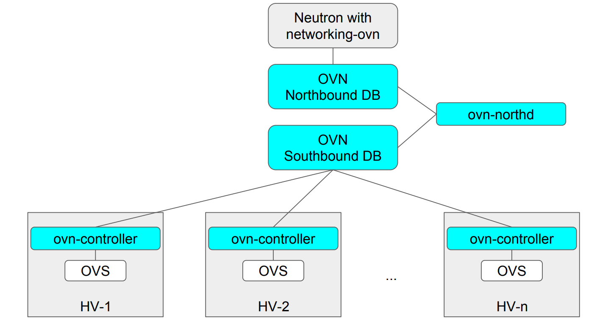

# overview

<!-- @import "[TOC]" {cmd="toc" depthFrom=1 depthTo=6 orderedList=false} -->
<!-- code_chunk_output -->

- [overview](#overview)
    - [概述](#概述)
      - [1.使用OVN的效果](#1使用ovn的效果)
      - [2.OVN架构](#2ovn架构)
    - [Northbound](#northbound)
      - [1.基本使用](#1基本使用)
        - [(1) 列出虚拟的设备（即逻辑网络）](#1-列出虚拟的设备即逻辑网络)
      - [2.路由器相关](#2路由器相关)
        - [(1) 列出路由器的路由表](#1-列出路由器的路由表)
      - [3.NAT相关](#3nat相关)
        - [(1) 列出nat配置](#1-列出nat配置)
        - [(2) 设置nat](#2-设置nat)
      - [4.LB相关](#4lb相关)
        - [(1) 列出LB](#1-列出lb)
    - [southbound](#southbound)
        - [(1) 数据流](#1-数据流)
      - [1.DEBUG： 对链路进行trace（终极）](#1debug-对链路进行trace终极)

<!-- /code_chunk_output -->

### 概述

#### 1.使用OVN的效果

* HV: hypervisor，即部署了OVN的设备
* 同一个颜色表示同一个vlan
* 物理连接很简单，通过SDN实现复杂的逻辑连接

#### 2.OVN架构



* Northbound DB
  * 存储配置信息（类似声明式API）
  * 存储逻辑网络配置，即配置 虚拟出的设备和连接（不具体到某台机器的配置）
* Southbound DB
  * 目的是使得这些虚拟设备在各个物理机上连接起来（即建立隧道等）
  * 存储 具体机器的网络配置 和 具体的数据流
    * 即 哪些虚拟的设备(比如端口等) 配置在 哪些具体的机器上
    * 其他一些虚拟的设备 每台都要配置

* northd
  * 在Northbound DB和Southbound DB中间进行转换

* ovn-controller
  * 是OVN的agent，每个hypervisor上都有一个
  * 用于读取southerbound DB数据，配置OVS

* CMS (Cloud Management System)
  * 用于操作OVN的客户端

***

### Northbound

#### 1.基本使用
##### (1) 列出虚拟的设备（即逻辑网络）

```python
$ ovn-nbctl show

#使用外部nbdb: --db=tcp:[10.172.1.132]:6641,tcp:[10.172.1.201]:6641,tcp:[10.172.1.235]:6641（参数必须接在ovn-sbctl）

"""
展示了 逻辑网络和连接 （即需要创建的虚拟设备和连接）

format:

<device_type> <id> <alias>
- <port>
        <type>
        <addresses> or <remote_port>
"""

switch 87f5c3c8-7275-4e46-8506-416d75e9d24b (neutron-9bd921d6-d451-4c25-802a-42f6b9991db8) (aka public1)
    port provnet-91270315-0043-4282-8c10-4804b15105d4
        type: localnet
        addresses: ["unknown"]
    port a9eb8a65-b994-4589-9e77-16b374eefe77
        type: router
        router-port: lrp-a9eb8a65-b994-4589-9e77-16b374eefe77
    port 835757c0-e56d-4dd1-b9e0-0e97c49ff2eb
        type: localport
        addresses: ["fa:16:3e:f6:fd:34"]

...

router 20594965-2b2e-4b01-8dc3-dd35f532a785 (neutron-6b412af2-5e61-461e-b93e-1549c4f45251) (aka demo-router)
    port lrp-4a31cedb-095d-49d9-afbc-4f3627f69195
        mac: "fa:16:3e:88:d0:36"
        networks: ["3.1.5.254/24"]
    port lrp-a9eb8a65-b994-4589-9e77-16b374eefe77
        mac: "fa:16:3e:43:5a:89"
        networks: ["10.172.1.59/24"]
        gateway chassis: [openstack-1]
    nat 0bd54b92-46fc-40cf-a20b-3179e18dbefc
        external ip: "10.172.1.59"
        logical ip: "3.1.5.0/24"
        type: "snat"

```

#### 2.路由器相关
##### (1) 列出路由器的路由表
```shell
$ ovn-nbctl lr-route-list <router>

IPv4 Routes
Route Table <main>:
                0.0.0.0/0               10.68.0.254 dst-ip
```

#### 3.NAT相关

##### (1) 列出nat配置
```shell
$ ovn-nbctl lr-nat-list <router>
TYPE             EXTERNAL_IP        EXTERNAL_PORT    LOGICAL_IP            EXTERNAL_MAC         LOGICAL_PORT
snat             10.172.1.51                         10.67.0.0/24
snat             10.172.1.51                         3.1.5.0/24
```

##### (2) 设置nat
```shell
kubectl-ko nbctl lr-nat-add <router> <type> <EXTERNAL_IP> <LOGICAL_IP>
#<type>为snat、dnat、dnat_and_snat
```

#### 4.LB相关

##### (1) 列出LB
```shell
ovn-nbctl lb-list
```

***

### southbound

* 列出虚拟设备与机器的绑定关系
```python
$ ovn-sbctl show

#使用外部sbdb: --db=tcp:[10.172.1.132]:6642,tcp:[10.172.1.201]:6642,tcp:[10.172.1.235]:6642 （参数必须接在ovn-sbctl）

"""
展示了 虚拟设备与机器的绑定关系
一个chassis就是一个intergration bridge（用于内部连接和隧道连接，即将br-int和br-tun合并为一个br-int）

format:

Chassis <host_id>
    hostname: <hostname>
    Encap: <encapsulation_protocol>
        ip: <host_ip>
    - Port_Binding <port_name>
"""

Chassis "e18d0f09-f2c7-4f25-9c82-fd392c2d826d"
    hostname: master-2
    Encap geneve
        ip: "10.172.1.201"
        options: {csum="true"}
    Port_Binding coredns-555d9f6546-nxmdd.kube-system
    Port_Binding ubuntu.test
    Port_Binding kube-ovn-pinger-95x6v.kube-system
    Port_Binding node-master-2

...

Chassis openstack-2
    hostname: openstack-2
    Encap geneve
        ip: "10.172.1.46"
        options: {csum="true"}
    Port_Binding "3f761cc6-3f49-443a-8232-2721550b6bba"
```

##### (1) 数据流

* 列出整个数据流
```shell
$ ovn-sbctl lflow-list
```

* 列出有哪些datapath（即数据流）
```shell
$ ovn-sbctl count-flows
```

* 某个datapath的数据流
```shell
$ ovn-sbctl lflow-list <datapath>
```

#### 1.DEBUG： 对链路进行trace（终极）
```shell
#inport： 流量的入口
# 可以通过ovn-nbctl show查看端口
#ip4.dst： 目标地址
#下面的意思是，追踪流量从lrp-81b5acac-e17c-46fa-8186-db957a87a6b7端口进行，目标地址是172.16.1.231的链路，能够检查出哪里不通
ovn-trace 'inport=="lrp-81b5acac-e17c-46fa-8186-db957a87a6b7" && ip4.dst==172.16.1.231'

#结果显示（最后是drop）：
#ingress(dp="demo-router", inport="lrp-81b5ac")
#----------------------------------------------
# 0. lr_in_admission: no match (implicit drop)
```