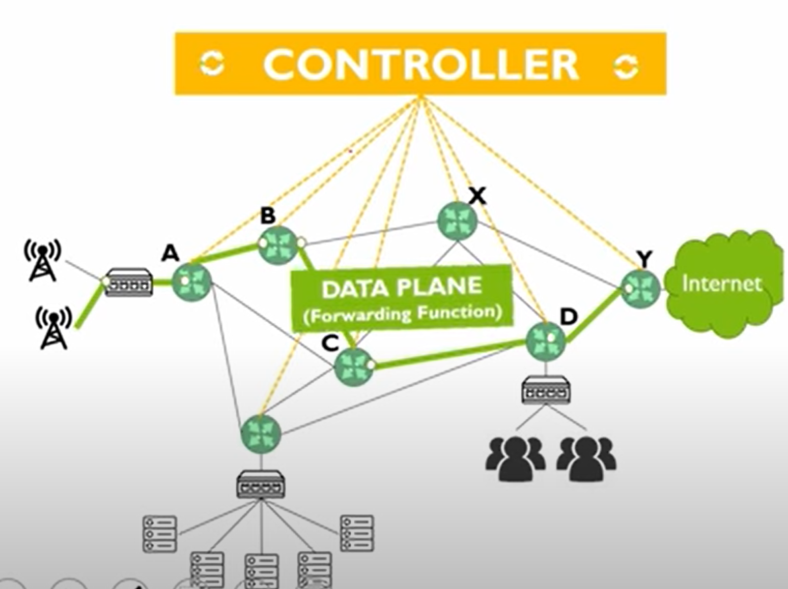
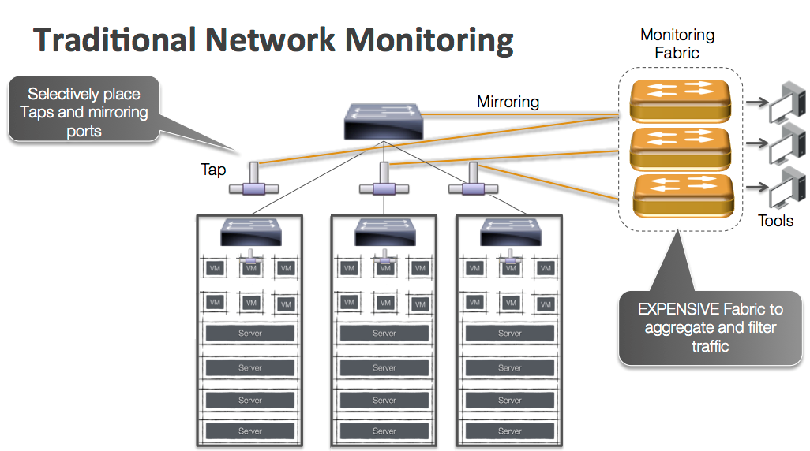

# SDN(software definitied network)

<!-- @import "[TOC]" {cmd="toc" depthFrom=1 depthTo=6 orderedList=false} -->
<!-- code_chunk_output -->

- [SDN(software definitied network)](#sdnsoftware-definitied-network)
    - [概述](#概述)
      - [1.SDN架构](#1sdn架构)
      - [2.SDN controller](#2sdn-controller)
        - [（1）集中式和分布式](#1集中式和分布式)
      - [2.与traditional network比较](#2与traditional-network比较)
      - [3.why need SDN](#3why-need-sdn)
      - [4.网络分析](#4网络分析)

<!-- /code_chunk_output -->

### 概述

#### 1.SDN架构

* 有多种控制器
* Southbound使用的协议：openflow

#### 2.SDN controller

##### （1）集中式和分布式
* 集中式
  * 使用单独的几台服务器部署controller，需要实现高可用性
* 分布式
  * 将controller部署在各个设备上，相互通信，实现分布式部署（好处：高可用性、成本降低）

#### 2.与traditional network比较

* traditional network：
  * 每个device都有自己的控制平面，依靠自己的控制平面，决定路由等
  * 如果需要改配置，每个device都要改
* SDN：
  * 对网络进行抽象
  * 基于internet网络，有**统一的控制平面**
  * 能够控制edge device、cloud的virtual gateway
  * 在controller上进行配置，然后下发给各个device，不需要操作每台设备

#### 3.why need SDN
* 灵活，适应复杂的云环境
* 成本更低，将交换机的硬件和软件分离，不需要用特定的软件
* 配置更加简单方面，只需要在统一的控制平面进行配置，然后下发到各个edge device，传统的网络，需要一个个进行配置
* 基于SDN可以快速配置网络策略、路由等等（比如：能够快速建立VPN）

#### 4.网络分析

* 传统的

* SDN可以直接从各个交换机获取丰富的指标数据进行分析
