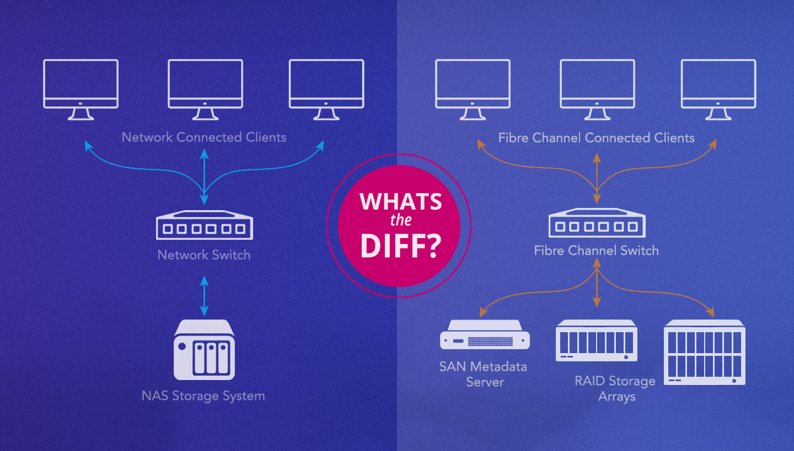
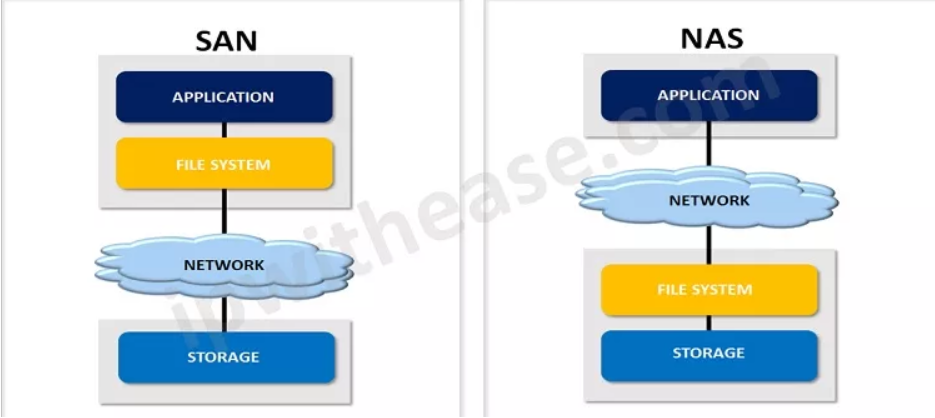
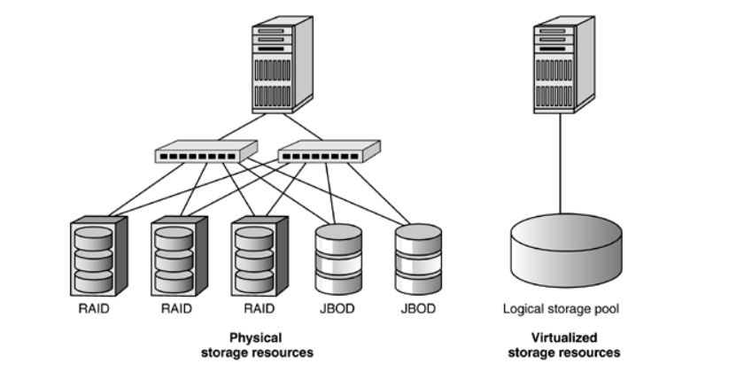
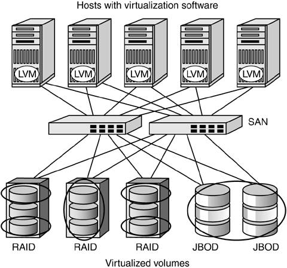
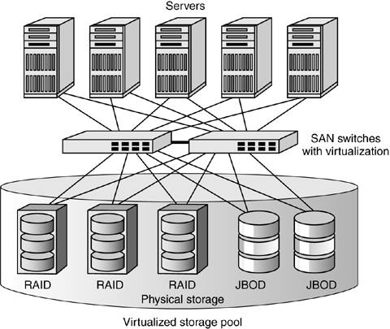
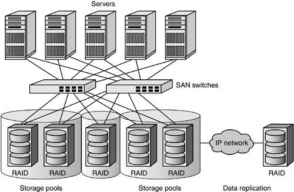
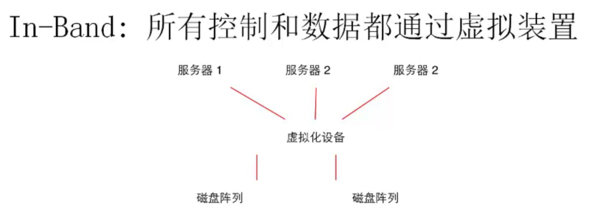
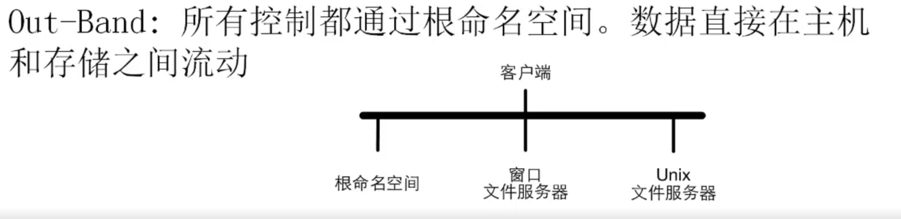

# overview

<!-- @import "[TOC]" {cmd="toc" depthFrom=1 depthTo=6 orderedList=false} -->

<!-- code_chunk_output -->

- [overview](#overview)
    - [概述](#概述)
      - [1.存储虚拟化三类接口](#1存储虚拟化三类接口)
        - [(1) 块接口 (block-level)](#1-块接口-block-level)
        - [(2) 文件接口 (file-level)](#2-文件接口-file-level)
        - [(3) 对象存储接口 (object-level)](#3-对象存储接口-object-level)
      - [2.分布式存储的实现](#2分布式存储的实现)
        - [(1) SAN (storage area network)](#1-san-storage-area-network)
        - [(2) NAS (network attached storage)](#2-nas-network-attached-storage)
        - [(3) 其他实现](#3-其他实现)
        - [(4) SAN和NAS区别](#4-san和nas区别)
      - [3.storage virtualization](#3storage-virtualization)
        - [(1) 说明](#1-说明)
        - [(2) 基本概念](#2-基本概念)
      - [4.三种存储虚拟方式](#4三种存储虚拟方式)
        - [(1) host-based](#1-host-based)
        - [(2) interconnection-based (最常用)](#2-interconnection-based-最常用)
        - [(3) storage-based](#3-storage-based)
      - [5.in-band 和 out-of-band](#5in-band-和-out-of-band)
        - [(1) in-band virtualization](#1-in-band-virtualization)
        - [(2) out-of-band virtualization](#2-out-of-band-virtualization)

<!-- /code_chunk_output -->

### 概述

#### 1.存储虚拟化三类接口

##### (1) 块接口 (block-level)
* 本地块存储
    * SATA,SAS
    * 本地磁盘阵列(RAID)
* 远程块存储接口
    * 光纤通道
    * iSCSI

##### (2) 文件接口 (file-level)
* 文件系统
* 网络文件系统 (NFS, CIFS, HDFS)
* VFS

##### (3) 对象存储接口 (object-level)
* S3
* openstack swift

#### 2.分布式存储的实现

##### (1) SAN (storage area network)
* 存储服务器通过**专用存储网络**连接，例如光纤通道(FC)或以太网
* 支持的协议:
    * FCP: a mapping of SCSI over Fibre Channel
    * iSCSI: mapping of SCSI over TCP/IP
    * FCoE: Fibre Channel over Ethernet
    * 等等
* 提供 **block-level** 存储

##### (2) NAS (network attached storage)
* 存储服务器通过**通用的网络**来访问，例如以太网
* 支持的协议: 
    * Network File System (NFS)
    * File Transfer Protocol (FTP)
    * Hypertext Transfer Protocol (HTTP)
    * 等等
* 提供 **file-level** 存储

##### (3) 其他实现
比如：ceph

##### (4) SAN和NAS区别

#### 3.storage virtualization

##### (1) 说明
* 将 多个存储 虚拟化 成 一个存储池，对外提高存储服务
    * RAID就是一种存储虚拟化

##### (2) 基本概念

* virtualization intelligence 是虚拟化层
* virtualization appliance 是虚拟化后的存储设备

#### 4.三种存储虚拟方式

##### (1) host-based
* 将virtulization intelligence放在**主机侧**

* 比如: LVM

* 优点
    * 避免了in-band方式的性能瓶颈
* 缺点
    * 需要在每个主机进行配置

##### (2) interconnection-based (最常用)

* 将virtulization intelligence放在 **主机 和 存储 之间**

* 比如：在交换机上进行存储虚拟化

* 缺点
    * 当时in-band方式时，可能存在性能瓶颈，因为metadata和data都要经过virtualization appliance
    * 交换机的任务会变得繁重，原来交换机只要负责交换任务，现在还需要负责虚拟化等任务

##### (3) storage-based

* 将virtualization intelligence放在**存储侧**
* 比如: RAID

* 缺点
    * 需要选择特定厂商的设备，会跟厂商绑定

#### 5.in-band 和 out-of-band

* metadata
    * 元数据，即数据的信息（包括文件名、位置等）
* data
    * 真正的数据
* control path
    * 访问metadata的路径
* data path
    * 访问data的路径 

##### (1) in-band virtualization

* control path和data path**共享**一个path，即通过virtualization appliance进行访问

* 优点
    * 主机只能看到和访问到virtualization appliance，不知道后面具体的存储，对主机来说影响最小
* 缺点
    * 性能瓶颈
    * 更容易故障，当virtualization appliance故障，存储即不可用

##### (2) out-of-band virtualization

* 将control path和data path**分开**，control path通过virtualization，data path直接连接具体的存储

* 优点
    * 解决了in-band方式的缺点
* 缺点
    * 对主机侧影响较大，主机侧能够看到并访问到具体的存储