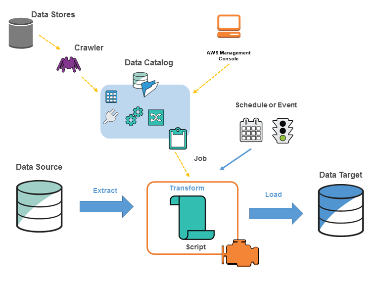

# Glue

<!-- @import "[TOC]" {cmd="toc" depthFrom=1 depthTo=6 orderedList=false} -->

<!-- code_chunk_output -->

- [Glue](#glue)
    - [Overview](#overview)
      - [1.Why need Glue](#1why-need-glue)
      - [2.Catalog](#2catalog)
        - [(1) Crawlers](#1-crawlers)
      - [3.ETL](#3etl)

<!-- /code_chunk_output -->


### Overview



AWS Glue is a serverless data integration service for discovering, preparing, and combining data for analytics, machine learning, and application development.

```
[Raw S3 Bucket] ➔ [Glue ETL Job] ➔ [Clean S3 Bucket] ➔ [Athena + Glue Catalog] ➔ [BI Dashboard]
```

#### 1.Why need Glue

- Data sits in many places (S3, RDS, DynamoDB, Redshift) in different formats — Glue connects and normalises it without managing servers
- Eliminates the need to write boilerplate ETL code; Glue generates PySpark/Python scripts automatically
- Schema discovery is automatic via crawlers, so you don't need to manually define table structures
- Pay only for the resources used during job runs (DPU-hours); no idle infrastructure cost

#### 2.Catalog

- **Glue Data Catalog** is a central **metadata** repository — stores table definitions, schemas, and partition info
- Acts as a Hive-compatible metastore; usable by Athena, EMR, and Redshift Spectrum without duplication

##### (1) Crawlers
- Crawlers scan data sources (S3, JDBC, etc.), infer schemas, and populate or update catalog tables automatically
- Supports versioned schemas so you can track how a table's structure changed over time

#### 3.ETL

- Jobs run as serverless Spark (PySpark / Scala) or Python Shell scripts
- **DynamicFrame** is Glue's extension of Spark DataFrame — handles schema inconsistencies (missing fields, mixed types) gracefully
- Job bookmarks track which data has already been processed, enabling incremental loads
- Triggers can be scheduled (cron), event-driven (S3 event, another job), or on-demand
- **Glue Studio** provides a visual drag-and-drop interface to build ETL pipelines without writing code