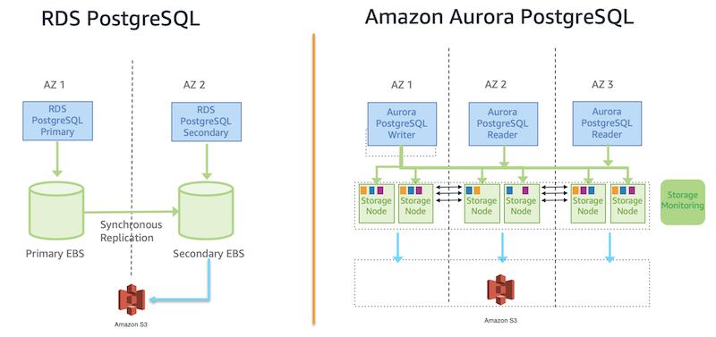

# RDS and Aurora

<!-- @import "[TOC]" {cmd="toc" depthFrom=1 depthTo=6 orderedList=false} -->

<!-- code_chunk_output -->

- [RDS and Aurora](#rds-and-aurora)
    - [Overview](#overview)
      - [1.RDS vs Aurora](#1rds-vs-aurora)

<!-- /code_chunk_output -->

### Overview

#### 1.RDS vs Aurora
