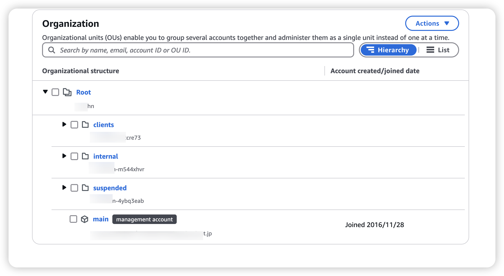

# IAM (Identity and Access Management)

<!-- @import "[TOC]" {cmd="toc" depthFrom=1 depthTo=6 orderedList=false} -->

<!-- code_chunk_output -->

- [IAM (Identity and Access Management)](#iam-identity-and-access-management)
    - [Overview](#overview)
      - [1.basic](#1basic)
        - [(1) concepts](#1-concepts)
        - [(2) credentials](#2-credentials)
        - [(3) API](#3-api)
        - [(4) external credentials](#4-external-credentials)
        - [(5) `:q~/.aws/credentials` vs `~/.aws/config`](#5-qawscredentials-vs-awsconfig)
      - [2.role](#2role)
        - [(1) assume a role](#1-assume-a-role)
        - [(2) trust policy](#2-trust-policy)
        - [(3) permission policy](#3-permission-policy)
      - [3.account and organization](#3account-and-organization)

<!-- /code_chunk_output -->

### Overview

#### 1.basic 

##### (1) concepts

* Account ID
    * when logging in with a non-root user account

##### (2) credentials

* access key
    * enable access key id and secret access key for the AWS API

* username/password
    * use account id and password for web login

* temperary Credentials
    * access key id
    * secret access key
    * session token

##### (3) API

* first need to sign request
    * use access key id and secret access key to get token
    * add `Authrization: <token>` to the header of a request

##### (4) external credentials

* `~/.aws/config`

```
[profile developer]
credential_process = <shell_command>
```

* Expected output from the Credentials program

```json
{
    "Version": 1,
    "AccessKeyId": "an AWS access key",
    "SecretAccessKey": "your AWS secret access key",
    "SessionToken": "the AWS session token for temporary credentials",
    "Expiration": "ISO8601 timestamp when the credentials expire"
}
```

##### (5) `:q~/.aws/credentials` vs `~/.aws/config`

* they all have multiple profiles
* `~/.aws/credentials` Stores **access credentials** (Access Key, Secret Key, and Session Token)
* `~/.aws/config` Stores AWS CLI configurations (region, output format, IAM roles, etc.)

#### 2.role

##### (1) assume a role
* when you assume a role, it provides you with **temporary** security credentials for your role session
* can give AWS access to users who already have identities defined outside of AWS

* default profile (`~/.aws/credentials`) contains valid credentials:
```ini
[default]
aws_access_key_id = AKIAEXAMPLE123
aws_secret_access_key = abcdefghijklmnopqrstuvwxyz1234567890
```

* `~/.aws/config`
    * use credentials from default profile to assume the IAM role `MyRole`
```ini
[default]
region = us-east-1
output = json

[profile my-profile]
region = ap-northeast-1
output = yaml
role_arn = arn:aws:iam::123456789012:role/MyRole
source_profile = default
```

* use the profile
```shell
aws s3 ls --profile my-profile
aws sts get-caller-identity --profile my-profile
```

##### (2) trust policy
[policy grammar](https://docs.aws.amazon.com/IAM/latest/UserGuide/reference_policies_grammar.html)

* specify which **principal** can assume this role
  * account
  ```json
  // does not limit permissions to only the root user of the account
  "Principal": { "AWS": "arn:aws:iam::123456789012:root" }
  ```
  * username
  ```json
  "Principal": {
    "AWS": [
      "arn:aws:iam::AWS-account-ID:user/user-name-1", 
      "arn:aws:iam::AWS-account-ID:user/user-name-2"
    ]
  }
  ```
  * role
  ```json
  "Principal": { "AWS": "arn:aws:iam::AWS-account-ID:role/role-name" }
  ```
  * service
  * session
  * ...

* example
```json
{
    "Version": "2012-10-17",
    "Statement": [
        {
            "Effect": "Allow",
            "Principal": {
                "AWS": "arn:aws:iam::123456789012:user/test"
            },
            "Action": "sts:AssumeRole"
        }
    ]
}
```

##### (3) permission policy
[policy grammar](https://docs.aws.amazon.com/IAM/latest/UserGuide/reference_policies_grammar.html)

* define whcih role this user can assume
  * so if a AWS user wants to assume a role, it needs to 
    * set corresponding permission policy for the user
    * set corresponding trust policy for that role
* define permissions for specific services and resources
* a permission policy can **attach** to role, user and etc.

* example
```json
{
    "Version": "2012-10-17",
    "Statement": [
        {
            "Action": [
                "s3:PutObject",
                "s3:GetObject",
                "s3:DeleteObject",
                "s3:ListBucket"
            ],
            "Effect": "Allow",
            "Resource": [
                "arn:aws:s3:::aiops-test-website",
                "arn:aws:s3:::aiops-test-website/*"
            ]
        }
    ]
}
```

#### 3.account and organization

* organization
    * a collection of multiple AWS 
    * has a OU ID (Organizational Unit ID): `ou-<org-id>-<random-characters>`
    * has a admin account
* when create an account
    * will create a role `OrganizationAccountAccessRole` in this account which is the admin of the account


