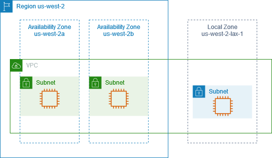
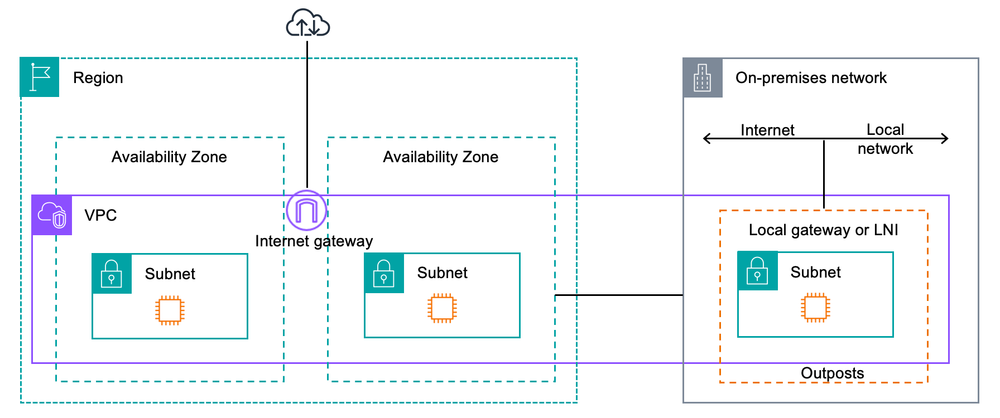
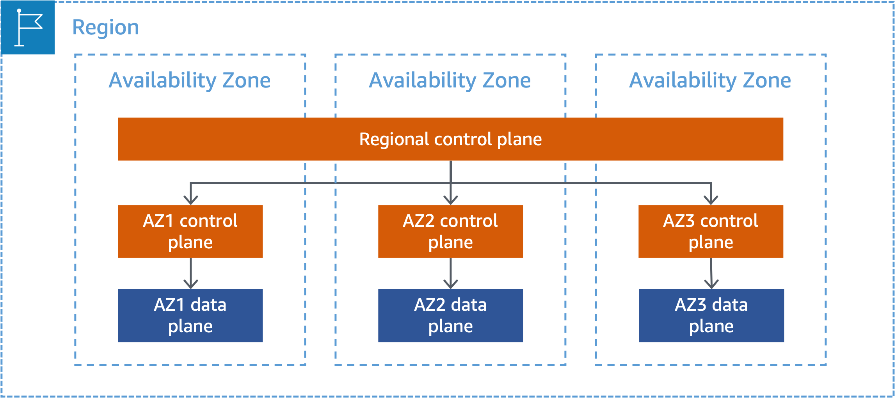
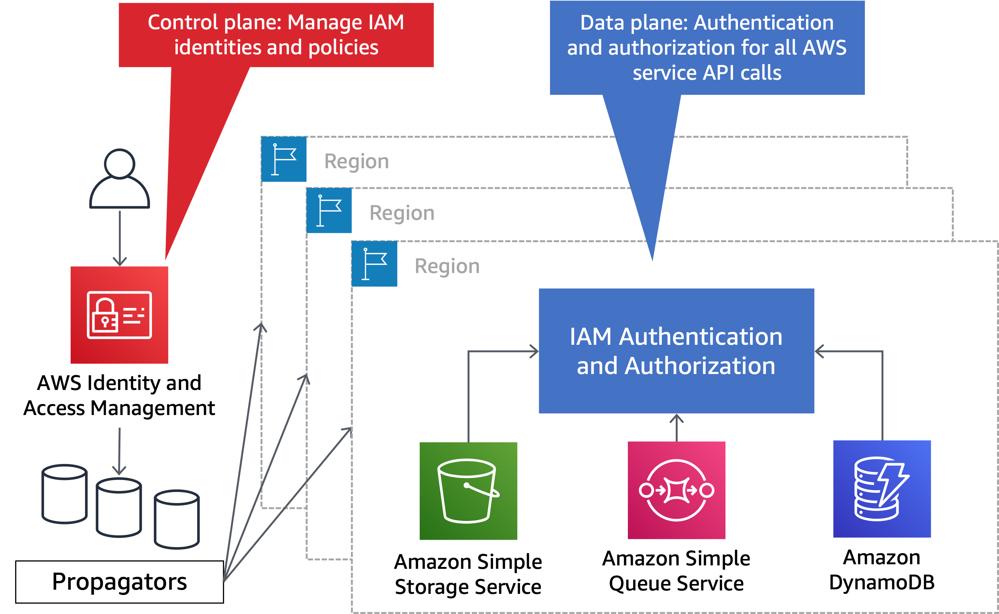

# Infra and Services

<!-- @import "[TOC]" {cmd="toc" depthFrom=1 depthTo=6 orderedList=false} -->

<!-- code_chunk_output -->

- [Infra and Services](#infra-and-services)
    - [Infra](#infra)
      - [1.fault isolation](#1fault-isolation)
        - [(1) AZ](#1-az)
        - [(2) Regions](#2-regions)
        - [(3) Partitions](#3-partitions)
        - [(4) Control planes and data planes](#4-control-planes-and-data-planes)
      - [2.Local zones vs AZ](#2local-zones-vs-az)
      - [3.outposts](#3outposts)
      - [4.Points of presence (global network edge locations)](#4points-of-presence-global-network-edge-locations)
    - [services](#services)
      - [1.zonal services](#1zonal-services)
      - [2.regional services](#2regional-services)
      - [3.global services](#3global-services)

<!-- /code_chunk_output -->

[xRef](https://docs.aws.amazon.com/whitepapers/latest/aws-fault-isolation-boundaries/abstract-and-introduction.html)

### Infra

#### 1.fault isolation

##### (1) AZ

##### (2) Regions

##### (3) Partitions

##### (4) Control planes and data planes

#### 2.Local zones vs AZ
* lcal zone (reduce latency)
    * No dedicated control plane; managed by the parent region
    * Compute, storage, networking (limited AWS services)
* AZ (provide redunancy)

* lax: Los Angeles International Airport (LAX) code

#### 3.outposts

#### 4.Points of presence (global network edge locations)
* to optimize performance, reduce latency, and improve network efficiency for its services
* services:
    * CloudFront (CDN)
    * Route 53 (DNS)
    * AWS Global Accelerator (AGA)

***

### services

#### 1.zonal services

* AZ control plane: control logic in the AZ
* regional control plane: control logic between AZs in the region
* local zones: No dedicated control plane; managed by the parent region

#### 2.regional services

#### 3.global services
* Some global AWS services exist in each partition
    * e.g. IAM has a single control plane and regionalized data plane
    
    * The following are partitional services and their control plane location in the aws partition:
        * AWS IAM (us-east-1)
        * AWS Organizations (us-east-1)
        * AWS Account Management (us-east-1)
        * Route 53 Application Recovery Controller (ARC) (us-west-2) - This service is only present in the aws partition    
        * AWS Network Manager (us-west-2)
        * Route 53 Private DNS (us-east-1)

