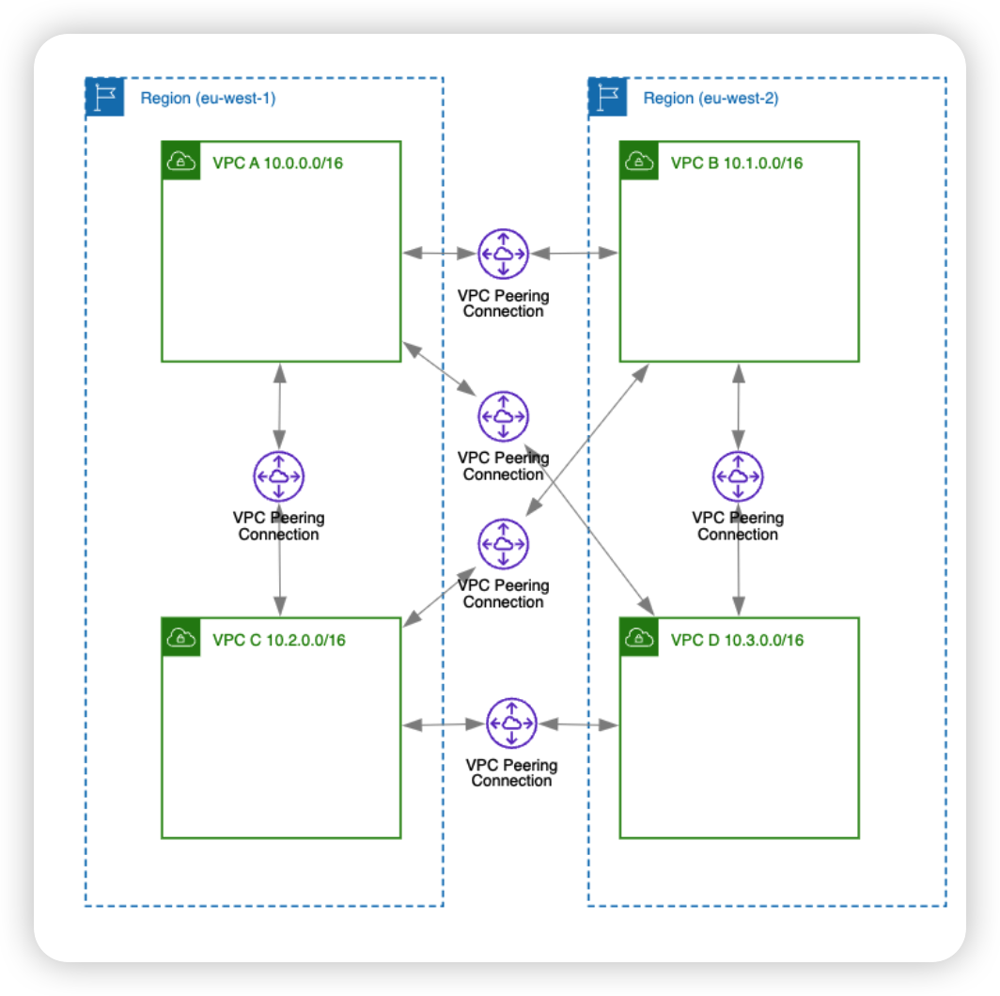
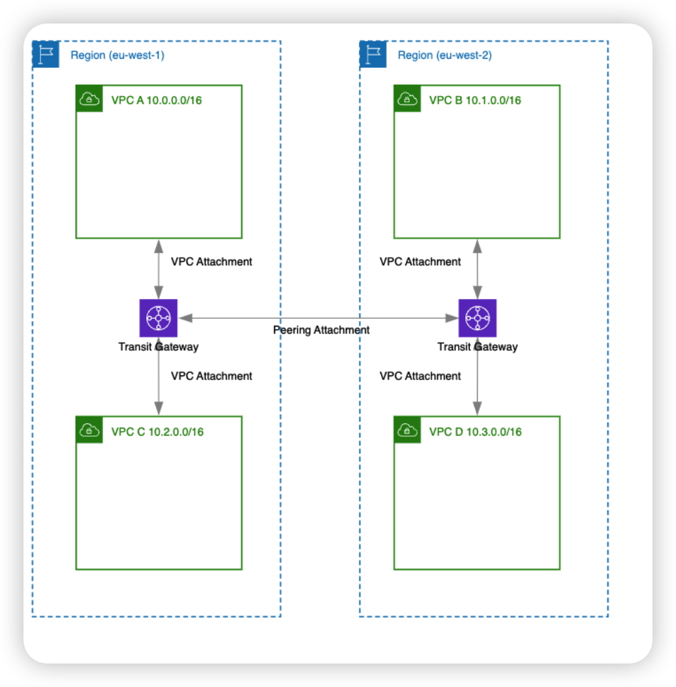
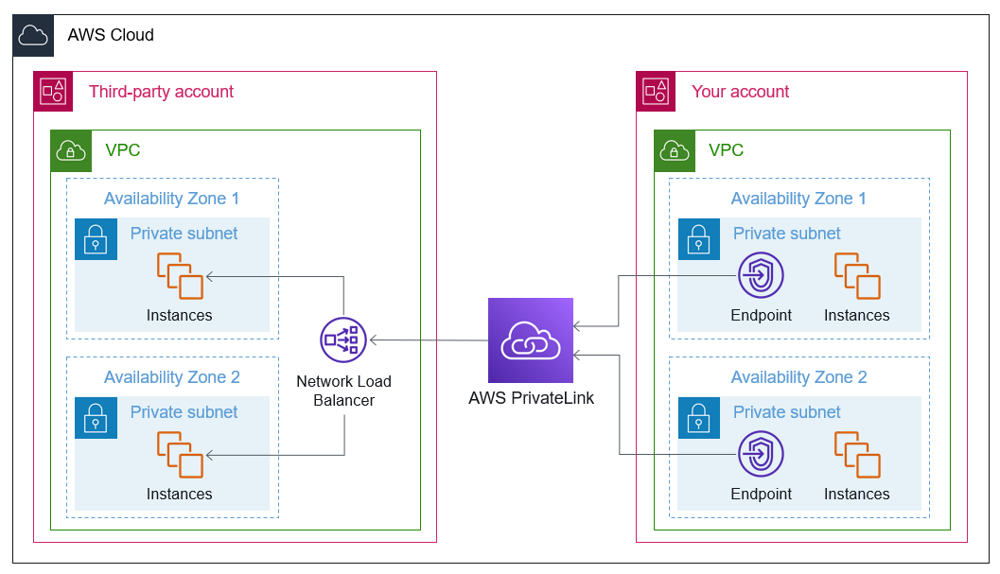

# VPC

<!-- @import "[TOC]" {cmd="toc" depthFrom=1 depthTo=6 orderedList=false} -->

<!-- code_chunk_output -->

- [VPC](#vpc)
    - [Overview](#overview)
      - [1.VPC peering](#1vpc-peering)
      - [2.Transit gateway](#2transit-gateway)
      - [3.PrivateLink (VPC endpoints)](#3privatelink-vpc-endpoints)
      - [4.Resource Access Manager (RAM)](#4resource-access-manager-ram)

<!-- /code_chunk_output -->

### Overview

#### 1.VPC peering
* 1-to-1 connection between two VPCs
* No overlapping IPs allowed

#### 2.Transit gateway
* You "attach" your VPCs to the Transit Gateway (TGW). The TGW handles the routing logic between them.
* No overlapping IPs allowed

#### 3.PrivateLink (VPC endpoints)
PrivateLink connects a Consumer to a specific Service
* VPC Endpoint: The "plug" you create in your VPC
* AWS PrivateLink: The "wiring" inside AWS that makes that plug work and keeps the traffic off the internet

#### 4.Resource Access Manager (RAM)

Share foundational infrastructure like Amazon VPC subnets **across accounts**, allowing multiple accounts to deploy application resources to the same subnet
