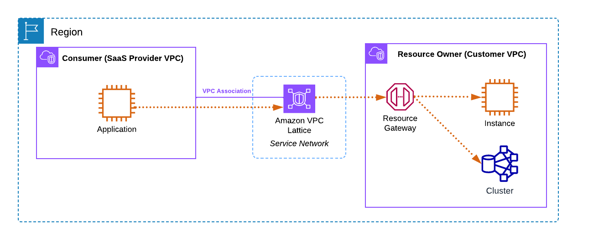

# VPC Connectivity

<!-- @import "[TOC]" {cmd="toc" depthFrom=1 depthTo=6 orderedList=false} -->

<!-- code_chunk_output -->

- [VPC Connectivity](#vpc-connectivity)
    - [Overview](#overview)
      - [1.VPC peering](#1vpc-peering)
      - [2.Transit gateway](#2transit-gateway)
      - [3.PrivateLink (VPC endpoints)](#3privatelink-vpc-endpoints)
        - [(1) Classic PrivateLink](#1-classic-privatelink)
        - [(2) VPC Lattice: Resource Gateway (L4 network endpoint)](#2-vpc-lattice-resource-gateway-l4-network-endpoint)
        - [(3) VPC Lattice: Service Network (L7 network endpoint)](#3-vpc-lattice-service-network-l7-network-endpoint)
      - [4.Resource Access Manager (RAM)](#4resource-access-manager-ram)

<!-- /code_chunk_output -->

### Overview

#### 1.VPC peering
* 1-to-1 connection between two VPCs
* No overlapping IPs allowed

#### 2.Transit gateway
* You "attach" your VPCs to the Transit Gateway (TGW). The TGW handles the routing logic between them.
* No overlapping IPs allowed

#### 3.PrivateLink (VPC endpoints)
PrivateLink connects a Consumer to a specific Service
* VPC Endpoint: The "plug" you create in your VPC
* AWS PrivateLink: The "wiring" inside AWS that makes that plug work and keeps the traffic off the internet

##### (1) Classic PrivateLink
* Endpoint Services: classic PrivateLink provider side
* Endpoints: classic PrivateLink consumer side

##### (2) VPC Lattice: Resource Gateway (L4 network endpoint) 
* Resource Gateways - The L4 network endpoints that facilitate connectivity
* Resources - The actual AWS resources being shared/accessed
* RAM (Resource Access Manager) - Enables secure sharing of resources across AWS accounts and organizations
* Endpoints: VPC Lattice consumer side

##### (3) VPC Lattice: Service Network (L7 network endpoint) 

#### 4.Resource Access Manager (RAM)

**AWS Resource Access Manager (RAM)** lets you share AWS resources across accounts or within an AWS Organization — without moving or duplicating them.

Common things you can share:
- VPC subnets (consumer deploys into your subnet)
- Transit Gateways (consumer attaches their VPC)
- VPC Lattice Resource Configurations (consumer gets a private endpoint to your RDS/service)
- Route 53 Resolver rules, Aurora clusters, and more