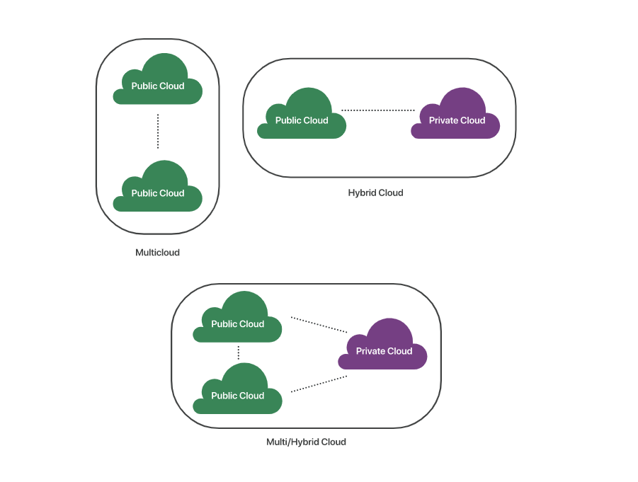

# overview

<!-- @import "[TOC]" {cmd="toc" depthFrom=1 depthTo=6 orderedList=false} -->
<!-- code_chunk_output -->

- [overview](#overview)
    - [概述](#概述)
      - [1.Cloud分类](#1cloud分类)
        - [（1）按照提供的服务分类](#1按照提供的服务分类)
        - [（2）按照部署的方式分类](#2按照部署的方式分类)
      - [2.hybrid cloud](#2hybrid-cloud)
        - [（1）混合云中可以包含哪些环境](#1混合云中可以包含哪些环境)
        - [（2）不同环境如何进行通信](#2不同环境如何进行通信)
      - [3.grid computing vs cloud computing](#3grid-computing-vs-cloud-computing)
      - [4.算力分为三个层次](#4算力分为三个层次)
      - [5.cloud network](#5cloud-network)
      - [6.cloud native](#6cloud-native)
        - [（1）核心特性](#1核心特性)

<!-- /code_chunk_output -->

### 概述

#### 1.Cloud分类

##### （1）按照提供的服务分类

|类型|说明|
|-|-|
|IaaS（infrastructure as a service）|提供基础设施，比如：存储、服务器等）|
|PaaS（platform as a service）|提供平台|
|SaaS（software as a service）|提供软件|
|FaaS（function as a service）|也称为serverless，也称为事件驱动计算，动态分配资源来运行单个功能（本质上是微服务）|

##### （2）按照部署的方式分类

|类型|说明|使用场景|
|-|-|-|
|public cloud|被多个组织共享的云环境|
|private cloud|给专门组织使用的云环境|
|VPC（virtual private cloud）|虚拟私有云，托管在公有云上的私有云（就是在公有云上实现**逻辑隔离**）|
|Hybrid cloud|混合云，多种云的混合并紧密联系在一起（比如私有云和共有混合）|1.私有云提供某些服务，公有云提供某些服务 2.公有云作为私有云的备份 3.用公有云处理高需要时段，大多数操作保留在私有云中|
|multicloud|多云，使用多个公有云环境|
|专有云|私有化部署的公有云|

* 混合云与多云的区别

#### 2.hybrid cloud

##### （1）混合云中可以包含哪些环境
* public cloud
* on-premises private cloud（本地私有云）
* hosted private cloud（托管私有云，即VPC）
* on-premises（legacy，部署采用云技术的方式）

##### （2）不同环境如何进行通信
* API
* VPN
* WAN

#### 3.grid computing vs cloud computing
|criteria|grid computing|cloud computing|
|-|-|-|
|目的|大规模的计算|降低成本，增加回报|
|管理|分散管理系统|集中管理系统（所有主机都由提供商进行集中管理）|
|访问|通过grid中间件|通过web协议|
|计算|提供最大计算能力|按需提供计算能力|
|虚拟化|数据和计算资源的虚拟化|硬件和软件平台的虚拟化|
|使用|面向应用|面向服务|

* grid computing

* cloud computing

#### 4.算力分为三个层次
* central cloud（中心云）
* edge cloud（边缘云）
* terminals（端）

#### 5.cloud network

* DCN（data center network）
一个数据中心内的网络，用于连接该数据中心内的所有资源
* DCI（data center interconnect）
连接多个数据中心的网络
* ECN（external conenection network）
将外部的一些网络（比如某个企业的网络）接入到我们的云
* EIN（edge interconnection network）
连接各个边缘云和中心云的网络

#### 6.cloud native

是一种 基于云特性 的 软件开发和部署的方法

[参考](https://docs.microsoft.com/en-us/dotnet/architecture/cloud-native/definition#modern-design)

##### （1）核心特性
* 弹性
* 高可用
* 自动化
* 自愈性
* 可观测性