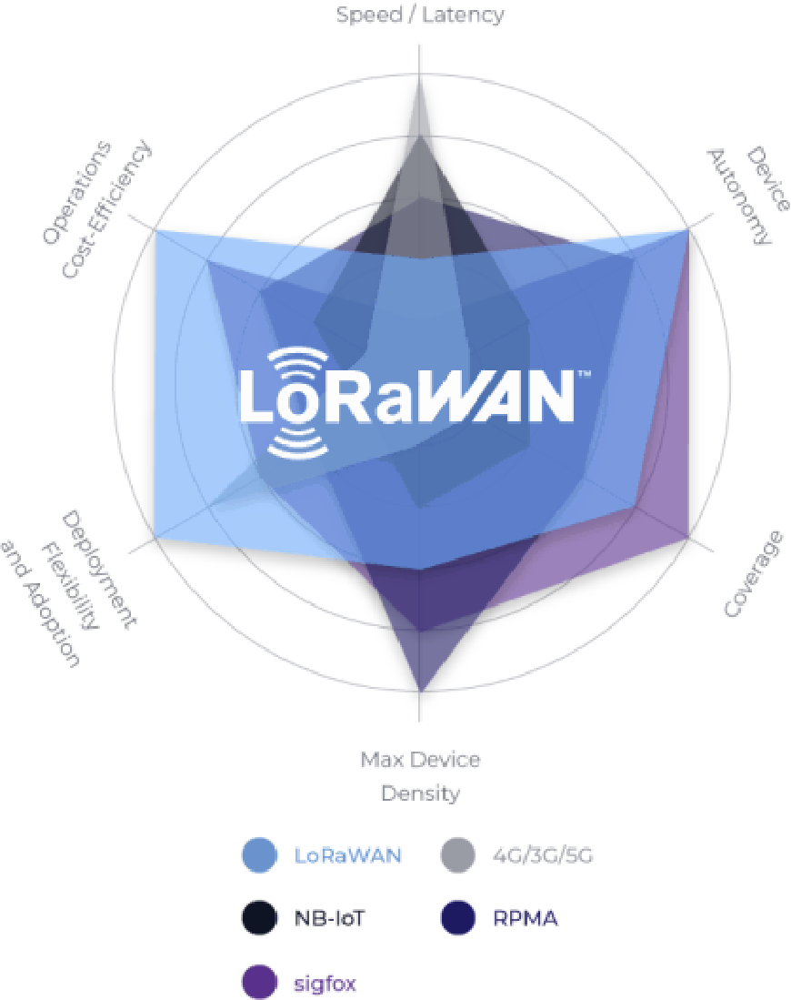
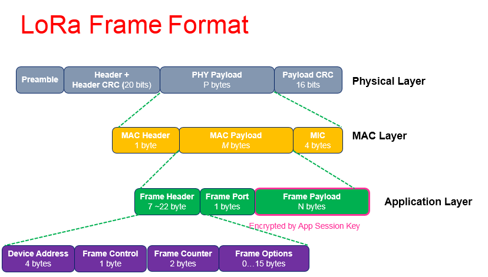
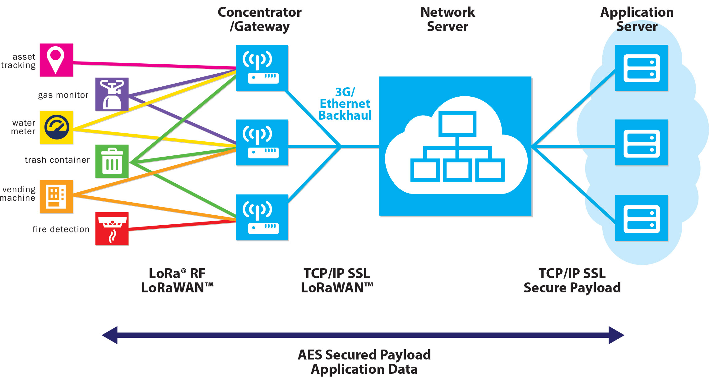

# LoRa

<!-- @import "[TOC]" {cmd="toc" depthFrom=1 depthTo=6 orderedList=false} -->
<!-- code_chunk_output -->

- [LoRa](#lora)
    - [Introduction](#introduction)
      - [1.Terms](#1terms)
      - [2.LoRaWAN](#2lorawan)
        - [(1) why LoRaWAM](#1-why-lorawam)
        - [(2) LoRa frame format](#2-lora-frame-format)
      - [3.LoRa network architecture](#3lora-network-architecture)
        - [(1) end devices](#1-end-devices)
        - [(2) gateways](#2-gateways)
        - [(3) network server](#3-network-server)
    - [data exchange](#data-exchange)
      - [1.introduction](#1introduction)
      - [1.message type](#1message-type)
        - [(1) updf](#1-updf)
        - [(2) upinfo](#2-upinfo)
        - [(3) dndf format](#3-dndf-format)
        - [(4) dntxed](#4-dntxed)
        - [(5) dnacked](#5-dnacked)
        - [(6) joining](#6-joining)
        - [(7) joined](#7-joined)

<!-- /code_chunk_output -->

### Introduction

#### 1.Terms

|term|description|
|-|-|
|LoRa(long range)|a wireless modulation technique|
|LoRaWAN|a MAC layer protocol for wide area networks|
|EUI|Extended Unique Identifier|

#### 2.LoRaWAN
* It is designed to allow low-powered devices to communicate with Internet-connected applications over long range **wireless connections**
* LoRaWAN can be mapped to the **second and third layer** of the OSI model
* LoRaWAN is suitable for transmitting small size payloads (like sensor data) over long distances


##### (1) why LoRaWAM

* low power
* long range
* high capacity - a LoRaWAN network server can handle millions of messages from thousands of gateways
* security and robustness
* low cost

##### (2) LoRa frame format


#### 3.LoRa network architecture




* end devices send LoRa frame to LoRa gateway through a specific radio frequency
* LoRa gateways send LoRa frame to LoRa network server through tcp/ip network
* LoRa network servers send LoRa Application layer to application server through tcp/ip network  

##### (1) end devices
* A LoRaWAN end device can be a sensor, an actuator, or both
* They are often battery operated
* These end devices are wirelessly connected to the LoRaWAN network through gateways using LoRa RF modulation

##### (2) gateways

* types of gateways

|type|description|application|
|-|-|-|
|indoor gateways|provide coverage in difficult-to-reach indoor locations|deployment places like homes, businesses and buildings|
|outdoor gateways|suitable for providing coverage in rural, urban, and dense urban areas|deployment places like cellular towers, the rooftops of very tall buildings, metal pipes (masts) etc|

##### (3) network server
manage the entire LoRaWAN network, main functions:
* activate end devices
* message routing
  * forward uplink data(application payloads) to application servers
  * forward downlink data to end devices

***

### data exchange

#### 1.introduction
* messages are saved into the database for a certain amount of time
* all uptream messages have a upid which is strictly increasing over time in a TCIO instance

Each TCIO instance further maintains a transient read pointer. If an application
connects to a TCIO instance for the first time, it will be forwarded all upstream messages stored in the database beginning with the oldest one. Once
all stored messages have been processed, new message will be forwarded to the application as received without further delay. Each message
forwarded increases the read pointer accordingly.

#### 1.message type

|msgtype|description|content|
|-|-|-|
|updf|upstream data frame|report an upstream message with its up data frame payload|
|upinfo|upstream info|report additional context information about an up data frame(an upinfo can be linked to its corresponding updf via SessID and FCntUp)|
|dndf|downstream data frame|submit a downstream message for transmitting data to a device|
|dntxed|downtream transmitted|report successful transmition of a down data frame|
|dnacked|downstream acknowledged|report acknowledgement of reception of a given down data frame by a deivce|
|joining||signal that a device initiated an over-the-air activation(OTAA) to the network|
|joined||signal that a device completed an over-the-air activation(OTAA)|


##### (1) updf
```go
{
  "msgtype": "updf"
  "DevEui": EUI64 // device identifier
  "upid": INT8 // unique message identifier
  "SessID": INT4 // session identifier (0=ABP, >0 OTAA join sessions)
  "FCntUp": UINT4 // frame counter used by the device
  "FPort": UINT1 // port number
  "FRMPayload": HEX* // up data frame payload (may be empty)
  "DR" int // data rate the message was sent with
  "Freq" int // frequency the message was sent with
  "region" str // region specifier
}
```

##### (2) upinfo
```go
{
  "msgtype": "upinfo"
  "DevEui": EUI64 // device identifier
  "upid": INT8 // unique message identifier
  "SessID": INT4 // session identifier
  "FCntUp": UINT4 // frame counter used by the device
  "FPort": UINT1 // port number
  "FRMPayload": HEX* // up data frame payload (may be empty)
  "DR" int // data rate the message was sent with
  "Freq" int // frequency the message was sent with
  "region" str // region specifier
  "upinfo": [ UOBJ, .. ]
}

UOBJ = {
  "routerid": INT8 // identifier of the router having received the frame
  "muxid": INT8 // internal routing information
  "rssi": float // signal strength
  "snr": float // signal to noise ratio
  "ArrTime": float // arrival time stamp in the de-mux fabric
}
```

##### (3) dndf format
each downstream message must be identified by a globally unique id(MsgId)
```go
{
  "msgtype": "dndf"
  "MsgId": "INT8"  //
  "FPort": UINT1 // port number on the device
  "FRMPayload": HEX* // down data frame payload (may be empty)
  "DevEui": EUI64 // identity of the device
  "confirm": bool // confirmed down data frame?
}
```


##### (4) dntxed
```go
{
  "msgtype": "dntxed"
  "MsgId": INT8   //the MsgId links the message to the corresponding dndf
  "upinfo": {
    "routerid": INT8 // identifier of the router which sent the down frame
  }
  "confirm": bool // confirmed down data frame?
  "DevEUI": EUI64 // device EUI-64
}
```

##### (5) dnacked
```go
{
  "msgtype": "dnacked"
  "MsgId": INT8  //the MsgId links the message to the corresponding dndf
}
```

##### (6) joining
```go
{
  "msgtype": "joining"
  "SessID": UINT4 // unique session identifier per device
  "NetID": UINT4 // LoRaWAN network identifier
  "DevEui": EUI64 // device identifier
  "DR" int // data rate the message was sent with
  "Freq" int // frequency the message was sent with
  "region" str // region specifier
  "upinfo": [ UOBJ, .. ] // see `updf` for details
}
```

##### (7) joined
```go
{
  "msgtype": "joined"
  "SessID": UINT4 // unique session identifier per device
  "NetID": UINT4 // LoRaWAN network identifier
  "DevEui": EUI64 // device identifier
}

```
