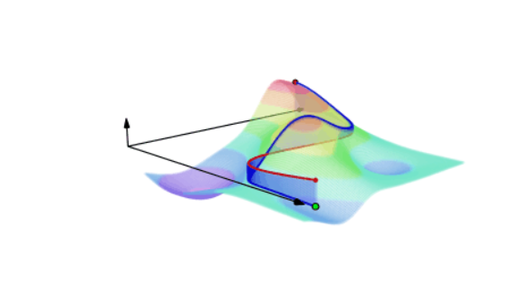
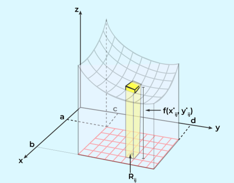
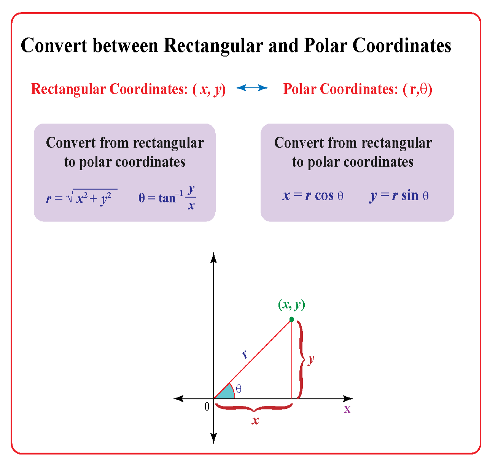
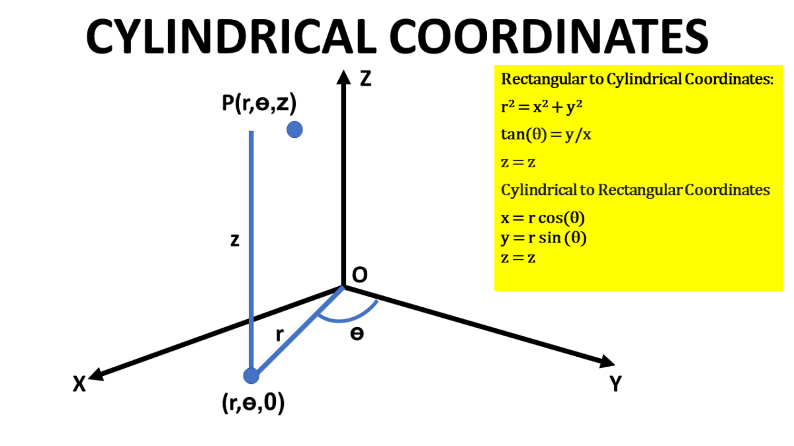
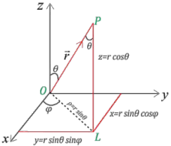
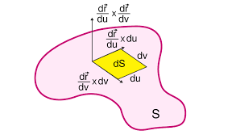
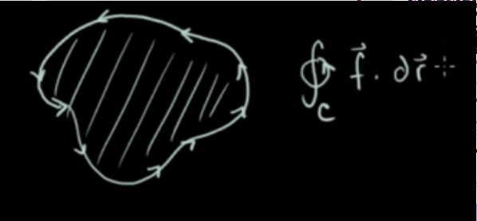

# integration

<!-- @import "[TOC]" {cmd="toc" depthFrom=1 depthTo=6 orderedList=false} -->

<!-- code_chunk_output -->

- [integration](#integration)
    - [overview](#overview)
      - [1.why need parameterization](#1why-need-parameterization)
      - [2.line integrals for scalar functions](#2line-integrals-for-scalar-functions)
      - [3.line integrals in vector fields](#3line-integrals-in-vector-fields)
        - [(1) path independence](#1-path-independence)
      - [4.double integrals](#4double-integrals)
      - [5.other coordinates](#5other-coordinates)
        - [(1) polar coordinates](#1-polar-coordinates)
        - [(2) cylindrical coordinates](#2-cylindrical-coordinates)
        - [(3) sphere coordinates](#3-sphere-coordinates)
      - [6.triple integrals](#6triple-integrals)
      - [7.surface integrals](#7surface-integrals)
        - [(1) 举例](#1-举例)
      - [8.flux](#8flux)
      - [9.Green's theorem](#9greens-theorem)
      - [10.2D divergence theorem](#102d-divergence-theorem)
      - [11.stakes theorem](#11stakes-theorem)

<!-- /code_chunk_output -->

### overview

#### 1.why need parameterization
减少变量数，方便表示和计算，比如有一些取线无法用一个函数表示，用parameterization更方便表示
* 对于linear integreal，使用一个参数
* 对于double integral，使用两个参数

* 比如求 linear integral
    * 已知:
        * $y=2x, 0\le x\le 1$
        * 求$\int_c(x+y)ds$
    * 使用parameterization方法
        * $x(t)=t$
        * $y(t)=2t$
        * $\int_0^13t\sqrt{x'(t)^2+y'(t)^2}dt=\int_0^13t\sqrt 5dt=\frac{3\sqrt 5}{2}$
    * 直接求解（当linear比较复杂时，这种方法就比较复杂）
        * $\int_0^1(x+y)\sqrt{dx+dy}=\int_0^13x\sqrt{dx^2+4dx^2}=\int_0^13x\sqrt 5dx=\frac{3\sqrt 5}{2}$

#### 2.line integrals for scalar functions

* 已知
    * $x=g(t)$
    * $y=h(t)$
    * $a\le t \le b$
* 则
    *  $\int_{t=a}^{t=b}f(x,y)ds=\int_{t=a}^{t=b}f(x,y)\sqrt{dx^2+dy^2}=\int_{t=a}^{t=b}f(x,y)\sqrt{(\frac{dx}{dt})^2+(\frac{dy}{dt})^2}dt$

#### 3.line integrals in vector fields

* 已知
    * c (curve，位置函数):
        * $r(t)=x(t)\vec i+y(t)\vec j$
        * $a\le t \le b$
    * 再各个位置所受的力
        * $\vec f(x,y)$
    * 求做的功
* work $=\int_c\vec f\cdot d\vec r=\int_c\vec f \cdot (x'(t)dt\ \vec i+y'(t)dt\ \vec j)$

##### (1) path independence
* if $\vec f=\nabla F$
* then $\int_c\vec f\cdot d\vec r=F(b)-F(a)$
* 即path indepenence: $c_1$和$c_2$起点和终点一样的，但是路线不一样，最终做的功是一样的，与路线无关:
    * $\int_{c_1}\vec f\cdot d\vec r=\int_{c_2}\vec f\cdot d\vec r$

* 判断$\vec f(x,y)=P(x,y)\vec i+Q(x,y)\vec j$是否存在F:
    * $P_y=Q_x$，则存在F

#### 4.double integrals

* $\int_c^d\int_{a}^{b}f(x,y)dxdy=\int_a^b\int_{c}^{d}f(x,y)dydx$
    * 也可以写成: $\int\int_D f(x,y)dA$

#### 5.other coordinates

##### (1) polar coordinates

* 表示: $(\theta, r)$

* cartesian coordinates 和 polar coordinates 之前的转换关系

##### (2) cylindrical coordinates

##### (3) sphere coordinates 

#### 6.triple integrals

* 已知
    * 密度函数: $p(x,y,z)$，在各个位置的密度
    * 求物体的质量
* $\int P(x,y,z)dV=\int_{a_3}^{b_3}\int_{a_2}^{b_2}\int_{a_1}^{b_1} P(x,y,z)dzdydx$

#### 7.surface integrals
* 存在 $\vec r(s,t)=x(s,t)\vec i+y(s,t)\vec j +z(s,t)\vec k$

* surface integral: $\int\int\limits_S dS=\int\int\limits_A|\frac{\partial \vec r}{\partial s}\times\frac{\partial \vec r}{\partial t}|dsdt$
    * 

##### (1) 举例
* 例一：
    * 求$x^2+y^2+z^2=1$的surface integrals
    * 首先进行parameterization
        * $x=\cos t\cos s$
        * $y=\cos t\sin s$
        * $z=\sin t$
        * $\vec r=\cos t\cos s\ \vec i+\cos t\sin s\ \vec j+\sin t\ \vec k$
            * $0\le s\le2\pi$, $-\frac{\pi}{2}\le t\le \frac{\pi}{2}$

* 例二：
    * $x+y^2-z=0, 0\le x\le 1,0\le y\le 2$
    * 首先进行parameterization
        * $x=u$
        * $y=v$
        * $z=u+v^2$
        * $\vec r=u\vec i+v\vec j+u+v^2\vec k$
            * $0\le u\le 1,0\le v\le 2$

#### 8.flux

* flux in 2d
    * $\int_c\vec F\cdot d\vec s=\int_c\vec F\cdot \vec n ds$
        * $\vec n$: 单位法向量，与s (s表示弧长)的切线垂直
* flux in 3d
    * $\int\int\limits_{S}\vec F\cdot d\vec S=\int\int\limits_{S}\vec F\cdot\vec ndS$
        * $\vec n$: 单位法向量，与该点的切面垂直

#### 9.Green's theorem

relates a line integral around a simple closed curve C to a double integral over the plane region D bounded by C

* 已知
    * $\vec f(x,y)=P(x,y)\vec i+Q(x,y)\vec j$
    * $d\vec r=dx\vec i+dy\vec j$

* $\oint_c\vec f\cdot d\vec r=\int\int\limits_R(\frac{\partial Q}{\partial x}-\frac{\partial P}{\partial y})dxdy$

* if $\vec f$ is conservative, then $\oint_c\vec f\cdot d\vec r=0$
    * so $\frac{\partial Q}{\partial x}=\frac{\partial P}{\partial y}$

#### 10.2D divergence theorem
* 已知:
    * $\vec F=P(x,y)\vec i+Q(x,y)\vec j$
* $\oint_c\vec  F\cdot d\vec s=\oint_c\vec  F\cdot\vec nds=\oint_c \vec F\cdot\frac{dy\vec i-dx\vec j}{ds}ds=\oint_cP(x,y)dy-Q(x,y)dx=\int\int\limits_R(\frac{\partial P}{\partial x}+\frac{\partial Q}{\partial y})dxdy=\int\int\limits_R \text {div}\vec F \cdot d\vec s$
    * $\vec n$: outward单位法向量，与s (s表示弧长)的切线垂直
    * $\oint_cP(x,y)dy-Q(x,y)dx=\int\int\limits_R(\frac{\partial P}{\partial x}+\frac{\partial Q}{\partial y})dxdy$

#### 11.stakes theorem
* 已知:
    * $\vec F=P(x,y)\vec i+Q(x,y)\vec j$
* $\oint_c\vec F\cdot d\vec r=\int\int\limits_S (\text {curl}\vec F \cdot \vec n)dS=\int\int\limits_S \text {curl}\vec F \cdot d\vec S=\int\int\limits_R(\frac{\partial Q}{\partial x}-\frac{\partial P}{\partial y})dxdy$
    * $\vec n$: 单位法向量，与S平面垂直
    * oriented positively： 头的方向与$\vec n$一样，绕着曲线c走，曲面的中心在左手边
    * 如果是oriented negtively: $\oint_c\vec F\cdot d\vec r=-\int\int\limits_S (\text {curl}\vec F \cdot \vec n)dS$