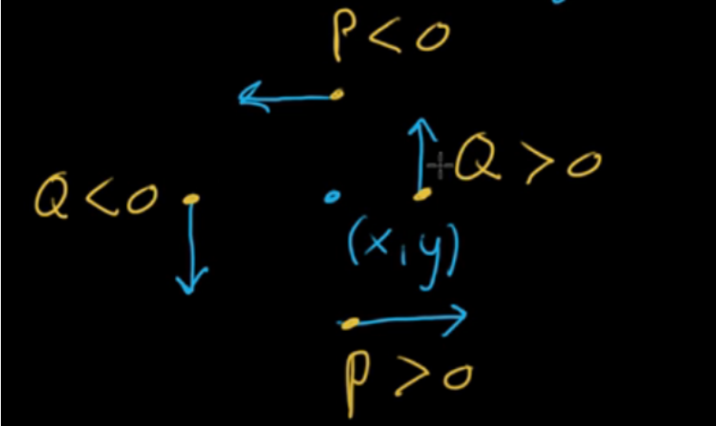
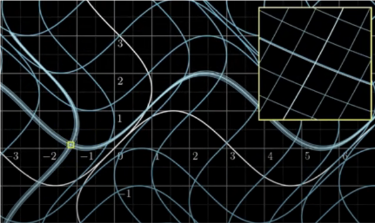
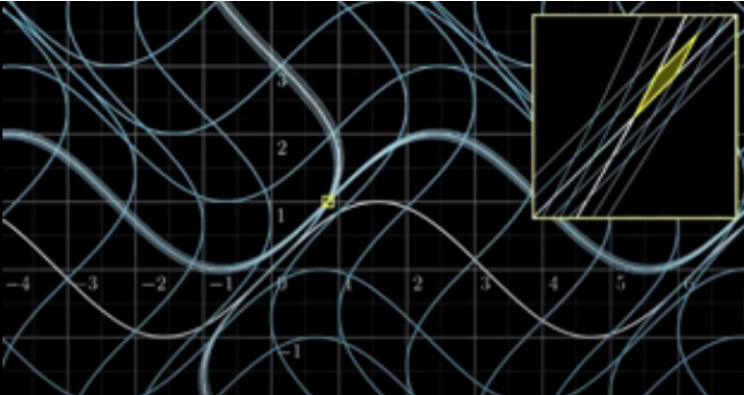

# multivariable calculus

<!-- @import "[TOC]" {cmd="toc" depthFrom=1 depthTo=6 orderedList=false} -->

<!-- code_chunk_output -->

- [multivariable calculus](#multivariable-calculus)
    - [符号规范](#符号规范)
    - [overview](#overview)
      - [1.理解multivariable](#1理解multivariable)
        - [(1) contour plots](#1-contour-plots)
        - [(2) vector field](#2-vector-field)
        - [(3) function is transformation](#3-function-is-transformation)
      - [2.partial derivatives](#2partial-derivatives)
        - [(1) 性质](#1-性质)
        - [(2) gradient](#2-gradient)
        - [(3) why gradient is the direction of steepest ascent](#3-why-gradient-is-the-direction-of-steepest-ascent)
      - [3.directional derivative](#3directional-derivative)
        - [(1) slope](#1-slope)
      - [4.parametric curve](#4parametric-curve)
        - [(1) parametric equation](#1-parametric-equation)
        - [(2) vector-valued functions](#2-vector-valued-functions)
      - [5.multivariable chain rule](#5multivariable-chain-rule)
      - [6.curvature](#6curvature)
        - [(1) curvature of circle](#1-curvature-of-circle)
      - [7.divergence](#7divergence)
      - [8.curl](#8curl)
        - [(1) 2d-curl](#1-2d-curl)
        - [(2) 3d-curl](#2-3d-curl)
      - [6.Laplacian](#6laplacian)
        - [(1) harmonic function](#1-harmonic-function)
      - [7.Jacobian](#7jacobian)
        - [(1) Jacobian matrix](#1-jacobian-matrix)
        - [(2) Jacobian determinant](#2-jacobian-determinant)
        - [(3) 应用: Change of Variables](#3-应用-change-of-variables)

<!-- /code_chunk_output -->

### 符号规范

* $S$: surface
* $R$: Region in a plane (or space)，比如一个surface在xy平面上的映射可以用R表示
* $s$: arc length，用于parameterize curves $\vec r$
* $r$: 一般用$\vec r$描述一个curve

***

### overview

#### 1.理解multivariable

##### (1) contour plots

* 越密集，表示越陡峭（即斜率的绝对值越大）
* The gradient is **perpendicular** to contour lines
    * 简单理解：
        * 因为coutour line与该点的graident是垂直的，所以coutour line的值不会改变（因为同一条countour line值都是相等的）
    * 推导:
        * $f(x,y)=C$
            * $\nabla f=\begin{bmatrix} \frac{\partial f}{\partial x}\\\\\frac{\partial f}{\partial y}\end{bmatrix}$
            * tangent vector: $\begin{bmatrix} dx\\ dy\end{bmatrix}$
        * $\frac{f}{dx}=\frac{\partial f}{\partial x}+\frac{\partial f}{\partial y}\frac{dy}{dx}=0$
            * $\therefore \nabla f\cdot \text {tangent vector}=0$

##### (2) vector field

* 箭头的长短，表示该点vector的大小

##### (3) function is transformation

#### 2.partial derivatives
* $\frac{\partial}{\partial x}f(a,b)=\underset{h \to 0}{\lim}\frac{f(a+h,b)-f(a,b)}{h}$
    * $\frac{\partial f}{\partial x}$ 描述：在某一点，当其他变量固定，函数f如何随x而变化的

##### (1) 性质
* 当$f,x,y$是连续的，则
    * $\frac{\partial}{\partial y}\frac{\partial f}{\partial x} = \frac{\partial}{\partial x}\frac{\partial f}{\partial y}$

##### (2) gradient

* $\nabla f=\begin{bmatrix} \frac{\partial f}{\partial x}\\\\\frac{\partial f}{\partial y}\\...\end{bmatrix}$
* $\nabla f$是一个向量
    * direction: direction of steepest ascent
    * length: steepness of of that direction of steepest ascent
        * 以$f(x,y)$为例，$\nabla f(x,y)$表示，怎么沿着x,y方向行走，才能到达最高点

##### (3) why gradient is the direction of steepest ascent
* $\underset{||\vec v=1||}{\max}\vec v \cdot \nabla f(\vec a)$
    * $\because \vec a\cdot\vec b=|\vec a||\vec b|\cos\theta$
    * 所以当$\vec v$和$\nabla f(\vec a)$方向一致时，值最大

#### 3.directional derivative

* $\nabla_{\vec v}f(\vec a)=\underset{h \to 0}{\lim}\frac{f(\vec a+h\vec v)-f(\vec a)}{h}$
    * $\nabla_{\vec v}f$ 描述：在某一点，当其他变量固定，函数f如何随$\vec v$而变化的（注意与slope区分）

* $\nabla_{\vec v}f(x,y)=\frac{\partial f}{\partial \vec v}=v_1\frac{\partial f}{\partial x}+v_2\frac{\partial f}{\partial y}=\vec v \cdot \nabla f$
    * $\vec v=(v_1,v_2)$

##### (1) slope

* slope $=\frac{\nabla_{\vec v}f}{||\vec v||}$

#### 4.parametric curve

##### (1) parametric equation
输出多个数值，且输出之间是相互独立的（没有直接关联），都取决于输入的参数，比如:
* x=f(t), y=g(t)
    * t就是parameter，x和y就是输出

##### (2) vector-valued functions
* parametric equation:
    * $x=x(t), y=y(t)$
* 对应的vector-valued function:
    * $\vec r(t)=x(t)\vec i+y(t)\vec j$
        * $\vec i,\vec j$分别是x,y轴上的单位向量

* differentiation
    * $\vec r\ '(t)=x'(t)\vec i+y'(t)\vec j$
        * 理解：向量表示速度
            * 向量的方向表示运动的方向
            * 向量的大小表示速度大小

#### 5.multivariable chain rule

* $\frac{d}{dt}f(\vec v(t))=\nabla f(\vec v(t))\cdot \vec v\ '(t)$
    * 可以理解为f关于$\vec v\ '(t)$的directional dirivative

#### 6.curvature
弧长的变化，引起切线方向的变化

* $\kappa=||\frac{d\vec T}{d\vec S}||=\frac{||\frac{d\vec T}{dt}||}{||\frac{d\vec S}{dt}||}$
    * 因为只关注方向的变化，所以需要对切线进行normalization: $\vec T(t)=\frac{\vec S\ '(t)}{||\vec S\ '(t)||}$

* $\vec S(t)=\begin{bmatrix}x(t)\\y(t)\end{bmatrix}$
    * $\kappa=\frac{x'(t)y''(t)-y'(t)x''(t)}{(x'(t)^2+y'(t)^2)^{\frac{3}{2}}}$
        * 公式分析：
            * $||\frac{d\vec T}{dt}||=\frac{\vec S'(t)}{||\vec S'(t)||} \times \frac{\vec S''(t)}{||\vec S'(t)||}$
                * 描述切线和切线变化形成的平行四边形面积
            * $||\frac{d\vec S}{dt}||=||\vec S'(t)||$
            * 所以 $\kappa = \frac{\vec S'(t)\times \vec S''(t)}{||\vec S'(t)||^3}$

* 根据计算结果，能够得到其curvature是半径为$\frac{1}{\kappa}$的圆的curvature

##### (1) curvature of circle

$\kappa = \frac{1}{R}$
* R是圆的半径

#### 7.divergence

* 存在$\vec V(x,y)=\begin{bmatrix}P(x,y)\\Q(x,y)\end{bmatrix}$
    * $\text {div}\vec V(x,y)=\frac{\partial P}{\partial x}+\frac{\partial Q}{\partial y}$
        * 可以写作：$\nabla\cdot\vec V$

* 含义
    * div > 0: 流出的>流入的
    * div = 0: 流出的=流入的
    * div < 0: 流出的<流入的

#### 8.curl

##### (1) 2d-curl

* 存在$\vec V(x,y)=\begin{bmatrix}P(x,y)\\Q(x,y)\end{bmatrix}$
    * $\text {2d-curl}\vec V(x,y)=\frac{\partial Q}{\partial x}+\frac{\partial P}{\partial y}$
        * 可以写作：$\nabla\times\vec V$

* 含义
    * 2d-curl > 0: 逆时针流动
    * 2d-curl = 0: 没有圈
    * 2d-curl < 0: 顺时针流动

##### (2) 3d-curl

* 每个点使用向量描述其curl
    * 向量的方向 描述 旋转的轴（通过右手法则能够判断出旋转的方向）
    * 向量的大小 描述 旋转的速度

* 存在$\vec V(x,y,z)=\begin{bmatrix}P(x,y,z)\\Q(x,y,z)\\R(x,y,z)\end{bmatrix}$
    * $\text {curl}\vec V(x,y,z)=\begin{bmatrix}\frac{\partial}{\partial x}\\ \\ \frac{\partial}{\partial y}\\ \\ \frac{\partial}{\partial z}\end{bmatrix}\times\begin{bmatrix}P\\Q\\R\end{bmatrix}=\begin{bmatrix}\frac{\partial R}{\partial y}-\frac{\partial Q}{\partial z}\\ \\ \frac{\partial P}{\partial z}-\frac{\partial R}{\partial x}\\ \\ \frac{\partial Q}{\partial x}-\frac{\partial P}{\partial y}\end{bmatrix}$
        * 可以写作：$\nabla\times\vec V$
        * 每一项都是2d-curl，比如：$\frac{\partial R}{\partial y}-\frac{\partial Q}{\partial z}$ 就是yz平面的curl

#### 6.Laplacian

$\Delta f=\text {div(grad f)}=\nabla\cdot\nabla f=\sum\limits_{i=1}^N\frac{\partial^2 f}{\partial x_i^2}$
* 当$\Delta f<0$时，表示有一个局部高点
* 当$\Delta f>0$时，表示有一个局部低点

##### (1) harmonic function

$\Delta f\equiv 0$
* 在各个点都为0
* 表示各个点，周边都有上升和下降，不能找到一个局部高点和局部低点

#### 7.Jacobian

##### (1) Jacobian matrix

* $f(x,y)=\begin{bmatrix}f_1(x,y)\\f_2(x,y)\end{bmatrix}$
* Jacobian matrix: $\begin{bmatrix}\frac{\partial f_1}{\partial x} & \frac{\partial f_1}{\partial y}\\ \\ \frac{\partial f_2}{\partial x} & \frac{\partial f_2}{y}\end{bmatrix}$
* 对于一个点(x,y)，进行函数变换（非线性的），在很小的范围内可以近似看成线性变换，用Jacobian matrix描述该线性变化（即(x,y)变化一点，经过函数变换，变化可以看成是线性变换）
    * 

##### (2) Jacobian determinant
* (x,y)在很小范围内变化，函数变换后，该很小范围的空间变化程度（参考matrix determinant）
    * 

##### (3) 应用: Change of Variables

transform coordinates from one system to another
* 若
    * $S=\int\int_D24x^2+12y^2dxdy$
    * $x=X_1(u,v)=\frac{u}{4}$
    * $y=X_2(u,v)=\frac{v}{3}$

* 则
    * $\int\int_Df(x,y)dA=\int\int_Rf(X_1(u,v),X_2(u,v))|J(\vec X)|dudv = \int\int_R\frac{u^2}{8}+\frac{v^2}{9}dudv$