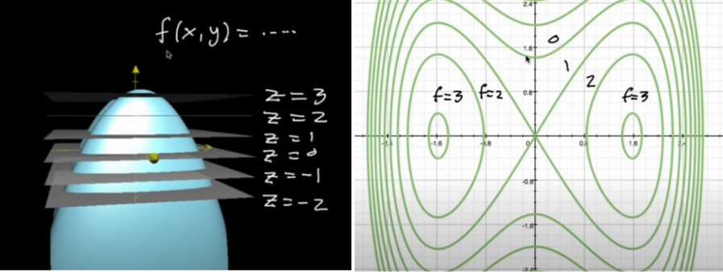
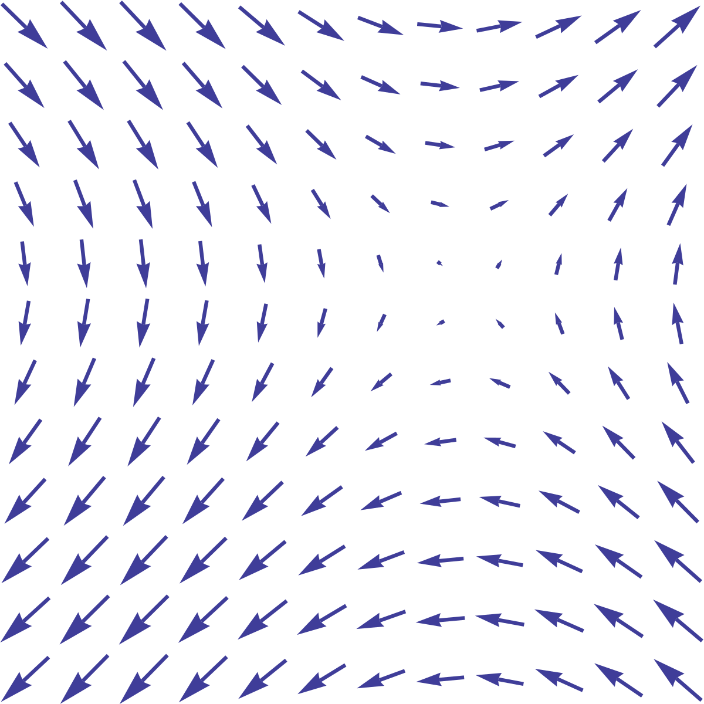

# multivariable calculus

<!-- @import "[TOC]" {cmd="toc" depthFrom=1 depthTo=6 orderedList=false} -->

<!-- code_chunk_output -->

- [multivariable calculus](#multivariable-calculus)
    - [overview](#overview)
      - [1.理解multivariable](#1理解multivariable)
        - [(1) contour plots](#1-contour-plots)
        - [(2) parametric equation](#2-parametric-equation)
        - [(3) vector field](#3-vector-field)
        - [(4) function is transformation](#4-function-is-transformation)
      - [2.partial derivatives](#2partial-derivatives)
        - [(1) 性质](#1-性质)
        - [(2) gradient](#2-gradient)
        - [(3) directional derivative](#3-directional-derivative)

<!-- /code_chunk_output -->

### overview

#### 1.理解multivariable

##### (1) contour plots

* 越密集，表示越陡峭（即斜率的绝对值越大）

##### (2) parametric equation
输出多个数值，且输出之间是相互独立的（没有直接关联），都取决于输入的参数，比如:
* x=f(t), y=g(t)
    * t就是parameter，x和y就是输出

##### (3) vector field

* 箭头的长短，表示该点vector的大小

##### (4) function is transformation

#### 2.partial derivatives
* $\frac{\partial}{\partial x}f(a,b)=\underset{h \to 0}{\lim}\frac{f(a+h,b)-f(a,b)}{h}$
    * $\frac{\partial f}{\partial x}$ 描述：在某一点，当其他变量固定，函数f如何随x而变化的

##### (1) 性质
* 当$f,x,y$是连续的，则
    * $\frac{\partial}{\partial y}\frac{\partial f}{\partial x} = \frac{\partial}{\partial x}\frac{\partial f}{\partial y}$

##### (2) gradient

* $\nabla f=\begin{bmatrix} \frac{\partial f}{\partial x}\\\\\frac{\partial f}{\partial y}\\...\end{bmatrix}$
* $\nabla f$是一个向量
    * direction: direction of steepest ascent
    * length: steepness of of that direction of steepest ascent
        * 以$f(x,y)$为例，$\nabla f(x,y)$表示，怎么沿着x,y方向行走，才能到达最高点

##### (3) directional derivative