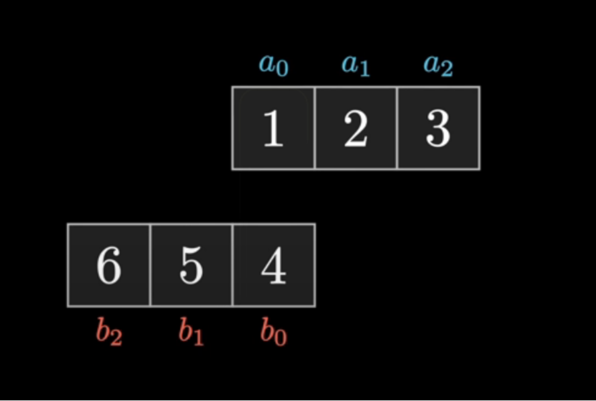
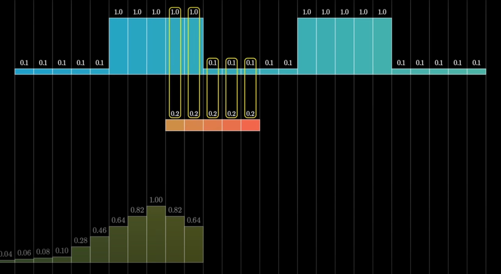
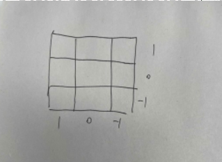

# convolution

<!-- @import "[TOC]" {cmd="toc" depthFrom=1 depthTo=6 orderedList=false} -->

<!-- code_chunk_output -->

- [convolution](#convolution)
    - [概述](#概述)
      - [1.discrete convolution](#1discrete-convolution)
        - [(1) 理解](#1-理解)
        - [(2) 2D discrete convolution](#2-2d-discrete-convolution)
      - [2.continuous convolution](#2continuous-convolution)
      - [3.fast convolution](#3fast-convolution)

<!-- /code_chunk_output -->

### 概述

#### 1.discrete convolution
* 存在两个序列$(a_i)$和$(b_i)$
* 这两个序列的卷积产生一个新的序列：
    * $(a*b)_n=\sum\limits_{i} a_i\cdot b_{n-i}$
        * n表示新序列的第n个元素
        * $(a*b)_0 = a_0\cdot b_0$
        * $(a*b)_1 = a_0\cdot b_1 + a_1\cdot b_0$
        * $(a*b)_2 = a_0\cdot b_2 + a_1\cdot b_1 + a_2\cdot b_0$
        * ...

* 理解
    * 将序列b倒置，从左到右平移，将对应的元素相乘，将窗口内的乘积相加
    

* 多项式相乘
    * $(1+2x+3x^2)(4+5x+6x^2)=4+13x+28x^2+27x^3+18x^4$
    * $(1,2,3)*(4,5,6) = (4,13,28,27,18)$

##### (1) 理解
* 序列a 在**窗口b**中 的**数据关系**
    * 比如：平均值等

##### (2) 2D discrete convolution
* $h[m,n] = f[m,n] * g[m,n] = \sum\limits_{j}\sum\limits_{i}f[i,j]\cdot g[m-i,n-j]$
* 一般使用对称的kernel（比如: 3x3, 5x5等），以kernel的中心为卷积中心，这样才能考虑**元素周围**的影响
    * 
    * 比如：$h[0,0] = f[0,0]\cdot g[0,0] + f[1,0]\cdot g[-1,0] + f[0,1]\cdot g[0,-1] + f[1,1]\cdot g[-1,-1]$

#### 2.continuous convolution

#### 3.fast convolution