# application

<!-- @import "[TOC]" {cmd="toc" depthFrom=1 depthTo=6 orderedList=false} -->

<!-- code_chunk_output -->

- [application](#application)
    - [概述](#概述)
      - [1.Euler graph (欧拉图)](#1euler-graph-欧拉图)
        - [(1) 目标](#1-目标)
        - [(2) 欧拉图](#2-欧拉图)
        - [(3) 判断欧拉图](#3-判断欧拉图)
      - [2.Hamiltonian graph (哈密顿图)](#2hamiltonian-graph-哈密顿图)
        - [(1) 目标](#1-目标-1)
        - [(2) 哈密顿图](#2-哈密顿图)
      - [3.单源点最短路径 (single-source shortest path)](#3单源点最短路径-single-source-shortest-path)
        - [(1) 重要性质](#1-重要性质)
        - [(2) 算法概述： Dijkstra算法](#2-算法概述-dijkstra算法)
        - [(3) 举例](#3-举例)
      - [4.邮路问题](#4邮路问题)
        - [(1) 问题描述](#1-问题描述)
        - [(2) 算法概述](#2-算法概述)
        - [(3) 举例](#3-举例-1)
      - [5.匹配和二分图](#5匹配和二分图)
        - [(1) 匹配定义](#1-匹配定义)
        - [(2) 二分图定义](#2-二分图定义)
        - [(3) 完备匹配和完美匹配](#3-完备匹配和完美匹配)
        - [(4) 举例](#4-举例)
      - [6.平面图](#6平面图)
        - [(1) 定义](#1-定义)
        - [(2) 欧拉公式](#2-欧拉公式)
        - [(3) 判断是否是平面图](#3-判断是否是平面图)
        - [(4) 着色问题](#4-着色问题)
        - [(5) 四色定理](#5-四色定理)
        - [(6) 举例](#6-举例)

<!-- /code_chunk_output -->

### 概述

#### 1.Euler graph (欧拉图)

##### (1) 目标
用于研究**针对现存边**的遍历路径问题，即找出一条路径，包含有所的边且不重复

##### (2) 欧拉图

* 若G中有一条包含所有边（有向边）的简单回路，则称为欧拉回路，称为G的**欧拉图**
    * 平凡图是欧拉图

* 若G中有一条包含所有边（有向边）的简单通路，则称为欧拉通路，称为G的**半欧拉图**

##### (3) 判断欧拉图
* 判断欧拉图
    * 无向连通图G是欧拉图，当且仅当G的所有结点的度数都是偶数
    * 有向连通图G是欧拉图，当且仅当G的所有结点的入度等于出度
    * 图G是非平凡的欧拉图当且仅当 G是连通的且是若干个边不重的回路的并

* 判断半欧拉图 
    * 无向连通图G是半欧拉图，当且仅当G中只有两个 奇度数 的结点，其余结点的度数都是偶数
    * 有向连通图G是半欧拉图，当且仅当G中只有两个 奇度数 的结点，其中一个结点的入度比出度大1，另一个结点的入度比出度小1。其余结点的入度和出度相等

#### 2.Hamiltonian graph (哈密顿图)

##### (1) 目标
用于研究**针对结点**的构建路径问题，即找出一条路径，包含有所的点且不重复

##### (2) 哈密顿图
* 若G中有一条包含所有结点（仅一次）的回路，则称为哈密顿回路，称为G的**哈密顿图**
* 若G中有一条包含所有结点（仅一次）的通路，则称为哈密顿通路，称为G的**半哈密顿图**

#### 3.单源点最短路径 (single-source shortest path)
给定顶点s，计算s到其余各个顶点的**最短路径**

##### (1) 重要性质
* 一个最短路径上的点，其中这个点到起点的路径，也必然是这个点的最短路径

##### (2) 算法概述： Dijkstra算法
* 前提: 权重不能为负数
* 使用优先级搜索 (Priority First Search)
* 以一个点为起点，找出优先级最高的一个点 (即路径最短的一个点)
* 找到后，更新其余节点的优先级
    * 找到的这个点的相邻节点的优先级
* 重复上述步骤

##### (3) 举例
* 初始：
  * S集合只包含源结点a
    * a的距离为0
  * T集合包含其他结点
    * 其他结点距离为都为无穷

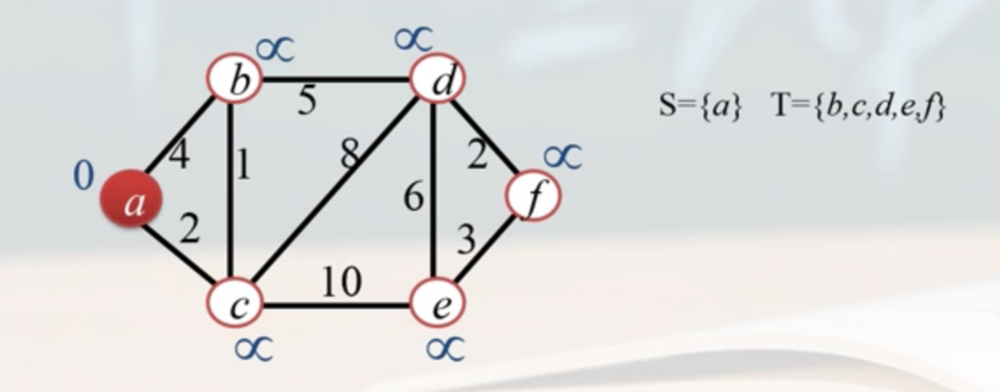

* 以a为起点更新集合T中的结点距离：
  * b和c与a邻接
    * a到b的距离为4，小于无穷，则更新b的距离为4
    * a到c的距离为2，小于无穷，则更新c的距离为2
  * 其他结点和a不邻接，距离还是无穷
  * 从T中选择距离最近的结点（即c）加入到S中

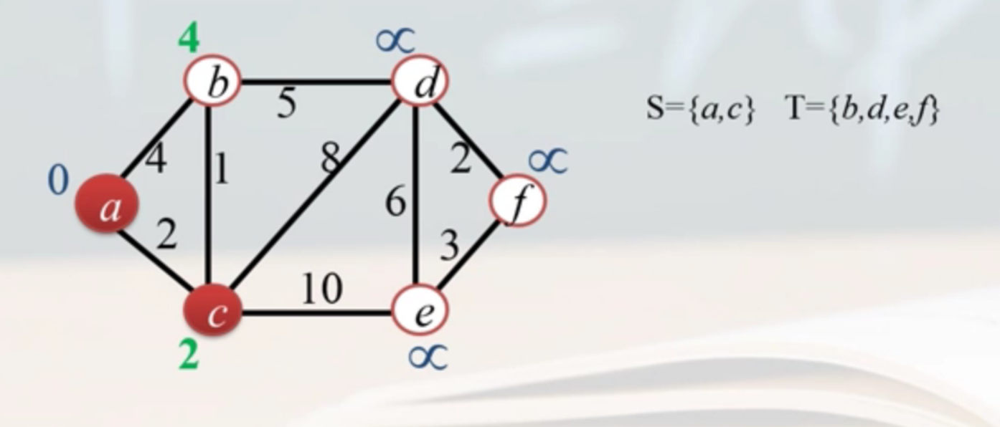

* 以c为依据更新集合T中的结点距离：
  * b、d、e与c邻接
    * c的距离为2，c到b的距离为1，所以b的距离为3，小于4（上一步更新的），则更新b的距离为3
    * c的距离为2，c到d的距离为8，所以d的距离为10，小于无穷，则更新d的距离为10
    * c的距离为2，c到e的距离为10，所以e的距离为12，小于无穷，则更新e的距离为12
  * 其他结点和c不邻接，距离还是无穷
  * 从T中选择距离最近的结点（即b）加入到S中

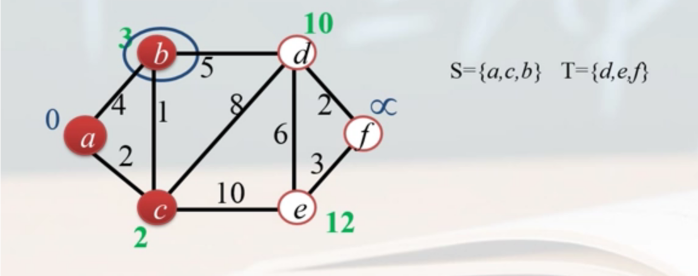

* 以c为依据更新集合T中的结点距离，后面以此类推

#### 4.邮路问题

##### (1) 问题描述
在一个连通的带权图G=(V,E,W)中，寻找一条回路，使得回路
* 包含G中的每条边至少一次
* 且该回路的总权值最小

##### (2) 算法概述

* 如果图是欧拉图，只要 求出图G的一条欧拉回路即可
* 如果图不是欧拉图（即含有奇数度的结点），则将该图转换成欧拉图
  * 如果图中有奇度数结点，则一定有偶数个这样的结点
  * 将奇度数结点两两配对，然后找出两两间的最短通路，并添加边
    * 使附加边E1权值最小的充要条件：
      * G+E1中任意边最多重复一次
      * G+E1中任意回路中重复边的权值之后 不大于 该回路总权值的一半

##### (3) 举例

* 添加附加边

* 根据上述定理，调整附加边
  * G+E1中任意边最多重复一次
  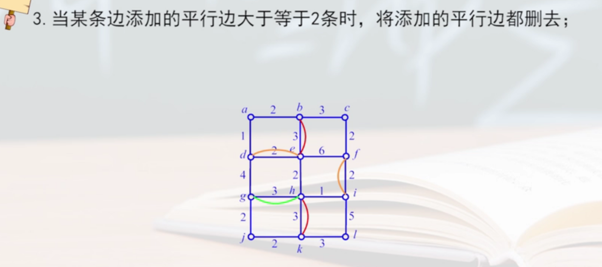
  * G+E1中任意回路中重复边的权值之后 不大于 该回路总权值的一半
  

* 根据上述定理，检查最终确定的附加边
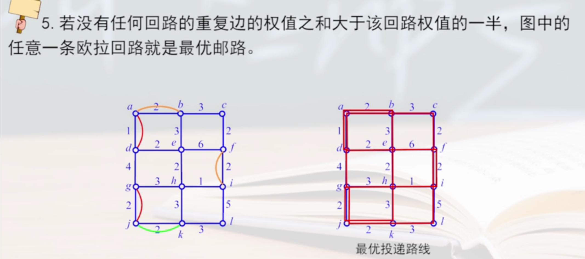

#### 5.匹配和二分图

##### (1) 匹配定义
* 在图G=(V,E)中，若$M\subseteq E$，且M中的任意两条边都不相邻，则称M为G的一个匹配

  * 若在M中添加任意一条边，使得M不再是匹配，则称M为G的极大匹配
  * 若G中不存在 匹配$M_1$，使得$|M_1|>|M|$，则称M为G的最大匹配
  * M中的结点称为M饱和点，G中的其他结点称为M非饱和点
  * 若G中的每个结点都是饱和点，则称M为G的一个完美匹配
  * M交错路：由M中的边和不属于M中的边 交错组成的 简单通路
  * M可扩充路：若M交错路的两端的结点都为 M非饱和点
    * M可扩充路上非匹配的边，能构成一个匹配M1
  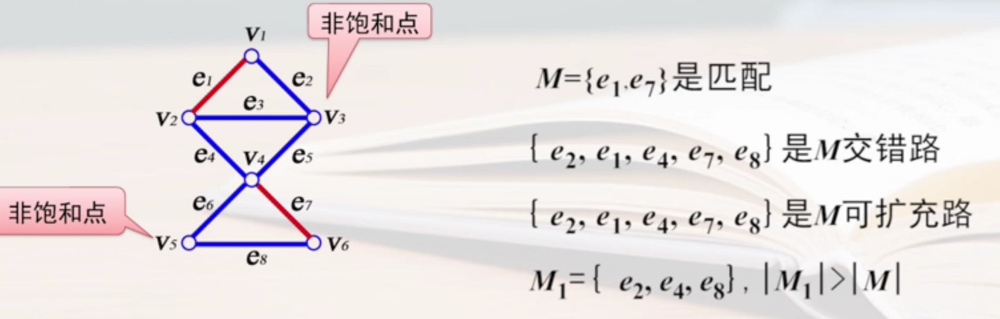

* 判断最大匹配
  * M是图G=(V,E)的最大匹配的充要条件
    * 图G中不存在M可扩充路

##### (2) 二分图定义
* 对于图G(V,E)
    * 能划分两个子集$V_1$和$V_2$
    * 使得每条边的一个端点在$V_1$中，另一个端点在$V_2$中
    * $V_1$和$V_2$称为互补结点集
* 则称为二分图
* 若$V_1$中的每个结点和$V_2$中的每个结点 都有 边相连
* 则称为完全二分图
* 若 $|V_1|=m, |V_2|=n$，记作$K{m,n}$

* 判断二分图
  * 无向简单图G=(V,E)是二分图的充要条件 
    * G中无 奇数长度的回路

##### (3) 完备匹配和完美匹配
* 设G=(V,E)是二分图，$V_1$和$V_2$是G的互补结点集
  * 若G的一个匹配M使得 $|M|=min\{|V_1|,|V_2|\}$
* 则称M是G的完备匹配
  * 若$|V_1|=|V_2|$
* 则称M是G的完美匹配
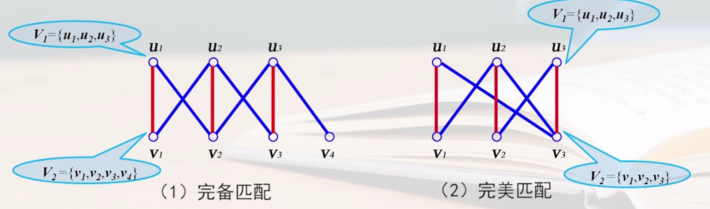

* 判断完备匹配
  * M是二分图G完备匹配的充要条件
    * $V_1$中的任意k个结点（k=1,2,...,$|V_1|$）至少邻接$V_2$中的k个结点

##### (4) 举例
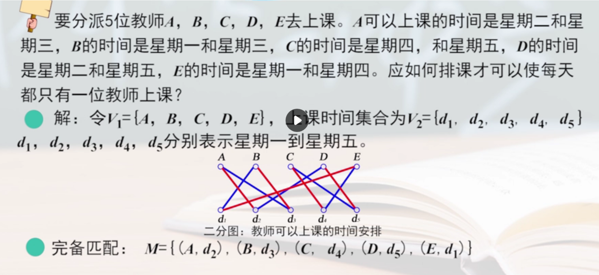

#### 6.平面图

##### (1) 定义

* 处结点处外，任意两条边都不相交的图，称为**平面图**

* 平面图P和图G同构，则称P是图G的一个**平面嵌入**

* 设G是一个平面嵌入，G的边将G所在的平面划分为若干个区域，每个区域称为G的一个**面**
  * 面积无限的区域称为无限面和外部面
  * 面积有限的区域称为有限面和内部面
* 包含每个面的 所有边构成的回路 称为 **面的边界** 
  * 一个边界包含的 边数 称为该**面的次数**，极为$deg(f)$
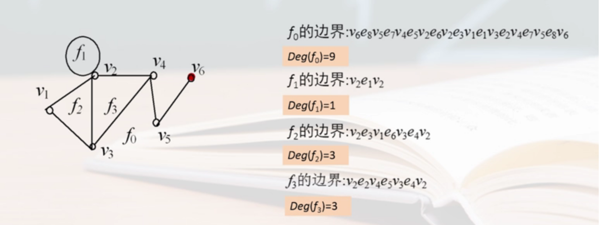 

##### (2) 欧拉公式

* G中有n个结点，m条边，f个面，则有公式
  * $n-m+f=2$

##### (3) 判断是否是平面图
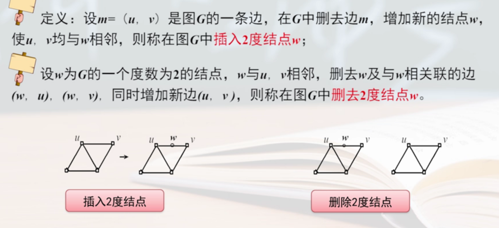
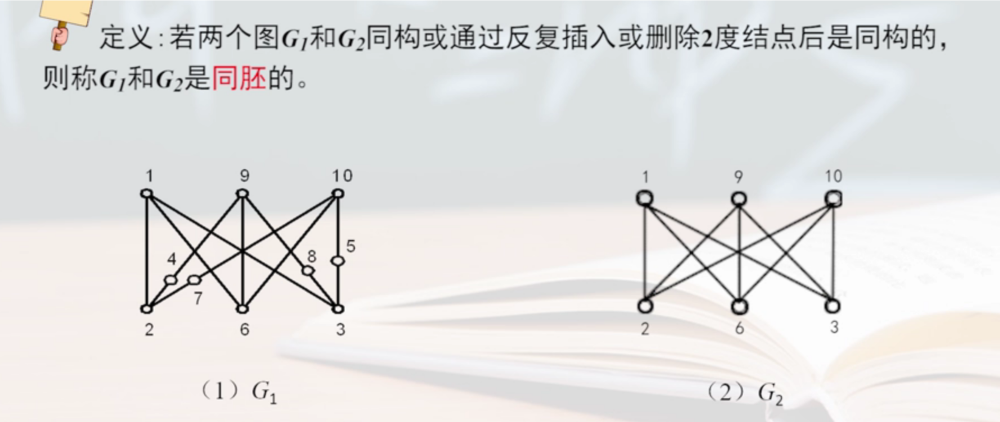

* 设图G是无向图，则G是平面图的充要条件
  * 图G不含 和$K_5$或$K_{3,3}$同胚的子图
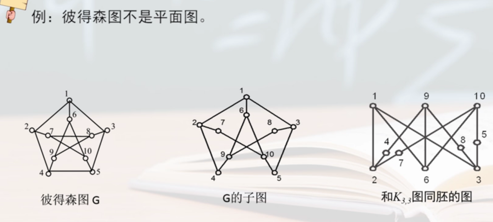

##### (4) 着色问题

* 对平面图G的区域着色问题，可以转换成对G的对偶图G*的着色问题

* 对一个简单图G进行**结点着色**
  * 给每个结点指定一个颜色
  * 邻接结点颜色不能相同
  * 给图G结点着色，最少用k种颜色，则称G是**k色图**

##### (5) 四色定理
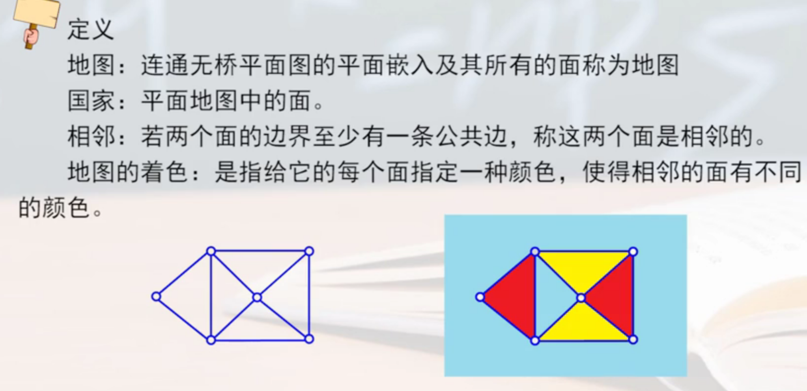

* 对一个平面图的各个面进行着色，使得相邻的面有不同的颜色，所用的颜色可以不多于4种

##### (6) 举例

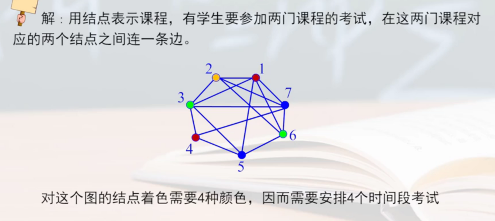