# graph theory

<!-- @import "[TOC]" {cmd="toc" depthFrom=1 depthTo=6 orderedList=false} -->

<!-- code_chunk_output -->

- [graph theory](#graph-theory)
    - [概述](#概述)
      - [1.graph](#1graph)
        - [(1) 结点和边的关系](#1-结点和边的关系)
        - [(2) 路径](#2-路径)
        - [(3) 度（degree）](#3-度degree)
      - [2.图的分类](#2图的分类)
        - [(1) 有向图和无向图](#1-有向图和无向图)
        - [(2) 简单图和多重图](#2-简单图和多重图)
        - [(3) 完全图](#3-完全图)
        - [(4) 正则图](#4-正则图)
        - [(5) 环图](#5-环图)
        - [(6) 轮图](#6-轮图)
        - [(7) 方体图](#7-方体图)
        - [(8) 二分图](#8-二分图)
        - [(9) 代权图](#9-代权图)
        - [(10) 平凡图](#10-平凡图)
      - [3.图的运算](#3图的运算)
        - [(1) 删除边](#1-删除边)
        - [(2) 删除结点](#2-删除结点)
        - [(3) 收缩](#3-收缩)
        - [(4) 加新边](#4-加新边)
      - [4.子图和补图](#4子图和补图)
        - [(1) 子图](#1-子图)
        - [(2) 补图](#2-补图)
      - [5.图的同构 (isomorphism)](#5图的同构-isomorphism)
        - [(1) 自互补图](#1-自互补图)
        - [(2) 同构关系是等价关系](#2-同构关系是等价关系)
      - [6.通路和回路](#6通路和回路)
        - [(1) 简单通路](#1-简单通路)
        - [(2) 基本通路](#2-基本通路)
        - [(3) 距离](#3-距离)
      - [7.图的连通](#7图的连通)
        - [(1) 连通图和非连通图](#1-连通图和非连通图)
        - [(2) 连通分支 (连通分量)](#2-连通分支-连通分量)
        - [(3) 点割集](#3-点割集)
        - [(4) 边割集](#4-边割集)
        - [(5) 点连通度和边连通度](#5-点连通度和边连通度)
        - [(6) 有向连通图](#6-有向连通图)
        - [(7) 强分图](#7-强分图)
      - [8.图的表示](#8图的表示)
        - [(1) adjacency matrix (邻接矩阵)](#1-adjacency-matrix-邻接矩阵)
        - [(2) 定理](#2-定理)
        - [(3) 邻接矩阵举例](#3-邻接矩阵举例)
        - [(4) incidence matrix (关联矩阵)](#4-incidence-matrix-关联矩阵)
        - [(5) 矩阵的应用](#5-矩阵的应用)

<!-- /code_chunk_output -->

### 概述

#### 1.graph

* G = (V; E)
    * V: vertex（节点）的集合
        * $|V|$（即结点数）称为图的阶
    * E: edge（边）的集合
        * 元素是为有序对或无序对

* 环
    * 一条边的两个端点都是同一个结点
* 平行边
    * 关联一对结点的多条边，称为平行边

##### (1) 结点和边的关系
* adjacency (**邻接**关系): 形容 两个连接的**结点** 的关系
* incidence (**关联**关系): 形容 **结点与边** 的关系

##### (2) 路径
* `path = <V0,V1,..., Vk>`
    * 由顶点构成的一个序列
    * 简单路径: 不含重复的顶点

##### (3) 度（degree）
* 对于$v\in V$，与结点v有关联的边数称为该结点的度，记作`d(v)`
* 对于有向图: 度=出度+入度
    * 出度
        * 对于$v\in V$，边的**起点**与结点v有关联的边数称为该结点的**出度**，记作$d^+(v)$
    * 入度
        * 对于$v\in V$，边的**终点**与结点v有关联的边数称为该结点的**入度**，记作$d^-(v)$

* **环**的度数为2
    * 对于有向图出度和入度都为1

* 定理1：
    * 设图G=(V,E)为无向图或有向图，有n个结点，m条边
    * 则$\sum_{i=1}^n d(V_i)=2m$
* 定理2：
    * 对于有向图，所有结点的入读之和 与 所有结点的出度之后 相等

* 度数列
    * 能够大致描述一个图
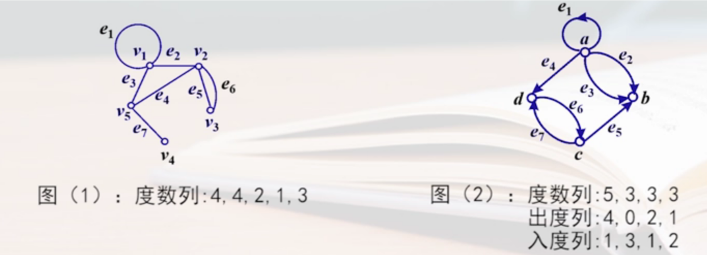
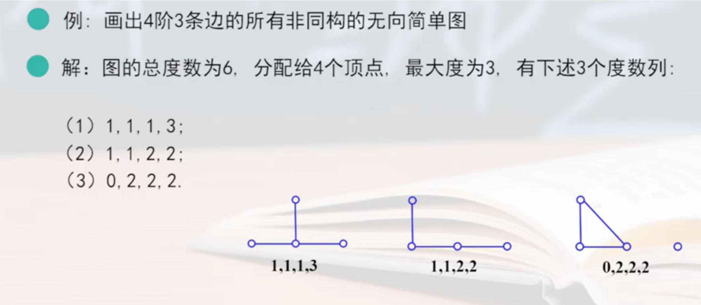

#### 2.图的分类

##### (1) 有向图和无向图
* undirected edge (无向边): 没有方向的边
* undigraph (无向图): 所有边均为 无向边
* digraph (有向图): 所有边均为 有向边
* mixed graph (混合图): 既有无向边，又有有向边
* DAG (directed acyclic graph): 有向无环图

##### (2) 简单图和多重图
* 简单图
    * 不含 平行边 和 环 的图
* 多重图
    * 含 平行边 的图

##### (3) 完全图
* 无向完全图
    * 任何结点 都与 其余的结点 邻接
* 有向完全图
    * 任意两个结点u和v，既有有向边(u,v)，又有有向边(v,u)

##### (4) 正则图
* 无向正则图
    * 所有结点的度数都相等

##### (5) 环图
* 对于图G(V,E)
    * $V=\{v_1,v_2,...,v_n\} (n\ge3)$ 
    * $E=\{(v_1,v_2),(v_2,v_3),...,(v_{n-1},v_n),(v_n,v_1)\}$
* 称为环图，记作$C_n$

##### (6) 轮图
* 在环图中添加一个结点，并把这个结点和其他各个结点相连接，则称为轮图，记作$W_n$

##### (7) 方体图
* 对于图G(V,E)
    * 有$2^n$个结点*
    * 每个结点的长度为n位的位串
    * 任何相邻结点的位串只有一位不同
* 则称为n方体图，记作$Q_n$

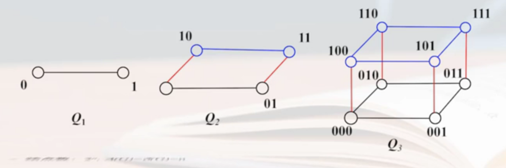

##### (8) 二分图
* 对于图G(V,E)
    * 能划分两个子集$V_1$和$V_2$
    * 使得每条边的一个端点在$V_1$中，另一个端点在$V_2$中
* 则称为二分图
* 若$V_1$中的每个结点和$V_2$中的每个结点 都有 边相连
* 则称为完全二分图
* 若 $|V_1|=m, |V_2|=n$，记作$K{m,n}$

##### (9) 代权图
* 每个结点或每条边都带有数值，则称为带权图

##### (10) 平凡图
* 只含有一个结点的图

#### 3.图的运算

##### (1) 删除边
* 对于图G(V,E)
    * $G-e$
        * 表示从图G中删除边e（其中$e\in G$）
    * $G-E_1$
        * 表示从图G中删除边子集$E_1$（其中$E_1\subseteq E$）

##### (2) 删除结点
* 对于图G(V,E)
    * $G-v$
        * 表示从图G中删除结点v和结点关联的边（其中$v\in V$）
    * $G-V_1$
        * 表示从图G中删除结点子集$V_1$和结点关联的边（其中$V_1\subseteq V$）

##### (3) 收缩
* 对于图G(V,E)，$e=(u,v)\in E$
    * 从G中删除边e
    * 将e的两个端点u、v用一个端点w代替
    * 并将u、v关联的边都关联到w
* 称为收缩，记作$G|e$
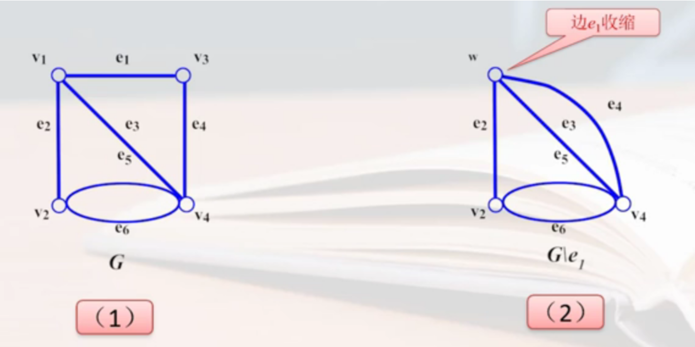

##### (4) 加新边
* 在两个结点间加一条新边
* 记作$G\cup (u,v)$ 或 $G+(u,v)$

#### 4.子图和补图

##### (1) 子图
* 对于图$G(V,E)$ 和 $G_1=(V_1,E_1)$
    * 若 $V_1\subseteq V$，且$E_1\subseteq E$
* 则称$G_1$是G的**子图**，G是$G_1$的母图，记作$G_1\subseteq G$

* 若$G_1\subseteq G$且$V_1=V$，则称$G_1$是G的**生成子图**

##### (2) 补图
* 对于图$G(V,E)$ 
    * 以V为结点集 和 所有能够使G称为**完全图**添加的边集，组成的图
* 称为补图，记作~G

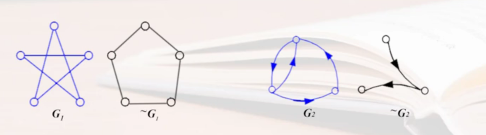

#### 5.图的同构 (isomorphism)

* 对于图$G_1(V_1,E_2)$ 和 $G_2=(V_2,E_2)$
    * 从$V_1$到$V_2$存在双射函数$f$
    * 使得任意$(u,v)\in E_1$，存在$(f(u),f(v))\in E_2$
    * 如果u、v间存在平行边，则f(u)和f(v)之间存在相同数量的平行边
* 则称$G_1$和$G_2$是**同构**的，记作$G_1\cong G_2$

* 直观理解：其中一个图可以通过 平移、转动、边长度伸缩等，使得和另一张图完全相同

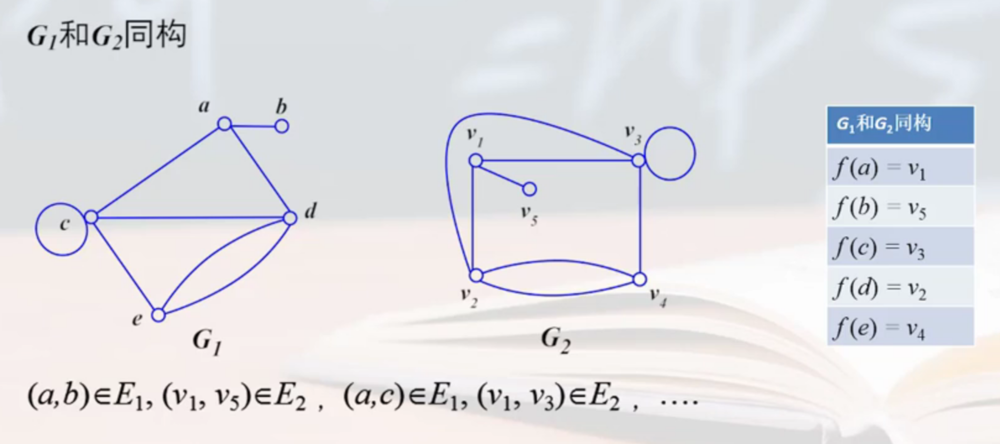

##### (1) 自互补图
如何一个图G和他的互补图~G同构，则称此图为自互补图

##### (2) 同构关系是等价关系

因为同构关系具有自反性、对称性和传递性

#### 6.通路和回路
* 对于图$G(V,E)$ 
    * 以$V_0$为起点，以$V_n$为终点
    * 由结点和边交替出现的序列$v_0e_1v_1e_2v_2...v_{n-1}e_nv_n$
* 称为$V_0$到$V_n$的**通路**
* 若起点和终点是同一点，则称为**回路**

##### (1) 简单通路
* 若通路中的所有边互不相同，则称为简单通路

* 若回路中的所有边互不相同，则称为简单回路
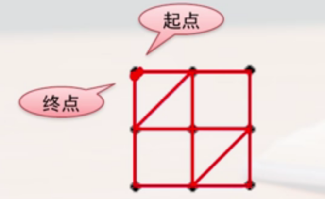
* 有向图的类似

##### (2) 基本通路
* 若通路中的所有结点和边都互不相同，则称为基本通路（初级通路）
* 若回路中的所有结点和边都互不相同，则称为基本回路
* 有向图的类似

##### (3) 距离

* u和v的距离 d(u,v) = u和v之间**最短通路**的距离
    * 若不存在通路，则$d(u,v)=\infty$

#### 7.图的连通

* 不特殊说明，一般都是针对无向图而言的

##### (1) 连通图和非连通图
* 对于无向图
* 平凡图 或 任意两结点间都存在通路
* 则称为连通图
* 否则称为非连通图

##### (2) 连通分支 (连通分量)
* 对于无向图
* 根据连通关系，将结点集划分为等价类$V_1,V_2,...,V_k$
    * 一个等价类是一个连通图
    * 任意两个等价类间没有结点是连通的
* 则$G(V_1),G(V_2),...G(V_k)$ 称为G的 **连通分支**，连通分支数记作W

##### (3) 点割集
* 对于无向图$G(V,E)$
    * $\exists V'\subset V$，若$W(G-V')>W(G)$
    * 且$\forall V''\subset V'$，若$W(G-V'')=W(G)$
* 则称V'是G的**点割集**
    * 若{v}是点割集，则v称为**割点**
* 直观意思: 就是删除一个结点集合，连通分支会增加，如果只删除该结点集合的子集，连通分支不变
* 举例
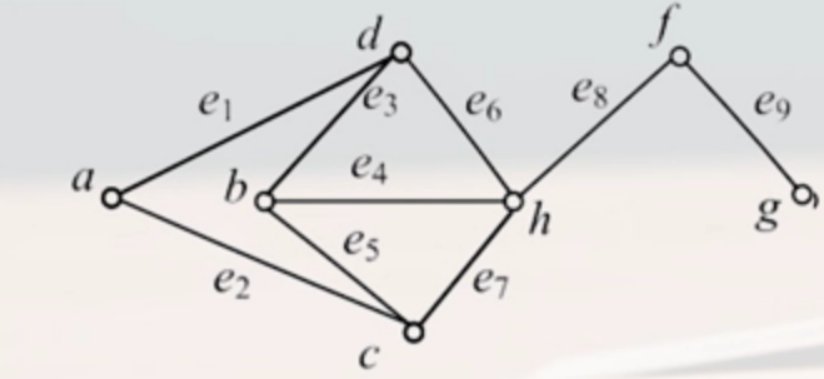
    * {c,d}就是其中一个点割集

##### (4) 边割集
* 对于无向图$G(V,E)$
    * $\exists E'\subset E$，若$W(G-E')>W(G)$
    * 且$\forall E''\subset E'$，若$W(G-E'')=W(G)$
* 则称E'是G的**边割集**
    * 若{e}是点割集，则e称为**割边或桥**
* 直观意思: 就是删除一个边集合，连通分支会增加，如果只删除该边集合的子集，连通分支不变

##### (5) 点连通度和边连通度
* 无向连通图G，为了产生一个非连通图，G需要删除最少的结点数，称为**点连通度**（也称图G的连通度），记作$\kappa(G)$
    * 若G的点连通度为$\kappa(G)$，$k\le kappa(G)$则称G是 **k-连通图**
* 无向连通图G，为了产生一个非连通图，G需要删除最少的边数，称为**边连通度**，记作$\lambda(G)$
    * 若G的边连通度为$\lambda(G)$，$r\le lambda(G)$则称G是 **r边-连通图**
    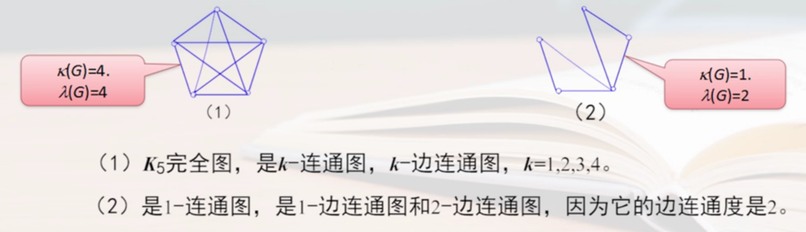
* 无向非连通图的点连通度和边连通度都为0

* 定理
    * 对于无向图G，$\kappa(G)\le\lambda(G)\le\delta(G)$
        * $\delta(G)$表示该图的最小度
    * 若无向图G是k-连通图，删除k-1个结点后，G还是连通图

##### (6) 有向连通图 
* 对于**有向**图$G(V,E)$
    * 任意两个结点间 至少从一个结点 到 另一个结点是可达的，则称G是**单向连通**的
    * 任意两个结点间 都是相互可达的，则称G是**强连通**的
    * 在不考虑方向的情况下，任意两个结点间 都是可达的，则称G是**弱连通**的

##### (7) 强分图
* 对于有向图
* 根据互相可达关系，将结点集划分为等价类$V_1,V_2,...,V_k$
    * 一个等价类是一个强连通图
* 则$G(V_1),G(V_2),...G(V_k)$ 称为G的 **强分图**

#### 8.图的表示

##### (1) adjacency matrix (邻接矩阵)
* 对于图$G(V,E)$，$V=\{v_1,v_2,...,v_n\}$
    * $A(G)=(a_{ij})_{n\times n}$
        * n行和n列代表n个结点
        * $a_{ij}$是以$v_i$为起点、$v_j$为终点的边的数量
    * 特性
        * 行的和
            * 为该结点的出度数
        * 列的和
            * 为该结点的入度数
        * 所有元素值和
            * 为图的边数
        * 孤立点
            * 行和列都为0
        * 主对角线之后
            * 为环的数量

##### (2) 定理
* 对于图$G(V,E)$，$V=\{v_1,v_2,...,v_n\}$
    * $A^k=(a_{ij}^{(k)})_{n\times n}$
        * $a_{ij}^{(k)}$表示G中从$v_i$到$v_j$的**长度为k**的所有路径的数目
    * $B_n=A+A^2+...+A^n$
        * 其中元素$b_{ij}^{(n)}=a_{ij}^{(1)}+a_{ij}^{(2)}+...+a_{ij}^{(n)}$
            * 表示从$v_i$到$v_j$的**长度小等等于k**的所有路径的数目
            * 所以对于n个结点的图G来说，当$B_n$矩阵中有元素为0
                * 表示相应结点间不存在通路
    * 可达矩阵（或连通矩阵） $P(G)=(a_{ij})_{n\times n}$
        * $a_{ij}$，当结点可达时，为1，不可达时为0
        * 对角线都为1
    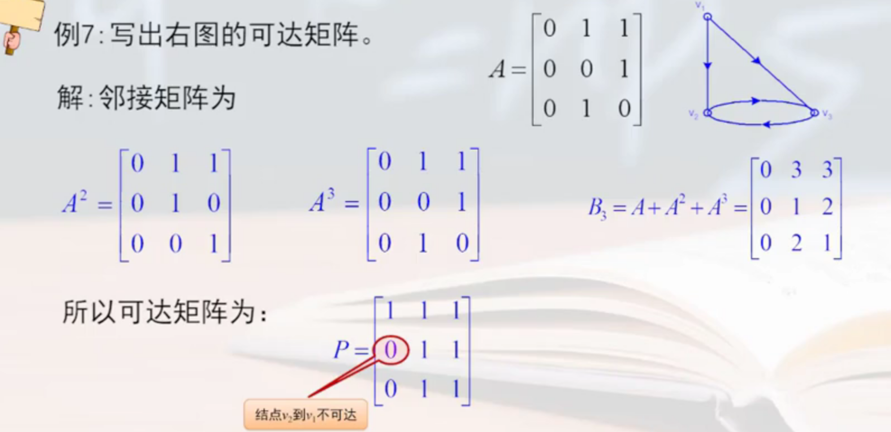

##### (3) 邻接矩阵举例

* 判断是否是强连通图
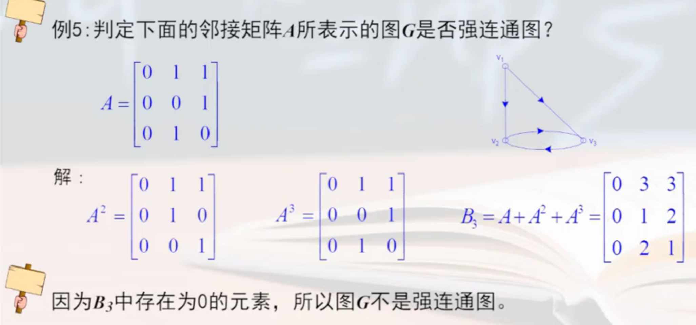

* 判断两个图是否同构
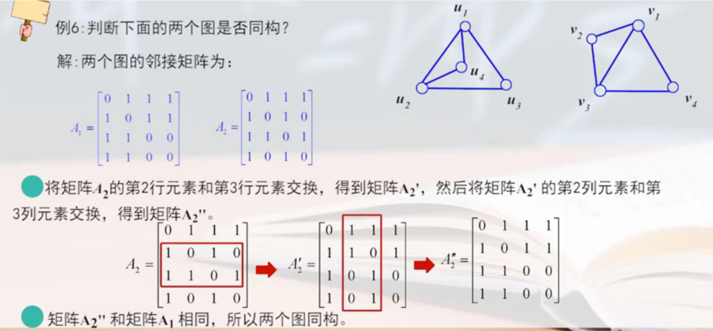

##### (4) incidence matrix (关联矩阵)
* 对于有向图$G(V,E)$，$V=\{v_1,v_2,...,v_n\}$，$E=\{e_1,e_2,...,e_m\}$
    * $M(G)=(m_{ij})_{n\times m}$
        * 每行代表一个结点，每列代表一个边
        * $m_{ij}$ 当$v_i$是$e_j$的起点为1，当$v_i$是$e_j$的终点为-1，当$v_i$是$e_j$不关联为0
            * 对于无向图没有-1取值，当为环时值为2，其他都一样
    * 特性
        * 每列只有一个 1 和 -1
        * 每行1的个数为该结点的入度，每行-1的个数为该结点的出度
        * 孤立点对应的行全为0
        * 多重边对应的列相同

##### (5) 矩阵的应用

问题 --> 状态机 --> 图 --> 求解 

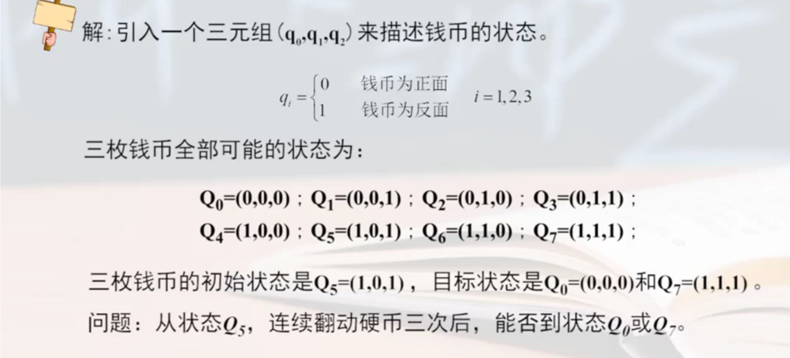
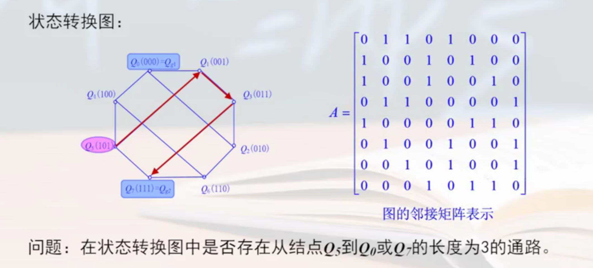
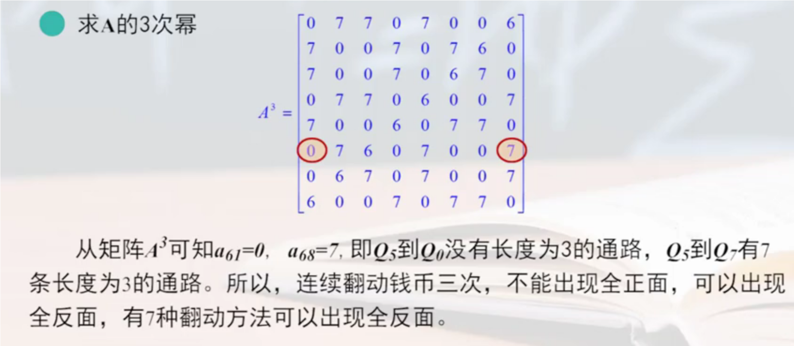