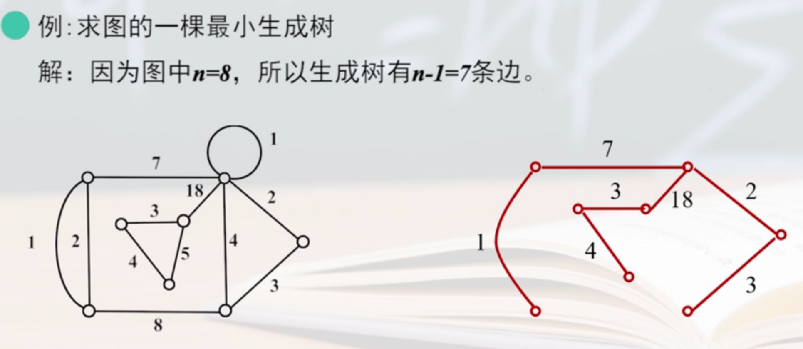
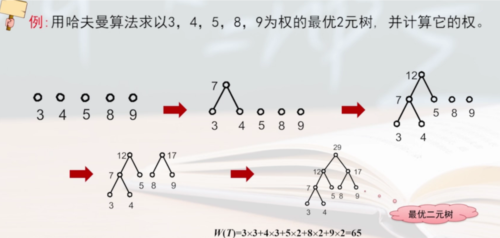

# tree

<!-- @import "[TOC]" {cmd="toc" depthFrom=1 depthTo=6 orderedList=false} -->

<!-- code_chunk_output -->

- [tree](#tree)
    - [概述](#概述)
      - [1.基本概念](#1基本概念)
        - [(1) 无向树](#1-无向树)
        - [(2) 有向根树](#2-有向根树)
      - [2.图的生成树](#2图的生成树)
        - [(1) 定义](#1-定义)
        - [(2) 找出最小生成树算法](#2-找出最小生成树算法)
      - [3.根树的应用](#3根树的应用)
        - [(1) 最优二元树](#1-最优二元树)
        - [(2) 哈夫曼编码](#2-哈夫曼编码)

<!-- /code_chunk_output -->

### 概述

#### 1.基本概念

##### (1) 无向树
* 一个连通 且 无回路 的无向简单图 称为无向树
    * 树中的边称为树枝
    * 度数为1的结点称为树叶
    * 度数大于1的结点称为分支点（内点）
    * 平凡图称为平凡树

* 一个不连通的，但每个连通分支都是无向树的图 称为 森林

##### (2) 有向根树
* 一个有向图G，如果略去有向边的方向所得无向图为一棵无向树，则称G为有向树
    * 有一个结点入度为0，其余结点入度为1，则称此有向树为有向根树
        * 入度为0的结点称为树根
        * 出度为0的结点称为树叶
        * 出度不为0的结点称为分支点（内点）

#### 2.图的生成树

##### (1) 定义
* 对于图G，如果它的 生成子图$T_G$ 是树，则称$T_G$是图G的生成树
    * G中不在生成树$T_G$中的边 称为 弦
    * G中所有弦组成的集合称为生成树$T_G$的 余树 

* G中所有生成树中，权重最小的生成树，称为**最小生成树**

##### (2) 找出最小生成树算法

设G=(V,E,W)是n阶带权图
* 在E中选择最小权值的e，加入到生成树T中，并将e从E中删除
* 在E中选择最小权值的e
    * 若e和已在T中的边不构成回路，则将e加入到生成树T中，并将e从E中删除
    * 若e和已在T中的边构成回路，则将e从E中删除
* 若T中的边数为n-1，则算法结束，否则返回第二步

#### 3.根树的应用

##### (1) 最优二元树
权最小的二元树
* 权$W(T)=\sum_{i=1}^{n}w_il(v_i)$
    * $w_i$是结点的权重
    * $l(v_i)$是结点$v_i$所在的层数（即深度）

##### (2) 哈夫曼编码
