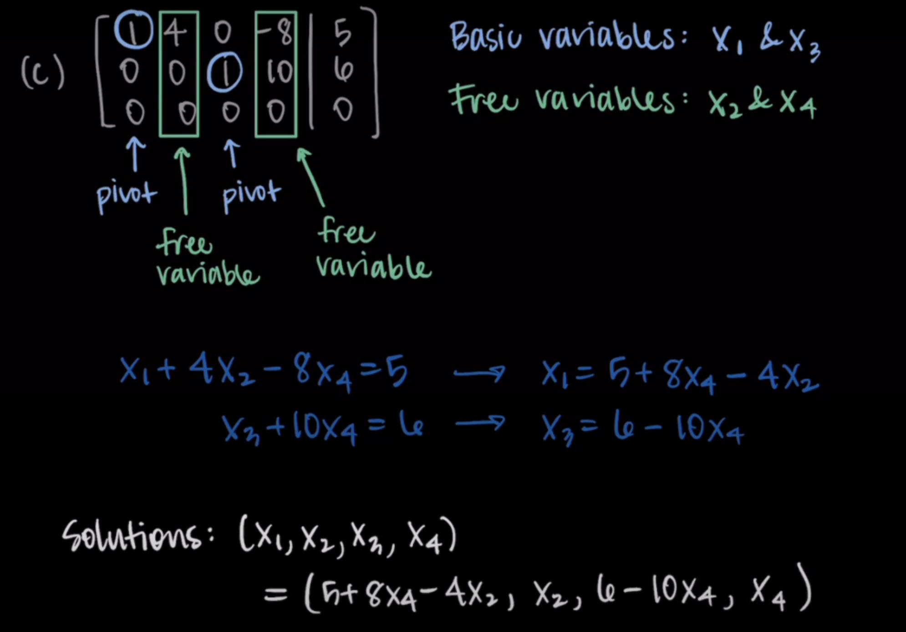
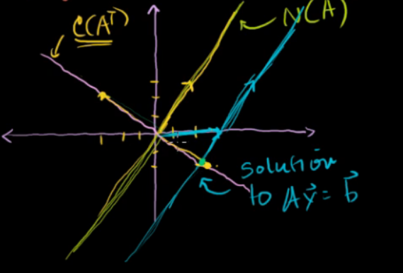
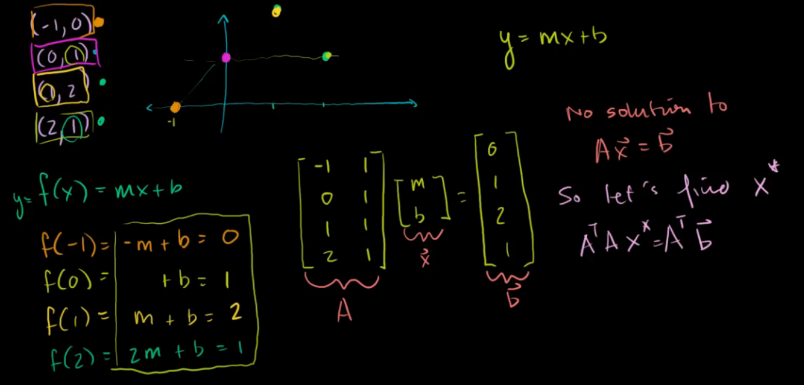
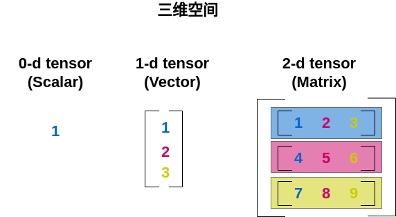
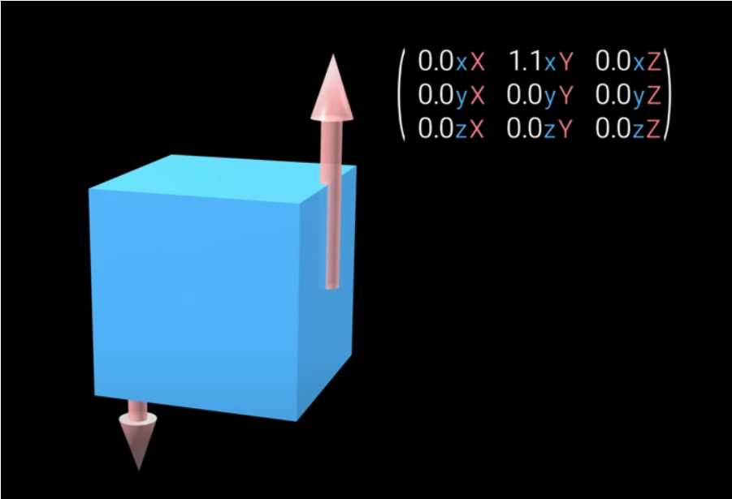

# overview

<!-- @import "[TOC]" {cmd="toc" depthFrom=1 depthTo=6 orderedList=false} -->

<!-- code_chunk_output -->

- [overview](#overview)
    - [概述](#概述)
      - [1.vector](#1vector)
        - [(1) 线性组合](#1-线性组合)
        - [(2) span](#2-span)
        - [(3) linear dependent](#3-linear-dependent)
        - [(4) basis vector（基向量）](#4-basis-vector基向量)
      - [2.parametric representation for line](#2parametric-representation-for-line)
      - [3.hyperplane and norm vector](#3hyperplane-and-norm-vector)
        - [(1) 概念](#1-概念)
        - [(2) distance between point and hyperplane](#2-distance-between-point-and-hyperplane)
        - [(3) 平行的平面](#3-平行的平面)
        - [(4) 根据两个向量，求其组成的平面](#4-根据两个向量求其组成的平面)
      - [4.subspace](#4subspace)
        - [(1) subspace of $R^n$](#1-subspace-of-rn)
        - [(2) basis of subspace](#2-basis-of-subspace)
      - [5.使用矩阵解方程](#5使用矩阵解方程)
        - [(1) reduced row echelon form (rref)](#1-reduced-row-echelon-form-rref)
        - [(2) pivot and free variables](#2-pivot-and-free-variables)
        - [(3) $A\vec x=\vec b$](#3-avec-xvec-b)
      - [6.矩阵](#6矩阵)
        - [(1) column space](#1-column-space)
        - [(2) null space (kernel)](#2-null-space-kernel)
        - [(3) dimension of a subspace](#3-dimension-of-a-subspace)
        - [(4) column space 和  null space的关系](#4-column-space-和--null-space的关系)
        - [(5) 寻找null space](#5-寻找null-space)
      - [7.transformation](#7transformation)
        - [(1) image of transformation](#1-image-of-transformation)
        - [(2) preimage](#2-preimage)
      - [8.linear transformation](#8linear-transformation)
        - [(1) 定义](#1-定义)
        - [(2) 以二维空间为例](#2-以二维空间为例)
        - [(3) 线性变换组合](#3-线性变换组合)
        - [(4) rank (矩阵的秩)](#4-rank-矩阵的秩)
        - [(5) 非方阵](#5-非方阵)
        - [(6) change of basis](#6-change-of-basis)
      - [9.inverse matrices (只有方正矩阵可逆)](#9inverse-matrices-只有方正矩阵可逆)
      - [10.determinant (行列式)](#10determinant-行列式)
        - [(1) 定义](#1-定义-1)
        - [(2) 与行的关系](#2-与行的关系)
        - [(3) upper triangular determinant](#3-upper-triangular-determinant)
        - [(4) 计算determinant的简单方法](#4-计算determinant的简单方法)
      - [11.transpose](#11transpose)
        - [(1) transpose of a vector](#1-transpose-of-a-vector)
        - [(2) if A linearly indepently, then $A^TA$ is invertiable](#2-if-a-linearly-indepently-then-ata-is-invertiable)
      - [12.orthogonal complements](#12orthogonal-complements)
        - [(1) definition](#1-definition)
        - [(2) $dim(V)+dim(V^\bot)=n$](#2-dimvdimvbotn)
        - [(3) $V$和$V^\bot$的basis vector是$R^n$的basis vector](#3-v和vbot的basis-vector是rn的basis-vector)
        - [(4) $A\vec x=\vec b$](#4-avec-xvec-b)
      - [13.orthogonal projections](#13orthogonal-projections)
        - [(1) projection](#1-projection)
        - [(2) $||\vec x-\text {Proj}_{V}\vec x||\le||\vec x-\vec v|| \ (\vec v \in V)$](#2-vec-x-text-proj_vvec-xlevec-x-vec-v--vec-v-in-v)
        - [(3) least squares approximation](#3-least-squares-approximation)
      - [14.orthonormal basis](#14orthonormal-basis)
        - [(1) definition](#1-definition-1)
        - [(2) properties](#2-properties)
        - [(3) $\text {Proj}_{V} \vec x=AA^T\vec x=(\vec x\cdot\vec v_1)\vec v_1+(\vec x\cdot\vec v_2)\vec v_2+...+(\vec x\cdot\vec v_k)\vec v_k$](#3-text-proj_v-vec-xaatvec-xvec-xcdotvec-v_1vec-v_1vec-xcdotvec-v_2vec-v_2vec-xcdotvec-v_kvec-v_k)
        - [(4) Gram-Schmidt process](#4-gram-schmidt-process)
      - [15.特殊矩阵](#15特殊矩阵)
        - [(1) orthonormal matrix: Q](#1-orthonormal-matrix-q)
        - [(2) symmetric matrix: S (特征向量是正交的)](#2-symmetric-matrix-s-特征向量是正交的)
        - [(3) quadratic form: $X^TSX$ (能表示所有的 二次方程)](#3-quadratic-form-xtsx-能表示所有的-二次方程)
        - [(4) symmetric positive definite: $S_{++}$](#4-symmetric-positive-definite-s_)
        - [(5) symmetric positive semidefinite: $S_{+}$](#5-symmetric-positive-semidefinite-s_)
      - [16.tensor](#16tensor)
        - [(1) 1-d tensor (vector)](#1-1-d-tensor-vector)
        - [(2) 2-d tensor (matrix)](#2-2-d-tensor-matrix)
        - [(3) 3-d tensor](#3-3-d-tensor)

<!-- /code_chunk_output -->

### 概述

线性代数的目标：解决线性方程$Ax=0$问题（A是矩阵，x是向量）

#### 1.vector

*  一个向量就是一段运行轨迹

##### (1) 线性组合
* $\vec v_1 + \vec v_2$
    * 先进行第一段运行轨迹，再进行第二段运行轨迹
* $\vec v_1 * n$
    * 就是对运动轨迹进行scale（即拉伸或缩短）

##### (2) span

向量所有可能的**线性组合** 的 **集合**

##### (3) linear dependent
在一组向量中，其中一个向量，能由这组向量中的**其他向量** 通过 **线性组合** **相互转换**

##### (4) basis vector（基向量）
* 基向量一组**非线性相关**的向量，能够span到**整个空间**

* 对于二维空间来说，下面两个**非线性相关**的向量可以作为该空间的基向量
    * $\vec i$ = (1,0)
    * $\vec j$ = (0,1)
    * 所有向量都能由这两个向量进行scale得到

* 对于三维空间
    * $\vec i$ = (1,0,0)
    * $\vec j$ = (0,1,0)
    * $\vec k$ = (0,0,1)

#### 2.parametric representation for line
* 表示过$\vec a$和$\vec b$的直线
* $L=\{\vec b+t(\vec b-\vec a) | t\in R\}$
* 使用parametric形式
    * 设$\vec a=\begin{bmatrix}a_1\\a_2\end{bmatrix}, \vec b=\begin{bmatrix}b_1\\b_2\end{bmatrix}$
    * 则
        * $x=b_1+t(b_1-a_1)$
        * $y=b_2+t(b_2-a_2)$

#### 3.hyperplane and norm vector
* in 1d space: hyperplane is dot
* in 2d space: hyperplane is line
* in 3d space: hyperplane is surface

##### (1) 概念
* $R^n$ vector space
    * 若 $a_1x_1+a_2x_2+...+a_nx_n=b$
        * 这就是一个hyperplane 
    * 则存在norm vector: $\vec n=(a_1,a_2,...,a_n)$
    * 证明:
        * 若u和w两点在平面上（注意$\vec u,\vec w$不在平面上，$\vec u-\vec w$在平面上）
        * 则$\vec n\cdot\vec u-\vec n\cdot\vec w=b-b=0$

##### (2) distance between point and hyperplane 
* 若v是hyperplane上的一点，则
    * unit normal vector: $\frac{\vec n}{||\vec n||}$
    * 原点到hyperplane的距离
        * $\frac{\vec n}{||\vec n||}\cdot\vec v = \frac{|b|}{||\vec n||}$
            * 表示$\vec v$在normal vector方向上的映射
    * 点$v_2$到hyperplane的距离
        * $\frac{\vec n}{||\vec n||}\cdot(\vec v_2-\vec v)$

##### (3) 平行的平面

* 假设在$R^3$中，平面为$Ax+By+Cz=D$,
* 则存在平行的平面: $Ax+By+Cz=D_2$

##### (4) 根据两个向量，求其组成的平面
* 两个向量叉乘，求出normal vector，从而得到系数
* 然后带入其中一个点，即可求出平面

#### 4.subspace

##### (1) subspace of $R^n$
* if V is subspace of $R^n$，则V is subset of $R^n$，且需要满足下述条件:  
    * $\vec 0$ in V
    * closed under addition
        * if $\vec x$ in v, then $c\vec x$ in V
    * closed under multiplication
        * if $\vec a, \vec b$ in V, then $\vec a+\vec b$ in V

* 举例:
    * $V=\{\begin{bmatrix} 0\\0\\0\end{bmatrix}\}$
        * V is subspace of $R^3$
    * $S=\{\begin{bmatrix} x_1\\x_2\end{bmatrix}\in R^2 | x_1\ge0\}$
        * S is not subspace of $R^2$
    * $V=\text {span}(\vec v_1,\vec v_2,...)$
        * 任意向量的span都是subspace

##### (2) basis of subspace
basis is minimum set of vectors than spans the subspace
* $V=\text {span}(\vec v_1,\vec v_2,..., \vec v_n)$
    * if $\{\vec v_1,\vec v_2,..., \vec v_n\}$ is linearly independent
    * then $S=\{\vec v_1,\vec v_2,..., \vec v_n\}$, S is a basis for V

#### 5.使用矩阵解方程

##### (1) reduced row echelon form (rref)

##### (2) pivot and free variables

* pivot variables:
    * 依赖其他变量
    * pivot variables所在的 原矩阵列 线性无关，且是矩阵的column space的basis vector
* free variables
    * 不依赖其他变量，所以可以是任何值

##### (3) $A\vec x=\vec b$

* $A\vec x=\vec 0$
    * 解: $N(A)$
* $A\vec x=\vec b$
    * 经过rref: $[rref(A)|\vec b']$
    * 解: $\vec b'+N(A)$
    * [参考](#12orthogonal-complements) 

#### 6.矩阵
A是一个$m\times n$的矩阵，由vector组成
* **一列**就是一个**vector**
* **一行**就是一个**维度**

##### (1) column space
* column space： $C(A)$
    * $C(A)=\text {span}(\vec v_1,\vec v_2,...,\vec v_n)$
        * column vectors（一个column就是一个vector）的所有线性组成 构成的span
    * 另一种表述: $C(A)={A\vec x|\vec x\in R^n}$
* row space: $C(A^T)$
    * row vectors（一个row就是一个vector）的所有线性组合 构成的span
* $C(A^T) = C(A)$

##### (2) null space (kernel)
null space of A: $N(A)=\{\vec x\in R^n|A\vec x=\vec 0\}$
* null space中的向量经过线性变化后为0
* **$N(A)=(C(A^T))^{\bot}$**
    * N(A) is **orthogonal complement** of the rowspace of A
    * 证明:
        * $A\vec x=\vec 0$
            * 其中$A=\begin{bmatrix} \vec r_1^T\\\vec r_2^T\\ \vdots \\\vec r_n^T \end{bmatrix}$
        * $\therefore \vec r_1\cdot\vec x=0, \vec r_2\cdot\vec x=0,...,\vec r_n\cdot\vec x=0$

##### (3) dimension of a subspace
* dimension of a  subspace = \# of elements in a basis for the subspace
* dim(C(A)) = \# of pivot variables = rank(A)
* nullity(A) = dim(N(A))

##### (4) column space 和  null space的关系
* 当$\vec v_1,\vec v_2,...,\vec v_n$ 是linearly independent时，
    * N(A)只有一个，即$\vec 0$
    * 所以可以通过求A的null space，判断其column vector是否linearly independent

* 假设A是一个m*n矩阵
    * $dim(N(A)) = n-rank$

##### (5) 寻找null space

求解$A\vec x=\vec 0$
* $N(A)=N(rref(A))$
    * rref: reduced row echelon form，利用消元（elimination）简化计算

#### 7.transformation

存在transformation T: $R^n \rightarrow R^m$
* $R^n$称为domain: 原先数据所在的域（注意不是范围）
* $R^m$称为co-domain: 变换后数据所在的域

##### (1) image of transformation
* image of $R^n$ under T: $T(R^n)=\{T(\vec x)|\vec x\in R^n\}$
    * 或者表示为 im(T)
* 对于线性变换 $T(\vec x)=A\vec x$:
    * $T(R^n)=C(A)$
        * C(A): column space of A

##### (2) preimage
* 存在$S\subseteq R^m$
    * preimage of S under T: $T^{-1}(S)$

* $T(T^{-1}(S))\subseteq S$

#### 8.linear transformation

##### (1) 定义

* $L(\vec v + \vec w) = L(\vec v) + L(\vec w)$
* $L(c\vec v) = cL(\vec v)$

* 所以**所有向量**可以使用**基向量**进行表示，然后对**基向量**进行**线性变换**，从而求得对**该向量**的**线性变换**

##### (2) 以二维空间为例
* 默认前提:
    * 基向量：
        * $\vec i$ = (1,0)
        * $\vec j$ = (0,1)
    * 基向量用矩阵表示为
        * $\begin{bmatrix} 1 & 0 \\ 0 & 1 \end{bmatrix}$

* 存在一个向量$\vec v= \begin{bmatrix} x \\y \end{bmatrix} = x\vec i + y\vec j$

* 对基向量进行线性变量，则向量v的位置就能够确定
    * 比如旋转90度
    * 基向量就变为
        * $\begin{bmatrix} 0 & -1 \\ 1 & 0 \end{bmatrix}$
    * 则向量v的位置就是
        * $\begin{bmatrix} 0 & -1 \\ 1 & 0 \end{bmatrix}\begin{bmatrix} x \\y \end{bmatrix} = x\vec i + y\vec j =x\begin{bmatrix} 0 \\1 \end{bmatrix} + y\begin{bmatrix} -1 \\0 \end{bmatrix} = \begin{bmatrix} -y \\ x \end{bmatrix}$
    * 所以新的基向量就是**变换矩阵**

##### (3) 线性变换组合
即多次进行线性变换
* 第一次变换:
    * $\vec M_1 = \begin{bmatrix} a & b \\ c & d \end{bmatrix}$
* 第二次变换
    * $\vec M_2 = \begin{bmatrix} e & f \\ g & h \end{bmatrix}$
* 对向量v进行变换：
    * 对向量v先做$\vec M_1$变换再做$\vec M_2$变换
        * $\begin{bmatrix} e & f \\ g & h \end{bmatrix}\begin{bmatrix} a & b \\ c & d \end{bmatrix}\begin{bmatrix} x \\y \end{bmatrix} = \begin{bmatrix} e & f \\ g & h \end{bmatrix}(x\begin{bmatrix} a \\c \end{bmatrix} + y\begin{bmatrix} b \\d \end{bmatrix})$
     
    * 先对基向量进行$\vec M_1$和$\vec M_2$变换，再对向量v变换
        * $\begin{bmatrix} e & f \\ g & h \end{bmatrix}\begin{bmatrix} a \\ c \end{bmatrix} = \begin{bmatrix} ae+cf \\ ag+ch \end{bmatrix}$
         
        * $\begin{bmatrix} e & f \\ g & h \end{bmatrix}\begin{bmatrix} b \\ d \end{bmatrix} = \begin{bmatrix} be+df \\ bg+dh \end{bmatrix}$
         
        * $\begin{bmatrix} ae+cf & be+df \\ ag+ch & gb+dh \end{bmatrix}\begin{bmatrix} x \\ y \end{bmatrix}$

##### (4) rank (矩阵的秩)

* **rank = row rank = column rank = #independent columns** 
    * column rank: 线性无关的列的数量，即**column space**的**维度**

    * $\begin{bmatrix} 2 & -2 \\1 & -1 \end{bmatrix}$
        * 这个线性变换后，span为一条直线，即一维，则这个矩阵的秩为1

* 满秩
    * 行满秩: 行数 = rank
    * 列满秩: 列数 = rank
    * 如果将列看成一个向量时，当列满秩时，行列式才不为0，此时
        * 才能求出**逆矩阵**，也就是**方程式有解**
        * 如果不满秩，行列式为0，方程式可以有无限的解 或者 无解

##### (5) 非方阵

* 比如:
    * $\begin{bmatrix} 2 & 0 \\-1 & 1 \\ -2 & 1 \end{bmatrix}$
        * 将二维向量变换为三维向量
        * 但是**变换还是在二维空间进行**的
            * 所以column space的维度为2，所以为满秩
    * $\begin{bmatrix} 2 & 0 & 1\\-1 & 1 & 2 \end{bmatrix}$
        * 将三维向量变换为二维向量
        * 比如:
            * 存在$\vec v=\begin{bmatrix} 4 \\ 3\end{bmatrix}$
            * 线性变换: $\begin{bmatrix} 1 & -2 \end{bmatrix}$
            * 变换后的 $\vec v' = 4\vec i + 3\vec j = 4\begin{bmatrix} 1 \end{bmatrix} + 3\begin{bmatrix} -2 \end{bmatrix} = [-2]$

##### (6) change of basis
* 向量
    * basis乘以相应的coordinates进行相加
    * 默认是standard basis（即相互正交的基向量）
* 特定的basis和standard basis相互转换
    * $B[\vec v]_B=\vec v$
        * B表示basis矩阵
        * $[\vec v]_B$表示以B为basis的coordinates
* 对standard basis下的向量做线性变换A
    * 对non-standard basis下的向量，则做如下的线性变换：$A=B^{-1}AB$

#### 9.inverse matrices (只有方正矩阵可逆)

* 矩阵就是对向量的变换，逆矩阵就是逆变换
    * 所以$A^{-1}A=I$

* $T(\vec x)=A\vec x, (A: m\times n)$，A可逆需要满足的条件 对于co-domain中的任意y，都存在唯一的x，使用$A\vec x=\vec y$:
    * surjective (onto)
        * $rank(A)=m$
    * injective (one-to-one)
        * $rank(A)=n$
    * 即$rref(A)=I_n$

* **当det(A)=0时，A不存在逆矩阵**
    * 比如二维，当det(A)=0时，代表变换后span为一条直线，这样就不存在逆变换还原向量
    * 比如三维，当det(A)=0时，代表变换后span为一个平面或一条直线，同样无法还原向量

#### 10.determinant (行列式)

##### (1) 定义
决定方正矩阵**是否可逆**，表示为 $\text {det(A)}=|A|$
* 用于描述**基向量**经过**线性变换**后的**空间变化程度**
    * 默认基向量空间1为，如果变换后的基向量空间为2,则称该变换的行列式为2
    * 当行列式为负数时，表示发生了翻转

* 若A是一个$n\times n$的矩阵，$A_{ij}$是A的$(n-1)\times (n-1)$子矩阵（去除第i行和第j列）
    * $$\begin{align}det(A)=&a_{11}det(A_{11})-a_{12}det(A_{12})\\ 
    & +a_{13}det(A_{13})-a_{14}det(A_{14})\\ 
    & ... + (-1)^{1+n}a_{1n}det(A_{1n})\end{align}$$
        * $det(\begin{bmatrix} a & b \\c & d \end{bmatrix}) = ad - bc$
            * 
        * $det(\begin{bmatrix} a & b & c\\d & e & f\\g & h & i \end{bmatrix}) = a*det(\begin{bmatrix} e & f \\h & i \end{bmatrix}) - b*det(\begin{bmatrix} d & f \\g & i \end{bmatrix}) + c*det(\begin{bmatrix} d & e \\g & h \end{bmatrix})$

##### (2) 与行的关系
* 如果A的某一行乘以k 得到新的矩阵$A_1$，则
    * $|A_1|=k|A|$
* 如果A和B 第i行相加等于C的第i行，A,B,C其他行都相等，则
    * $|C|=|A|+|B|$
* 交换A的第i和j行，得到新的矩阵$S_{ij}$，则
    * $|S_{ij}|=-|A|$
* 如果A中有两行相等，有上述交换两行结论可知
    * $|A|=-|A|$
    * 所以$|A|=0$

* A的某一行，减去另一行，得到新的矩阵$A_1$，则
    * $|A_1|=|A|$

##### (3) upper triangular determinant
* upper triangular: 主对角线以下的部分都为0
* upper triangular determinant = 主对角线上的元素相乘

##### (4) 计算determinant的简单方法
* 进行row operation (不影响determinant)，将矩阵转变为upper triangular
* 计算upper triangular determinant

#### 11.transpose

* $|A|=|A^T|$
* $(AB)^T=B^TA^T$
* $(A+B)^T=A^T+B^T$
* $(A^T)^{-1}=(A^{-1})^T$

##### (1) transpose of a vector
* $\vec v\cdot\vec w=\vec v^T\vec w$
    * 将向量的点积 转换成 矩阵的乘法
* $(A\vec x)\cdot \vec y=\vec x\cdot(A^T\vec y)$

##### (2) if A linearly indepently, then $A^TA$ is invertiable

#### 12.orthogonal complements

##### (1) definition
* V: some subspace of $R^n$
* orthogonal complements of V:
    * $V^{\bot}=\{\vec x\in R^n | \vec x\cdot\vec v=0 \text { for every } \vec v\in V\}$

##### (2) $dim(V)+dim(V^\bot)=n$
* if V is some subspace of $R^n$, then $dim(V)+dim(V^\bot)=n$
    * if $A^T$ is m*n,
        * $rank(A)+dim(N(A^T))=n$
        * 则 $dim(C(A))+dim(N(A^T))=n$
        * 则 $dim(C(A))+dim((C(A))^\bot)=n$

##### (3) $V$和$V^\bot$的basis vector是$R^n$的basis vector
* $V\cap V^\bot=\{\vec 0\}$
* $\vec a=\vec v+\vec x$
    * $\vec a$: any vector in $R^n$
    * $\vec v\in V$
    * $\vec x\in V^\bot$
* $||\vec a||^2=||\vec v||^2+||\vec x||^2$

##### (4) $A\vec x=\vec b$
* $\vec x=\vec r_0+\vec n_0$
    * $\vec r_0\in C(A^T)$
    * $\vec n_0\in N(A)$
* 结论
    * $\vec b\in C(A)$，则存在唯一的 $\vec r_0\in C(A^T)$ 是方程的$A\vec x=\vec b$的一个解，
    * 其他解的为$\vec x=\vec r_0+\vec n_0$
    * $r_0$是**最小的解**
    * 因为
        * $A\vec x=\vec b$的解和$A\vec x=\vec 0$的解平行
        * $C(A^T)$与他们垂直，所以$A\vec x=\vec b$的解，能够表示为$\vec r_0+\vec n_0$
        

#### 13.orthogonal projections

##### (1) projection
* $\vec x=\vec v+\vec w=\text {Proj}_{V} \vec x+\text {Proj}_{V^T}\vec x$
    * $\vec v\in V$
    * $\vec w\in V^{\bot}$
* projection是线性变换

##### (2) $||\vec x-\text {Proj}_{V}\vec x||\le||\vec x-\vec v|| \ (\vec v \in V)$

##### (3) least squares approximation
* 当$A\vec x=\vec b$没有解时，则需要找到结果最接近的解$\vec x^*$
    * 即minimize $||\vec b-A\vec x^*||$
* 当$A\vec x^*=\text {Proj}_{C(A)}\vec b$时，最接近

* example

#### 14.orthonormal basis

##### (1) definition
* $B={\vec v_1,\vec v_2,...,\vec v_k}$ is the orthonormal basis for subspace V
    * $\vec v_i\cdot\vec v_j=\begin{cases} 0 & i\ne j\\1 & i=j \end{cases}$ 

* if $\vec x\in V$，则
    * $[\vec x]_B=\begin{bmatrix} \vec v_1\cdot\vec x\\\vec v_2\cdot\vec x\\\vdots\\\vec v_k\cdot\vec x\end{bmatrix}$

##### (2) properties

* if A is  $n\times k$ matrix and is the orthonormal basis
    * 则 $A^TA=I_k$
* if A is  $n\times n$ matrix and is the orthonormal basis
    * 则 $A^T=A^{-1}$
        * $A^TA=I_n$
        * 因为线性无关，所以是可逆的，所以$A^{-1}A=I_n$

##### (3) $\text {Proj}_{V} \vec x=AA^T\vec x=(\vec x\cdot\vec v_1)\vec v_1+(\vec x\cdot\vec v_2)\vec v_2+...+(\vec x\cdot\vec v_k)\vec v_k$
* A是subspace V的orthonormal basis matrix
* $\{\vec v_1,\vec v_2,...,\vec v_k\}$ 是subspace V的orthonormal basis

##### (4) Gram-Schmidt process
* 将subspace V的basis $\{\vec v_1,\vec v_2,...,\vec v_k\}$ 转变成 orthonormal basis $\{\vec u_1,\vec u_2,...,\vec u_k\}$
    * $y_k=\vec v_k-\text {Proj}_{V_{k-1}} \vec v_k$
    * $u_k=\frac{\vec y_k}{||\vec y_k||}$

#### 15.特殊矩阵

##### (1) orthonormal matrix: Q

* Q是**方正** 且 每一列都是**orthonormal vectors (标准正交向量)**
    * 每一列的向量 都和 其他列向量 正交 且 与自身的点积为1
    * **$Q^TQ = I$**
        * 因为是方正，所以$QQ^T=I$
        * 因为等于$I$，所以 $Q^T=Q^{-1}$
    * 本质就是**旋转（可能还有翻转）**，所以对任何向量进行该线型变换，都不会改变该向量的长度

##### (2) symmetric matrix: S (特征向量是正交的)

* **$S = S^T$**
* $A^TA$ 结果是 symmetric positive definite 矩阵

##### (3) quadratic form: $X^TSX$ (能表示所有的 二次方程)
* quadratic form:
    * unary: $q(x)=ax^2$
    * binary: $q(x,y)=ax^2+bxy+cy^2$
    * ternary: $q(x,y,z)=ax^2+bxy+cy^2+dyz+ez^2+fxz$
* 使用matrix形式表示quadratic form
    * $A=\begin{bmatrix}a&b\\c&d\end{bmatrix}$
    * $X=\begin{bmatrix}x\\y\end{bmatrix}$
    * $q_A(x,y)=X^TAX=ax^2+(b+c)xy+dy^2$
    * 可以用symmetric matix表示: 
        * $S=\begin{bmatrix}a&\frac{b+c}{2}\\\frac{b+c}{2}&d\end{bmatrix}$
        * $q_A(x,y)=X^TSX$        

##### (4) symmetric positive definite: $S_{++}$

* $X^TSX>0$ for all non-zero vectors X 
* S满足以下任一个条件就是symmetric positive definite
    * 所有特征值 > 0
    * $X^TSX$ > 0 (X不等于0)
    * $S=A^TA$ (A的每一列都线性无关)
    * 所有的leading determinants > 0
        * leading determinants表示 取矩阵的 1x1矩阵，2x2矩阵，3x3矩阵，依次类推
    * 所有的pivots in elimination > 0
        * 消元后的每行的第一个非0的值 > 0
* if A is positive definite
    * then $A^T$ and $A^{-1}$ is also positive definite

##### (5) symmetric positive semidefinite: $S_{+}$
* $X^TSX\ge 0$ for any vectors X 

#### 16.tensor

以**三维空间**为例

##### (1) 1-d tensor (vector)
* 三维空间中的vector，有3个基向量（即基分量）
    * $\begin{bmatrix}x\\y\\z\end{bmatrix}$

##### (2) 2-d tensor (matrix)
* 因为是三维空间，所有有三个元素，且每个元素也是一个三维空间，所以一共有$3*3=9$个基向量（即基分量）
    * 
    * 

* 可以理解成 平面受力问题，比如：
    * 
    * 上面只有 xY分量上有值，表示x平面收到y方向的力

##### (3) 3-d tensor
* 因为是三维空间，所以一共 $3*3*3=27$个基向量（即基分量）

