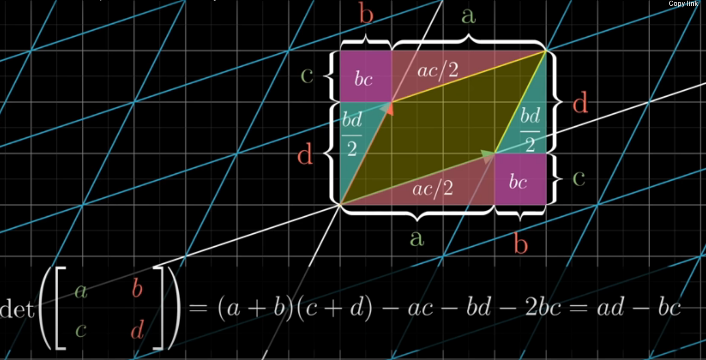
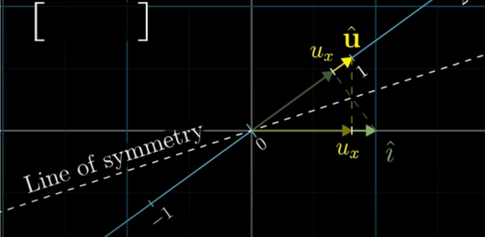

# overview

<!-- @import "[TOC]" {cmd="toc" depthFrom=1 depthTo=6 orderedList=false} -->

<!-- code_chunk_output -->

- [overview](#overview)
    - [概述](#概述)
      - [1.vector](#1vector)
        - [(1) 线性组合](#1-线性组合)
        - [(2) span](#2-span)
        - [(3) linear dependent](#3-linear-dependent)
        - [(4) basis vector（基向量）](#4-basis-vector基向量)
      - [2.矩阵](#2矩阵)
        - [(1) column space](#1-column-space)
        - [(2) null space (kernel)](#2-null-space-kernel)
        - [(3) 寻找null space (本质就是消元)](#3-寻找null-space-本质就是消元)
        - [(4) orthonormal matrix: Q](#4-orthonormal-matrix-q)
        - [(5) symmetric matrix: S](#5-symmetric-matrix-s)
      - [3.线性变换](#3线性变换)
        - [(1) 定义](#1-定义)
        - [(2) 以二维空间为例](#2-以二维空间为例)
        - [(3) 线性变换组合](#3-线性变换组合)
        - [(4) determinant (行列式)](#4-determinant-行列式)
        - [(5) inverse matrices (只有方正矩阵可逆)](#5-inverse-matrices-只有方正矩阵可逆)
        - [(6) rank (矩阵的秩)](#6-rank-矩阵的秩)
        - [(7) 非方阵](#7-非方阵)
      - [4.product](#4product)
        - [(1) inner product 和 outer product](#1-inner-product-和-outer-product)
        - [(2) dot product (vector)](#2-dot-product-vector)
        - [(3) matrix multiply](#3-matrix-multiply)
        - [(4) cross product](#4-cross-product)
      - [5.eigenvectors and eigenvalues](#5eigenvectors-and-eigenvalues)
        - [(1) 特征值和特征向量](#1-特征值和特征向量)
        - [(2) eigenbasis](#2-eigenbasis)
        - [(3) 性质](#3-性质)
      - [6.singular value decomposition (SVD)](#6singular-value-decomposition-svd)
        - [(1) 如何确定U、V和$\Sigma$](#1-如何确定u-v和sigma)

<!-- /code_chunk_output -->

### 概述

线性代数的目标：解决线性方程$Ax=0$问题（A是矩阵，x是向量）

#### 1.vector

*  一个向量就是一段运行轨迹

##### (1) 线性组合
* $\vec v_1 + \vec v_2$
    * 先进行第一段运行轨迹，再进行第二段运行轨迹
* $\vec v_1 * n$
    * 就是对运动轨迹进行scale（即拉伸或缩短）

##### (2) span

向量所有可能的**线性组合** 的 **集合**

##### (3) linear dependent
在一组向量中，其中一个向量，能由这组向量中的**其他向量** 通过 **线性组合** **相互转换**

##### (4) basis vector（基向量）
* 基向量一组**非线性相关**的向量，能够span到**整个空间**

* 对于二维空间来说，下面两个**非线性相关**的向量可以作为该空间的基向量
    * $\vec i$ = (1,0)
    * $\vec j$ = (0,1)
    * 所有向量都能由这两个向量进行scale得到

* 对于三维空间
    * $\vec i$ = (1,0,0)
    * $\vec j$ = (0,1,0)
    * $\vec k$ = (0,0,1)

#### 2.矩阵
由vector组成
* **一列**就是一个**vector**
* **一行**就是一个**维度**

##### (1) column space
* column space
    * column vectors（一个column就是一个vector）的所有线性组成 构成的span
    * $C(A).dim =  rank$ (即column vectors所处的维度)
* row space
    * row vectors（一个row就是一个vector）的所有线性组合 构成的span
    * 表示：$C(A^T) = C(A)$

##### (2) null space (kernel)
* 经过线性变换后，向量变为0，即
    * $N(A) \bot C(A^T)$
        * **A的null space 和 row space正交**
    * $N(A^T) \bot C(A)$
    * dimension of null space = (dimenson of A) - A.rank

* **$Ax=0$的解就是null space**
    * 因为只有null space中的向量，经过线性变换A才等于0
* 假设A是一个m*n矩阵，rank=r
    * $N(A).dim = n-r$
    * $N(A^T).dim = m -r$

##### (3) 寻找null space (本质就是消元)
* $Ax=0$
* 进行分解: [A = CR](./Advance.md#1-a--cr)
    * 利用消元（elimination），求出R
* R=0的解就是null space
    * R可以表示为 $[I\ F]$
    * $[I\ F]\begin{bmatrix} -F \\ I \end{bmatrix} = 0$
    * 所以解就是$\begin{bmatrix} -F \\ I \end{bmatrix}$

##### (4) orthonormal matrix: Q

* Q是**方正** 且 每一列都是**orthonormal vectors (标准正交向量)**
    * 每一列的向量 都和 其他列向量 正交 且 与自身的点积为1
    * $Q^TQ = I$
        * 因为是方正，所以$QQ^T=I$
        * 因为等于$I$，所以 $Q^T=Q^{-1}$
    * 本质就是**旋转（可能还有翻转）**，所以对任何向量进行该线型变换，都不会改变该向量的长度

##### (5) symmetric matrix: S

* $S = S^T$
* S的**特征向量是正交的**
* $A^TA$ 结果是 symmetric positive definite 矩阵

* $X^TSX$（X是一个向量，比如: X=[x y]）能表示所有的二次方程，而在机器学习中，代价函数几乎都是二次方程
    * 满足以下任一个条件就是symmetric positive definite
        * 所有特征值 > 0
        * $X^TSX$ > 0 (X不等于0)
        * $S=A^TA$ (A的每一列都线性无关)
        * 所有的leading determinants > 0
            * leading determinants表示 取矩阵的 1x1矩阵，2x2矩阵，3x3矩阵，依次类推
        * 所有的pivots in elimination > 0
            * 消元后的每行的第一个非0的值 > 0

    * 当$f(x) = X^TSX$ 时，表示f(x)函数的形状像碗一样

#### 3.线性变换

##### (1) 定义

* $L(\vec v + \vec w) = L(\vec v) + L(\vec w)$
* $L(c\vec v) = cL(\vec v)$

* 所以**所有向量**可以使用**基向量**进行表示，然后对**基向量**进行**线性变换**，从而求得对**该向量**的**线性变换**

##### (2) 以二维空间为例
* 默认前提:
    * 基向量：
        * $\vec i$ = (1,0)
        * $\vec j$ = (0,1)
    * 基向量用矩阵表示为
        * $\begin{bmatrix} 1 & 0 \\ 0 & 1 \end{bmatrix}$

* 存在一个向量$\vec v= \begin{bmatrix} x \\y \end{bmatrix} = x\vec i + y\vec j$

* 对基向量进行线性变量，则向量v的位置就能够确定
    * 比如旋转90度
    * 基向量就变为
        * $\begin{bmatrix} 0 & -1 \\ 1 & 0 \end{bmatrix}$
    * 则向量v的位置就是
        * $\begin{bmatrix} 0 & -1 \\ 1 & 0 \end{bmatrix}\begin{bmatrix} x \\y \end{bmatrix} = x\vec i + y\vec j =x\begin{bmatrix} 0 \\1 \end{bmatrix} + y\begin{bmatrix} -1 \\0 \end{bmatrix} = \begin{bmatrix} -y \\ x \end{bmatrix}$
    * 所以新的基向量就是**变换矩阵**

##### (3) 线性变换组合
即多次进行线性变换
* 第一次变换:
    * $\vec M_1 = \begin{bmatrix} a & b \\ c & d \end{bmatrix}$
* 第二次变换
    * $\vec M_2 = \begin{bmatrix} e & f \\ g & h \end{bmatrix}$
* 对向量v进行变换：
    * 对向量v先做$\vec M_1$变换再做$\vec M_2$变换
        * $\begin{bmatrix} e & f \\ g & h \end{bmatrix}\begin{bmatrix} a & b \\ c & d \end{bmatrix}\begin{bmatrix} x \\y \end{bmatrix} = \begin{bmatrix} e & f \\ g & h \end{bmatrix}(x\begin{bmatrix} a \\c \end{bmatrix} + y\begin{bmatrix} b \\d \end{bmatrix})$
     
    * 先对基向量进行$\vec M_1$和$\vec M_2$变换，再对向量v变换
        * $\begin{bmatrix} e & f \\ g & h \end{bmatrix}\begin{bmatrix} a \\ c \end{bmatrix} = \begin{bmatrix} ae+cf \\ ag+ch \end{bmatrix}$
         
        * $\begin{bmatrix} e & f \\ g & h \end{bmatrix}\begin{bmatrix} b \\ d \end{bmatrix} = \begin{bmatrix} be+df \\ bg+dh \end{bmatrix}$
         
        * $\begin{bmatrix} ae+cf & be+df \\ ag+ch & gb+dh \end{bmatrix}\begin{bmatrix} x \\ y \end{bmatrix}$

##### (4) determinant (行列式)
* 用于描述**基向量**经过**线性变换**后的**空间变化程度**
    * 默认基向量空间1为，如果变换后的基向量空间为2,则称该变换的行列式为2
    * 当行列式为负数时，表示发生了翻转

* $det(\begin{bmatrix} a & 0 \\0 & b \end{bmatrix}) = a*b$
* $det(\begin{bmatrix} a & b \\c & d \end{bmatrix}) = ad - bc$
    * 
* $det(\begin{bmatrix} a & b & c\\d & e & f\\g & h & i \end{bmatrix}) = a*det(\begin{bmatrix} e & f \\h & i \end{bmatrix}) - b*det(\begin{bmatrix} d & f \\g & i \end{bmatrix}) - c*det(\begin{bmatrix} d & e \\g & h \end{bmatrix})$

##### (5) inverse matrices (只有方正矩阵可逆)

* 矩阵就是对向量的变换，逆矩阵就是逆变换
    * 所以$A^{-1}A=E$
        * 二维$E=\begin{bmatrix} 1 & 0 \\0 & 1 \end{bmatrix}$
        * 三维$E=\begin{bmatrix} 1 & 0 & 0 \\0 & 1 &0 \\ 0 & 0 & 1 \end{bmatrix}$

* **当det(A)=0时，A不存在逆矩阵**
    * 比如二维，当det(A)=0时，代表变换后span为一条直线，这样就不存在逆变换还原向量
    * 比如三维，当det(A)=0时，代表变换后span为一个平面或一条直线，同样无法还原向量

##### (6) rank (矩阵的秩)

* **rank = row rank = column rank = #independent columns** 
    * column rank: 线性无关的列的数量，即**column space**的**维度**

    * $\begin{bmatrix} 2 & -2 \\1 & -1 \end{bmatrix}$
        * 这个线性变换后，span为一条直线，即一维，则这个矩阵的秩为1

* 满秩
    * 行满秩: 行数 = rank
    * 列满秩: 列数 = rank
    * 如果将列看成一个向量时，当列满秩时，行列式才不为0，此时
        * 才能求出**逆矩阵**，也就是**方程式有解**
        * 如果不满秩，行列式为0，方程式可以有无限的解 或者 无解

##### (7) 非方阵

* 比如:
    * $\begin{bmatrix} 2 & 0 \\-1 & 1 \\ -2 & 1 \end{bmatrix}$
        * 将二维向量变换为三维向量
        * 但是**变换还是在二维空间进行**的
            * 所以column space的维度为2，所以为满秩
    * $\begin{bmatrix} 2 & 0 & 1\\-1 & 1 & 2 \end{bmatrix}$
        * 将三维向量变换为二维向量
        * 比如:
            * 存在$\vec v=\begin{bmatrix} 4 \\ 3\end{bmatrix}$
            * 线性变换: $\begin{bmatrix} 1 & -2 \end{bmatrix}$
            * 变换后的 $\vec v' = 4\vec i + 3\vec j = 4\begin{bmatrix} 1 \end{bmatrix} + 3\begin{bmatrix} -2 \end{bmatrix} = [-2]$

#### 4.product

##### (1) inner product 和 outer product

* outer product
    * 两个向量组成一个新的矩阵
    * $\vec u \otimes \vec v = \begin{bmatrix} u_1v_1 & u_1v_2 & \cdots & u_1v_n \\ u_2v_1 & u_2v_2 & \cdots &u_2v_n \\ \vdots & \vdots & \ddots & \vdots \\ u_mv_1 & u_mv_2 & \cdots & u_mv_n\end{bmatrix}$

* inner product
    * 向量的inner product就是dot product
    * 矩阵的inner product比较复杂

##### (2) dot product (vector)

* 理解: $\vec v_1 \cdot \vec v_2$
    * 对$\vec v_2$进行**线性变换**
    * 或 $\vec v_2$在$\vec v_1$上的**映射**

* dot product可以表示
    * 向量的inner product
    * 矩阵的matrix multiply

* $\vec v \cdot \vec w$ = (length of projected $\vec w$ on $\vec v$)(length of $\vec v$) = $\vec w \cdot \vec v$
    * 当$\vec v$和$\vec w$方向 不一致时为负数，垂直时为0

* 可以将$\begin{bmatrix} 1 \\ 2 \end{bmatrix} \cdot \begin{bmatrix} 4 \\ 3 \end{bmatrix}$理解成，对向量进行线性变换
    * $\begin{bmatrix} 1 & 2 \end{bmatrix} \begin{bmatrix} 4 \\ 3 \end{bmatrix}=1*4+2*3=10$

* 为什么映射和线性变换有关
    * duality: 比如存在一条斜线，该斜线的1单元记为$\vec u$，在x上的映射（也是$\vec i$在该斜线上的映射）记为$u_x$，在y上的映射（也是$\vec j$在该斜线上的映射）记为$u_y$
        * 能够得出结论：$\vec i$和$\vec j$在该斜线上的映射 = $\vec u$在x和y上的映射
    * 若该斜线上存在一个向量$\vec v = (v_x,v_y)$，$\vec v \cdot \begin{bmatrix} x \\ y \end{bmatrix}$
        * 所以x在$\vec v$上的映射为$v_x$（同理y）
    * $\begin{bmatrix} x \\ y \end{bmatrix} = x\vec i + y\vec j$，求在$\vec v$上的映射，所以基向量$(\vec i, \vec j)$就变为了$\vec v = (v_x,v_y)$，所以$\begin{bmatrix} x \\ y \end{bmatrix}$在该斜线上的映射就是$xv_x + yv_y$，也就是$\begin{bmatrix} v_x & v_y \end{bmatrix} \begin{bmatrix} x \\ y \end{bmatrix}$

    

##### (3) matrix multiply

* 理解: $A \cdot B$
    * 多个向量的**线性变换**
        * B的每一列是一个向量，对每一个向量进行线性变换A
    * A的每行和B的每列进行**dot product**

* dot product 和 matrix multiply区分
    * dot product对象：**向量**，**输出**是一个**值**
    * matrix multiply对象：**矩阵**，**输出**是另一个**矩阵**： $M = A \cdot B$ 
        * 前提： A矩阵的每行和B矩阵的每列做点积（A每行的元素数 = B每列的元素数）
        * M的第m行，第n列的元素值 = A矩阵的第m行 $\cdot$ B矩阵的第n列

##### (4) cross product
* 两个二维向量叉乘，$\vec v \times \vec w$ 结果是两个向量构成的平行四边形的面积（如果$\vec v$ 在右边，则是正数）
* 两个三维向量叉乘，产生一个新的三维向量: $\vec v \times \vec w = \vec p$
    * $\vec w$的长度是 $\vec v$和$\vec w$组成平行图的面积（即行列式的值）
    * $\vec p$的方向是 经过原点 与$\vec v$和$\vec w$所在平面垂直
        * 右手法则:
            * 食指表示$\vec v$
            * 中指表示$\vec w$
            * 大拇指的方向就是$\vec p$的方向
* 从三维向量的叉乘计算 -> 几何意义
    * $\vec v \times \vec w = det(\begin{bmatrix} \vec i & v_1 & w_1 \\ \vec j & v_2 & v_2 \\ \vec k & v_3 & w_3 \end{bmatrix})= \vec p \cdot \begin{bmatrix} \vec i \\ \vec j \\ \vec k \end{bmatrix}$
        * 存在$\vec p$使得该等式成立
        * $det(\begin{bmatrix} \vec i & v_1 & w_1 \\ \vec j & v_2 & v_2 \\ \vec k & v_3 & w_3 \end{bmatrix})$ = ($\vec v$和$\vec w$的面积) * ($\begin{bmatrix} \vec i \\ \vec j \\ \vec k \end{bmatrix}$在 $\vec v$和$\vec w$平面的垂直线上 的映射) 
        * $\vec p \cdot \begin{bmatrix} \vec i \\ \vec j \\ \vec k \end{bmatrix}$ = ($\begin{bmatrix} \vec i \\ \vec j \\ \vec k \end{bmatrix}$在$\vec p$上的映射) * ($\vec p$的长度)
        * 所以$\vec p$
            * 方向 在$\vec v$和$\vec w$平面的垂直线上 
            * 大小为$\vec v$和$\vec w$的面积

#### 5.eigenvectors and eigenvalues

##### (1) 特征值和特征向量
* **特征向量**：经过线性变换，向量的**方向没有改变**，只是进行了scale
    * scale的值就是 **特征值**
    * 比如: 进行$\begin{bmatrix} 1 & 1 \\ 0 & 1 \end{bmatrix}$线性变换，x轴的span没有改变，scale值为1,所以x轴上的所有向量都是特征向量，特征值为1

* 数学定义: $A\vec v= \lambda \vec v$
    * $\lambda$可以 $\lambda I$，I是主对角线都为1的矩阵
    * 所以$(A-\lambda I)\vec v= 0$
    * 所以$det(A-\lambda I)=0$

* 不是所有的线性变换都有特征值和特征向量的

##### (2) eigenbasis
针对某一个线性变换，使用一组特征向量作为新的基向量，如果需要计算多次进行该线性变换，使用eignebasis简化计算，因为除了主对角线上，其他地方都为0

##### (3) 性质

* $A^nx = \lambda^nx$
    * $A^{-1}x = \frac{1}{\lambda}x$
* $A=X\Lambda X^{-1}$ (A非对称 方正矩阵)
    * X每一列都是**A的单位特征向量**, $\Lambda$每一列都是对应的特征值
    * 因为$AX=X\Lambda$，所以$A=X\Lambda X^{-1}$
    * 注意：**只有方正矩阵可逆**
    * 能够推出：
        * $A^k=X\Lambda^k X^{-1}$
* 特征值的和 = A对角线的数值相加
    * 根据$A=X\Lambda X^{-1}$推出
* 特征值的乘积 = det(A)
    * 因为$det(A-\lambda I)=0$，所以$det(A) = det(\lambda I)$，右边等于特征值的乘积

#### 6.singular value decomposition (SVD)
* 本质：任何的线性变换 都是 先**旋转**到基向量的位置，再进行**scale**，最后**旋转**回原来的位置
* $AV = U\Sigma$，其中U和V都是标准正交矩阵（即$U^TU=I, V^TV=I$）
    * 即$A\begin{bmatrix}\\ \vec v_1 & \cdots & \vec v_r \\ \ \end{bmatrix} = \begin{bmatrix}\\ \vec u_1 & \cdots & \vec u_r \\ \ \end{bmatrix} \begin{bmatrix}\sigma_1 \\ & \ddots \\ && \sigma_r \end{bmatrix}$
    * **r是矩阵的rank**
    * singular values: $\sigma_1 \ge\sigma_2\ge ... \ge\sigma_r\ge 0$
    * singular vector: $U$ 和 $V^T$

* 所以 $A = U\Sigma V^T$，对向量进行A线性变换，也就是
    * $V^T$: 先旋转
    * $\Sigma$: 再scale（对角矩阵只进行scale）
    * $U$: 再旋转回原来的位置

##### (1) 如何确定U、V和$\Sigma$

* U是$AA^T$的特征向量
* V是$A^TA$的特征向量
* $\sigma_i^2$就是非0特征值 (U和V的非0的特征值相等)
* 证明
    * $A^TA=V\Sigma^TU^TU\Sigma V^T=V(\Sigma^T\Sigma)V^T$
    * $AA^T=U\Sigma V^TV\Sigma^TU^T=U(\Sigma\Sigma^T)U^T$