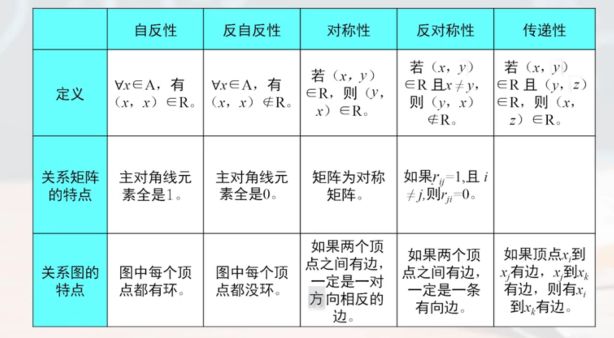
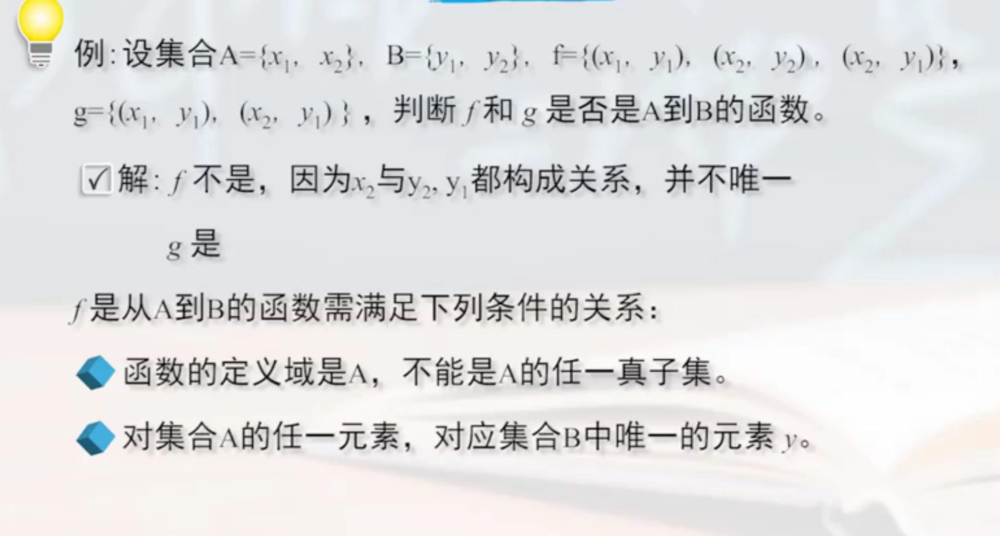
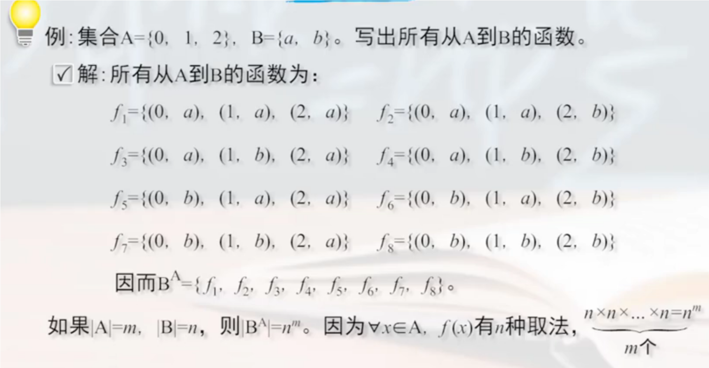
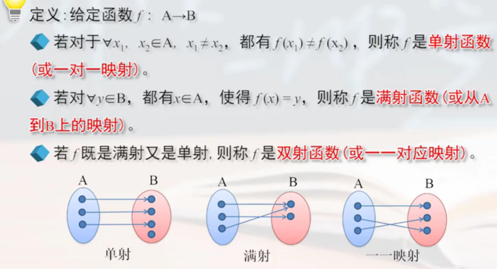
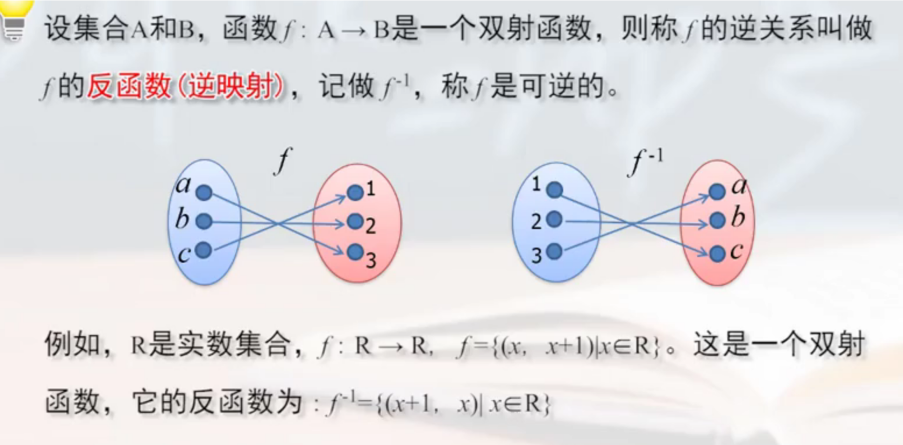

# set (集合)

<!-- @import "[TOC]" {cmd="toc" depthFrom=1 depthTo=6 orderedList=false} -->

<!-- code_chunk_output -->

- [set (集合)](#set-集合)
    - [概述](#概述)
      - [1.概念](#1概念)
        - [(1) 描述方法](#1-描述方法)
        - [(2) 特殊集合](#2-特殊集合)
      - [2.集合关系](#2集合关系)
      - [3.集合运算](#3集合运算)
        - [(1) 幂 (power)](#1-幂-power)
        - [(2) 差](#2-差)
        - [(3) 补集](#3-补集)
        - [(4) 对称差](#4-对称差)
        - [(5) 后继集](#5-后继集)
      - [4.关系](#4关系)
        - [(1) 有序对 (可扩展有序n元组)](#1-有序对-可扩展有序n元组)
        - [(2) 笛卡尔积 (直积)](#2-笛卡尔积-直积)
        - [(3) 二元关系 (可扩展n元关系)](#3-二元关系-可扩展n元关系)
        - [(4) 关系的表示](#4-关系的表示)
      - [5.关系运算](#5关系运算)
        - [(1) 逆运算](#1-逆运算)
        - [(2) 复合运算（合成运算）](#2-复合运算合成运算)
        - [(3) n次幂运算](#3-n次幂运算)
      - [6.关系的性质](#6关系的性质)
        - [(1) 自反关系 (reflexive relation)](#1-自反关系-reflexive-relation)
        - [(2) 反自反关系 (anti-reflexive relation)](#2-反自反关系-anti-reflexive-relation)
        - [(3) 对称关系 (symmetrical relation)](#3-对称关系-symmetrical-relation)
        - [(4) 反对称关系 (anti-symmetrical relation)](#4-反对称关系-anti-symmetrical-relation)
        - [(5) 传递关系 (transitive relation)](#5-传递关系-transitive-relation)
      - [7.关系闭包 (closure)](#7关系闭包-closure)
        - [(1) 定义](#1-定义)
        - [(2) 常见闭包](#2-常见闭包)
        - [(3) 闭包定理](#3-闭包定理)
      - [8.等价关系 (equivalence relation)](#8等价关系-equivalence-relation)
        - [(1) 定义](#1-定义-1)
        - [(2) 等价类](#2-等价类)
        - [(3) 商集](#3-商集)
      - [9.偏序关系 (Partial ordering relation)](#9偏序关系-partial-ordering-relation)
        - [(1) 定义](#1-定义-2)
        - [(2) 全序关系](#2-全序关系)
        - [(3) 最小（大）元 和 极小（大）元](#3-最小大元-和-极小大元)
        - [(4) 上（下）界和上（下）确界](#4-上下界和上下确界)
        - [(5) 良序关系](#5-良序关系)
      - [10.函数 (特殊关系)](#10函数-特殊关系)
        - [(1) 定义](#1-定义-3)
        - [(2) $B^A$ (B上A)](#2-ba-b上a)
        - [(3) 映射](#3-映射)
        - [(4) 复合函数](#4-复合函数)
        - [(5) 反函数（逆映射）](#5-反函数逆映射)
      - [11.集合的基数](#11集合的基数)
        - [(1) 等基数（等势）](#1-等基数等势)
        - [(2) 基数比较](#2-基数比较)
        - [(3) 有限集合和无限集合](#3-有限集合和无限集合)
        - [(4) 可数集合（可列集合）](#4-可数集合可列集合)

<!-- /code_chunk_output -->

### 概述

#### 1.概念

##### (1) 描述方法

* 列举法
* 描述法*
    * `B={x | P(x)}`
        * 其中谓词公式P(x)必须明确范围
        * 比如: `B={x | 3<x<6}`
* 归纳法

##### (2) 特殊集合
* 有限集
* 无限集
* 空集
* 全集

#### 2.集合关系

* 相等关系
* 包含关系

#### 3.集合运算

##### (1) 幂 (power)
幂集记作：P(A) 或者 $2^A$ 
* $P(A) = \{x | x\subseteq A\}$
* x是A的所有子集，有$2^n$个

##### (2) 差

$A-B=\{x|x\in A\land x\notin B\}$ 

##### (3) 补集
设$A\subseteq E$,$~A=E-A=\{x|x\in E\land x\notin A\}$

##### (4) 对称差
$A\oplus B=(A-B)\cup(B-A)=\{x|(x\in A\land x\notin B)\lor(x\in B\land x\notin A)\}$

##### (5) 后继集

$A^+=A\cup\{A\}$

#### 4.关系

##### (1) 有序对 (可扩展有序n元组)

* 有序n元组形如: $(a_1,a_2,...,a_n)$
    * 其中$a_i$是按顺序排列的

##### (2) 笛卡尔积 (直积)

* $A\times B=\{(x,y)|x\in A\land y\in B\}$
    * 其中(x,y)是有序对

* 举例: A={a,b,c} B={1,3}
    * $A\times B=\{(a,1),(a,3),(b,1),(b,3),(c,1),(c,3)\}$
    * $B\times A=\{(1,a),(1,b),(1,c),(3,a),(3,b),(3,c)\}$
    * $A\times\empty=\empty$
    * $\empty\times B=\empty$

##### (3) 二元关系 (可扩展n元关系)

* 当集合的元素为**有序对**，则称该集合为二元关系
    * 当有序对$(a,b)\in R$，则称a和b有R关系，记作aRb
    * 所有有序对的第一个元素构成的集合 称为 该关系的 定义域（或前域）
    * 所有有序对的第二个元素构成的集合 称为 该关系的 值域（或后域）
* $A\times B$的任意一个子集 是 集合A到B的一个二元关系

* 空关系： $\empty$
* 全域关系： $E_A=A\times A$
* 恒等关系： $I_A=\{(x,x)|x\in A\}$
    * 比如A={a,b}
    * 则$E_A=\{(a,a),(a,b),(b,a),(b,b)\}$
    * 则$I_A=\{(a,a),(b,b)\}$

##### (4) 关系的表示

* 集合
* 关系图
* 矩阵

#### 5.关系运算

##### (1) 逆运算
$R^{-1}=\{(y,x) | xRy\}$
* 就是交换有序对的顺序

##### (2) 复合运算（合成运算）
* 设R是A到B上的二元关系，S是B到C上的二元关系
* $S\circ R={(x,z)|x\in A\land z\in C\land \exists y(y\in B\land(x,y)\in  R\land(y,z)\in S)}$
    * 根据R（A和B的关系）和S（B和C的关系），能够得到$S\circ R$（A和C的关系）

##### (3) n次幂运算
* $R^0=I_A=\{(x,x)|x\in A\}$
* $R^n=R^{n-1}\circ R$
* 具有周期性，即存在a，当n>=a是3，$R^n=R^a$

#### 6.关系的性质

##### (1) 自反关系 (reflexive relation)
* 设R是集合A上的一个关系
* 如果对于A中的每一个元素x，均有$(x,x)\in R$，则称R是自反关系，表示如下：
    * $\forall x(x\in A\to(x,x)\in R)$
* 例如：
    * 正整数集合上的整除关系，相等关系 都是 自反关系
    * 大于关系，小于关系 都不是 自反关系

##### (2) 反自反关系 (anti-reflexive relation)
* 设R是集合A上的一个关系
* 如果对于A中的每一个元素x，均有$(x,x)\notin R$，则称R是反自反关系，表示如下：
    * $\forall x(x\in A\to(x,x)\notin R)$
* 例如：
    * 大于关系，小于关系 都是 反自反关系

##### (3) 对称关系 (symmetrical relation)
* 设R是集合A上的一个关系
* 如果对于A中的个元素x和y，如有$(x,y)\in R$，则必有$(y,x)\in R$，则称R是对称关系，表示如下：
    * $\forall x\forall y(x\in A\land y\in A\land(x,y)\in R\to(y,x)\in R)$
* 例如:
    * 整数集合上的等于关系，任何集合的全域关系，同学关系 都是 对称关系

##### (4) 反对称关系 (anti-symmetrical relation)
* 设R是集合A上的一个关系
* 如果对于A中的个元素x和y，如$(x,y)\in R$和$(y,x)\in R$，就必有x=y，则称R是反对称关系，表示如下：
    * $\forall x\forall y(x\in A\land y\in A\land(x,y)\in R\land(y,x)\in R\to x=y)$
        * 即当$(x,y)\in R$时且$x\neq y$时，则$(y,x)\notin R$
* 例如：
    * 大于关系、小于关系 都是 反对称关系

##### (5) 传递关系 (transitive relation)
* 设R是集合A上的一个关系
* 如果对于A中的个元素x、y、z，若$(x,y)\in R$，$(y,z)\in R$，必有$(x,z)\in R$，则称R是传递关系，表示如下：
    * $\forall x\forall y\forall z(x\in A\land y\in A\land z\in A\land(x,y)\in R\land(y,z)\in R\to (x,z)\in R)$
* 例如:
    * 大于关系、小于关系 都是 传递关系

#### 7.关系闭包 (closure)

##### (1) 定义
**添加**有序对后，满足某种关系**性质**的**最小集**，具体定义：
* 设R是非空集合A的二元关系，则必包R'需要满足：
    * R‘具有自反性（或 对称性 或 传递性等）
    * $R \subseteq R'$ (R'是在R的基础上添加有序对得到的)
    * 满足上述条件的最小集（对于任何包含R的自反关系R''，$都有R' \subseteq R''$

##### (2) 常见闭包
* 自反闭包：一般记作r(R)
* 对称闭包：一般记作s(R)
* 传递闭包：一般记作t(R)

##### (3) 闭包定理

#### 8.等价关系 (equivalence relation)

##### (1) 定义
* 设R是集合A上的一个关系
* 若R是自反的、对称的和传递的，则称R为A上的**等价关系**
    * 若$(x,y)\in R$，则称**x等价于y**，记作x~y
* 例如：
    * 集合上的恒等关系、全域关系等

##### (2) 等价类
* 设R是集合A上的等价关系，x是A中的一个元素
* 所有与x等价的元素 组成的集合，称为等价类，记作$[x]_R$
    * $[x]_R=\{y|y\in A\land xRy\}$

##### (3) 商集
* 设R是集合A上的等价关系
* 以R的所有等价类为元素 构成的集合，称为A在R下的商集，记作A/R
    * $A/R=\{[x]_R|x\in A\}$

#### 9.偏序关系 (Partial ordering relation)

偏序用于研究元素间是否可以进行大小比较和排序
* 偏序的意思是：不是所有元素之间都可以进行比较

##### (1) 定义
* 设R是集合A上的一个关系
* 若R是自反的、反对称的和传递的，则称R为A上的**偏序关系**，记作$\preccurlyeq$
    * $(a,b)\in R$，$a\preccurlyeq b$，表示a在b的前面（不是传统意义的小于等于）

* 集合A和A上的偏序关系一起叫做偏序集，记作$(A,\preccurlyeq)$

##### (2) 全序关系

* 设$(A,\preccurlyeq)$为偏序集
* 若对任意的$x,y\in R$，x和y都可比，则称$\preccurlyeq$为A上的全序关系，且称$(A,\preccurlyeq)$为全序集（也称线序集）

##### (3) 最小（大）元 和 极小（大）元
* 设$(A,\preccurlyeq)$为偏序集，且$B\subseteq A$
    * 若$\exists y(y\in B)$，使得$\forall x(x\in B\to y\preccurlyeq x)$，则称y是B的**最小元**
        * 意思就是每个元素都要可比（即全在全序关系）
    * 若$\exists y(y\in B)$，使得$\neg\exists x(x\in B\land y\prec x)$，则称y是B的**极小元**
        * 意思就是不是每个元素都是可以（即只有偏序关系）
    * 若$\exists y(y\in B)$，使得$\forall x(x\in B\to x\preccurlyeq y)$，则称y是B的**最大元**
        * 意思就是每个元素都要可比（即全在全序关系）
    * 若$\exists y(y\in B)$，使得$\neg\exists x(x\in B\land x\prec y)$，则称y是B的**极大元**
        * 意思就是不是每个元素都是可以（即只有偏序关系）

##### (4) 上（下）界和上（下）确界
* 设$(A,\preccurlyeq)$为偏序集，且$B\subseteq A$
    * 若$\exists y(y\in A)$，使得$\forall x(x\in B\to y\preccurlyeq x)$，则称y是B的**下界**
    * 若y是B的下界，且对B的任意下界b均有 $b\preccurlyeq y$，则称y是B的**最大下界（下确界面）**
    * 若$\exists y(y\in A)$，使得$\forall x(x\in B\to x\preccurlyeq y)$，则称y是B的**上界**
    * 若y是B的下界，且对B的任意下界b均有 $y\preccurlyeq b$，则称y是B的**最小上界（上确界面）**

##### (5) 良序关系
* 设$(A,\preccurlyeq)$为偏序集
* 若A的每一个非空子集都存在最小元，则称$(A,\preccurlyeq)$为良序关系

#### 10.函数 (特殊关系)

##### (1) 定义
* 设f是从集合A到集合B的一个二元关系
* 对于**任一**$x\in A$，都有**唯一**的$y\in B$，使得$(x,y)\in f$
* 则称f为A到B的函数或映射，记作$f:A\to B$

##### (2) $B^A$ (B上A)
* 设A、B为集合，**所有**从A到B的函数构成$B^A$，即
    * $B^A=\{f|f: A\to B\}$

##### (3) 映射

* 简单理解
    * **单射**是针对x的（即x值都会覆盖），且x不同，f(x)也不同
    * **满射**是针对f(x)的（即f(x)的值都会覆盖）
    * **双射**就是既是单射又是满射

##### (4) 复合函数
* 设$f: A\to B$，$g: B\to C$
* $g\circ f = g(f(x))$
    * 注意： f的值域必须是g的定义域的子集

##### (5) 反函数（逆映射）

#### 11.集合的基数

基数：集合的元素的个数

##### (1) 等基数（等势）
* 若存在双射函数$f: A\to B$
* 则称A和B是等势的或等基数
* 记作A~B 或 |A|=|B| 

##### (2) 基数比较
* 若存在单射函数$f: A\to B$
* 则称A的基数小于等于B的基数
* 记作 $|A|\le |B|$

##### (3) 有限集合和无限集合
* 基数为自然数的集合称为有限集合
    * 基数为自然数表示集合的元素数量是个自然数，即集合的元素数量有限
* 非有限集合称为无限集合

##### (4) 可数集合（可列集合）
* 所有与自然数集合等基数的集合 都称为可数集合（或可列集合）
* 比如开区间(0,1)就是不可列的