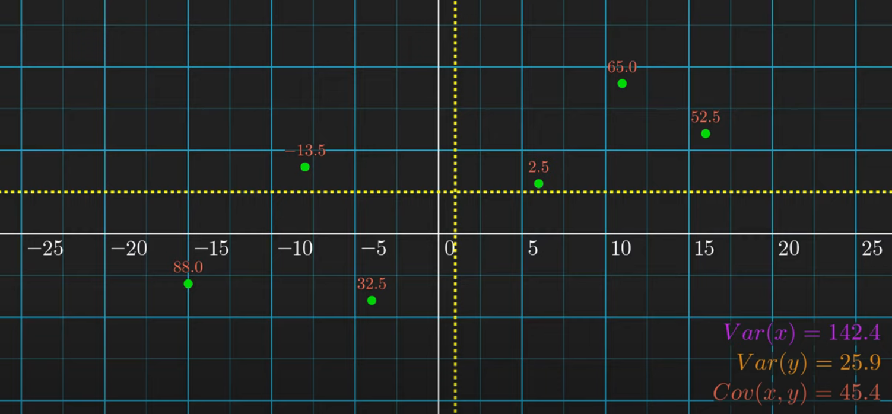

# overview

<!-- @import "[TOC]" {cmd="toc" depthFrom=1 depthTo=6 orderedList=false} -->

<!-- code_chunk_output -->

- [overview](#overview)
    - [概述](#概述)
      - [1.基本概念](#1基本概念)
        - [(1) expectation (mean): $\mu$](#1-expectation-mean-mu)
        - [(2) variance (squared deviation): $\sigma^2$](#2-variance-squared-deviation-sigma2)
        - [(3) standard deviation: $\sigma$](#3-standard-deviation-sigma)
        - [(3) covariance](#3-covariance)
        - [(4) correlation](#4-correlation)
      - [2.normalization in statistic (统计学中的归一化)](#2normalization-in-statistic-统计学中的归一化)
        - [(1) Z-score normalization](#1-z-score-normalization)
      - [3.normalization in probability distribution (概率分布中的归一化)](#3normalization-in-probability-distribution-概率分布中的归一化)
        - [(1) standard normalization](#1-standard-normalization)
        - [(2) softmax](#2-softmax)

<!-- /code_chunk_output -->

### 概述

#### 1.基本概念

##### (1) expectation (mean): $\mu$
* $E[X] = \sum_{i=1}^n x_ip_i = \frac{sum(X)}{num(X)}$

##### (2) variance (squared deviation): $\sigma^2$

* $Var(X) = E[(X-\mu)^2] = \frac{1}{n}\sum_{i=1}^n(x_i-\mu)^2$

##### (3) standard deviation: $\sigma$

* $\sigma = \sqrt {Var(X)}$

##### (3) covariance
* $Cov(X,Y) = E[(X-E[X])(Y-E[Y])] = \frac{1}{n}\sum_{i=1}^n(x_i-\mu_x)(y_i-\mu_y)$
    * 能够反映 X和Y变化的趋势方向（但不能反映趋势强度）：
        * 为正数时：x值越大（小），y值往往也越大（小）
        * 为负数时：x值越大，y值往往越小
        * 等于0时：y往往不随x变化

##### (4) correlation

* $Corr(X,Y) = \frac{Cov(X,Y)}{\sqrt {Var(X)} \sqrt {Var(Y)}}$
    * 范围: -1 ~ 1
    * 能够反映 X和Y变化的趋势方向和强度：
      * 当Corr的绝对值越接近于1，X和Y的关联度越高
        * 注意：这只是观察现象，并不是本质原因，可能还有更多变量，这里只关注X和Y的关系
    
    

* matrix correlation
  * 就是该元素的所在行和所在列的correlation

#### 2.normalization in statistic (统计学中的归一化)

使得数据分布符合一定要求

##### (1) Z-score normalization
* $Z = \frac{x - \mu}{\sigma}$

#### 3.normalization in probability distribution (概率分布中的归一化)

所有概率加起来等于1

##### (1) standard normalization
* $a_j = \frac{z_j}{\sum_{k=1}^{N}{z_k}}$

##### (2) softmax

* $a_j = \frac{e^{z_j}}{\sum_{k=1}^{N}{e^{z_k}}}$