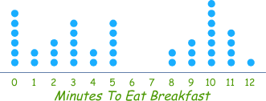
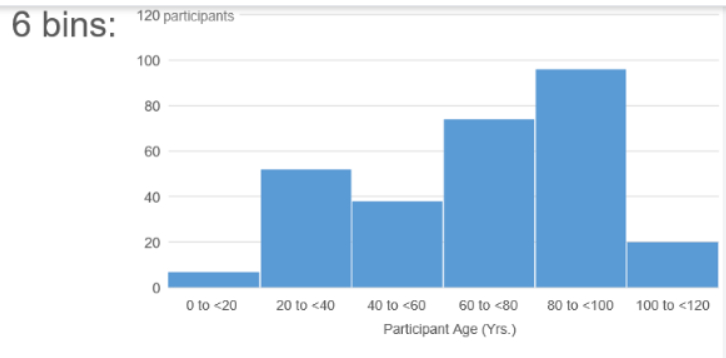
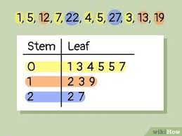
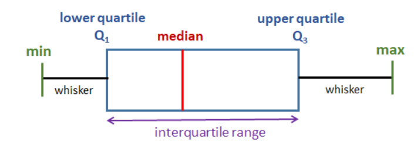

# overview

<!-- @import "[TOC]" {cmd="toc" depthFrom=1 depthTo=6 orderedList=false} -->

<!-- code_chunk_output -->

- [overview](#overview)
    - [概述](#概述)
      - [1.数据的展示](#1数据的展示)
        - [(1) frequence table](#1-frequence-table)
        - [(2) dot plots](#2-dot-plots)
        - [(3) histogram (bins/buckets/categories)](#3-histogram-binsbucketscategories)
        - [(4) stem-and-leaf plot](#4-stem-and-leaf-plot)
        - [(5) whisker plot (box plot)](#5-whisker-plot-box-plot)
        - [(6) line graphs](#6-line-graphs)

<!-- /code_chunk_output -->

### 概述

#### 1.数据的展示

##### (1) frequence table

##### (2) dot plots

##### (3) histogram (bins/buckets/categories)

* 6个bins bins/buckets/categories

##### (4) stem-and-leaf plot

##### (5) whisker plot (box plot)

  * min/max: 最小/最大 值
  * median: 中位数，如果是偶数序列，就是中间两个数相加/2
  * lower quartile: median将序列划分为两部分，第一部分的median (即25%位置处的数据)
  * upper quartile: median将序列划分为两部分，第二部分的median（即75%位置处的数据）
  * 所以interquartile range (IQR) 有50%的数据（即处在25%-75%范围内的数据），能够体现大致的数据分布

##### (6) line graphs
* 展示变化趋势