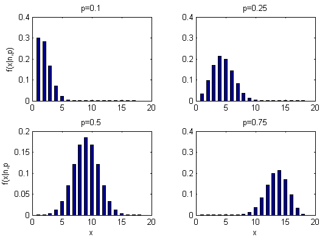

# probability

<!-- @import "[TOC]" {cmd="toc" depthFrom=1 depthTo=6 orderedList=false} -->

<!-- code_chunk_output -->

- [probability](#probability)
    - [overview](#overview)
      - [1.基础概念](#1基础概念)
        - [(1) Venn diagram](#1-venn-diagram)
        - [(2) 常用表示](#2-常用表示)
      - [2.independence](#2independence)
      - [3.coditional probability](#3coditional-probability)
        - [(1) 求A概率](#1-求a概率)
        - [(2) bayes formula](#2-bayes-formula)
      - [4.probability using combinations](#4probability-using-combinations)
        - [(1) permutation and combination](#1-permutation-and-combination)
        - [(2) fair probability](#2-fair-probability)
        - [(3) unfair probability](#3-unfair-probability)
      - [5.random variables](#5random-variables)
        - [(1) combine random variables](#1-combine-random-variables)
        - [(2) binomial random variables](#2-binomial-random-variables)
        - [(3) geometric random variables](#3-geometric-random-variables)
      - [6.probability distribution](#6probability-distribution)
        - [(1) probability mass function vs probability density](#1-probability-mass-function-vs-probability-density)
        - [(2) uniform distribution](#2-uniform-distribution)
        - [(3) Bernoulli distribution](#3-bernoulli-distribution)
        - [(4) binomial distribution](#4-binomial-distribution)
        - [(5) geometric distribution](#5-geometric-distribution)
        - [(6) Poisson distribution](#6-poisson-distribution)
      - [7.normalization in probability distribution (概率分布中的归一化)](#7normalization-in-probability-distribution-概率分布中的归一化)
        - [(1) standard normalization](#1-standard-normalization)
        - [(2) softmax](#2-softmax)

<!-- /code_chunk_output -->

### overview

#### 1.基础概念

##### (1) Venn diagram
Venn diagram不能反映依赖关系，只能反映事件是否有重叠

##### (2) 常用表示

* $P(A \cap B)$
  * joint probability: 表示A和B同时发生的概率

* $P(A \cup B)$
  * 表示A或B任意一个发生的概率

#### 2.independence

* independence
  * $P(A \cup B) = P(A) + P(B)$
  * $P(A \cap B) = P(A)\cdot P(B)$

* dependence
  * $P(A \cup B) = P(A) + P(B) - P(A \cap B)$
  * $P(A \cap B)=P(B) \cdot P(A|B) = P(A) \cdot P(B|A)$

#### 3.coditional probability

* $P(A \cap B)=P(B) \cdot P(A|B) = P(A) \cdot P(B|A)$

##### (1) 求A概率
* $P(A) = P(A \cap B) + P(A \cap \neg B)=P(B) \cdot P(A|B) + P(\neg B) \cdot P(A|\neg B)$

##### (2) bayes formula
* $P(B) \cdot P(A|B) = P(A) \cdot P(B|A)$

#### 4.probability using combinations

##### (1) permutation and combination

* permutation有P(n,k)中情况：$P(n,k)=\frac{n!}{(n-k)!}$ 
    * 在意顺序
    * 比如：5个人坐3张椅子，ABC和BAC是不一样的
* combination有C(n,k)中情况：$C(n,k)=\frac{P(n,k)}{k!}=\frac{n!}{(n-k)! \times k!}$ 
    * 不在意顺序
    * 比如：5个人坐3张椅子，ABC和BAC是一样的

##### (2) fair probability

* P(k heads in n throws of coins) = $\frac{C(n,k)}{2^n} = \frac{n!}{(n-k)! \times k! \times 2^n}$

##### (3) unfair probability

* 比如: heads朝上的概率为80%
* P(k heads in n throws of coins) = $C(n,k)\times 0.8^k\times 0.2^{(n-k)} = \frac{n!}{(n-k)! \times k!}\times 0.8^k\times 0.2^{(n-k)}$

#### 5.random variables

* 即用变量（比如：X）表示该事件（有多种可能的结果），方便后续的probability distribution等研究
    * 比如: 
        * 抛硬币，用X表示事件：当为head，X=1，当为tail，X=0
        * 扔骰子，用X表示事件：当为1点时，X=1，当为2点时，X=2，依次类推
* random varaibles分为discrete和continuous
    * 对于连续的比如：用X表示明天降雨量

##### (1) combine random variables
* assume X,Y independent
  * $E(X,Y)=E(X)+E(Y)$
  * $Var(X\pm Y)=Var(X)+Var(Y)$

##### (2) binomial random variables

* X: number of successes in **n** trials where P(success) for each trial is **p**
* $P(X=k)=C(n,k)\cdot p^k\cdot (1-p)^{(n-k)}$
  * why called binomial: k,n

* 10% rule of assuming independence between trials
  * 比如：要从一个班级中选3个男生
    * 当班级的人数很少时，不放回和放回的选，相差的概率很大
    * 当班级的人数很多时（即 3/total<10%），不放回和放回的选，相差不大，所以可以假设不放回的选也是independent的

##### (3) geometric random variables
* X: how many trails until success where P(success) for each trial is **p**
* $P(X=k)=(1-p)^{k-1}p$

#### 6.probability distribution

##### (1) probability mass function vs probability density
* discrete: probability mass function
* continuous: probability density function
    * **面积**是事件发生的概率

##### (2) uniform distribution
每种可能出现的概率相等

##### (3) Bernoulli distribution

* $P(X) = \begin{cases} 1-p & X=0\\ p&X=1 \end{cases}$
  * 
  * $E(X)=\sum_{i=1}^n x_ip_i = 0\cdot(1-p) + 1\cdot p=p$
  * $Var(x)=E[(X-\mu)^2]=(1-p)(0-p)^2+p(1-p)^2=p(1-p)$

##### (4) binomial distribution
discrete version of normal distribution
* $P(X=k)=C(n,k)\cdot p^k\cdot (1-p)^{(n-k)}$
  * 
  * 平均成功的次数：$E(X)=nE(\text {number of successes one trial})=np$
  * $Var(x)=nVar(\text {number of successes one trial})=np(1-p)$

##### (5) geometric distribution
* $P(X=k)=(1-p)^{k-1}p$
  * $E(X)=\frac{1}{p}$
    * 推导:
      * $E(X)=p+2p(1-p)+3p(1-p)^2+...$
      * $(1-p)E(X)=p(1-p)+2p(1-p)^2+...$
      * 相减： $pE(X)=p+p(1-p)+p(1-p)^2+...$

##### (6) Poisson distribution
* 已知 事件X在t时间间隔内发生的平均次数，且时间都是相互独立的：$E(X)=\lambda$
* 转换为离散概率分布（binomial distribution）进行分析：
  * 将时间间隔t细粒度化: 将$\frac{t}{n}, n\to\infty$看成一次实验，在这段有时间X发生一次，则认为成功（$p=\frac{\lambda}{n}$），否则认为失败
  * 则 $P(X=k)=\lim_{n\to\infty}C(n,k)(\frac{\lambda}{n})^k(1-\frac{\lambda}{n})^{n-k}$

* 根据上述公式推导得出：$P(X=k)=\frac{\lambda^k}{k!}e^{-\lambda}$

#### 7.normalization in probability distribution (概率分布中的归一化)

所有概率加起来等于1

##### (1) standard normalization
* $a_j = \frac{z_j}{\sum_{k=1}^{N}{z_k}}$

##### (2) softmax

* $a_j = \frac{e^{z_j}}{\sum_{k=1}^{N}{e^{z_k}}}$