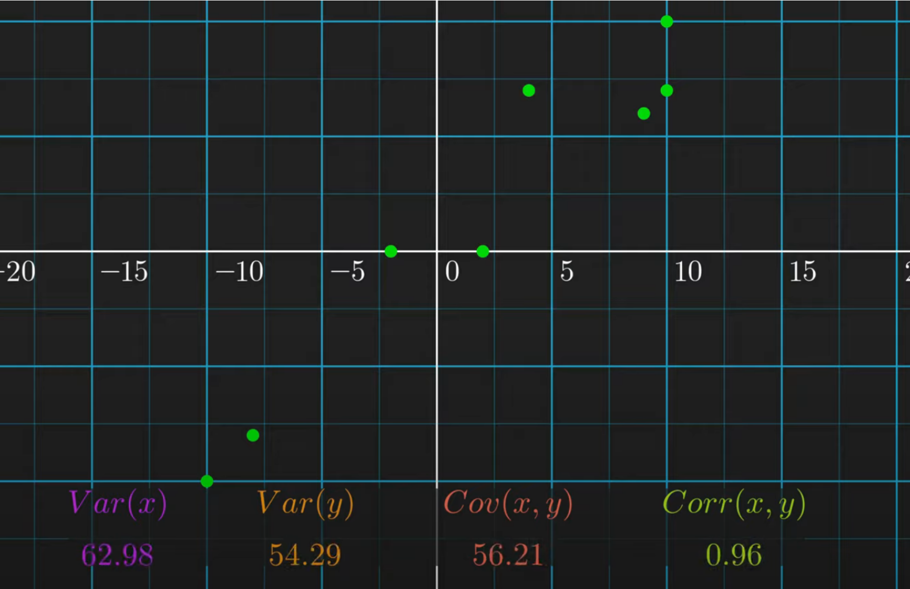
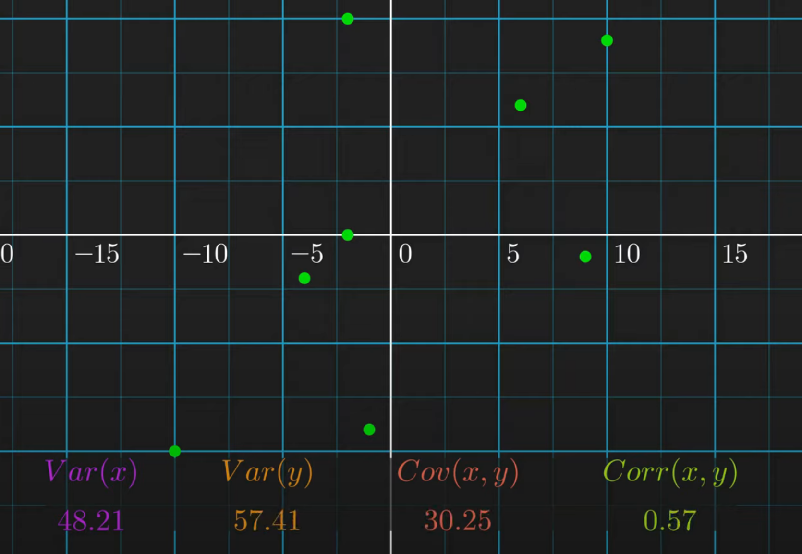

# statistics

<!-- @import "[TOC]" {cmd="toc" depthFrom=1 depthTo=6 orderedList=false} -->

<!-- code_chunk_output -->

- [statistics](#statistics)
    - [overview](#overview)
      - [1.population and sample](#1population-and-sample)
      - [2.基本统计](#2基本统计)
        - [(1) expectation (mean): $\mu$](#1-expectation-mean-mu)
        - [(2) variance (squared deviation): $\sigma^2$](#2-variance-squared-deviation-sigma2)
        - [(3) standard deviation: $\sigma$](#3-standard-deviation-sigma)
        - [(3) covariance](#3-covariance)
        - [(4) correlation](#4-correlation)
      - [3.sample的基本统计](#3sample的基本统计)
        - [(1) 为什么除以n-1](#1-为什么除以n-1)
      - [4.normalization in statistic (统计学中的归一化)](#4normalization-in-statistic-统计学中的归一化)
        - [(1) Z-score normalization](#1-z-score-normalization)
      - [5.normalization in probability distribution (概率分布中的归一化)](#5normalization-in-probability-distribution-概率分布中的归一化)
        - [(1) standard normalization](#1-standard-normalization)
        - [(2) softmax](#2-softmax)

<!-- /code_chunk_output -->

### overview

#### 1.population and sample

当无法对整体进行统计时（由于数量大、数据无法获得等），可以进行采样统计，从而反映整体的统计信息

#### 2.基本统计

##### (1) expectation (mean): $\mu$
* $E[X] = \sum_{i=1}^n x_ip_i = \frac{sum(X)}{num(X)}$

##### (2) variance (squared deviation): $\sigma^2$

* $Var(X) = E[(X-\mu)^2] = \frac{1}{n}\sum_{i=1}^n(x_i-\mu)^2$

##### (3) standard deviation: $\sigma$

* $\sigma = \sqrt {Var(X)}$

##### (3) covariance
* $Cov(X,Y) = E[(X-E[X])(Y-E[Y])] = \frac{1}{n}\sum_{i=1}^n(x_i-\mu_x)(y_i-\mu_y)$
    * 能够反映 X和Y变化的趋势方向（但不能反映趋势强度）：
        * 为正数时：x值越大（小），y值往往也越大（小）
        * 为负数时：x值越大，y值往往越小
        * 等于0时：y往往不随x变化

##### (4) correlation

* $Corr(X,Y) = \frac{Cov(X,Y)}{\sqrt {Var(X)} \sqrt {Var(Y)}}$
    * 范围: -1 ~ 1
    * 能够反映 X和Y变化的趋势方向和强度：
      * 当Corr的绝对值越接近于1，X和Y的关联度越高
        * 注意：这只是观察现象，并不是本质原因，可能还有更多变量，这里只关注X和Y的关系
    
    

* matrix correlation
  * 就是该元素的所在行和所在列的correlation

#### 3.sample的基本统计

* mean: $\overline {x}$
* variance:
  * biased variance: $S^2_n=\frac{1}{n}\sum_{i=1}^n(x_i-\mu)^2$
  * unbiased variance: $S^2_{n-1}=\frac{1}{n-1}\sum_{i=1}^n(x_i-\mu)^2$
* standard deviation
  * biased standard deviation: $S_n$
  * unbiased standard deviation: $S_{n-1}$

##### (1) 为什么除以n-1
* 没有明确的证明，sample时，除以n-1，方差更准确
  * 当sample数量越多时
    * 数据越接近population
    * n-1影响就会越小

#### 4.normalization in statistic (统计学中的归一化)

使得数据分布符合一定要求

##### (1) Z-score normalization
* $Z = \frac{x - \mu}{\sigma}$

#### 5.normalization in probability distribution (概率分布中的归一化)

所有概率加起来等于1

##### (1) standard normalization
* $a_j = \frac{z_j}{\sum_{k=1}^{N}{z_k}}$

##### (2) softmax

* $a_j = \frac{e^{z_j}}{\sum_{k=1}^{N}{e^{z_k}}}$