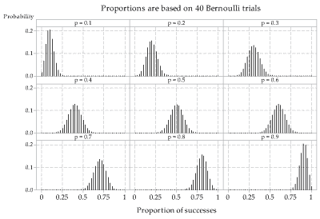
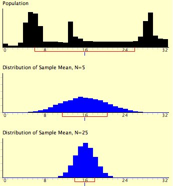
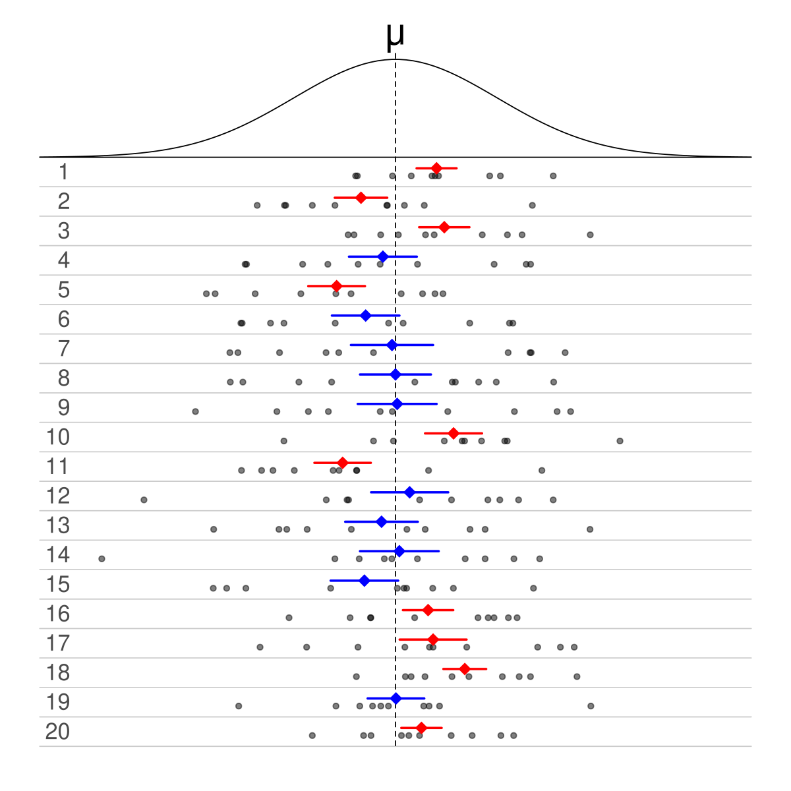
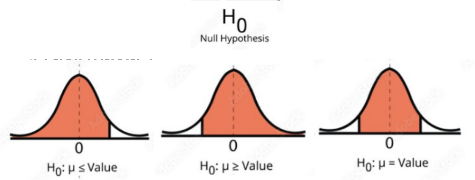
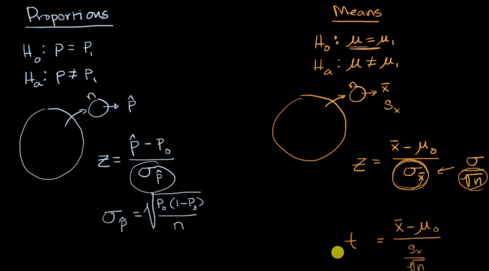
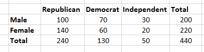

# population and sample

<!-- @import "[TOC]" {cmd="toc" depthFrom=1 depthTo=6 orderedList=false} -->

<!-- code_chunk_output -->

- [population and sample](#population-and-sample)
    - [overview](#overview)
      - [1.population and sample](#1population-and-sample)
        - [(1) sample measures](#1-sample-measures)
        - [(2) 为什么除以n-1](#2-为什么除以n-1)
        - [(3) random sample strategies](#3-random-sample-strategies)
        - [(4) sample bias](#4-sample-bias)
      - [2.sampling distribution](#2sampling-distribution)
        - [(1) sampling distribution of a sample propotion](#1-sampling-distribution-of-a-sample-propotion)
        - [(2) sampling distribution of a sample mean (central limit theorem)](#2-sampling-distribution-of-a-sample-mean-central-limit-theorem)
        - [(3) 特殊情况](#3-特殊情况)
      - [3.sampling distribution分析population的前提条件（下文都使用到了）](#3sampling-distribution分析population的前提条件下文都使用到了)
        - [(1) random sample](#1-random-sample)
        - [(2) normal distribution](#2-normal-distribution)
        - [(3) independent:](#3-independent)
      - [4.confidence intervals](#4confidence-intervals)
        - [(1) confidence intervals and margin of error](#1-confidence-intervals-and-margin-of-error)
        - [(2) estimating a population proportion with z statistics](#2-estimating-a-population-proportion-with-z-statistics)
        - [(3) estimating a population mean with t statistics](#3-estimating-a-population-mean-with-t-statistics)
      - [5.significance test](#5significance-test)
        - [(1) null hypothesis and alternative hypothesis](#1-null-hypothesis-and-alternative-hypothesis)
        - [(2) P-value](#2-p-value)
        - [(3) Type I Error and Type II Error and Power](#3-type-i-error-and-type-ii-error-and-power)
        - [(4) test proportions (z statistics) vs test means (t statistics)](#4-test-proportions-z-statistics-vs-test-means-t-statistics)
      - [6.goodness-of-fit test](#6goodness-of-fit-test)
        - [(1) Chi-square distribution](#1-chi-square-distribution)
        - [(2) Chi-square test](#2-chi-square-test)
        - [(3) goodness-of-fit test](#3-goodness-of-fit-test)

<!-- /code_chunk_output -->

### overview

#### 1.population and sample

当无法对整体进行统计时（由于数量大、数据无法获得等），可以进行采样统计，从而反映整体的统计信息

##### (1) sample measures
* propotion: $\hat p$
* mean: $\overline {x}$
* variance: $S^2$
  * biased variance: $S^2_n=\frac{1}{n}\sum_{i=1}^n(x_i-\mu)^2$
  * unbiased variance: $S^2_{n-1}=\frac{1}{n-1}\sum_{i=1}^n(x_i-\mu)^2$
* standard deviation: $S$
  * biased standard deviation: $S_n$
  * unbiased standard deviation: $S_{n-1}$

##### (2) 为什么除以n-1
* 没有明确的证明，sample时，除以n-1，方差更准确
  * 当sample数量越多时
    * 数据越接近population
    * n-1影响就会越小

##### (3) random sample strategies
* simple random sample
* stratified sample
  * 比如：大一，大二，大三，大四，每一个年级抽取一部分样本
* clustered sample
  * 比如：在全校，抽取几个班级的学生

##### (4) sample bias 
* voluntary bias
* convenience bias
* reponse bias
* wording bias

#### 2.sampling distribution

**已知population，分析sampling distribution（即每次采样，某种统计指标可能出现的情况）**

##### (1) sampling distribution of a sample propotion
* population
  * X: number of successes in **n** trials (在采样场景下就是n samples) where P(success) for each trial is **p**
  * $\mu_X=np$
  * $\sigma_X=\sqrt{np(1-p)}$
* sample (样本数为：n)
  * 根据10% rule，这里每个样本都可以看作独立的
  * **sample propotion**: propotion of the number of successes to n samples
    * $\hat p=\frac{\text {\# of successes in a sample}}{\text {\# of samples}}=\frac{X}{n}$

* sampling distribution of a sample propotion ($\hat p$)
  * $\mu_{\hat p}=\frac{\mu_X}{n}=p$
  * $\sigma_{\hat p}=\frac{\sigma_X}{n}=\sqrt{\frac{p(1-p)}{n}}$

  * 当p在0.5附近时，趋近于normal distributions
  * 当p较小时（比如0.1）
    * 可能distribution skewd right
      * 因为概率的范围在0-1之间，所以会偏向右边
    * 但当样本数足够多时，$\sigma$就会很小，也会趋近于正态分布
  * 当p较大时（比如0.9）
    * 可能 distribution skewd left
    * 但当样本数足够多时，$\sigma$就会很小，也会趋近于正态分布
  * 趋近**normal distribution**的条件:
    * $np \ge 10$
    * $n(1-p) \ge 10$
  * 当趋近正态分布时，可以使用正太分布的相关特性 进行评估
  
  

##### (2) sampling distribution of a sample mean (central limit theorem)
* 对于任意分布的数据，
  * 每次取n个samples求平均值
  * 当取样次数很大时，样本平均值的分布 趋近正态分布
    * 当n越大，越趋近正态分布

* population
  * 任意分布（各种奇怪的分布都有可能）
    * $\mu$
    * $\sigma$

* sampling distribution of a sample mean ($\overline x$，样本数：n)
  * 根据 central limit theorem，当 $n\ge 30$: 趋近**normal distribution**
    * $\mu_{\overline x}=\mu$
    * $\sigma_{\overline x}^2=\frac{\sigma^2}{n}$

    
  
  * 当 $n\lt 30$: **t-distribution**
    * 当$n\lt 30$时，用样本的$S$估计$\sigma$误差会比较大
      * 在计算mean的confidence interval时，$\sigma_{\overline x}=\frac{\sigma}{\sqrt{n}}\approx \frac{S_{n-1}}{\sqrt{n}}$，会导致underestimate，所以要使用t-distribution
    * t-distribution 有相对应的 t-table（类似于Z-table）

  

##### (3) 特殊情况
* 当population是Bernoulli distribution时，$\hat p=\overline x$，所以 $\hat p$的分布 == $\overline x$ 的分布

#### 3.sampling distribution分析population的前提条件（下文都使用到了）

##### (1) random sample
##### (2) normal distribution
* 对于sampling distribution of a sample propotion:
  * $np \ge 10$
  * $n(1-p) \ge 10$
* 对于sampling distribution of a sample mean:
  * $n\ge 30$
  * 或者 原始的数据 是 正态分布
  * 或者 sample是对称的，且没有outliers
##### (3) independent:
  * 10% rule

#### 4.confidence intervals

**根据某次采样结果**，分析 $\hat p$ 或 $\overline x$ 的**sampling distribution**，**估计** $p$ 或 $\mu$ 可能所在区间

##### (1) confidence intervals and margin of error

* population的指标可以使用smaple来估计
  * $p\approx\hat p=\frac{\text{\# of successes in the sample}}{\text{\# of samples}}$
  * $\mu\approx\overline x$
  * $\sigma\approx S_{n-1}$

* 寻找某个区间（confidence intervals），$p$ 或 $\mu$ 有一定概率（confidence level）落在该区间内
  * 比如: **每一次sample**，$p$ 有 95\% 的机率落在 $[\hat p-2\sigma_{\hat p}\ ,\ \hat p+2\sigma_{\hat p}]$中
    * 95%称为 **confidence level**
    * 这个区间称为 **confidence intervals**
    * $2\sigma_{\hat p}$称为 **margin of error**
    * 其中2称为 **critical value (Z)**
      * 即Z-score

##### (2) estimating a population proportion with z statistics
* $P(\hat p \text{ is within }2\sigma_{\hat p} \text { of } p) \Leftrightarrow P(p \text{ is within }2\sigma_{\hat p} \text { of } \hat p)$
  * 所以问题转换为：根据此次sample，分析 $\hat p$ 的sampling distribution，寻找区间，满足 $P(p \text{ is within } \hat p\pm Z\cdot\sigma_{\hat p})=\text {confidence level}$

##### (3) estimating a population mean with t statistics
* $P(\overline x \text{ is within }2\sigma_{\overline x} \text { of } \mu) \Leftrightarrow P(\mu \text{ is within }2\sigma_{\overline x} \text { of } \overline x)$
  * 所以问题转换为：根据此次sample，分析 $\overline x$ 的sampling distribution，寻找区间，满足 $P(\mu \text{ is within } \overline x\pm t^*\cdot\sigma_{\overline x})=\text {confidence level}$
    * $t^*$的值需要查询t-table
    * 当 **$n\ge 30$**（符合正态分布）或者 知道**population的$\sigma$**，则不需要样本估计方差，则可以使用Z值计算confidence interval
      * $P(\mu \text{ is within } \overline x\pm Z\cdot\sigma_{\overline x})=\text {confidence level}$

* 
  * 每一行是一次sample
  * 每一次sample，$\mu$有confidence level的机率落在confidence intervals的区间中

#### 5.significance test

* make some statements about a parameter in the populaion
* to test it
  * we take a sample of a certain size 
  * 计算样本的统计指标，基于假设（null hypothesis）判断 该指标或更极端情况 出现的概率（P-value），如果概率低于一定的值（significant level），则认为假设错误

##### (1) null hypothesis and alternative hypothesis
* null hypothesis ($H_0$)
  * a **statement** that there is no effect, **no difference**, or no relationship in the **population**
* alternative hypothesis ($H_a$)
  * a **statement** that **contradicts** the **null hypothesis**

* 比如: 
  * 学生应该至少睡8小时，某学校怀疑学生睡眠不足8小时，所以进行抽样调查
    * $H_0: \mu \ge 8$
    * $H_a: \mu < 8$
  * 餐厅的汉堡应该重2kg，但是老板怀疑汉堡没有2kg，所以进行抽样调查
    * $H_0: \mu=2$
    * $H_a: \mu<2$

##### (2) P-value
* make hypothesis
  * $H_0: \mu=20$
  * $H_a: \mu>20$
* significance level: $\alpha$
* take sample:
  * $n=100, \overline x=25$
* P-value
  * $P(\overline x\ge 25 | H_0 \text { is true})$
* conclusion
  * if P-value < $\alpha$
    * reject $H_0$
  * if P-value  >= $\alpha$
    * do not reject $H_0$

##### (3) Type I Error and Type II Error and Power

||$H_0$ true|$H_0$ false|
|-|-|-|
|reject $H_0$|Type I Error|correct conclusion|
|fail to reject $H_0$|correction conclusion|Type II Error|

* 
  * $\alpha$就是 **significance level**
  * $1-\beta$就是 **Power**

* Power = P(rejecting $H_0$ | $H_0$ false) = 1 - P(not rejecting $H_0$ | $H_0$ false) = P(not making Type II Error)

* 如何提高power
  * $\alpha\uparrow$ --> power $\uparrow$, Type I Error $\uparrow$
  * 采样数(n)$\uparrow$ --> power $\uparrow$
  * less variability of the populaion --> power $\uparrow$
  * true parameter far from $H_0$ --> power $\uparrow$

##### (4) test proportions (z statistics) vs test means (t statistics)

  * 当$n\lt 30$时，sampling distrbution of means不符合normal distribution，而是t-distribution，所以使用t statistics

#### 6.goodness-of-fit test

进行数据采样，基于某种假设的分布，判断出现这种采样分布的概率

##### (1) Chi-square distribution
* X: N(0,1)
  * random variable X满足标准正态分布（$\mu=0,\sigma=1$）
* Chi-square (Q): $\chi^2_k$
  * $\chi^2_k=X_1^2+X_2^2+...+X_k^2$
    * k表示自由度
    * 所有X都是标准正态分布
  
  
  * 查询chi-table，能够得到$P(\chi^2_k > n)$

##### (2) Chi-square test
* check if two categorical variables are related or independent
   * 比如：判断性别和政党的偏好是否有联系（参考下面的列子）

* $\chi^2=\sum\limits_{i=1}^{k}\frac{(O_i-E_i)^2}{E_i}$
  * $O_i$: observed frequency
  * $E_i$: expected frequency

* 公式推导
  * 假设每次发生概率为p，则E(x)=np,Var(X)=np(1-p)
  * 则$O-E: N(0,np(1-p))$
  * 则$\frac{O-E}{E}: N(0,\frac{1-p}{np})$
  * 则$\frac{O-E}{\sqrt E}: N(0,1-p)$，去除了n的影响，比较稳定，且更符合正态分布

##### (3) goodness-of-fit test
* 举例一
  * 问题
    * 石头剪刀布有三种情况，win和loss概率为1/4，tie概率为1/2
    * 现在随机进行了24次，结果如下
      * win: 4
      * loss: 13
      * tie: 7
  * 解答
    * $H_0$: 概率分布为上文所说
    * $H_1$: 概率分布不为上文所说
    * $\chi^2=(4-6)^2/6+(13-6)^2/6+(7-12)^/12=10.92$
    * P-value: $P(\chi^2 \ge 10.92)$
      * 查询chi-square表，其中自由度=2

* 举例二
  * 问题
    * 判断性别和政党的偏好是否有联系
      * 
  * 解答
    * $H_0$: 没有联系
    * $H_1$: 有联系
    * 基于假设，能够求出各个期望，比如E(Male and Republican) = 240 * 200/440=109