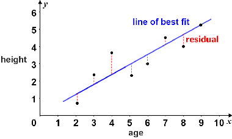

# regression

<!-- @import "[TOC]" {cmd="toc" depthFrom=1 depthTo=6 orderedList=false} -->

<!-- code_chunk_output -->

- [regression](#regression)
    - [overview](#overview)
      - [1.regression](#1regression)
        - [(1) residuals (error)](#1-residuals-error)
        - [(2) 目标: minimize $\sum|r_i|$或$\sum r_i^2$](#2-目标-minimize-sumr_i或sum-r_i2)
      - [2.least-squares regression](#2least-squares-regression)
        - [(1) linear least-squares regression](#1-linear-least-squares-regression)
        - [(2) R-squared (coefficient of determination)](#2-r-squared-coefficient-of-determination)
        - [(3) root-mean-square error (standard deviation of residuals)](#3-root-mean-square-error-standard-deviation-of-residuals)

<!-- /code_chunk_output -->

### overview

#### 1.regression
根据已有数据建立 回归**模型**，**预测**未知数据

##### (1) residuals (error)
* $r_i=y_i-\hat y_i$
    * residual = 实际值 - 预测值

##### (2) 目标: minimize $\sum|r_i|$或$\sum r_i^2$
* $\sum r_i^2$ 提高了outliers的权重

#### 2.least-squares regression

* squared residuals (error): $SE=\sum r_i^2$
* 寻找regression: minimize SE 

##### (1) linear least-squares regression
* 斜率 = $r * \frac{S_y}{S_x}$
    * r: correlation coefficent
    * $S_x$: sample的x值的标准差
    * $S_y$: sample的y值的标准差

* 经过的点: $(\overline x, \overline y)$
    * $\overline x$: sample的x值的平均值
    * $\overline y$: sample的y值的平均值

* 如何推导:
    * 比如: $\hat y=mx+b$
    * 则：$SE=\sum (y_i-mx_i-b)^2$
    * minimize SE，则$\frac{\partial SE}{\partial m}=0$, $\frac{\partial SE}{\partial b}=0$
    * 能够推导出
        * $m\frac{\overline {x^2}}{\overline x}+b=\frac{\overline{xy}}{\overline x}$
        * $m\overline x+b=\overline y$
    * $m=\frac{\overline{xy}-\overline x\ \overline y}{\overline {x^2}-(\overline x)^2} = \frac{Cov(x,y)}{Cov(x,x)} = \frac{Cov(x,y)}{Var(x)}$

##### (2) R-squared (coefficient of determination)

* R-squared measures how much prediction error we eliminated
    * 类似于[correlation coefficient (r)](./overview.md#4-correlation-coefficent-相关系数-r)
    * 范围[-1, 1]

* $r^2 = 1 - \frac{SE_{Line}}{SE_{\overline Y}}$
    * $SE_{Line}=\sum(y_i-\hat y_i)^2$
    * $SE_{\overline Y}=\sum(y_i-\overline y)^2$
    * 范围: $[0,1]$
        * 当model fit很好时，$SE_{Line}$就会很小，$r^2$就接近于1
        * 当model fit很差时，$SE_{Line}$就会很大，$r^2$就接近于0

##### (3) root-mean-square error (standard deviation of residuals)

* $RMSE=\sqrt{\frac{\sum(y_i-\hat y_i)^2}{n-1}}$
    * 因为是sample，所以除以n-1