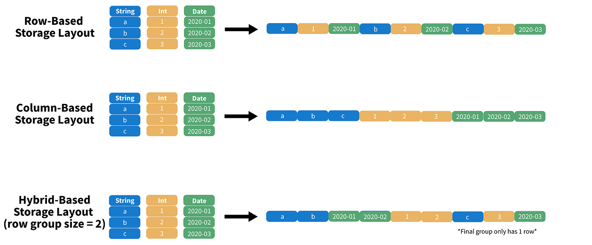

# data file format

<!-- @import "[TOC]" {cmd="toc" depthFrom=1 depthTo=6 orderedList=false} -->

<!-- code_chunk_output -->

- [data file format](#data-file-format)
    - [概述](#概述)
      - [1.两类数据文件格式](#1两类数据文件格式)
        - [(1) row-basedv](#1-row-basedv)
        - [(2) columnar storage](#2-columnar-storage)
      - [4.delta lake vs data lake](#4delta-lake-vs-data-lake)

<!-- /code_chunk_output -->

### 概述

#### 1.两类数据文件格式

##### (1) row-basedv
* 将一行的数据存储在一起
* 形式: **plain** text
* 适用场景：写密集型

* 具体实现
    * CSV (comma-separated values)

##### (2) columnar storage
* 将一列的数据存储在一起
* 特点
    * 适合读取部分数据（不适合读取全部数据，这个性能不如row-based）
    * 写性能较差
        * 需要大量CPU和内存
        * 需要遍历，才能定位到某一行数据（row-based只需要进行排序，就可以很快定位到）
        * 优化: row group (parquet)
            * 每个row group中，会列出每列的min和max，从而能够很快定位到数据
            
    * **压缩**性能更好
        * 因为一列数据的类型都相同，能进行更有效的压缩
* 形式: **binary**
* 适用场景：读取密集型（分析或历史数据）
* 具体实现
    * parquet
        * metadata 也存在文件中
            * 包括数据类型，压缩方式等等，这样读取数据时就不会有歧义（而CSV就没有存储这些数据）

#### 4.delta lake vs data lake