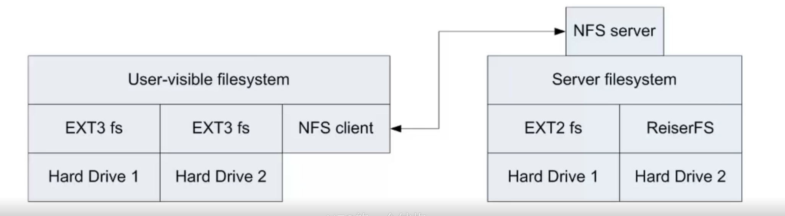
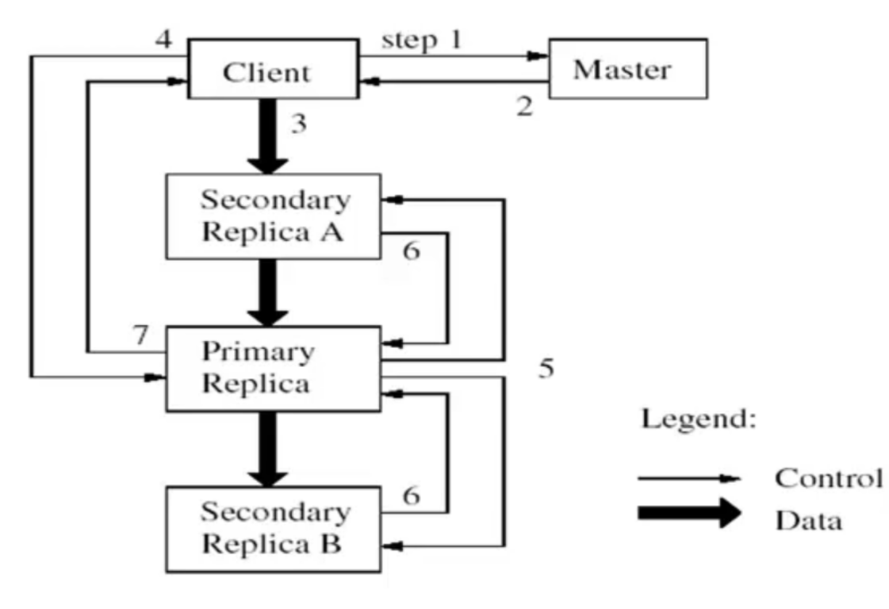

# overview

<!-- @import "[TOC]" {cmd="toc" depthFrom=1 depthTo=6 orderedList=false} -->

<!-- code_chunk_output -->

- [overview](#overview)
    - [概述](#概述)
      - [1.分布式文件系统 (DFS)](#1分布式文件系统-dfs)
      - [2.最简单的DFS： NFS](#2最简单的dfs-nfs)
      - [3.NFS的扩展: AFS (Andrew File System)](#3nfs的扩展-afs-andrew-file-system)
      - [4.GFS (Google File System)](#4gfs-google-file-system)
        - [(1) why](#1-why)
        - [(2) 基本设计](#2-基本设计)
        - [(3) 结构](#3-结构)
        - [(4) 性能问题](#4-性能问题)
        - [(5) 可靠性问题](#5-可靠性问题)
        - [(6) 一致性要求](#6-一致性要求)
        - [(7) POSIX兼容性](#7-posix兼容性)

<!-- /code_chunk_output -->

### 概述

#### 1.分布式文件系统 (DFS)

* 本质:
    * 将一个用目录树表达的 文件 翻译 为一个具体的节点
    * 磁盘的定位 则可以交给 该节点的 本地文件系统去完成

#### 2.最简单的DFS： NFS

#### 3.NFS的扩展: AFS (Andrew File System)

* 访问过程解析（比如需要访问文件： `/afs/tsinghua.edu.cn/dcst/hpc/games/a.txt`）
    * 用户先访问`/afs`获取`tsinghua.edu.cn`节点的信息
    * 用户接着访问`tsinghua.edu.cn`获取`dcst`节点的信息
    * 用户接着访问`dcst`获取`hpc`节点的信息
    * 用户接着访问`hpc`获取`games`节点的信息
    * 用户访问`games`节点获取`a.txt`文件

#### 4.GFS (Google File System)

##### (1) why
* 容错，当节点数量大，不可避免有些节点会出现故障
* 将一个超大规模文件，分布存储在不同节点上

##### (2) 基本设计

* 数据块
    * 由于文件的规模十分庞大，文件将会被划分为多个大小为**64MB**的**chunk**进行存储
* 性能设计
    * 存储负载均衡和访问负载均衡
* 可靠性
    * 通过副本的方式保存在多个节点上（通常为3个）
* 系统设计简化
    * 通过单个的节点来保存文件系统的**元数据**，这个节点被称为文件系统的**主节点master**

##### (3) 结构

* 应用程序根据 filename 和 chunk index（不是必须）去 master 获取相关元数据
* master存储的元数据内容 
    * namespace (即目录)
    * file对应哪些chunk
    * chunk的信息，包括存储在哪个chunkserver上等
* master返回给应用程序 chunk的信息
* 应用程序，根据chunk信息去指定chunkserver上获取数据

##### (4) 性能问题

* chunkserver的负载均衡问题
    * 存储负载均衡
        * master根据chunkservers的状态，进行动态调整
    * 访问负载均衡
        * 增加副本数，从而能够提高读取的速率
* chunkserver的扩展性问题
* master的性能负载问题
    * 元数据数据量
        * 一个64MB的chunk对应的元数据大小约为64B
    * 访问负载
        * 可以一次读取多个chunk的元数据

##### (5) 可靠性问题

* chunkserver可靠性问题
    * 副本和当副本数不足数，需要进行副本恢复
* master可靠性问题
    * 内存数据的可恢复性（WAL日志）
    * shadow服务器（也叫standby服务器、slave服务器）
        * 跟master做一样的操作，当master当即，这个服务器接替master
    * 将master上的数据多备份几份到不同节点上，即使master和shadow都故障了，也能够恢复

##### (6) 一致性要求

* GFS中的 放松的一致性
    * 一致的 (consistent)
        * 副本是一致的
    * 明确的 (defined)
        * 反映了客户端的操作，比如A和B同时写数据，则最终写入的内容要么全是A写的，要么全是B写的，这叫明确的
            * 比如A要写一个大于一个chunk大小的数据，则会分为两个chunk写入: A1和A2   
            * B也是如此： B1和B2
            * 最终的数据可能是A1和B2，数据是一致的，但不是明确的

    
    * 追加操作为什么可能夹杂着不一致的数据
        * 比如已有的数据还差1MB正好占满64MB，此时需要append 40MB的数据
        * 这时会重新使用一个chunk，而不会利用上面的1MB，因为会影响性能
        * 后面可能会利用一些零碎的数据来填充上面剩余的1MB

* 目的
    * 维持每一个chunk的三个副本完全一样
* 方法
    * 初始数据块没有数据，之后以相同的操作顺序执行客户端的操作
* 手段
    * 基于租期及主副本
        * 有一个是主副本，其他两个是次要副本，主副本负责定义操作的顺序，并且同步给次要副本，客户端写数据数，副本会按照定义好的顺序执行客户端的操作
        * 会给主副本一个租期，在一定的时间内，这个副本是主副本，如果超过这个时间主副本不续约，则选取其他的副本作为主副本
    
    

##### (7) POSIX兼容性
* GFS不是标准的文件系统，而是建立在本地文件系统上的应用层文件系统，存在以下特点
    * GFS增加了append操作
    * GFS定义了自己的数据一致性模型
    * 垃圾收集
        * master要记录删除操作日志，并将文件名改名为隐藏的文件名
        * 在系统负载不高的时候后台回收隐藏的文件
    * 过期副本的删除