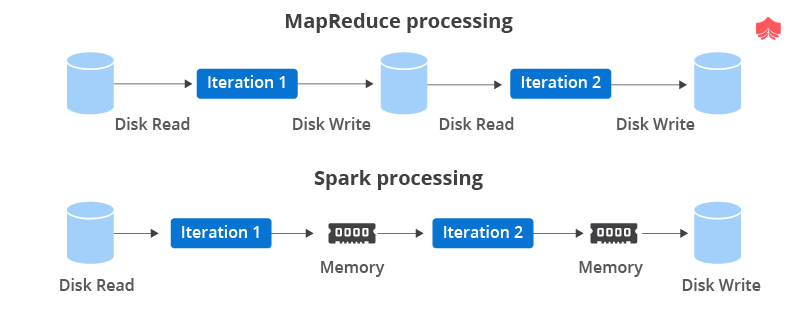
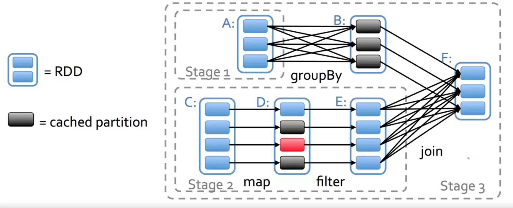

# RDD 

<!-- @import "[TOC]" {cmd="toc" depthFrom=1 depthTo=6 orderedList=false} -->

<!-- code_chunk_output -->

- [RDD](#rdd)
    - [概述](#概述)
      - [1.RDD (resilient distributed datasets)](#1rdd-resilient-distributed-datasets)
        - [(1) dataset](#1-dataset)
        - [(2) distributed](#2-distributed)
        - [(3) resilient](#3-resilient)
        - [(4) lineage](#4-lineage)
      - [2.RDD vs MapReduce](#2rdd-vs-mapreduce)
      - [3.Fault tolerance](#3fault-tolerance)
        - [(1) 容错依赖以下特性实现](#1-容错依赖以下特性实现)
      - [1.内存抽象: RDD (resilient distributed datasets)](#1内存抽象-rdd-resilient-distributed-datasets)
        - [(1) 概念](#1-概念)
        - [(2) 容错机制](#2-容错机制)
        - [(3) 基于RDD的操作](#3-基于rdd的操作)
        - [(4) 性能优化: 延迟估值 (lazy evaluation)](#4-性能优化-延迟估值-lazy-evaluation)
        - [(5) 性能优化: 数据划分 (partitioning)](#5-性能优化-数据划分-partitioning)
        - [(6) 局限性](#6-局限性)

<!-- /code_chunk_output -->

### 概述

#### 1.RDD (resilient distributed datasets)

##### (1) dataset
* 基于**数据集合**，而不是单个数据
* 由确定的粗粒度操作产生（比如：map、filter等）

##### (2) distributed
* partitioning
    * 可以设置partitioning规则，将相关的数据集划分到一个partition（即可以放在同一台机器），便于计算

##### (3) resilient
* Fault tolerance
* Lazy Evaluation
* Caching

##### (4) lineage
* 数据集之间有血缘关系（即依赖关系）
    * 原数据集 --操作1--> RDD1 --操作2--> RDD2

#### 2.RDD vs MapReduce

#### 3.Fault tolerance

##### (1) 容错依赖以下特性实现
* immutable
    * 数据一旦产生，就不能修改
* Lineage Tracking
    * 保留对数聚集的一系列操作，通过对原数据集执行这一系列操作就能恢复
* Data Replication
    * 可以跨节点拷贝数据

#### 1.内存抽象: RDD (resilient distributed datasets)

##### (1) 概念
* 基于**数据集合**，而不是单个数据
* 由确定的粗粒度操作产生（比如：map、filter等）
* 数据一旦产生，就不能修改（**immutable**）
* In-memory Computation
    * 在内存中执行计算，中间结果也可以存放在内存中

##### (2) 容错机制
* 通过”重复计算“的方法来恢复数据
    * 只要在log中记录对datasets的操作内容

##### (3) 基于RDD的操作

* Transformation
    * 从现有RDD产生**新的RDD**
    * map,reduce,filter,groupBy等
* Action
    * 从RDD返回一个值
    * count,first,collect等

* 复杂操作举例

##### (4) 性能优化: 延迟估值 (lazy evaluation)
* transformation是lazy的，即调用transformation函数时，并没有真正执行
* 只有执行到Action时，才会触发计算，举例
    

##### (5) 性能优化: 数据划分 (partitioning)
* 可以设置partitioning规则，将相关的数据集划分到一个partition（即可以放在同一台机器），便于计算

##### (6) 局限性
* 对于细粒度的数据更新，由于spark基于粗粒度RDD只读的 数据对象模型
    * 需要RDD变换（即有大量数据的复制），导致处理效率不高