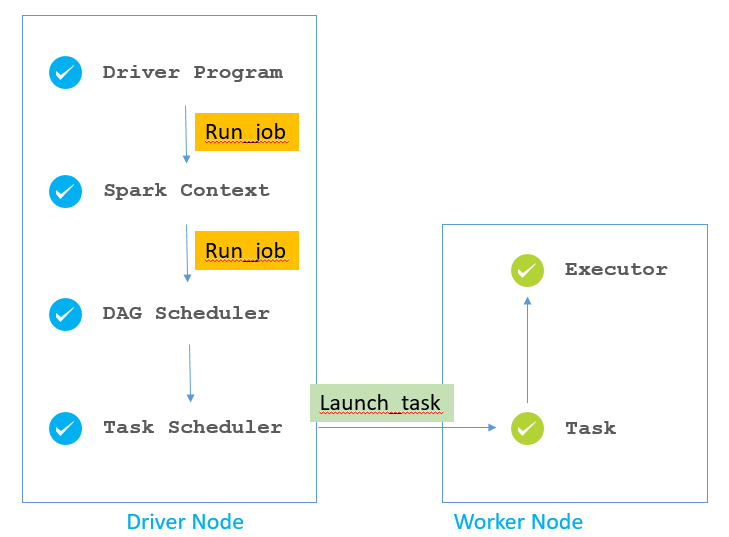

# overview

<!-- @import "[TOC]" {cmd="toc" depthFrom=1 depthTo=6 orderedList=false} -->

<!-- code_chunk_output -->

- [overview](#overview)
    - [概述](#概述)
      - [1.架构](#1架构)
        - [(1) 任务划分](#1-任务划分)
      - [2.python on spark](#2python-on-spark)
      - [3.scheduler](#3scheduler)
      - [4.DAG scheduler](#4dag-scheduler)
        - [(1) job](#1-job)
        - [(2) RDD dependencies](#2-rdd-dependencies)
        - [(3) stage](#3-stage)
        - [(4) task（最小的调度单元）](#4-task最小的调度单元)
      - [5. task scheduler](#5-task-scheduler)

<!-- /code_chunk_output -->

### 概述

#### 1.架构

* Cluster Manager
    * 集群资源管理，托管运行各个任务的driver
* Worker Node
    * 单机资源管理
* driver
    * 单任务管理（类似于yarn的Application Manager）
    * 代码开始都是运行在driver中的，然后driver会将rdd算子任务，分发给各个executor执行
* Executor
    * 一个work node可以有多个executor
    * 一个executor是一个执行器（执行一个个task）

##### (1) 任务划分

在driver中进行任务划分：job、stage和task

* 一个action算子产生一个job
    * 一个job有对应的DAG（用于描述处理流程）
* 一个job包含多个stage
* 一个stage中的一个partition对应一个task
* task就是**最小的调度单元**（由executor执行）

#### 2.python on spark

#### 3.scheduler

#### 4.DAG scheduler

* 将一个job划分为多个tasks:
    * 一个job包含多个stage
    * 一个stage中的一个partition对应一个task

##### (1) job
* 一个action算子产生一个job
* 一个job有对应的DAG（用于描述处理流程）

##### (2) RDD dependencies

* narrow dependencies
    * 父RDD的每个分区的数据，都各自全部传入某一个分区
* wide dependencies（即shuffle）
    * 父RDD的一个分区的数据，传入多个分区

##### (3) stage
* 遇到一个**wide dependencies**就划分出一个stage

##### (4) task（最小的调度单元）
* **一个stage** 中的 **一个partition** 对应一个task
* 这样task就作为最小的调度单元
    * 数据也不需要经过网络io，因为都在同一个分区内，且都是窄依赖

#### 5. task scheduler

负责将划分好的tasks调度到指定的executor上执行