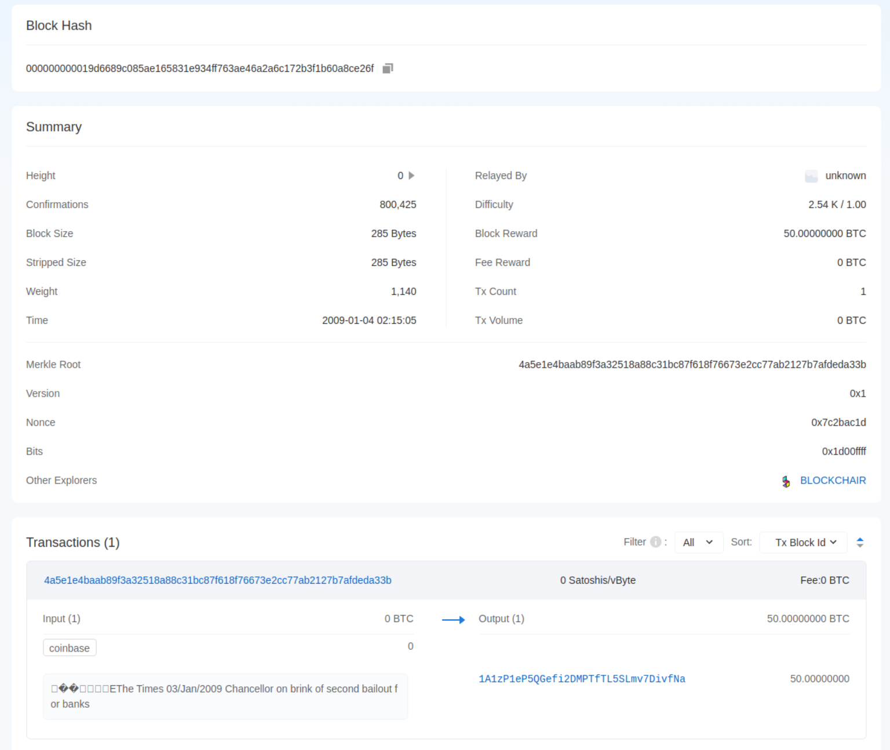
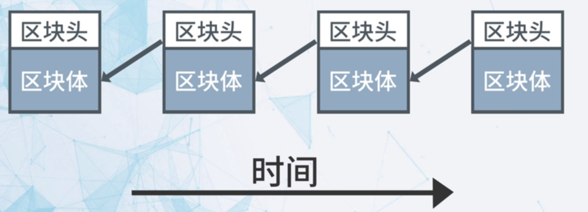
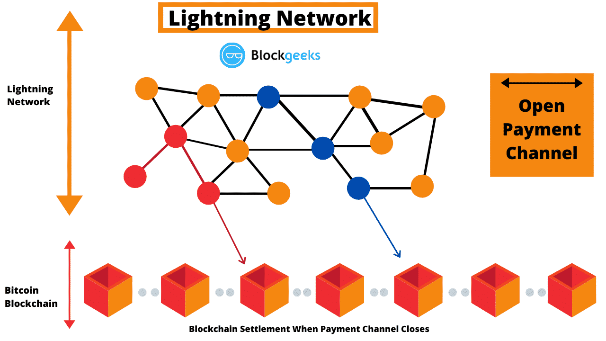

# overview


<!-- @import "[TOC]" {cmd="toc" depthFrom=1 depthTo=6 orderedList=false} -->

<!-- code_chunk_output -->

- [overview](#overview)
    - [概述](#概述)
      - [1.block chain](#1block-chain)
        - [(1) 定义](#1-定义)
        - [(2) 分类](#2-分类)
      - [2.数字签名](#2数字签名)
      - [3.block](#3block)
        - [(1) block header](#1-block-header)
        - [(2) block size](#2-block-size)
        - [(3) block hash](#3-block-hash)
        - [(4) block frequency](#4-block-frequency)
        - [(5) block例子](#5-block例子)
      - [4.block chain结构](#4block-chain结构)
        - [(1) 如何保证不被篡改](#1-如何保证不被篡改)
      - [5.consensus mechanism](#5consensus-mechanism)
        - [(1) Longest Chain](#1-longest-chain)
        - [(2) POW (proof of work)](#2-pow-proof-of-work)
        - [(3) 基本原理概述](#3-基本原理概述)
      - [6.POW (proof of work)](#6pow-proof-of-work)
        - [(1) difficulty](#1-difficulty)
        - [(2) difficulty target (leading zero)](#2-difficulty-target-leading-zero)
        - [(3) hash rate (算力)](#3-hash-rate-算力)
      - [7.常见的node类型](#7常见的node类型)
        - [(1) miner](#1-miner)
        - [(2) mining pool](#2-mining-pool)
        - [(3) full node](#3-full-node)
        - [(4) pruned node](#4-pruned-node)
      - [8.smart contract (智能合约)](#8smart-contract-智能合约)
        - [(1) 特点](#1-特点)
      - [9.POS (proof of stake)](#9pos-proof-of-stake)
        - [(1) DPOS (delegated proof of stake)](#1-dpos-delegated-proof-of-stake)
      - [10.mining](#10mining)
        - [(1) 设备](#1-设备)
        - [(2) 软件](#2-软件)
      - [11.lightning network (off-chain)](#11lightning-network-off-chain)
        - [(1) 目标](#1-目标)
        - [(2) 原理](#2-原理)
        - [(3) 存在问题](#3-存在问题)

<!-- /code_chunk_output -->

### 概述

#### 1.block chain

##### (1) 定义
使用 **密码** 技术将 **共识** 确认的区块按顺序追加形成的 **分布式**（**去中心化**）账本

##### (2) 分类

* 公链
* 联盟链
* 私链

#### 2.数字签名

* 利用私钥加密，公钥解密
* 钱包的地址就是公钥

#### 3.block

* 以下均以bitcoin为例

##### (1) block header

|内容|说明|详细说明|
|-|-|-|
|Version|版本|这个block使用的协议的版本（对于bitcoin就是bitcoin protocol的版本）|
|Previous block header hash|前一个block的header的哈希值|
|Timestamp|时间戳|这个block创建的时间|
|Difficulty|难度|用于调整difficulty target的值，使得能够稳定十分钟找到一个block|
|Nonce|number used once，一个随即数（**32 bit**）|通过调整该值，找到满足的block hash，由于只有32 bit，所以nonce是有**可能重复**的|
|MerkleRoot|当前block 交易信息 的哈希值|

##### (2) block size 
* 不能超过1MB
* 所以能够处理的事务数的速率 **7 transactions / second**

##### (3) block hash
* 使用block **header**进行**两次**hash
    * 通过调整nonce值，来寻找满足条件的hash
    * 如果上述无法找到
    * 通过调整交易顺序等后，通过调整nonce值，来寻找满足条件的hash

##### (4) block frequency
* block产生速度
    * one block per 10 minute
    * 144 blocks per day
    * 2016 blocks per two weeks

* 实现方式
    * 通过difficulty控制，计算速度
    * 每2016 blocks（即每2周）调整一次difficulty

##### (5) block例子


* block hash
    * 该block header的哈希值，用于唯一表示该block

* summary
    * Height
        * 链的高度，第一个block为0，以后依次加一
    * Confirmations
        * 当block后面加一个block，confirmations加一
        * 最后一个block的confirmations为1
    * Block Size
        * 块的总大小
    * Stripped Size
        * 去除witness data后块的大小（为了满足块不能超过1M限制的要求）
    * weight
        ```wasm
        block weight = (transaction data size * 3) + witness data size
        ```
    * Difficulty
        * 用于调整difficulty target的值
    * Block Reward
        * 创建该block获得的奖励
    * Tx Count
        * 交易数
    * Tx Volume
        * 交易体量，即所有交易的金额

* Transactions
    * 该block中记录的交易
    * 第一笔交易是coinbase交易，即给创建该block的人的奖励

#### 4.block chain结构



##### (1) 如何保证不被篡改
比如修改第一个块后，就会使得block header hash变了，后面的块维护了previous block header hash，所以想要篡改前面的难度很大

#### 5.consensus mechanism

##### (1) Longest Chain 
* 目的: 用于决定该block添加在哪条chain上

##### (2) POW (proof of work)
* 目的: 用于决定谁来写这个block
* 原理: 需要找到一个nonce，该nonce的hash需要满足系统规定的要求

##### (3) 基本原理概述

* 交易和block都会在全网广播，每个节点可以验证交易和block是否合法
    * 交易通过公钥来验证（因为交易通过私钥加密了）
    * block通过工作量证明机制和里面的交易是否合法来验证
* 当验证通过，节点会接受该block，并加入到已有的最长链上

#### 6.POW (proof of work)

##### (1) difficulty
* 为了调整difficulty target的值，使得能够稳定十分钟找到一个block
    * 每2016 blocks（即每2周）调整一次difficulty
    * 计算公式（具体要看算法，这里这是给出一个例子）
        * `New difficulty = old difficulty x (2016 blocks / time taken to mine last 2016 blocks)`

##### (2) difficulty target (leading zero)
* 是一个256-bit的数字，当`block的hash < difficulty target`时，则表示找到符合要求的块
* 这就意味着block的hash前面一定位数都是0,所以有等价于有多个leading zero

* 计算方式
    * `difficulty target = difficulty_1_target / difficulty = 2^256/2^32/difficulty = 2^256/(difficulty * 2^32)`

* 当difficulty为1（即难度最小）时，此时difficulty target最大：
    * 理论应为：
        * `0x00000000FFFFFFFFFFFFFFFFFFFFFFFFFFFFFFFFFFFFFFFFFFFFFFFFFFFFFFFF`
    * 但是由于bitcoin存储的是loating-point type（即64-bit，将后面的数值截断了），所以实际为：
        * `0x00000000FFFF0000000000000000000000000000000000000000000000000000`

##### (3) hash rate (算力)
* 挖取一块block理论所需要的hash rate
* `Hash Rate = (2^256 / difficulty target) / 600 = difficulty * 2^32 / 600` (单位: `H/s`)
    * 总共的hash值: 2^256
    * 符合要求的hash值: difficulty target
    * 平均需要计算的hash次数: `2^256 / difficulty target = difficulty * 2^32`
    * 一个块的产生的时间: 10min * 60 = 600s

#### 7.常见的node类型

##### (1) miner
* 负责接受mining pool分发的hash计算任务，并把结果汇报给mining pool

##### (2) mining pool
* 负责管理hash计算任务，创建block
* 保存整个block chain数据

##### (3) full node
* 负责保存整个block chain数据

##### (4) pruned node
* 负责保存最近的一些block的数据

#### 8.smart contract (智能合约)
* 一小段 存储在区块链中 能够 自动执行合约条款的 计算机程序

##### (1) 特点

* 储存位置
    * 代码被编译成bytecode，存储在block中
    * 所以有大小限制
* 触发
    * smart contract executor负载event
    * 从而触发相应的smart contract
* 运行
    * 以ethreum为例： 运行在EVM中（ethereum virtual machie）

#### 9.POS (proof of stake)
根据以下几个条件，选择合适的创建block的节点：
* 持币的数目
* 持币的时间
* 稳定在线

##### (1) DPOS (delegated proof of stake)
* 选举出一些超级节点
    * 每个节点都有投票权（投票数根据自己拥有的币数来确定）
* 然后在这些超级节点选择一个创建block

#### 10.mining

##### (1) 设备

* GPU
* ASIC  (application-specific integrated circuit)

##### (2) 软件

* mining software 
* cloud mining
* centralized hardware management

#### 11.lightning network (off-chain)

* 建立在区块链上一层（即layer 2），利用**smart contract**技术



##### (1) 目标
* 立即支付
    * 不需要等挖到块，才能确认交易
* 提高扩展性
    * 即提高事务处理能力，每秒能够处理更多的事务，从而满足小额付款的需求
* 降低成本
    * 降低交易手续费

##### (2) 原理

* payment channel
    * 双方创建一个 payment channel（即ledger entry，分类账条目）
        * 打开和关闭channel对于区块链来说都是一个事务
    * 双方所有的transactions都反应在这个entry中（有新的事务，则更新该entry），并进行**签名**，不对外进行广播
    * 只要有一方关闭该channel，则会将最新的entry（只有一个事务，因为将之前的转账金额都进行了合并）进行广播，则最终**只有一个事务**（不包括的打开和关闭channel的事务）被记录到块中（on-chain）

* route
    * 比如A和B有一个channel，B和C有一个channel
    * 当A和C需要转账时，则不需要开启一个新的channel，只需要在A和B、B和C的channel进行更新就能达到效果

##### (3) 存在问题

* Closed-Channel Fraud
    * 问题描述
        * 比如当A和B有一个channel，B下线了，A广播了一个旧的entry（双方都签过名了）
    * why
        * 使用了smart contract为什么还有这个问题，因为smart contract只能保证执行不被篡改，而数据channel数据是存储在双方节点上的，所以可以进行广播旧的entry
    * 解决 
        * dispute period
            * 当A发送旧的entry，B如果在线且在dispute period时间内发现，则可以广播最新的entry
        * Watchtower
            * 由第三方设置一个岗哨，因为B有可能不在线