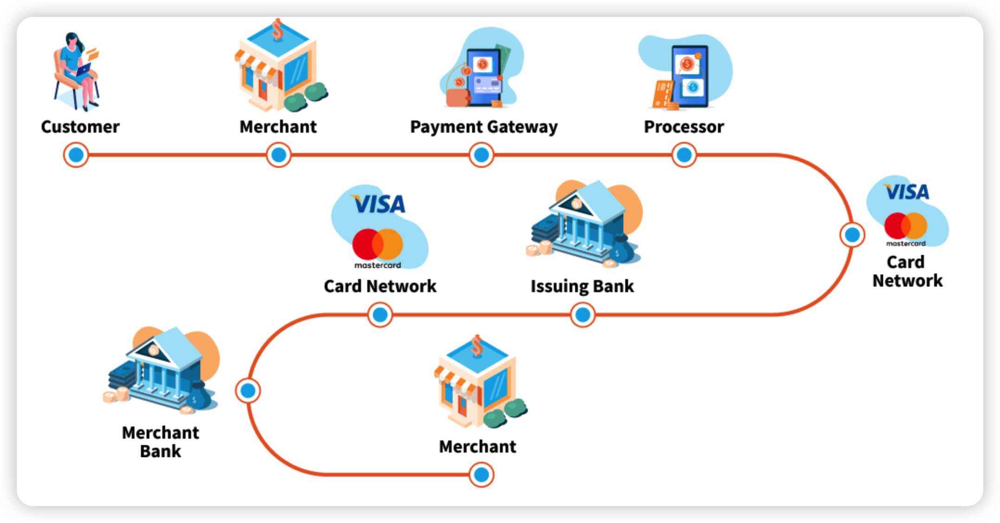
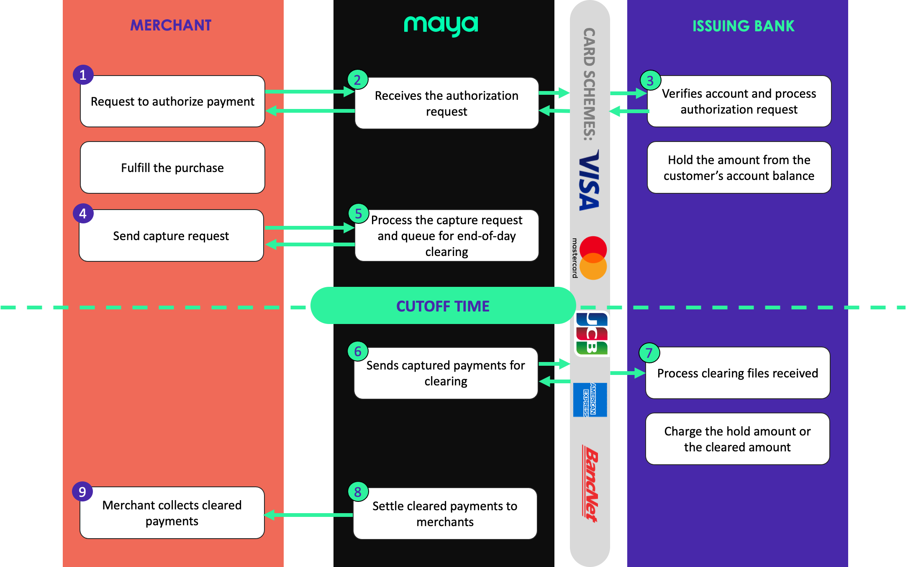

# State Machine

<!-- @import "[TOC]" {cmd="toc" depthFrom=1 depthTo=6 orderedList=false} -->

<!-- code_chunk_output -->

- [State Machine](#state-machine)
    - [Concepts](#concepts)
      - [1.payment gateway](#1payment-gateway)
        - [(1) authorize and capture](#1-authorize-and-capture)
    - [Order State](#order-state)
      - [1.normal state](#1normal-state)
      - [2.exception handling states](#2exception-handling-states)

<!-- /code_chunk_output -->

### Concepts

#### 1.payment gateway
it’s the service that processes credit/debit card payments for online stores and retailers.

##### (1) authorize and capture
* authorization verifies the card and reserves funds
    * e.g. When you hit "Place Order" in checkout page

* capture transfers the reserved funds to the merchant
    * e.g. When you Check-In at the restaurant

***

### Order State

#### 1.normal state

phase 1
* `received`
    * Order has all required info and is ready for immediate authorization
* `stored`
    * Order is saved but waiting for additional input (payment token from client)

phase 2: **authorising** process
* Synchronous (Sync) Payment Methods
    * --> `authorised`
* Asynchronous (Async) Payment Methods (e.g. PayPay)
    * `waiting for auth` --> `authorised`

phase 3: **fulfill** order process
* Confirm the delivery method (pickup counter, drive-thru, etc.)
    * Normal Orders (Pickup/Drive-Thru)
    * Special Orders (Coupons)
        * validating
    * Special Orders (Address Delivery)
        * validating --> `waiting for assignment` --> `assigned` (A delivery driver has been assigned to the order)
* sending to FOE 
    * Drive-Thru orders
        * `waiting for FOE` --> `sent to FOE`
            * Drive-Thru orders create a staging order first, then wait for FOE to confirm when the customer actually arrives at the drive-thru window
    * other orders
        * `sent to FOE`

phase 4: **capturing** process
* `payment captured`

#### 2.exception handling states
**unknown** states are all because of **timeout** 
* `auth unknown`
* `auth failed`
* `deauthorisation unknown`
* `deauthorisation failed`
* `send to FOE failed paused`
* `payment capture unknown`
* `payment capture failed`
* `payment refund unknown`
* `payment refund failed`

